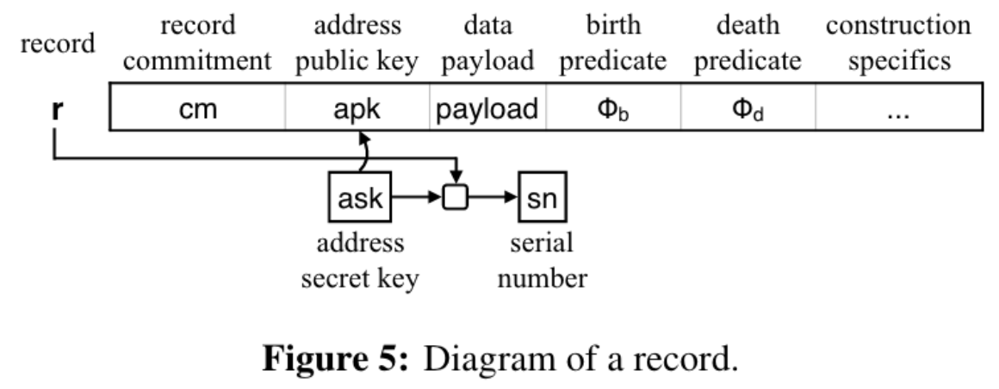
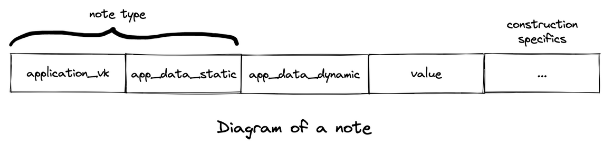
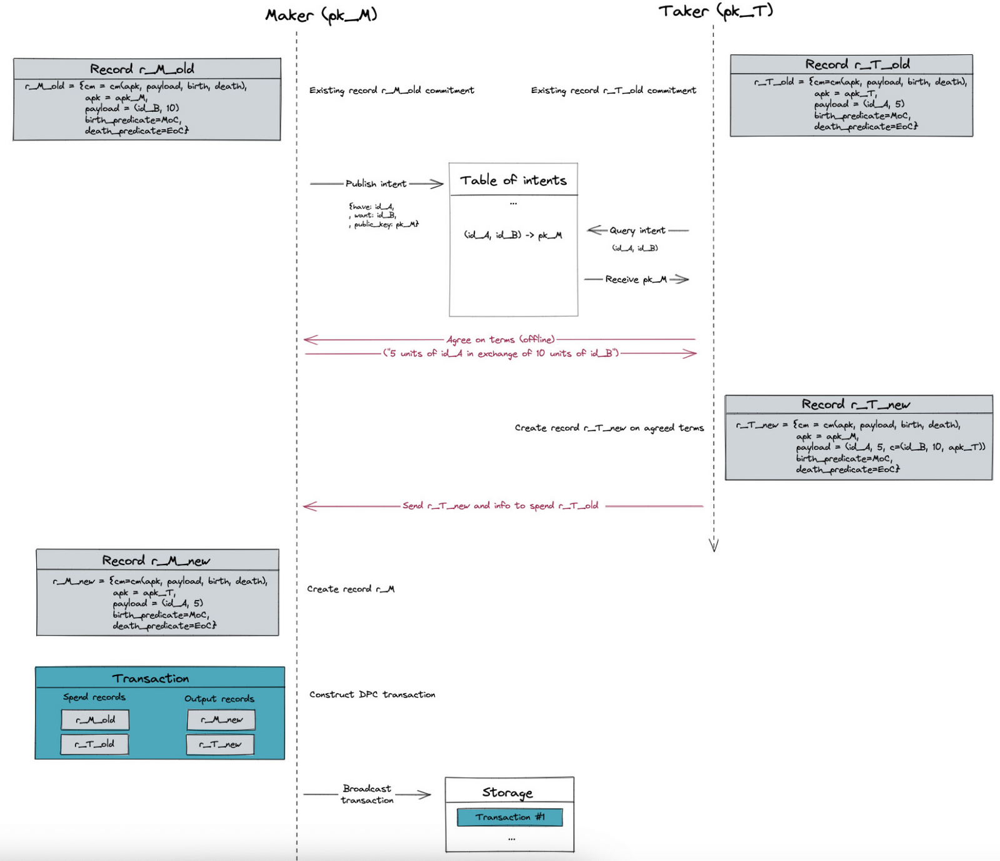
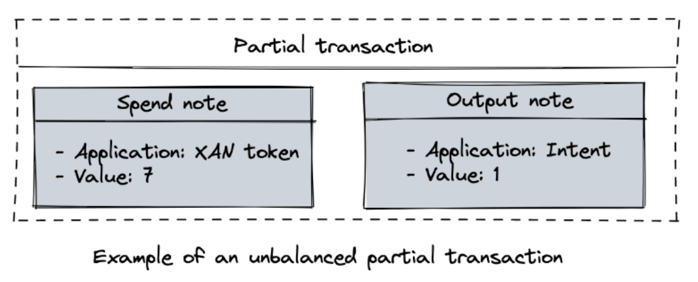
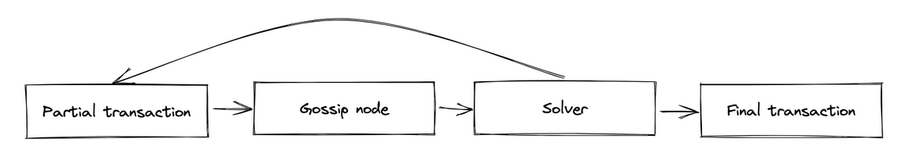
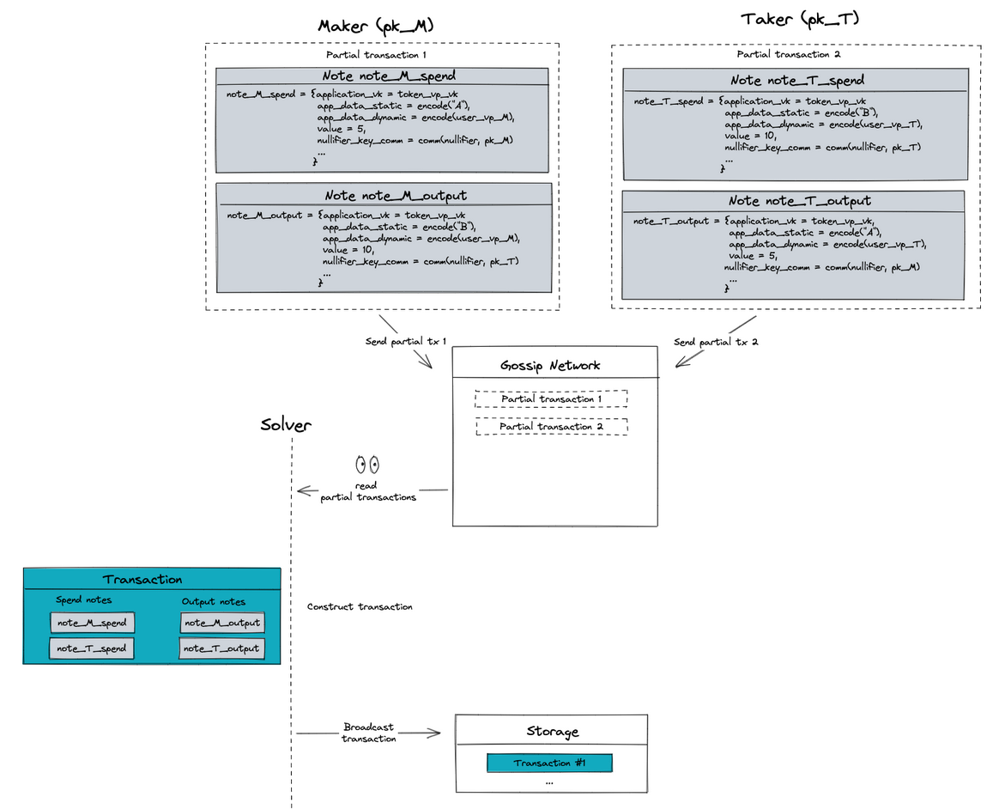

## TL;DR

[Taiga](https://github.com/anoma/taiga) is an intent-centric execution environment for privacy-preserving applications using zero-knowledge proofs. Intents are conditional programs that enable users to express their interest with some uncertainty about the final state transition.

> Side note: _Information flow control_ is arguably a better term than privacy since it encapsulates the notion that users control how their information flows, sometimes revealing it to certain parties of their choice (sometimes only to themselves). No system can work if it’s fully private, that is, if nobody can read the data entered in the system. What is private for some may not be private for others. What is important in a system like Taiga is that its users control their data. However, we’ll use the term _privacy_ in this article for convenience and familiarity.

## Introduction

Smart contract systems such as Ethereum and Solana are fully programmable but they are not private, that is, both the program and the data of a transaction are stored in plaintext and any observer of the blockchain can see the current state and history of all state changes.

[Zexe](https://eprint.iacr.org/2018/962.pdf) was the first ledger-based system that enabled private, programmable applications. [VeriZexe](https://eprint.iacr.org/2022/802.pdf) built upon Zexe to introduce a universal setup using Plonk, with remarkable efficiency gains in proving, but without other significant architectural changes. Until Taiga, Zexe (and VeriZexe) remained the only concrete constructions to achieve function privacy. Like VeriZexe, Taiga also chooses a different proving system, this time to remove the trusted setup completely, allowing for efficient recursion via Halo2 accumulation. Furthermore, Taiga brings an entirely new architecture of intents and solvers, where intents can be solved incrementally or partially in an asynchronous, non-interactive, composable manner. Taiga also introduces programmable authorisation, in which predicates control spending (instead of public keys). In short, Taiga extends the authorisation method to a predicate, instead of the more restrictive signature check of Zexe. The consequences of these changes are vast, enabling the surge of new applications which are not possible in the Zexe model such as subscriptions or automatic transactions in which the user doesn't have to be online.

Since VeriZexe is not conceptually different to Zexe, we'll focus on the differences between Taiga and Zexe.

## Privacy

Both Zexe and Taiga achieve both data and function privacy, that is, they hide user's data and applications are indistinguishable from one another. Data privacy is achieved via commitments and zero-knowledge proofs. The idea behind achieving function privacy consists of fixing a single universal function that takes user-defined functions as inputs.

In particular, to hide functions, the Zexe architecture provides a minimalist execution environment called "Record Nano-Kernel" (RKN) that accepts records with two boolean functions, the so called "birth" and "death" predicates. Birth predicates are transition rules that need to be satisfied when a record is created, while death predicates need to be satisfied when a record is consumed. These two boolean functions can be seen as data inputs to the single universal function. A transaction is valid if the predicates of all of the records involved in the transaction are satisfied.

Similarly, Taiga also provides an execution environment that takes notes (the equivalent of records in Zexe) with one boolean function called "Application Validity Predicate" (or `AppVP` for short).

The main important difference between a record in Zexe and a note in Taiga is that a note doesn't contain an address public key $apk$, which in Zexe is used to spend a note (by proving knowledge of the address secret key $ask$). How does a user spend a note in Taiga then? In Taiga, a note is purely some application state and it is the task of the application to determine how a note can be spent, and even whether it requires a user or not to spend a note. Instead of proving the ownership of a secret key as in Zexe, an application may require a predicate to deal with the authorisation to spend. A particular case of this predicate is a `userVP` which, among other checks, can also require a proof of knowledge of a private key, given the public key of the future spender. This flexibility of the authorisation method is what enables certain types of applications such as automatic transactions of some kind without user intervention.

In Taiga, only the `AppVPs` inside each of the notes in a transaction need to be satisfied. However, a user could encode further constraints and other arbitrary data in two different fields, `app_data_static` and `app_data_dynamic`, and the rules of this encoding is dependent on each application. `app_data_static` contains fixed data that makes the application unique and, together with `AppVP`, they constitute the note type. The note type is used as an identifier to check the balance of the different notes in a transaction. On the other hand, `app_data_dynamic` contains contextual data or "runtime" data.

An example that illustrates this difference between `app_data_static` and `app_data_dynamic` is a token application. The rules of the token application are defined in the `AppVP`. The `app_data_static` field is a scalar value that encodes whether it is a "BTC" or a "ETH" token. The `app_data_dynamic` field may encode some user-specific constraints, such as an upper bound of the amount he is willing to spend in any given transaction, together with his signature.

That is, notes with the same `AppVP` and `app_data_static` are fungible (modulo value) even if their `app_data_dynamic` differs. As mentioned, the encoding mechanisms are flexible and application dependent; any data can be encoded in `app_data_static` or `app_data_dynamic` as long as the application describes how to decode their respective finite field. In some other cases, these fields may represent a key of a lookup table where the data is actually stored, or the verifying key of a predicate. This design choice makes notes in Taiga lightweight and of constant size.

Furthermore, the architecture of Taiga enables composable privacy, composable solving and transparent execution. Composable privacy means that when a user builds a private application in Taiga, it can be composed (permissionlessly) with another private Taiga application, and their composition remains private. By composable solving we mean that intents can eventually be fully solved by composing partially solved intents. With transparent execution, we mean that Taiga makes privacy optional, allowing shielded and plaintext transactions to coexist in the same system. Applications on Taiga are written in the _the same way_ for transparent and shielded execution and both transparent and shielded execution can happen in one transaction - for example, many transparent and shielded intents could be atomically matched. This is quite different from systems where there is a hard boundary between the two. We'll explore next the architecture of Taiga to understand how composable privacy and transparent execution is possible.

## Architecture

Both Zexe and Taiga follow the UTXO model, in which a transaction spends and creates records of the same application given that their respective birth and death predicates are satisfied. However, Zexe is unopinionated on many levels about how to build applications on it. The Zexe paper has a few examples of applications built on top of Zexe, such as custom assets or private DEXs.

From their paper, an intent-based DEX application would work as follows:

> 1. A maker $M$ can publish to the index an intention to trade, which is a tuple $(id_A, id_B, pk_M)$ to be interpreted as: “I want to buy assets with identifier $id_B$ in exchange for assets with identifier $id_A$. Please contact me using the encryption public key pkM if you would like to discuss the terms.”

> 2. A taker $T$ who is interested in this offer can use $pk_M$ to privately communicate with M and agree on the terms of the trade (the form of communication is irrelevant). If $T$ and $M$ do not reach an agreement, then $T$ can always pursue other entries in the index. So suppose that $T$ and $M$ do reach an agreement. For the sake of example, $T$ will give 10 units of asset $id_B$ to $M$ and will receive 5 units of asset $id_A$ from $M$.

> 3. The taker $T$ creates a new record r with payload $(id_B, 10, c)$ for auxiliary data $c = (id_A, 5, apk_{new})$, and with death predicate EoC. Then $T$ sends r (along with the information necessary to redeem r) to $M$.

> 4. If $M$ possesses a record worth 5 units of asset $id_A$, he can use $T$’s message to construct a DPC transaction that completes the exchange by consuming r and by producing appropriate new records for $M$ and $T$. (This step deviates from existing intent-based DEXs in that it is the maker that broadcasts the trade transaction.)

The Zexe protocol is agnostic to the communication layer; how the Taker communicates with the Maker to agree on terms and share information is outside the scope of Zexe, but it requires (offline) interactivity among the participants of the system for matching intents. This restricts the types of applications that can be built on this system.

The following diagram encapsulates this DEX example. Both Maker and Taker start with some record commitment they can spend by revealing their nullifier. The red arrows represent direct offline communication between the two parties.

Taiga is designed for _non-interactive matching_, in contrast to Zexe (which is at least not explicitly designed for it). Taiga is only partially agnostic to the communication layer in the sense that it needs enough structure for non-interactive matching, but it's still agnostic to what the patterns of gossip and solving actually look like. Taiga allows the creation of partial transactions which can be independently checked and later combined in a final transaction regardless of the execution order.

To achieve composable privacy and non-interactivity, Taiga introduces the notion of intents, solvers and of partial transactions. A partial transaction is a transaction that doesn't check the balance between the spent and output notes. In Taiga, intents are a special type of application. For example, a partial transaction can contain a spend note of a certain token and an intent note encoding the conditions of the possible swap:

The partial transaction of this example is clearly unbalanced: both token and intent application don't have their counter spend/output notes. For a partial transaction to become a (balanced) transaction, for intents to be satisfied, Taiga introduces the notion of a **solver**. A solver is an entity that receives partial transactions and attempts to construct valid balanced transactions out of them.

We can illustrate the workings of Taiga and the specific role of the solver using the same intent-based DEX example we used above with Zexe.

Unlike Zexe, users don't need to communicate offline in Taiga. The task of the solver is to monitor partial transactions and construct final transactions based on their notes (or even other partial transactions if the solver thinks they will contribute to create future final transactions). A final transaction is basically a set of partial transactions, which are immutable, such that the final transaction is balanced. Composable privacy is achieved because the composition of two (private) partial transactions is still private. For solvers to read the content of the notes, they need certain viewing keys. How solvers use their keys is outside the scope of this post (see Taiga docs).

Once a solver creates a final transaction, it is broadcasted to some storage. Taiga can be plugged into any blockchain-like system like Ethereum. In particular, the [Anoma protocol](https://github.com/anoma/whitepaper/blob/main/whitepaper.pdf) incorporates Taiga as part of its stack, choosing [Typhon](https://specs.anoma.net/main/architecture/consensus/typhon.html) (a heterogeneous BFT system that stores, orders, and (abstractly) executes transactions) as its current storage of choice.

## Proving system

<table>
<thead>
<tr>
<th></th>
<th>Proving System</th>
<th>Trusted setup</th>
</tr>
</thead>
<tbody>
<tr>
<td><strong>Zexe</strong></td>
<td>Groth16</td>
<td>Per circuit</td>
</tr>
<tr>
<td><strong>VeriZexe</strong></td>
<td>UltraPlonk/Turboplonk</td>
<td>Universal</td>
</tr>
<tr>
<td><strong>Taiga</strong></td>
<td>Halo2</td>
<td>No</td>
</tr>
</tbody>
</table>

Although the proving system of choice can be considered an implementation detail, it is worth mentioning. Zexe uses [Groth16](https://eprint.iacr.org/2016/260.pdf), which requires a trusted ceremony per circuit, although some implementations of the Zexe protocol use different proving systems [1](1). As mentioned, VeriZexe requires only a single universal trusted setup. The implementation of VeriZexe uses both TurboPlonk and UltraPlonk, depending on the circuit.

VeriZexe also introduces further optimisations such as moving out the expensive pairing check from the SNARK verifier circuit, delaying the final proof verification step to validators, halving the number of proofs by merging the birth and death predicate into a single larger predicate, proof batching and leveraging the use of lookup arguments.

Taiga currently relies on [Halo2](https://zcash.github.io/halo2/), which doesn't require a trusted setup. While removing the trusted setup is not a big deal in terms of privacy (practically speaking, it doesn't make the system more secure), it becomes relevant when we do recursive proof composition (that is, when we check proofs inside of another circuit). Having nested recursion in pairing-based systems such as VeriZexe is inefficient and one loses the performance benefits that trusted setups bring. Halo2 uses the non-pairing [Pasta curves](https://electriccoin.co/blog/the-pasta-curves-for-halo-2-and-beyond/), which form a cycle with one another. This allows for efficient multi-layer (recursive) proof composition, instead of 1-layer proof composition that can only be achieved efficiently with VeriZexe.

In Taiga, we need recursion because we want the predicates to be private; tracing would be possible without recursion, thus leaking information. Another reason for supporting full recursion is scalability. Once the system starts handling many proofs and verifications, efficient recursion is needed to maintain the performance of the system. Furthermore, the implementation of Halo2 is highly optimised, mainly thanks to the engineering efforts of the ZCash team.

## Thanks!

Taiga is currently under active development, both design wise and implementation wise. If you want to know more about Taiga you can find our work [here](https://github.com/anoma/taiga).

---

[[1]]([1]) Aleo uses the Marlin proving system, which requires a universal trusted setup.

## Discussion

Please come discuss on the [Forums](https://research.anoma.net/t/zexe-vs-verizexe-vs-taiga/115).
