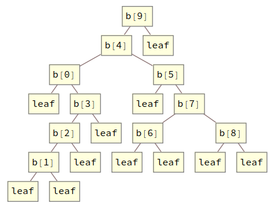
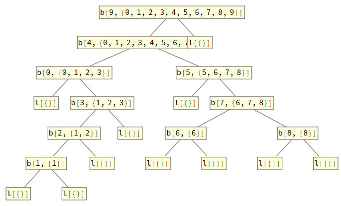

The topic of discussion is the hylomorphism; a recursive function made up of four parts;

1. An endofunctor, $F$. This is the same thing as a functor in the Haskell sense. There should be a map function that turns a function from $A$s to $B$s into a function from $F(A)$s to $F(B)$s, for all $A$ and all $B$.
2. A "coalgebra" over $F$; that is, a function that turns $A$s into $F(A)$s, for a _fixed_ $A$.
3. An "algebra" over $F$; that is, a function that turns $F(B)$s into $B$s, for a _fixed_ $B$.
4. A recursive equation that defines the hylomorphism. If $a$ is the algebra, $c$ is the coalgebra, and $h$ is the hylomorphism, the following equation holds.

$$
h = a ∘ F(h) ∘ c
$$

If you've never seen a hylomorphism before, it may not be clear either what $h$ is doing or why this pattern is important.

Briefly, we can think of $c$ as constructing a single layer of a tree. If $F$ is, for example, something like $X ↦ 1 + X ⨯ X$, then $c$ will take an $A$ and turn it into something in the shape $1 + A ⨯ A$, that is, it will either be a leaf, or a pair of $A$s. The $F(h)$, being aware of this layer structure, will map $h$ into the $A$s created by $c$. In the case of a leaf, there will be no created $A$s, so no new calls to $h$ will be created. Alternatively, if a branch is encountered then there will be one new $h$ call per branch. $h$ will produce new $c$s, and so we can imagine a tree whose layers are $F$ shaped taking form.

$a$ will deconstruct these layers. It will take an $F(B)$ and produce a $B$. In the case of a leaf, it will produce a $B$ wholesale, otherwise it may combine the $B$s in the branches. As $h$ recurses, it will spawn exactly one $a$ for each $c$, exactly one layer consumer for each layer producer. Ultimately, the $a$s will consume the whole tree. In the end, $h$ will be a recursive function that takes an $A$ and produces a $B$.

A commonplace example of a hylomorphism is the quicksort algorithm. $c$ will take an input list and split it into

1. the first element of the list.
2. all the elements of the list's tail that are less than or equal to the first.
3. all the elements of the list's tail that are greater than the first.

Recursively applying this will produce a tree that stores numbers on its branches such that all these numbers are sorted. $a$ then only needs to collapse the tree back into the list. We can infer that $F$ will be $X ↦ 1 + ℕ ⨯ X ⨯ X$. Additionally, both $A$ and $B$ will be $List(ℕ)$. Using this as a guide, we can implement this as a hylomorphism. I will use Mathematica, but this should be doable, maybe with more or less elegance, in most languages.

```wolfram
F[h_][leaf] := leaf
F[h_][branch[n_, l_, r_]] := branch[n, h[l], h[r]]

c[{}] := leaf
c[{x_, xs___}] := branch[x, Select[{xs}, # < x &], Select[{xs}, # > x &]]

a[leaf] := {}
a[branch[n_, l_, r_]] := Join[l, {n}, r]

quickSort[x_] := a@F[quickSort]@c@x

In  :: quickSort[{9, 4, 0, 5, 3, 2, 7, 8, 6, 1}]
Out :: {0, 1, 2, 3, 4, 5, 6, 7, 8, 9}
```

The reason why hylomorphisms are important boils down to their ubiquity and expressiveness. The vast majority of complex algorithms either are or can be cast as a hylomorphism. They also have an elaborate algebraic theory that allows them to be manipulated as purely mathematical objects for the purpose of program calculation and optimization. This is common in approaches in the vein of the algebra of programming.

The other topic of this post is trace arithmetization. There is a lot of work taking whole programming languages, execution models, or virtual machines and creating circuits for verifying the execution of a program. By arithmetizing hylomorphisms, we cover a large swath of programs without having to commit to a language. Now, is this actually better? Intuitively, I would say no; at least not on its face. However, I found this approach at least enlightening to contemplate.

The trace of a hylomorphism will have the same shape as the recursive call structure of the function. This is exactly the tree produced by the coalgebra. By using the identity function as the algebra, we can get this tree as $tree = F(tree) ∘ c$. With a bit of formatting, we can see this in our previous implementation.

```wolfram
quickSortTree[x_] := F[quickSortTree]@c@x

In :: quickSortTree[{9, 4, 0, 5, 3, 2, 7, 8, 6, 1}] //.
    branch[x_, y_, z_] :> b[x][y, z] // TreeForm
Out::
```

<figure>
  
  <figcaption>Recursive call tree of Quicksort</figcaption>
</figure>

This is not quite our trace, but it forms its skeleton. What we need to do is decorate each constructor with the $A$s and $B$s present there. Let's start with the $A$s produced by the coalgebra. At each leaf, we won't have an $F$ layer, but, instead, an $A ⨯ F$ layer. Some readers may recognize this as a cofree comonad over $F$; if you don't, then you can ignore that. To produce these layers, we merely need to copy each $A$, leave one copy alone and apply $c$ to the other. This can be accomplished using the universal property of ⨯, which I will denote △. △ will take two functions, one from $X$s to $Y$s and the other from $X$s to $Z$s and produce a function from $X$s to $(Y ⨯ Z)$s by copying the input and applying each function respectively. With this in hand, we can define the coalgebra part of the trace as

$$
ctrc = (A ⨯ F)(ctrc) ∘ (id △ c)
$$

Implementing this with our quicksort example, we'd get

```wolfram
AF[h_][{a_, leaf}] := {a, leaf}
AF[h_][{a_, branch[n_, l_, r_]}] := {a, branch[n, h[l], h[r]]}

split[f_, g_][x_] := {f[x], g[x]}

quickSortCTrc[x_] := AF[quickSortCTrc]@split[# &, c]@x

In :: quickSortCTrc[{9, 4, 0, 5, 3, 2, 7, 8, 6, 1}] //.
        {{a_, branch[x_, y_, z_]} :> b[x, a][y, z]
        , {a_, leaf} :> ToString[l[a]]} // TreeForm
Out::
```

<figure>
  
  <figcaption>Coalgebra Trace for Quicksort</figcaption>
</figure>

At this point, we have something which can be collapsed into a list of constraints. At each layer, we have something of the shape $A ⨯ F(A ⨯ ...)$. By mapping $π₁$, the first projection, we get a pair $A ⨯ F(A)$. Such a pair should be an input-output pair for $c$. $π₁$ is `First` in Mathematica.

```wolfram
TCCoalg[{a_, r_}] := {{a, F[First][r]}, r}

TCAlg[{a_, leaf}] := {a}
TCAlg[{a_, branch[n_, l_, r_]}] := Union[{a}, l, r]

TrcConstraints[trc_] := TCAlg@AF[TrcConstraints]@TCCoalg@trc

In :: TrcConstraints[quickSortCTrc[{9, 4, 0, 5, 3, 2, 7, 8, 6, 1}]]
Out:: {
  {{}, leaf},
  {{1}, branch[1, {}, {}]},
  {{6}, branch[6, {}, {}]},
  ...,
  { {4, 0, 5, 3, 2, 7, 8, 6, 1}
  , branch[4, {0, 3, 2, 1}, {5, 7, 8, 6}] },
  { {9, 4, 0, 5, 3, 2, 7, 8, 6, 1}
  , branch[9, {4, 0, 5, 3, 2, 7, 8, 6, 1}, {}] }  }
```

We can further test each ordered pair by issuing one argument to $c$ and testing for equality with the second.

```wolfram
In :: TrcConstraints[quickSortCTrc[{9, 4, 0, 5, 3, 2, 7, 8, 6, 1}]] /.
        {x_, y_} :> c[x] == y
Out:: {True, True, True, ..., True, True, True}
```

The algebra trace is only a bit more complicated. We do need $c$ to produce the tree. After that, each algebra will see, not an $F(B)$, but, instead, an $F(B ⨯ F(...))$, and it must produce a $B ⨯ F(B ⨯ F(...))$. This requires copying the input, mapping $π₁$ , and applying $a$ to one of those copies and leaving the other unmodified.

$$
atrc = (a ∘ F(π₁)) △ id ∘ F(atrc) ∘ c
$$

Implementation is maybe simpler than the coalgebra case.

```wolfram
quickSortATrc[x_] := split[a @* F[First], # &]@F[quickSortATrc]@c@x

In :: quickSortATrc[{9, 4, 0, 5, 3, 2, 7, 8, 6, 1}] //.
  { {a_, branch[x_, y_, z_]} :> b[x, a][y, z]
  , {a_, leaf} :> ToString[l[a]]} // TreeForm
Out::
```

<figure>
  
  <figcaption>Algebra Trace for Quicksort</figcaption>
</figure>

The same trace collapse function works for this, but the pair of arguments is now reversed from the coalgebra case.

```wolfram
In :: TrcConstraints[quickSortATrc[{9, 4, 0, 5, 3, 2, 7, 8, 6, 1}]] /.
  {x_, y_} :> x == a[y]
Out:: {True, True, True, ..., True, True, True}
```

We could combine this into a single full trace by storing both $A$ and $B$ at each constructor, but there's no benefit in doing that here, so I'll keep them separate.

This is all well and good, but, presumably, one would like to put this in a format that can ultimately be placed within a circuit. To that end, the algebra and coalgebra of quicksort are also recursive. They are also hylomorphisms, so we can produce their traces the same way. To facilitate this, it's prudent to do a bit of generic programming. We can define generic constructors for polynomial endofunctors and automatically generate functions using them. For example, we can define generic maps;

```wolfram
M[X_ ⊗ Y_][f_][{x_, y_}] := {M[X][f][x], M[Y][f][y]}
M[X_ ⊕ Y_][f_][inl[x_]] := inl[M[X][f][x]]
M[X_ ⊕ Y_][f_][inr[y_]] := inr[M[Y][f][y]]
M[$C][_][x_] := x
M[$X][f_][x_] := f[x]
```

And we can define a single hylomorphism function which we'll use for all future hylos.

```wolfram
hylo[F_, a_, c_][x_] := a@M[F][hylo[F, a, c]]@c@x
```

Focusing on the coalgebra, we must define a function which pulls off the first element of a list before splitting the list into two filtered sub-lists. This requires us to define the coalgebra in two pieces. The first piece is non-recursive; it tries splitting off an element and returns nothing if there is no first element. I'll call this piece $listCoalg$. It takes a $List(A)$ and returns a $1 + (A ⨯ List(A))$.

```wolfram
listCoalg[{}] := inl[tt]
listCoalg[{x_, xs___}] := inr[{x, {xs}}]
```

Incidentally, if we apply this recursively to an input list, we can convert it to a generic list.

```wolfram
In :: hylo[$C ⊕ ($C ⊗ $X), # &, listCoalg][{1, 2, 3}]
Out:: inr[{1, inr[{2, inr[{3, inl[tt]}]}]}]
```

These generic lists can be folded over using our generic functions. We can get back normal lists with

```wolfram
listAlg[inl[tt]] := {}
listAlg[inr[{x_, xs_}]] := Prepend[xs, x]

In :: hylo[$C ⊕ ($C ⊗ $X), listAlg, listCoalg][{1, 2, 3}]
Out:: {1, 2, 3}
```

Assuming we were able to split off the head of the list, we can now define the family of hylomorphisms which take a parameter and a list and produces a pair of lists.

```wolfram
filterAlg[p_][inl[tt]] := {{}, {}}
filterAlg[p_][inr[{x_, {l1_, l2_}}]] :=
  If[x < p, {Prepend[l1, x], l2}, {l1, Prepend[l2, x]}]

In :: hylo[$C ⊕ ($C ⊗ $X), filterAlg[3], listCoalg][{1, 5, 2, 4, 6}]
Out:: {{1, 2}, {5, 4, 6}}
```

With this, we can define the second piece of the coalgebra, a recursive function I'll call `filter`. That, along with the coalgebra itself, can be defined as;

```wolfram
filter[{x_, xs_}] := {x, hylo[$C ⊕ ($C ⊗ $X), filterAlg[x], listCoalg][xs]}
qsCoalg := M[$C ⊕ $X][filter] @* listCoalg
```

As you should, hopefully, see, the head of the list is stored in a pair and also used as the parameter to `filterAlg`.

The algebra is simpler. Its recursive part just implements concatenation.

```wolfram
concatAlg[n_][inl[tt]] := n
concatAlg[n_][inr[{x_, xs_}]] := Prepend[xs, x]
concat[n_, m_] := hylo[$C ⊕ ($C ⊗ $X), concatAlg[m], listCoalg][n]

qsAlg[inl[tt]] := {}
qsAlg[inr[{n_, {l_, r_}}]] := concat[l, Prepend[r, n]]

qs = hylo[$C ⊕ ($C ⊗ ($X ⊗ $X)), qsAlg, qsCoalg]

In :: qs[{9, 4, 0, 5, 3, 2, 7, 8, 6, 1}]
Out:: {0, 1, 2, 3, 4, 5, 6, 7, 8, 9}
```

With that, all the recursive parts of quicksort have been factored out. To turn this into a more useful set of constraints, we can implement generic versions of our trace functions. Part of that is implementing a function I called "collapse" which will take an $F(Set(A))$ and produce a $Set(A)$ by unioning together all the sets which appear in the expression.

```wolfram
hyloCTrc[F_, c_] := hylo[$C ⊗ F, # &, split[# &, c]]
hyloATrc[F_, a_, c_] := hylo[F, split[a @* M[F][First], # &], c]

collapse[X_ ⊗ Y_][{x_, y_}] :=
  Union[collapse[X][x], collapse[Y][y]]
collapse[X_ ⊕ Y_][inl[x_]] := collapse[X][x]
collapse[X_ ⊕ Y_][inr[y_]] := collapse[Y][y]
collapse[$C][x_] := {}
collapse[$X][x_] := x

ConstrCoalg[F_][{a_, r_}] := {{a, M[F][First][r]}, r}
ConstrAlg[F_][{a_, r_}] := Union[{a}, collapse[F][r]]
Constraints[F_] := hylo[$C ⊗ F, ConstrAlg[F], ConstrCoalg[F]]

CConstraints[F_, c_] := Constraints[F] @* hyloCTrc[F, c]
AConstraints[F_, a_, c_] := Constraints[F] @* hyloATrc[F, a, c]

In :: AConstraints[$C ⊕ ($C ⊗ $X), filterAlg[3], listCoalg][{1, 5, 6, 7, 2}]
Out:: {
  { {{}, {}}, inl[tt] },
  { {{2}, {}}, inr[{2, {{}, {}}}] },
  ...,
  { {{1, 2}, {5, 6, 7}}
  , inr[{1, {{2}, {5, 6, 7}}}] }
  }

In :: % /. {x_, y_} :> x == filterAlg[3][y]
Out:: {True, True, True, True, True, True}
```

At this point, the goal would be to get a list of constraints that are sufficiently primitive that we can implement them in a simpler system. This should basically be the check for `filterAlg`, `concatAlg`, and the non-recursive parts of the other functions.

For `filter`, the coalgebra just converts the standard representation of lists into a generic representation. In other words, it's essentially a glorified identity function. As such, we can ignore the coalgebra when describing the filter constraints.

```wolfram
filterCheck[{x_, xs_}] :=
  filterAlgCheck[x, #2, #1] & @@@
    AConstraints[$C ⊕ ($C ⊗ $X), filterAlg[x], listCoalg][xs]
```

I've named the, yet to be implemented, check for `filterAlg`, `filterAlgCheck`.

The coalgebra has two cases that produce two different sets of constraints. The only additional constraint on top of what `filterCheck` produces ensures that the second argument of the check is the appropriate output.

```wolfram
qsCoalgCheck[{}, r_] := {qsCoalgEqCheck[inl[tt], r]}
qsCoalgCheck[{a_, as___}, r_] :=
  Union[ {qsCoalgEqCheck[inr[filter[{a, {as}}]], r]}
        , filterCheck[{a, {as}}]  ]
```

We can ignore the coalgebra constraints for `concat` for the same reason we ignored them for `filter`. The structure of the constraints is, overall, similar.

```wolfram
concatCheck[n_, m_] :=
  concatAlgCheck[m, #2, #1] & @@@
  AConstraints[$C ⊕ ($C ⊗ $X), concatAlg[m], listCoalg][n]

qsAlgCheck[inl[tt], s_] := {qsAlgEqCheck[inl[tt], s]}
qsAlgCheck[inr[{n_, {l_, r_}}], s_] :=
  Union[ {qsAlgEqCheck[concat[l, Prepend[r, n]], s]}
        , concatCheck[l, Prepend[r, n]]  ]
```

We can map these over the constraints of quicksort to get the totality of constraints for a single trace.

```wolfram
qsCheck[x_] :=
  Flatten[Union[
    qsAlgCheck[#2, #1] & @@@ AConstraints[$C ⊕ ($C ⊗ ($X ⊗ $X)), qsAlg, qsCoalg][x],
    qsCoalgCheck @@@ CConstraints[$C ⊕ ($C ⊗ ($X ⊗ $X)), qsCoalg][x]
  ], 1]
```

If we run `qsCheck` on ${9, 4, 0, 5, 3, 2, 7, 8, 6, 1}$, we will get a total of 87 constraints to check.

For the rest of this post, I will try compiling those constraints to [Vamp-IR](https://github.com/anoma/vamp-ir), a language for representing arithmetic circuits.

In order to perform all the checks, we need to be able to check equality between elements of polynomial endofunctors. Vamp-IR has built-in tuples, but not coproducts. We can, however, implement coproducts via higher-order functions.

```wolfram
def inl x l r = l x;
def inr x l r = r x;
```

We can then implement equality checks. These are parameterized by whatever method is necessary to check equality of the underlying data. Each will return $1$ if the elements are equal, and $0$ otherwise.

```wolfram
def isZero x = {
  def xi = fresh (1 | x);
  x * (1 - xi * x) = 0;
  1 - xi * x
};
def intEq a b = isZero (a - b);

def unitEq a b = 1;
def emptyEq a b = 0;

def prodEq eqX eqY (x1, y1) (x2, y2) =
  eqX x1 x2 * eqY y1 y2;

def sumEq eqX eqY a b =
  a (fun x1 { b (fun x2 { eqX x1 x2 }) (fun y2 { 0 }) })
    (fun y1 { b (fun x2 { 0 }) (fun y2 { eqY y1 y2 }) });
```

We can write some functions to assist in automatically generating Vamp-IR code. This code will convert syntax trees to strings of Vamp-IR code and also automatically generate equality checkers based on a functor.

```wolfram
ap[ap[trm_, {args1__}], {args2__}] := ap[trm, {args1, args2}]
termStr[x_Integer] := ToString@x
termStr[x_String] := x
termStr[ap[trm_, {args__}]] :=
  "(" <> StringRiffle[termStr /@ {trm, args}, " "] <> ")"

eqTrm[X_ ⊗ Y_] := ap["prodEq", {eqTrm[X], eqTrm[Y]}]
eqTrm[X_ ⊕ Y_] := ap["sumEq", {eqTrm[X], eqTrm[Y]}]
eqTrm[$1] := "unitEq"
eqTrm[$0] := "emptyEq"
eqTrm[$N] := "intEq"
```

For several checks, we need to check equality between lists. This isn't possible in general, as lists can be arbitrarily long. We can, however, create a check that works for every list up to a specific length. For our example, the limit is length 10, which has 11 constructors including the empty list at the end. As such, we can automatically compute this and add it as a definition.

```wolfram
In :: termStr@eqTrm@Nest[$1 ⊕ ($N ⊗ #) &, $0, 11]
Out:: "(sumEq unitEq (prodEq intEq [...]

def listEq = (sumEq unitEq (prodEq intEq (sumEq unitEq [...])));
```

It's quite a long definition, so I've truncated it here. From here, we can start implementing each of the checks. `filterAlgCheck` is the most technically sophisticated. Firstly, it needs a method to verify that one number is less than another. Since none of our numbers are over 9, I'll only make a big enough range check for 0-15.

```wolfram
def isBool x = (x * (1 - x) = 0);
def decomp4 x = {
  def x0 = fresh ((x\2^0) % 2); isBool x0;
  def x1 = fresh ((x\2^1) % 2); isBool x1;
  def x2 = fresh ((x\2^2) % 2); isBool x2;
  def x3 = fresh ((x\2^3) % 2); isBool x3;
  x = x0 + 2*x1 + 2^2*x2 + 2^3*x3 ;
  (x0, x1, x2, x3)
};
def intDecomp4 x = decomp4 (x + 2^3);
def isNegative4 a = {
  def (a0, a1, a2, a3) = intDecomp4 a;
  1 - a3
};
def less4 a b = isNegative4 (a - b);
```

With these, the check can be implemented directly.

```wolfram
def or b1 b2 = 1 - (1 - b1) * (1 - b2);

def filterAlgCheck p a (b1, b2) =
  a (fun x { listEq b1 (inl 0) * listEq b2 (inl 0) })
    (fun (h, (a1, a2)) {
      or (less4 h p * listEq (inr (h, a1)) b1 * listEq a2 b2)
          ((1 - less4 h p) * listEq a1 b1 * listEq (inr (h, a2)) b2)
    });
```

We can then automatically generate Vamp-IR constraints in Mathematica if we implement functions for converting elements of polynomial endofunctors and using them to generate the full check.

```wolfram
tup[x___, tup[z__]] := tup[x, z]
termStr[tup[x__]] := "(" <> StringRiffle[termStr /@ {x}, ", "] <> ")"
termStr[eq[x_, y_]] := termStr[x] <> " = " <> termStr[y] <> ";"

funConv[$1][x_] := 0
funConv[$C][x_] := x
funConv[X_ ⊕ Y_][inl[x_]] := ap["inl", {funConv[X][x]}]
funConv[X_ ⊕ Y_][inr[y_]] := ap["inl", {funConv[Y][y]}]
funConv[X_ ⊗ Y_][{x_, y_}] := tup[funConv[X][x], funConv[Y][y]]
listConv[{}] := ap["inl", {0}]
listConv[{x_, xs___}] := ap["inr", {tup[x, listConv[{xs}]]}]
funConv[$L[X_]][l_] := listConv[funConv[X] /@ l]

filterAlgCheck[p_, a_, b_] :=
  eq[ap["filterAlgCheck", {p,
    funConv[$1 ⊕ ($C ⊗ ($L[$C] ⊗ $L[$C]))][a],
    funConv[$L[$C] ⊗ $L[$C]][b]
    }], 1]

In :: termStr@filterAlgCheck[9,
            inr[{7, {{8, 6, 1}, {}}}],
            {{7, 8, 6, 1}, {}}]
Out:: (filterAlgCheck 9
        (inr (7, (inr (8, [...])), (inl 0)))
        ((inr (7, (inr (8, [...])))), (inl 0))) = 1;
```

`concatAlgCheck` is much simpler, but still requires some basic work.

```wolfram
def concatAlgCheck p a b =
  a (fun x { listEq p b })
    (fun (n, l) { listEq (inr (n, l)) b });

concatAlgCheck[p_, a_, b_] :=
  eq[ap["concatAlgCheck",
    {listConv[p],
    funConv[$1 ⊕ ($C ⊗ $L[$C])][a],
    listConv[b]
    }], 1]
```

The remaining equality checks are trivial so long as we know their types.

```wolfram
qsAlgEqCheck[x_, y_] := eq[ap["listEq", {listConv[x], listConv[y]}], 1]

eqTrm[$L] := "listEq"
qsCoalgEqCheck[x_, y_] :=
  eq[ap[eqTrm[$1 ⊕ ($N ⊗ ($L ⊗ $L))],
  {funConv[$1 ⊕ ($C ⊗ ($L[$C] ⊗ $L[$C]))][x],
    funConv[$1 ⊕ ($C ⊗ ($L[$C] ⊗ $L[$C]))][y]
    }], 1]
```

We can now compile all the constraints into the remainder of the Vamp-IR file with

```wolfram
StringRiffle[termStr /@ qsCheck[{9, 4, 0, 5, 3, 2, 7, 8, 6, 1}], "\n"]
```

I've compiled the full Vamp-IR program into [this gist](https://gist.github.com/AHartNtkn/1b69a3000c57de3e3ab21e08fbc4667e), if you want to see it. It does, indeed, produce a valid proof, but I'm not fully satisfied with it. You can also find a Mathematica notebook with the code that was used to produce it [here](https://gist.github.com/AHartNtkn/88126da50efd14a1b90a663087d149f5).

There is an argument to be made that what I did here was not a principled way to arithmetize data-structure manipulations. The compiled circuit will throw away most data-structure details and only really check field element manipulations. Arithmetizing the data-structure manipulations themselves would be more involved, and would require a few design choices. The latter approach is related to what [GEB](https://github.com/anoma/geb) is doing. I also had the thought, while writing this post, that these constructions could be made even more generic by describing all the functions through the interface of a distributive category. This would allow the arithmetizations for the primitive functions to be more automatic. This is even more like what GEB does. Perhaps this idea should be revisited there.

```

```
