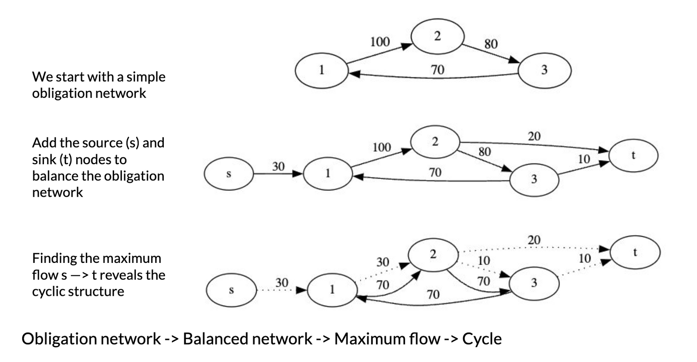
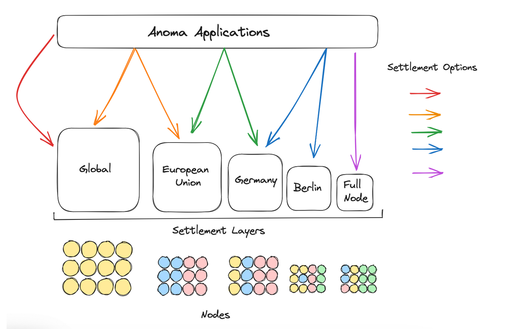

## Introduction

Recently, I traveled to the town of [Reichenau an der Rax](https://crypto-commons.org/collaborative-finance) to learn more and connect with some teams building the future of finance. It was an eye-opening experience in many ways. I was impressed with the density of knowledge, but more so with the collaborative spirit and passion of the participants. No one was there to make money or sell goods. Instead, people came together to learn, communicate, strategize, and organize.

In this article, I'll share some of my learnings from the gathering. First, I'll attempt to explain [Collaborative Finance](https://cofi.informal.systems/) in simple terms. Next we'll review Anoma and what an application on Anoma could look like. Finally, we'll discuss how CoFi and Anoma form a beautiful pairing.

## What is CoFi?

[CoFi](https://hackmd.io/ZxDrwaKTRDqP7qSTO9URsg?view=) or Collaborative finance is a term that characterizes a broad group of protocols, an organic grassroots movement spanning the globe, as well as a specific settlement and clearing protocol [MTCS](https://cofi.informal.systems/FAQ#how-much-trade-credit-is-in-cycles). This definition includes mutual credit systems, mesh-credit networks, and complementary currency protocols that allow communities to issue credit to members built on relationships of _trust_.

CoFi harnesses networks of credit and networks of trust that exist between all of us so that we can utilize the same mechanisms that banks and financial institutions are leveraging to build scalable trust and clearing networks.

The idea of [CoFi](https://cofi.informal.systems/) is to recognize a simple fact; that we are all together. There is no isolated, self-sustaining [local](https://www.youtube.com/live/VTm47N87rsY?feature=share) community. We are a global community composed of local communities. Indeed, the local community is often more relevant because locally we have more trust. If we understand this, then we can use trust locally to diminish the power of the global financial systems of control, allowing us to build new systems that work. In the process, we rebalance our relationship with the world. This is CoFi.

In this section, we'll briefly review two of the most prominent projects building CoFi applications; Informal's MTCS & Circles UBI/Entropy.

### Informal Systems & Multilateral Trade Credit Set-off (MTCS)

[(MTCS)](https://www.mdpi.com/1911-8074/13/12/295) allows businesses to share their trade credit data with a third-party platform that analyzes trade relationships to identify closed cycles of trade credit that can be canceled or netted out, reducing overall indebtedness.

<figure>
  
  <figcaption>Source: Informal Systems</figcaption>
</figure>

- The **MTCS** algorithm looks for closed cycles of invoices in an obligation network and subtracts the smallest amount from each cycle.
- An **obligation network** is a set of bilateral debts (invoices) between several participants.
- **Trade credit** is a form of business-to-business credit where one company purchases goods or services from another without making an immediate payment, instead deferring payment to a later date.

This process leads to liquidity savings, enhancing cash flow, reducing payment costs, and lowering financial risk. The magnitude of savings depends on the density and distribution of trade credits. Data from [Sardex](https://www.ft.com/content/cf875d9a-5be6-11e5-a28b-50226830d644), one of the most successful [mutual credit systems](https://www.sardexpay.net/) in the world, shows a reduction of net internal debt of the obligation network by approximately 25% when obligation-clearing is used by itself. The data shows a further 50% reduction when obligation-clearing is used together with mutual credit.

What is significant about this system is that it can interoperate with the legacy financial system and cryptocurrencies with liquidity injections. This can help bridge the gap between a new path forward that benefits the welfare of communities and humans, without creating an unnecessary dialectic between the legacy system and this new system.

### Circles UBI ⇾ Entropy

[Circles](https://handbook.joincircles.net/docs/developers/whitepaper) is a system that uses personalized cryptocurrencies and a network of trust between currencies to distribute money in a way that aims to make wealth more equal, in the form of an Unconditional Basic Income.

<figure>
  
  <figcaption>Source: Circles White Paper</figcaption>
</figure>

When people join Circles, they get their own cryptocurrency, which is regularly added to their account. Users can trust each other's currencies, which helps create a trans-territorial monetary system. Because of the emergent trust graph, Circles acts as a proof of personhood mechanism, whereby peers in a network verify that other people are legit, without having to engage in [eyeball scanning](https://vitalik.eth.limo/general/2023/07/24/biometric.html).

[Circles Entropy](https://circlesentropy.github.io/blackpaper/#fnref:ltn) is a project made by the Circles team that helps users make anonymous transactions and create trusted credentials without revealing their social graph to anyone. The Circles Coop has recently released a black paper outlining how they plan to use Anoma's [Taiga](https://github.com/anoma/taiga) to power their application.

## What is Anoma?

Anoma is an intent-centric platform on top of which applications can run. It provides memory isolation, inter-application communication, and execution. Anoma is designed for applications focused on solving socio-economic [coordination problems](https://www.slatestarcodexabridged.com/Meditations-On-Moloch).

### What are intents?

On Anoma, all user interactions start with an intent.

An [_intent_](https://research.anoma.net/t/exploring-intents-in-modular-architectures/136?u=apriori) is a message sent by a user which expresses their preferences regarding a desired state of the system. The user defines the constraints of what the system can do instead of execution paths.

- The _state_ of a system refers to its current condition or status at a given moment.
- _Solvers_ compete to match user intents, outputting full or partial transactions. Solvers ensure users’ preferences are respected.

The user constructs an intent in their wallet and sends it to Anoma. Some magic happens in the Anoma black box. The users' wallet provides a message which tells them their intent is satisfied or not. In the failure case, it's likely a wallet would suggest other configurations to try. The UX design space for user preference expression is beyond the scope of this article, but it's worth mentioning there are many [exciting developments](https://www.propellerheads.xyz/blog/blockchain-and-llms) incorporating large language models (LLMs).

For a breakdown of the intent lifecycle, see page 6 of the Anoma [white paper](https://media.githubusercontent.com/media/anoma/whitepaper/main/whitepaper.pdf).

### What Would an Application on Anoma Look like?

Imagine you could create an application that was agnostic to which blockchain it settles to. The application could live with shared state across multiple blockchains. On Anoma applications are virtual, meaning they are not deployed or tracked in any kind of registry, but instead they are defined by their solver algorithms and `resource_logic`.

The benefit of this model is that user security preferences can be separated from application design. In the diagram pictured above, the colored arrows represent users' choice of where users want to _settle_ their intents. The geographically labeled boxes represent [settlement](https://twitter.com/zmanian/status/1662460570342227970?s=20) layers or specific domains. The colored dots represent the network of Anoma nodes running the various instances. The coloration emphasizes that not all nodes will support all instances of Anoma. Therefore, users can choose their preferences regarding which security domain they intend to use.

## Why Anoma x CoFi?

Now that we have gone over CoFi and Anoma at a high level, let's dive into the motivations of why an application developer may want to build a CoFi application on Anoma.

### Information Flow Control

By using Anoma, users and application developers take [control](https://news.bitcoin.com/privacy-protocols-have-not-gained-traction-because-user-experience-hasnt-been-up-to-par-namada-co-founder/) over where, when, and to whom they share information. This is done with Taiga, a stateless execution environment for privacy preserving distributed applications running on Anoma. Taiga will provide data and function privacy with recursive zero-knowledge proofs.

### Permissionless Intent Infrastructure

Anoma supports programmable intents with a general protocol. This means that developers creating new applications don't have to worry about finding or building extra components like validators, solvers, or indexers, or any specialized infrastructure. They just need to decide on intent formats and solver algorithms.

Each CoFi application will likely have specific types of intents that need to be solved. Anoma provides a permissionless substrate for decentralized solving.

### Accounting Systems for Trust Graphs

Anoma is a general architecture designed to address architectural problems without making specific decisions. This flexible architecture allows different communities to experiment and innovate. As a community, if we are indeed committed to replacing fiat money, we need a fundamentally different macroscopic accounting system for [_scale-free_](https://pluranimity.org/) money.

Utilizing a limited number of denominations (money) in our economic system limits variety. If we desire diversity in our world, it is crucial to have diversity in our accounting systems. Anoma represents a step in that direction.

### Values Alignment

In 1914, Mitchell-Innes [argued](https://medium.com/ideal-money/the-credit-theory-of-money-9d141640465d) that money is credit and credit alone. If we take this at face value, it's not a logical leap to postulate that _trust_ is money. We are not talking about a system where people transact and then walk away from each other immediately upon exchanging currency (paper, digital, crypto) for goods and services as we experience today.

Trust as currency requires cooperation. It requires the _perfect_ coordination device that allows end users to issue currency instantly and also clear obligation and debt cycles as they are convenient to do so.

Can you imagine a world where business, DAOs, and organizations of any scale can work together to offset invoices and clear debt obligations?

Are you ready for a world where communities can issue their own currencies, returning sovereignty, dignity, and agency to their lives as they align around shared goals and purpose?

I am, and those of us building Anoma are as well.

Values alignment is critical when it comes to deciding how or where to allocate time and resources. The term alignment in AI research refers to the successful direction of AI systems towards human-intended goals, preferences, or ethical principles. These are higher order goals which humans are attempting to embed in AI. Similarly, values alignment for Anoma means working towards a better pluralistic world, where freedom is a choice, public goods are funded, and there exists a rich diversity of ideas. Many of the teams building CoFi protocols share these same values.

## Concluding Meditations

The pursuit of money as an end in of itself gives rise to an infinite set of [multi-polar traps](https://www.reddit.com/r/slatestarcodex/comments/3vcrbb/whats_a_multipolar_trap/), which allow the Moloch to extract rents gained from human coordination failures. With CoFi we can change this. As a community, if we commit to replacing fiat money or at a minimum augmenting it with scale-free money, we can change everything. _Together_, Anoma and CoFi provide one way of achieving this bright future.

---

## Acknowledgements

Thank you to [Yulia Khalniyazova](https://twitter.com/vveiln?s=20), [Raluca](https://twitter.com/ctzn101), [Julio Linares](https://twitter.com/Julio_Linares_?s=20), [Christopher Goes](https://twitter.com/cwgoes?s=20), [Paolo Dini](https://twitter.com/paolo3d?s=20) and[ Tomaž Fleischman](https://twitter.com/T_Fleischman?s=20) for reviewing different drafts of this post and providing insightful feedback.

Also thank you to [Giuseppe Littera (Peppi)](https://twitter.com/peppilittera?s=20), [Ethan Buchman](https://twitter.com/buchmanster?s=20) and [Shoaib Ahmed](https://twitter.com/sufialhussaini?s=20) for various conversations in and around these topics.

_All errors are my own. Please provide feedback on the _[_Anoma discourse_](https://research.anoma.net/t/anoma-is-putting-graphs-back-into-crypto/131?u=apriori)_ as you are inspired to do so._
