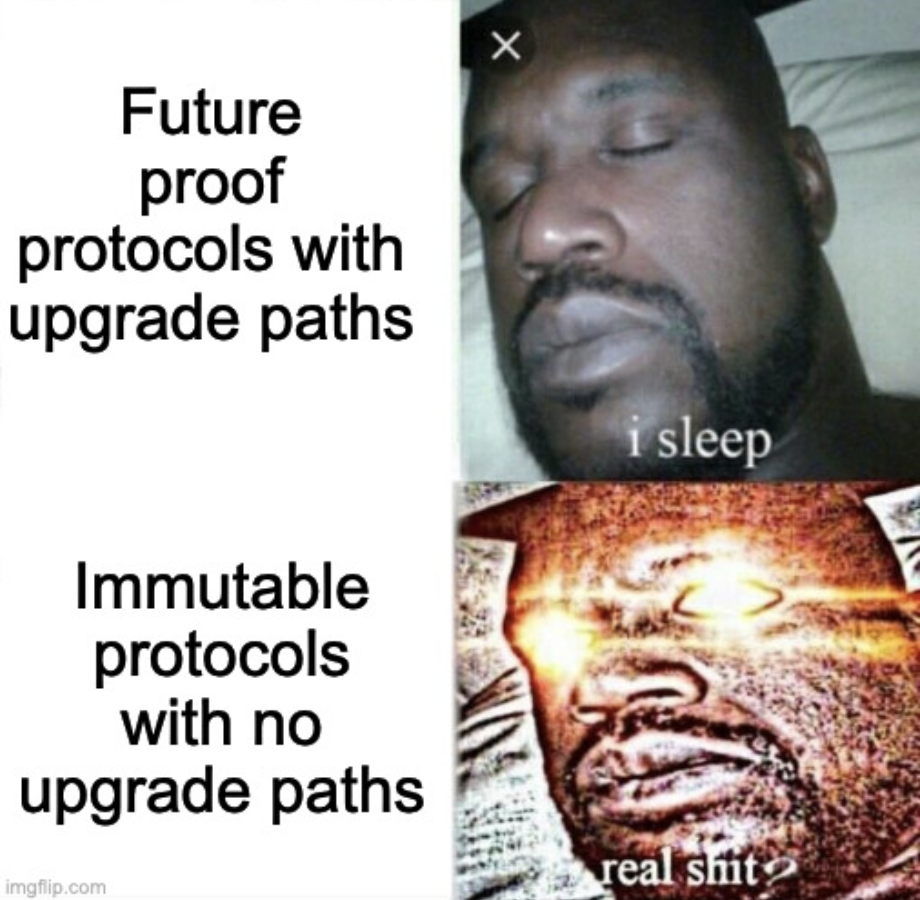
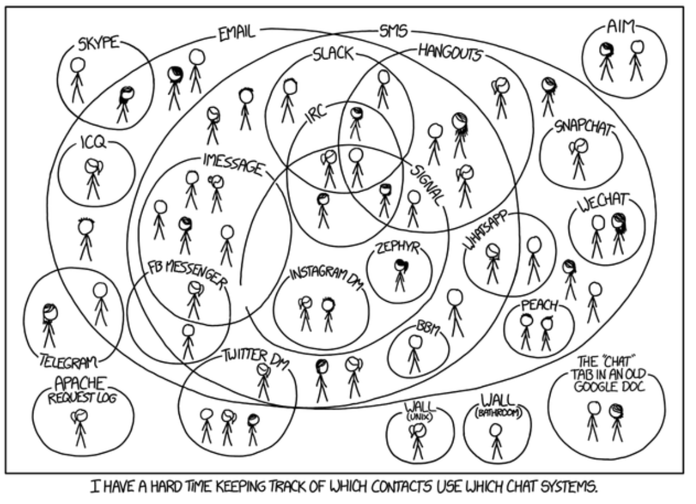
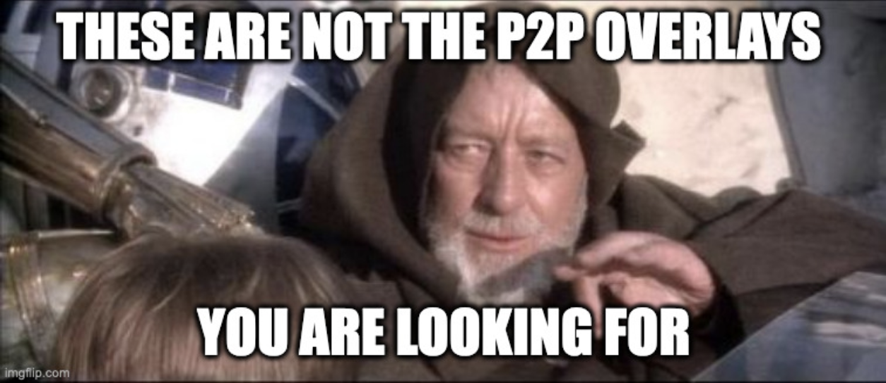
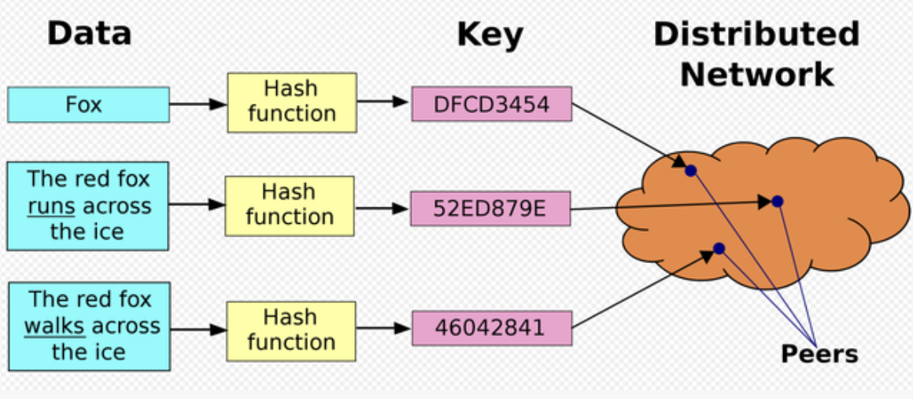
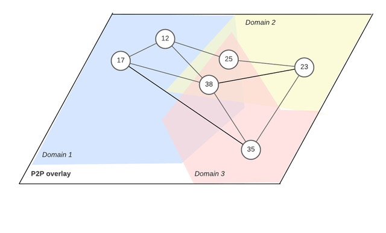
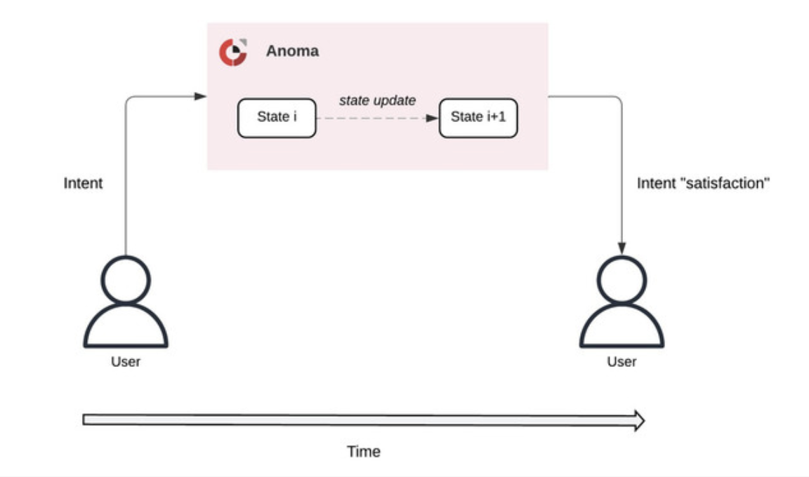

## Preface 

Multichat is a concept for an Anoma application. The application can be thought of as a distributed chat network *without* a central server operator. The history of chat applications is rich, spanning from the original Internet protocols like the Internet Relay Chat (IRC), Extensive Messaging and Presence Protocol (XMPP), AOL Instant Messenger (AIM), and Short Message/Messaging Service (SMS) to Slack, Discord, Discourse, Signal, WhatsApp and Telegram in present times.  Multichat demonstrates the principle of separating protocols from operators by allowing developers to customize interfaces for particular types of communication, relying on user trust graphs to identify and maintain connectivity. 

Multichat offers a minimum viable feature set that is competitive with existing messaging but can be forked and iterated over beyond a single hackathon event. Multichat's core feature set should include: (i) a messaging protocol, (ii) a user management system, (iii) complex permissioning (iv) message expiry (v) user presence and status (vi)  notification system and (vii) end-to-end encryption.

In this art we will survey the landscape of various chat applications and take a look at three case studies; Signal, Matrix and Multichat. We'd like to point out to the astute reader that this post does not provide a comprehensive survey as there are many chat applications that we do not mention. In addition,  this post is only a half measure in that it paints one possible sketch of what multichat could look like without providing the necessary rigor required found in documentation or specifications. In future art we will have more refined ideas and concrete descriptions of Multichat's requirements and features which hopefully will be of interest for application developers. 

## References 

It should be noted that this art is inspired by significant contributions to the research literature. Most of the ideas, references, phrases, and terminology used come from the following source materials. Also, it should be noted that Wikipedia references are used throughout. We recommend the earnest reader to visit these materials before engaging in this art. 

- [*The ecosystem is moving: challenges for distributed and decentralized technologies from the perspective of Signal development*](https://www.youtube.com/watch?v=Nj3YFprqAr8) by Moxie Marlinspike
- [*Ethereum: A Next-Generation Smart Contract and Decentralized Application Platform*](https://ethereum.org/content/whitepaper/whitepaper-pdf/Ethereum_Whitepaper_-_Buterin_2014.pdf) by Vitalik Buterin 
- [*A Federated Architecture for Information Management*](https://dl.acm.org/doi/pdf/10.1145/4229.4233) by Heimbigner and McLeod
- [Matrix 1.0: Decentralized Communication at Scale](https://www.youtube.com/watch?v=eA0KnTt4O7E) by Matthew Hodgson
- [*An Autonomous Ecologist's Guide to Namada and Anoma*](https://www.youtube.com/watch?v=OoS2_QT6_gc) by Christopher Goes
- [*Blockchain Nodes are Heterogeneous and Your P2P Overlay Should be Too: PODS*](https://arxiv.org/pdf/2306.16153.pdf) by Zarin, Sheff & Roos
- [*Sovereign Domain P2P Overlays, A brief intro to Anoma's P2P Network*](https://drive.google.com/file/d/1AT9vc0P_ReitBwY3wq0V7L3T88BC9LzD/view) by Naqib Zarin
- [*Towards an intent-centric topology*](https://anoma.net/blog/towards-an-intent-centric-topology) by Christopher Goes
- [*Rise of the Resource Machines*](https://anoma.net/blog/rise-of-the-resource-machines) by Yulia Khalniyazova 
- [*How Slack built Shared Channels*](https://slack.engineering/how-slack-built-shared-channels/)  by Sun and Demmer
- [*Grassroots Flash: A Payment System for Grassroots Cryptocurrencies*](https://arxiv.org/pdf/2309.13191.pdf) by Lewis-Pye, Noar, Shapiro
- [The Anoma: Undefining Money - Versatile commitments to value](https://anoma.net/vision-paper.pdf) by Goes, Yin & Brink

## Acknowledgements

This art is Inspired by conversations with Christopher Goes, D, Naqib Zarin, TG, Yulia Khalniyazova, and Tobias Heindel. 

*Thank you to [Christopher Goes](https://x.com/cwgoes), [@0x_Emperor](https://x.com/0x_emperor), and [Michael Heuer](https://x.com/heueristik) for preliminary review and feedback. Note that, we did not make all of the requested changes. Review ≠ endorsement.*

Indeed, this art [stands on the shoulders of giants](https://en.wikipedia.org/wiki/Standing_on_the_shoulders_of_giants), and our contributions here pale in comparison to the referenced literature. **All errors, mistakes, omissions are the author's own.**

  
## Introduction 

Multichat is a concept for an Anoma application. The application can be thought of as a distributed chat network *without* a central server operator. Multichat demonstrates the principle of separating protocols from operators, or operator - protocol separation. OPS speaks to the unbundling of an existing web 2 business model. For example, centralizing some of the original internet protocols has been a recipe for success. It's what slack did with IRC, it's what Facebook did with email, It’s what WhatsApp did with XMPP. Clearly, these companies did more than just fork something like IRC. However, they often used open-source software to bootstrap their product development and then created gated moats of value capture, leaving users with high switching costs while cementing a rent seeking model often referred to surveillance capitalism.

The Anoma Protocol is a distributed operating system on top of which applications can run. Anoma allows developers to rebuild these protocols agnostic of the existing operators on permissionless intent infrastructure. Anoma's architecture affords developers a rich canvas for experimentation where many existing applications like X (twitter) can be rebuilt to be permissionless, interoperable and customizable for community or organization needs. 

There are three common types of chat application networking architectures including (i) centralized server-based, (ii) federated, (iii) Peer-to-Peer (P2P). We'll take a look at centralized server-based and federated architectures first, and then follow up by exploring P2P designs enabled by Anoma's network architecture. In addition, we'll examine Signal as a case study for centralized architecture and [Matrix] for federated architectures. 

Signal and Matrix provide users many things they desire. One stated goal of this research is to understand if Anoma can offer anything beyond what already exists on the marketplace. With that said, Let's begin with centralized architectures.

## Part 1: Concepts & Case Studies

## The challenges of centralized server-based chat applications

<figure>
  
  <figcaption>Source: imageflip</figcaption>
</figure>

A naive understanding is the simple client-server model.  In a client-server model, the workload between the client (service requester) and a server (service provider) is shared such that the client makes requests for services or content to the server while the server may run one or more programs that share information with the client. The relationship is asymmetric, the server does the work for the client.  

Often clients and servers communicate over a [computer network](https://en.wikipedia.org/wiki/Computer_network "Computer network") on separate hardware, but both client and server may reside in the same system. A server [host](https://en.wikipedia.org/wiki/Host_(network) "Host (network)") runs one or more server programs, which share their resources with clients. A client usually does not share any of its resources, but it requests content or service from a server. Clients, therefore, initiate communication sessions with servers, which await incoming requests. 

Clients and servers are run on separate hardware devices. In a centralized server-based model that is common today, many clients make request to a single cluster of servers located in the same data center. For example, every time a user refreshes their Twitter feed, a call to Twitter's servers is made by the client on the user's cell phone. 

Unfortunately, the architecture of centralized server-based social networks often results in the network operators obtaining and storing a broad range of personal information of their members, including their online behavior, original content and social graph. As an operator, you can use this information to determine the correct ads to feature for given subsets of users and then auction off-space.

**Advantages**
- **Low latency** - there is no communication overhead between different nodes in the network, all messaging happens on the same server.
- **High performance** - the system is likely optimized for high performance including high throughput, meaning it can handle an increased network load. 
- **High uptime**- network outages are infrequent and partitions are non-existent.  
- **Reliability** - the system can perform its expected function when required. 
- **Simple implementation** -  building an application on a distributed system is hard and may require additional engineering knowledge. Conversely, centralized applications are often easy to implement with many cloud computing servers competing. 
- **Scalability** - it is easy to rent more cloud space.

**Disadvantages**
- **Control** -  the central authority of the system has complete administrative control over the system. 
- **Data ownership** - the operator can obtain and store user information including their online behavior, original content, and social graph. The operator can use this information to profit while sharing nothing with the user. 
- **Censorship Resistance** - another downside to server-based social networks is they may also [comply](https://theintercept.com/2022/10/31/social-media-disinformation-dhs/) with [censorship](https://opoyi.com/india/facebook-cut-access-to-944-content-items-in-india-on-government-request-355972/) [requests](https://officialrequests.meta.com/xreports/login/) from state level actors or ransom attackers: like opportunistic AI agents. 
- **Switching Costs** - unfortunately, there are high switching costs for centralized applications. Indeed, under a censorship attack, other types of network architectures also struggle. If you move from Facebook to X for instance, your social graph does not travel with you. 

One interesting example of a centralized server model that has managed to side-step the disadvantages listed above is Signal, a private messaging application. Signal operates the Signal protocol, formerly known as the text secure protocol. This allows Signal the application to provide encrypted messaging for text (including attachments), voice, and video chats. Users can communicate with each other individually or in group chats. Historically, Signal used cell phone numbers as global identifiers for users (exclusively), though they recently rolled out usernames as well. Signal provides client software that allows users to independently verify their contacts. Signal is available for users on iOS, Android, and desktop compatible with Windows, macOS (UNIX) and Linux distributions. 

### Signal Case study - The ecosystem is moving 

<figure>
  
  <figcaption>Source: imageflip</figcaption>
</figure>

<a href="https://imgflip.com/i/8ka6kw"></a><div><a href="https://imgflip.com/memegenerator"></a></div>

Signal's co-founder Moxie Marlinspike (previously Open Whisper Systems) gave a compelling talk at the 36th [Chaos Communication Congress](https://en.wikipedia.org/wiki/Chaos_Communication_Congress) in Leipzig, Germany. In the talk, he made a few key points. 

- Software evolves - evolution is incompatible with the static nature of decentralized systems. Swift and timely upgrades are not easy.
- Centralization is not as bad as it seems (you can iterate quickly) - centralizing protocols has been a recipe for success. It's what slack did with IRC, it's what Facebook did with email, It’s what WhatsApp did with XMPP.
- By decentralization we really want; privacy, censorship resistance, availability and control - you can get all of these properties without decentralization.
- Open-source software (OSS) plays a larger role in availability and control than decentralization.
- Anyone who is working on decentralized systems today needs to do so without forgetting that the ecosystem is moving.

In particular, Moxie walked the conference attenders through four properties people want when they claim to want decentralized systems. 

Signal tackles privacy with private groups, contact discovery, and sealed senders. This means that the Signal service has no visibility into group communication state, membership information, visibility into your contacts (social graph), and no visibility into who is messaging who (Signal uses Zero-Knowledge Proofs!). 

Censorship resistance assumes that many things are more difficult to block than just one thing. For example, If you have many servers, it’s more difficult for a censor to block access to those than block access to one server. However, if something is user discoverable, it is also going to be censor discoverable. In a scenario where your server gets censored, and you switch all activity to a different server, there are high switching costs for the user (blow up your entire social graph). Moxie argues that it’s actually more effective to have one centralized service with multiple [ingress points](https://en.wikipedia.org/wiki/Ingress_filtering). If you have such a service with many users and access to that service gets blocked, it's easy to spin up another ingress point, a proxy, or a VPN that everyone can switch to, enabling low switching costs. 

Availability is raised as a concern Every time there is an outage or liveness failure of a centralized system. While distributed systems can offer theoretical benefits, in practice they also suffer from liveness failures. There is no free lunch. 

Control in centralized systems is not strictly worse than in decentralized systems. If you have a federated environment, different services can behave differently. If you are a subscriber of one service and your provider starts to behave maliciously, you could just switch providers but not lose access to the entire network. Control, however, is derived from open-source software. It's trivial to fork the code base and redeploy the application. Decentralized systems are not strictly better in this regard, and perhaps the overhead of the social layer to coordinate hard forks is not what gives users control. Rather, it is the software being Free and Open-Source (FOSS) that provides control to users. 

Perhaps the most relevant point made by Moxie in his talk (which answers why Signal is not some type of decentralized architecture) is that decentralized architectures are difficult to upgrade. If you iterate slowly, you will get outcompeted and become irrelevant. Networks evolve. Also, security threats are in a constant state of flux. Also, the user experience language often changes and evolves quickly to satisfy new user desires. As more money, time, and focus is poured into software development, the entire ecosystem accelerates its collective pace of innovation. Those who cannot keep up perish. The ecosystem is moving.

As we transition to discussing federated architectures next, it’s worth keeping this theme in mind.

## Decentralized alternatives, thinking about Federated Architectures

<figure>
  
  <figcaption>Source: imageflip</figcaption>
</figure>

Federated Architectures do not have the constraint of a central authority. The role of the central authority is replaced by cooperative activity.  A federated database architecture is a collection of independent database systems united into a loosely coupled federation to share and exchange information. A federation consists of instances (components) and a single federal dictionary. The instances represent individual users, applications, workstations, or other instances in an office information system. 

Borrowing the definition and mental model from Heimbinger and McLeod (1985) in *A Federated Architecture for Information Management*, Federated architectures must balance two conflicting requirements.

- The instances should maintain as much *autonomy* as possible. 
- Achieve a reasonable degree of *information sharing* or interoperability. 

**Autonomy** 
- No instance is forced to perform an activity for any other instance. 
- Each instance determines the data it wants to share with other instances. Partially controlled information sharing is a fundamental goal of the federated approach.
- Each instance determines how it will view and combine existing data. Each instance must build its own global scheme to suit its needs.
- Instances must be able to enter and leave the federation. 

**Information Sharing**
- Data communication - instances can share portions of their data with other instances. Exchanging data is a primary operation for a federated network; this requires a mechanism to share data. 
- Transaction sharing - a particular instance may not want to share its data directly. For example, if the data is sensitive or has constraints. Transaction sharing allows an instance to share operations or transactions to be performed on its data without directly exposing the actual data to other instances.
- Cooperative activities - in a system of autonomous instances, the only way that the federation can function correctly is by cooperation. Components must be able to initiate a potentially complex series of actions involving cooperation with other instances. Cooperation in this context refers to negotiated data sharing.

**Advantages** 

The main advantage of the federated architecture is that it allows individual instances to remain autonomous and control what data they share, while still enabling some sharing across instances. However, the downside is that you lose the benefit of having all data fully integrated into a single, global database schema, which composite/integrated database approaches provide.

- Low switching - can provide censorship resistance in the worst case with a credible threat to exit.
- Autonomy - operators of instances can customize feature sets and policies that suit their community needs.
- Interoperability - users can discover users from different instances with shared standards. 
- Data ownership  - users can choose which instances to interact with, including their own. 
- Information control - in a permissioned or permissionless setting, programmable disclosure can be baked in.

**Disadvantages**

There exists a tradeoff between preserving autonomy of each instance vs. having a unified, integrated view of all data across the instance. 

- Fragmentation can lead to poor UX - each instance may have custom configurations or customizations that can lead to inconsistent user experience across the network.
- Performance degradation based on communication complexity - coordinating communication across servers can lead to high network load and increased failure rate. Scalability can be challenging. 
- Security - each instance needs to be individually secured and protected against attacks.
- Network effects - user discovery can be a challenge, as users from different instances may not be easily discoverable.
- Maintenance and upgrades - each instance may have its own upgrade schedule and software versioning. Also, this can become a coordination problem without a proper control mechanism (governance). 

One annoyance or drawback of using today's Multichat applications is that they typically do not allow for interoperability between applications. What do we mean? Have you even tried to receive a message in telegram or signal and then need to communicate in Slack? There are many of these interactions every day. A tweet is created on X that gets shared on Telegram for distribution, then again downstream to Slack for further dissemination from the relevant parties. Matrix provides one attempt to solve this problem. Although not covered here, Mastodon and the Fediverse provide another interesting case study.

## [matrix] Case study 

<figure>
  
  <figcaption>Source: Matrix 1.0: Decentralized Communication at Scale</figcaption>
</figure>

Matrix is a federated network for secure decentralized real-time communication. Matrix is open-source software. It is used for, interoperable chat, Interoperable Voice over IP (VOIP), open communication for AR/VR, and real-time IoT data fabric. Matrix can be used anywhere that needs a standard HTTP API for publishing and subscribing to data while tracking the conversation history.  This affords users the ability to communicate with each other across different messaging applications, including Slack, Discord, Signal, WhatsApp, etc. Ultimately, Matrix is a big network of [JSON](https://en.wikipedia.org/wiki/JSON) where you can replicate JSON between a decentralized, open network of servers. 

Matrix's mission is to create a global decentralized encrypted communication network that provides an open platform for real-time communication. Matrix can replace the mobile phone networks and e-mail communications. 

Matrix was designed with a certain set of values. In particular, the Matrix manifesto states that
- People should have full control over their communication. 
- People should not be locked into centralized Silo's, but instead be able to express their individual preferences to host their communication without limiting who they can reach. 
- Conversing securely and privately is a human right.
- Communication should be open to everyone globally as a free, open, and unencumbered standard.

Today there exist several centralized silos like Slack, Discord, Signal, Telegram, Twitter, IRC, etc. Matrix can act as a connective tissue to link these isolated chat protocols together. The servers of Matrix are decentralized. They run a client protocol where clients talk a simple an [HTTP](https://en.wikipedia.org/wiki/HTTP) (Hypertext Transfer Protocol) [API](https://en.wikipedia.org/wiki/API) (Application Programming Interface) across the different nodes participating in the network. The aim is that no single party owns or controls your communications. The conversations between nodes are replicated in a [Merkle tree](https://en.wikipedia.org/wiki/Merkle_tree) on the servers over all the participating instances. 

Matrix's architecture includes; clients, home servers, application servers, and identity servers. The application servers bridge to other messaging protocols. Identity servers map your phone number or [Email](https://en.wikipedia.org/wiki/Email) address to an identifier in the matrix server to discover who is on the network and how to talk to them. 

### The Features of Matrix include
- Conversation history - synchronize between chat rooms.
- Group messaging - one-to-one communication.
- End-to-End Encryption ([E2EE](https://en.wikipedia.org/wiki/End-to-end_encryption)) - [Double Ratchet Algorithm.](https://en.wikipedia.org/wiki/Double_Ratchet_Algorithm)
- Editable messages and reactions.
- VOIP calling for web based Real-time chat.
- Server-side push notification rules.
- Server-side search functionality.
- Read receipts, typing notifications, user presence.
- Synchronized read state and unread accounts.
- Decentralized content repository. 
- "Account data" for users per room. 

As a source of truth, the [Matrix specification](https://spec.matrix.org/latest/) is a document that defines all the APIs that the clients use to talk to the servers. Matrix has six stable clients and up to twenty-one clients, including alpha and beta products. This level of client diversity is not dissimilar to that of the Ethereum protocol.  The [Synapse](https://github.com/matrix-org/synapse) client maintained by [Element](https://github.com/element-hq/synapse) is the most mature python implementation.

Clearly, Matrix has much to offer its users. Its decentralized design leaves no single point of failure, as anyone can run their own server. The federated architecture also provides low switching costs and thwarts operator lock-in. In addition, Matrix supports several mediums of communication which include messaging, VOIP, IoT communication, and perhaps its most notable feature *interoperability* with other chat-based protocols. 

While Matrix certainly has much to offer, it's not without its drawbacks. While Matrix supports end-to-end encryption, metadata like message timestamps can be visible to servers involved in the routing of messages. Client diversity can certainly be seen as a feature for decentralization and resilience of the network, but it leads to a challenging user experience, especially for folks who cannot reason about the trade-offs. This approach of client diversity may also sacrifice discoverability for users based on the particular client's distribution. Finally, scalability can also become challenging. Synchronizing and replicating state across multiple servers can lead to high latency when communicating compared to centralized servers, which, may degrade user experience. 


## A Multichat architecture that synthesizes centralized and federated architectures

<figure>
  
  <figcaption>Source: Matrix 1.0: Decentralized Communication at Scale</figcaption>
</figure>

After reviewing the advantages and trade-offs of centralized served based vs. federated networks for building chat applications, including reviewing case studies of Signal and Matrix, it should be clear that both types of architectures have desirable properties.  Is there a way to get autonomy, interoperability, high uptime, censorship resistance, control, data protection and low latency? 

Perhaps. But to answer that question we should consider what Mulitchat provides that existing chat applications do not and explore what makes Multichat unique. One unique feature is building on Anoma which is unique in its own right. Anoma provides an operating system for application developers to build on, which affords developers a number of key features. As such, we'll start by reviewing Anoma's P2P architecture. 

### Motivation

Anoma's P2P architecture can potentially provide many of the features that a chat application would desire. In particular,

- We want a smart chat protocol which will use the lowest-latency physical link to the actual user, e.g. use a LAN link if they're on the same network
- We want "offline"-capable chat
- We want censorship-resistant P2P so that the chat servers cannot be banned and users don't need to constantly find new VPNs 


In the following section, we'll review some of our Research on P2P networks by reviewing research by [Naqib Zarin](https://twitter.com/naqib_zarin) (P2P researcher), and the paper he co-authored with [Isaac Sheff](https://x.com/IsaacSheff?s=20) and Stefanie Roos, [*Blockchain Nodes are Heterogeneous and Your P2P Overlay Should be Too: PODS.*](https://arxiv.org/pdf/2306.16153.pdf) to understand what's special about Anoma - why you would want to build any chat application. But first let's start with some basics.

### What is a P2P network?

A P2P network is a decentralized distributed system without a central party that orchestrates communication. Since there is no orchestrator, nodes need to communicate directly with each other to maintain the ledger.  

- An architecture with a central orchestrator makes coordination easy. All nodes can simply send their request and respond messages to a central node and this node will do the rest. 
- Decentralized architectures are more complex. 
   - For example, where do you send your information? Do you send it to all nodes? If so, this means that both the number of peer connections you maintain and the cost of participation increases exponentially. 
   - Do we only send information to some nodes? If so, which nodes and where?  
   - Who do we connect with, and how do we ensure that the information can be received by all nodes even if not all nodes are connected to each other?

A P2P overlay is a virtual network that is built on top of the underlying physical infrastructure (the Internet). The P2P overlay is responsible for managing connections between nodes and ensuring information is propagated efficiently over the entire network. 

### Two main components to the P2P overlay

- Topology - the topology maybe either unstructured or structured.
- Communication Strategy - describes data selection, types of nodes, and time selection 

Let's start with Topologies. Network topology is the arrangement of the elements (links, nodes, etc.) of a communication network In unstructured overlays nodes are connected to each other randomly. On the other hand, a structured topology is tightly regulated with very specific rules regarding where nodes are positioned in the topology. Nodes in this topology are often DHT (distributed hash table) [based](https://www.paradigm.xyz/2022/08/das). [Kademlia](https://en.wikipedia.org/wiki/Kademlia) is the most popular example. 

<figure>
  
  <figcaption>Source: Distributed Hash Table, Wikipedia</figcaption>
</figure>


Communication Strategies have three key components. (i) *data selection,* which describes what information nodes send, the type of message (entire message or an [erasure coding of the message](https://en.wikipedia.org/wiki/Erasure_code)). (ii) *types of nodes* - who nodes send their information to. For example, do we use [flooding](https://link.springer.com/chapter/10.1007/978-3-642-21697-8_85) and send messages to all neighbors or [gossip](https://devavrat.mit.edu/wp-content/uploads/2017/08/Gossip-Algorithms.pdf) and send information only to some neighbors? (iii) *time selection* - when do we send messages? Nodes can decide to relay messages instantly for better information dissemination, or they can also wait and [aggregate](https://ethresear.ch/t/pragmatic-signature-aggregation-with-bls/2105) multiple messages to reduce costs by consuming less bandwidth.

## Features 

### Interoperability

Traditional P2P designs did not prioritize interoperability because it was not necessary. For example, connecting a streaming message application to a file storage system was not a desired property.  Using a similar P2P architecture in decentralized systems has resulted in a lack of interoperability. For example, the blockchain ecosystem is unique in that there exist several independently maintained P2P overlays. We want to allow for information to flow between overlays to prevent [Silos](https://www.tietoevry.com/en/blog/2021/05/time-to-break-down-the-silos-for-exponential-p2p-payments-growth/), but also interconnected overlays can benefit from each other in different ways.  For example:

- Services - two overlays can make services available to each other from a network layer perspective (resources). 
- State - two interoperable overlays can benefit from sharing a certain state. Messages of a given overlay can use the routes maintained by another overlay if those routes are shorter. 
- Communication - benefit from each other by communication [coordination](https://www.slatestarcodexabridged.com/Meditations-On-Moloch), the network traffic can be reduced by "piggybacking" messages that are meant for the same destination. Sophisticated strategies  can be developed if a source and target node map to the same IP address, whereby we don't have to send information over the p2p network.  

### Scalability 

There are three important scalability dimensions to consider. 

- Number of nodes - if the node count increases, then we want to maintain performance. 
- Volumes of data - we don't want to overburden particular nodes with large amounts of work or data.
- Communication streams - the network should be able to handle different streams of communication. 

We can achieve scalability across these three dimensions by implementing a sharding like scheme such that we split high-volume communication flows and data storage into smaller ones. From a single p2p overlay perspective, this means we have multiple sub-overlays that work together to a common goal.
 
### Proposal: P2P Overlays Domains with sovereignty (PODS)

<figure>
  
  <figcaption>Source: Naqib Zarin, *A brief introduction to Anoma's P2P layer*</figcaption>
</figure>

Nodes are heterogeneous, your p2p overlay should be too. Each domain has its own overlay topology, and a distinct set of P2P intra-domain protocols, tailored to the characteristics and needs of the nodes in that domain. This new approach provides: 

- **Performance** of typical federated p2p overlays by (i) making data interoperable, (ii) collecting data and statistics about domains, and (iii) using the collected data to make routing decisions
- **Security** of large or monolithic p2p overlays by (i) monitoring the health levels of other domains and (ii) allowing nodes to join the attacked domain to restore the fraction of honest nodes in that domain.
- **Flexibility** to accommodate node heterogeneity by allowing for different protocols to be run in different domains.

While we presented a basic intuition about a novel type of P2P architecture, this is clearly not a silver bullet solution. We look forward to feedback and collaboration from the community, including collaborating on future [Anoma Research Topics](https://art.anoma.net/) (ART)s relational to the networking architecture, P2P overlay, and trust (h/t [Jonathan Prieto-Cubides](https://x.com/jonathan_heliax)). 

## Part 2: Multichat on Anoma

<figure>
  
  <figcaption>Source: DALL·E 3</figcaption>
</figure>

Multichat in theory, is designed to handle [heterogeneous](https://en.wikipedia.org/wiki/Heterogeneous_System_Architecture) organization graphs. Similar to slack or discord where channels are managed by central servers. Specifically, you want to allow users of Multichat to create channels, communicate across those channels to other channels, including separate workspaces and different versions of Multichat. 

### Affordances and challenges of building with Anoma

> [**Affordances**](https://www.interaction-design.org/literature/topics/affordances) represent the possibilities in the world for how the agent (a person, animal, or machine) can interact with something.

Psychologist James Gibson coined “affordance” in 1977, referring to all action possibilities with an object based on users’ physical capabilities. For instance, a chair affords sitting on, standing on, throwing, etc.

[Don Norman](https://en.wikipedia.org/wiki/Don_Norman) later (1988) introduced the term to the design community, but modified the meaning slightly to make it more appropriate for use by designers. For example, Don Norman defined affordances as perceivable action possibilities – i.e., only actions which users consider possible. Norman theorized that designers must create objects’ affordances to conform to users’ needs based on these users’ physical and perceptual capabilities, goals and prior experiences.

Clear affordances are vital to usability. Users will map the possibilities of what an object does according to their conceptual model of what that object should do (e.g., inserting fingers into scissor holes to cut things). If the affordances of an application are apparent, this can often lead to a great user experience.

**Anoma's affordances:**

- **Permissionless Intent infrastructure** - Anoma supports programmable intents with a generalized protocol. This means that developers creating new applications don’t have to worry about finding or building extra components like; validators, solvers, indexers, tool chains, or any specialized infrastructure. Developers just need to decide on intent formats and solver algorithms. Each application will likely have specific types of intents that need to be solved. Anoma provides a permissionless substrate for decentralized solving. Anoma nodes can be configured to perform any or multiple distinct protocol rolls. These can change depending on user intents. 
    - In the endgame the Multichat codebase can be forked and modified, allowing communities to customize the application to suit their needs, including the resource types, logics, and intent types.  Front end and mobile developers can also use Anoma as a backend for Multichat building custom interfaces that can interoperate similar to how matrix connects to various messaging services with HTTP. 


- **Information Flow Control** - The parties involved in a transaction can decide how much of the information about their state to reveal and to whom. There is no difference between transparent and shielded resources, but the amount of information revealed about the states differs. It is realized with the help of shielded execution, in which the state transition is only visible to the parties involved.

    - For Multichat this allows for complex user permissions. For example, users can choose who they trust to receive and process messages. They can also choose any available encryption methods compatible with the Anoma protocol. For example, think about the permissioning features on a Discord chat.

- **Intent-level composability** - All applications written for Anoma can be composed at the intent level, meaning that intents for different applications can be composed together and [executed atomically](https://www.geeksforgeeks.org/atomic-operations-in-os/), and [settled](https://frontier.tech/the-cake-framework) across domains without any additional effort or prior coordination on behalf of the application developers.
    - Multichat intents can be composable with each other across chat and even non-chat applications. These intents could be composed with other Anoma applications, which could open the door for quite a bit of innovation at future hackathons. 

**Short-term and medium-term challengers to building on Anoma:**

- **Domain-Specific Language** - learning new programming languages, while by no means impossible, is not easy. Programming languages can be trendy and in the crypto ecosystem, Solidity and Rust-based languages are the dominant smart contracting languages of choice. In addition, functional programming languages in the crypto ecosystem have a negative connotation. However, DSLs can be superpower. Solidity, for all its criticism, has survived and thrived in large part due to the wide adoption of the EVM. 
    - We'll attempt to address this concern by writing a toy example with pseudocode showing how to write resources, resource logics and Intent types.


## Minimal Lovable Multichat 

Now that we have a solid understanding of what type of application Multichat is as well as a context with which to understand what affordances the Anoma protocol provides to builders, along with a basic understanding of what is offered in the competitive marketplace, we can now ask, what key features should a minimal lovable Multichat have?

 - **Messaging protocol** should use Anoma's P2P network for communication (sending and receiving messages). It should also clearly define message resource types, logics, and intents.
- A **user management system** should allow the creation of user profile resources to store user information, such as username, public key, and avatar.
- **Complex permissions** can be handled by information flow control functionalities via Intents which enforce granular preferences like permissions. It may also be important to define resource logics for user permissions and channel access control. Also, for administration, we may want to implement role-based permissions. 
- **Message expiry** functionality should afford users the ability to set message expiry and retention policies.
- **User presence and status** may be difficult at first blush. Implement user presence and status indicators. 
- **Notification system** should rely on Anoma's P2P network.
- **End-to-end encryption** - ZKPs can help here. Juvix can be compiled to target a zkVM backend. Though metadata leakage and content control maybe difficult initially.

### What could MLM look like?

<figure>
  
  <figcaption>Source: imageflip</figcaption>
</figure>

Anoma applications are written in [Juvix](https://docs.juvix.org/0.6.1/README.html#), a high-level functional programming language.  To build an application like Multichat it may be necessary to consider several different resource types, corresponding resource logics, and intent types, that can processed by the resource machine. By way of example below, we will walk through some hypothetical pseudocode - inspired by `abstract-resource-machine-simulator` [2 party exchange](https://github.com/anoma/abstract-resource-machine-simulator/blob/main/Apps/TwoPartyExchange.juvix) -  to help the reader or application designer gain an intuition. 

### Resources

First, we probably want a message resource which contains the sender, receipts, content, a timestamp, and expiry fields along with additional metadata. This resource type may look like this


``` 
messageResource : Resource := {
  sender : Address,
  recipients : List Address,
  content : String,
  timestamp : Timestamp,
  expiry : Timestamp,
  -- other metadata fields
}
```


In addition, we most likely want a few more kinds of resources: a channel resource with fields for name,  members, and permissions,

```
channelResource : Resource := {
  name : String,
  participants : List Address,
  permissions : Permissions,
```

a user profile resource with fields consisting of a username, public key and avatar.

```
userProfileResource : Resource := {
  username : String,
  publicKey : PublicKey,
  avatar : String,
```

a `permissionsResource` which defines the actions (booleans) the user is allowed to perform, such as sending messages, creating channels, or managing their profile, 

```
permissionsResource : Resource := {
  user : Address,
  permissions : {
    sendMessage : Bool,
    createChannel : Bool,
    manageProfile : Bool,
    // Other permissions can be added as needed
  }
```

and a `channelAcess` resource which represents the user's role and access within a specific channel. `ChannelRole` is an enumeration which defines the user's role within the channel

``` 
channelAccess : Resource := {
  channel : Address,
  user : Address,
  role : ChannelRole,
  // Other metadata or fields can be included
}

ChannelRole : Enum := {
  Member,
  Moderator,
  Admin,
  // Other roles can be added as needed
}

```

### Resource Logics

The existence of resources alone are not enough to create a multichat application. We also need Intent types. Recall that resource logics specify under which conditions Resources that carry them can be created and consumed.

- `messageLogic` should check sender permissions, validate message content and metadata, and enforce message expiry based on `timestamp`. 
- `channelLgoic` should control channel creation, deletion, and membership. It should enforce `permissions` in the `permissions` field, and handle channel-specific settings.
- `userProfileLogic` should control the user profile creation, updates, and deletion. It should enforce user authorization rules with `PublicKey` and handle user presence and status updates. 
- `permissionsResourceLogic` performs a check to see if the user has the necessary permissions to perform the action.
- `channelAccessLogic` checks if the user has the necessary role to enter a particular channel.

### Intent Types

<figure>
  
  <figcaption>Source: Someone building Anoma</figcaption>
</figure>

Intent types will specify the resources that can be created and consumed for each operation. Let's take a look at potential intent type to send messages;  `sendMessageIntent`

``` 
sendMessageIntent : PartialTx := {
  consume := [permissionsResource, channelAccess],
  create := [messageResource {
    sender = senderAddress,
    recipients = recipientAddresses,
    content = messageContent,
    timestamp = currentTimestamp,
    expiry = expiryTimestamp
  }]
}
```

The Intent Type `sendMessageIntent` will allow users to send messages in Multichat by consuming and creating the necessary resources. Recall that [resources](https://anoma.net/blog/rise-of-the-resource-machines) are immutable. They can be created once and consumed once, which indicates the system state change. The resources that were created but not consumed yet make the current state of the system. 

In this example, `consume` is an array which specifies which resources need to be consumed, `PermissionResource` and `channelAccess`. Additional intent types could include `joinChannelIntent`, `leaveChannelIntent`, `updateProfileIntent`, among others. 

Indeed, the goal of this section was to tease out a minimal lovable Multichat spec that can be further iterated upon as product requirements for specific application builders become clear. We look forward to your feedback! 

### Comparative Analysis

Indeed, we've now gone through the exercise of explaining different types of architecture for chat applications featuring Signal, Matrix and Multichat. Is Multichat any better or even worthwhile? Let's break this down with the help of a table. The table displays ten different properties to evaluate these applications. 

| Property | Multichat | Signal | Matrix |
|---|---|---|---|
| Architecture | P2P (Anoma) | Centralized | Federated |
| Decentralization | High | Low | Medium |
| Censorship Resistance | High | Medium (multiple ingress points) | Medium |
| Privacy | High (information flow control) | High (end-to-end encryption, sealed sender) | Medium (end-to-end encryption, metadata leakage) |
| Interoperability | High (intent-level composability) | Low | High (bridges to other apps) |
| Customization | High (fork and modify codebase) | Low | Medium (custom server configurations) |
| Scalability | High (scale-invariant) | High (centralized) | Medium (state sync challenges) |
| User Experience | TBD | High  | Medium (client fragmentation) |
| Upgrade Flexibility | High (swap out proving backend, consensus, etc.) | High (centralized control) | Low (coordination across instances) |
| Trust Assumptions | Low (customizable) | High (trust Signal) | Medium (trust in server operators) |

While Multichat is hypothetical, it does potentially win on important areas like censorship resistance, privacy, interoperability, customization, scalability, and flexible upgrades versus well established applications Signal and Matrix (let's reserve judgement until the application is live).

## Conclusion

<figure>
  
  <figcaption>Source: Someone building Anoma</figcaption>
</figure>

In the article, we walked through the benefits and drawbacks of centralized vs. decentralized architectures for chat applications that exist today. We reviewed a case study focusing on centralized server models by reviewing Signal and federated architectures by reviewing [matrix]. Thereafter, we introduced Anoma's P2P overlay architecture as a way to potentially get the best of both centralized and federated architectures. Next we described a minimal lovable Multichat by outlining the key features and then attempted to spec out what an implementation could look like. In particular, we designed the application in relation to the Anoma Resource Machine, outlining new resource types, logics, and intent types in pseudocode. Finally, we reviewed a comparison table between Multichat, Signal and Matrix that suggests if we design Multichat correctly it may be useful to many users. 

## Future Directions
Further directions of research may include adding new features or incorporating [Conflict-free replicated data types](https://en.wikipedia.org/wiki/Conflict-free_replicated_data_type) (CRDTs).

### Feedback

Please provide and feedback, comments, and complaints in the [research forums](https://research.anoma.net/t/draft-rfc-dreaming-of-multichat-a-chat-application-built-with-anoma/515?u=apriori). See you there. 

