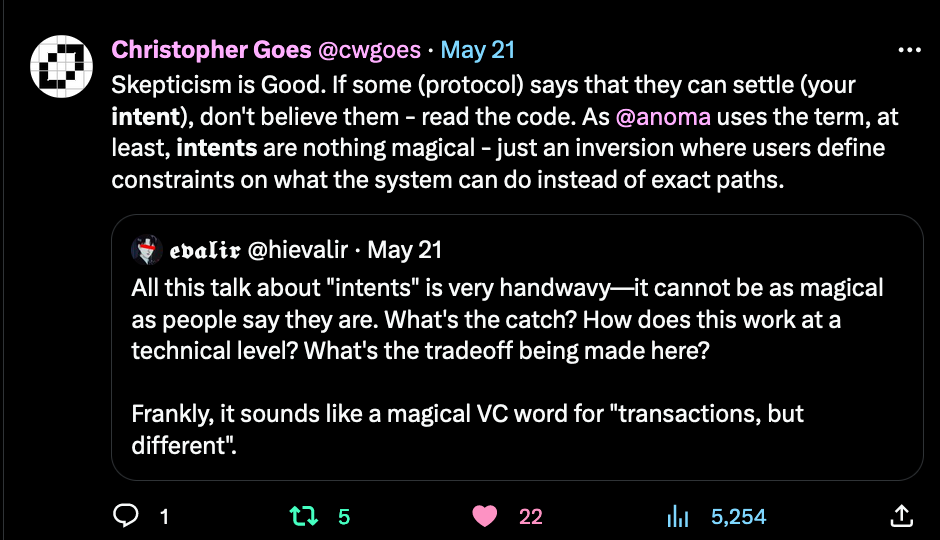
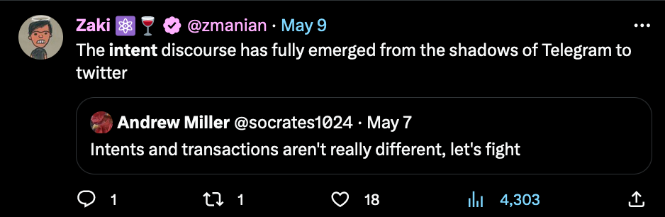
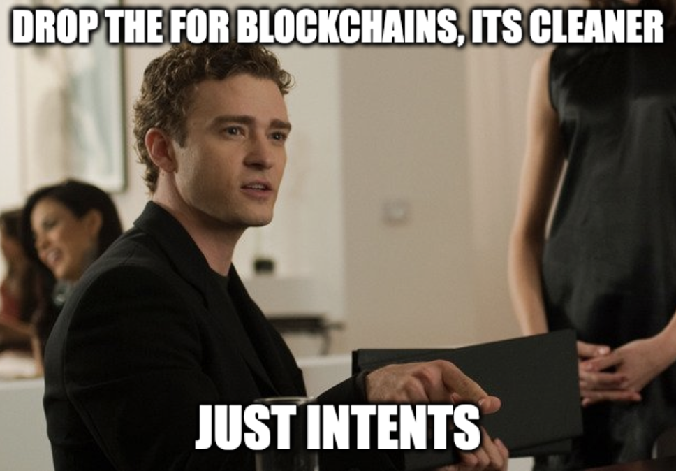
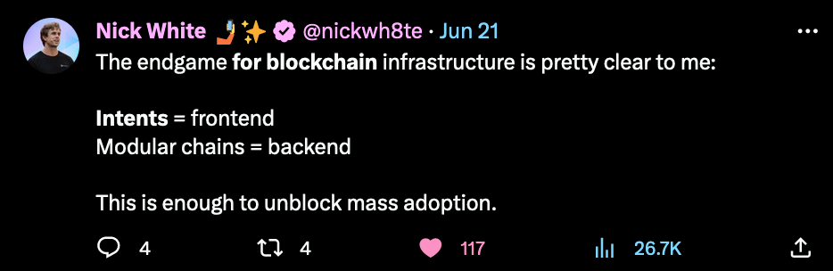
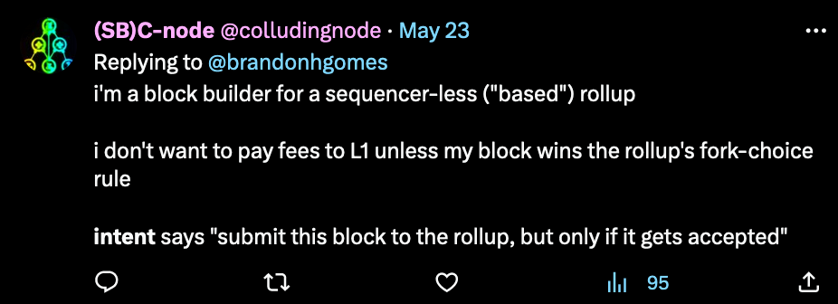
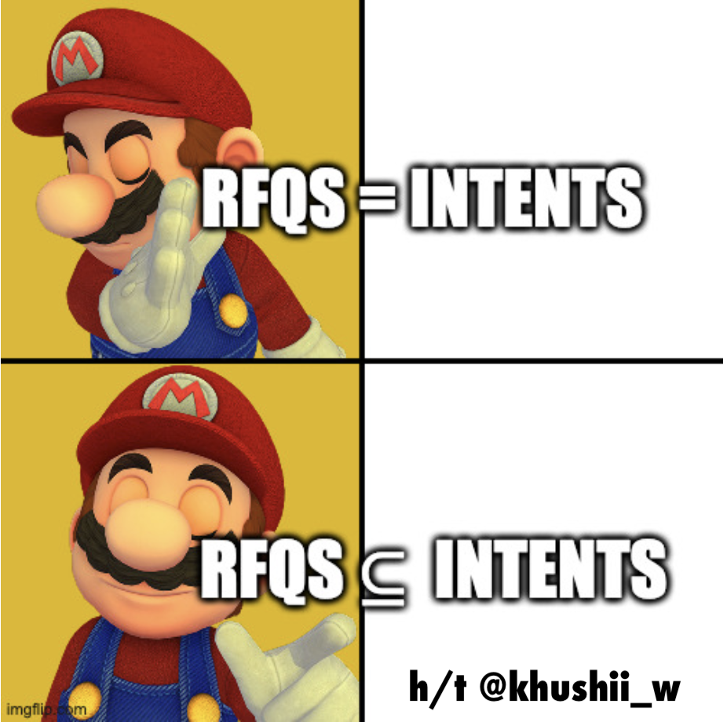
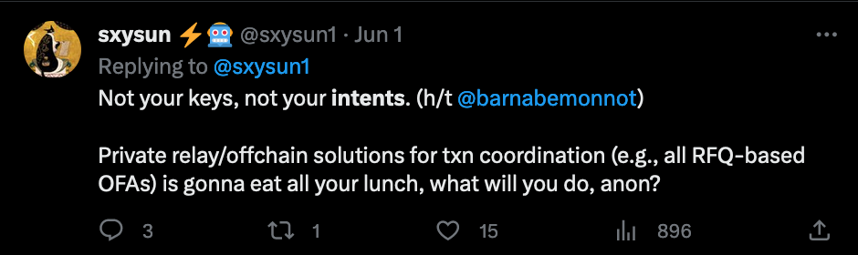
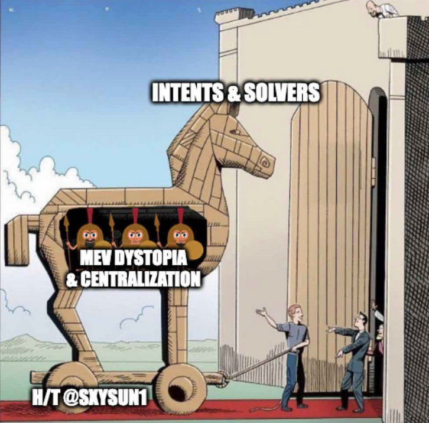
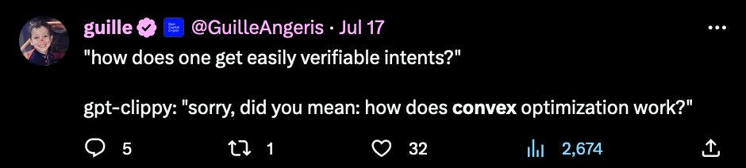
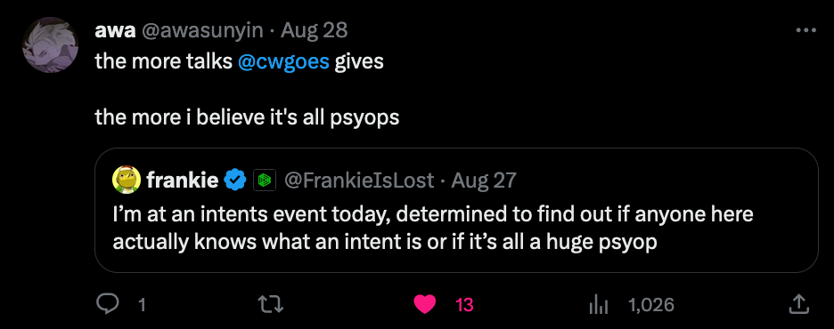

## Intents Day 0: A New PsyOp

Intents day brought together a group of leading thinkers and builders working on intents or intent like protocols.

Each of the speakers presented for approximately fifteen minutes, with a ten-minute open discussion following each presentation. The participants asked good questions, and often the presenters had open dialogue during the presentation. In addition, there were three whiteboard sessions.

In this report, you will find a summary of the speaker presentations from *Intents Day *along with some memes. Additional references are [`linked`](https://twitter.com/cwgoes/status/1655970054645612545) for context. The words that follow are mostly _not_ ours, we simply aggregated the information for your consumption and perhaps enjoyment. The errors _are_ my own.

## tl;dr

It's all a huge PsyOp. Intents aren't real.

## The Past, Present, and Future of Intents

The morning started with a presentation by [`Christopher Goes`](https://twitter.com/cwgoes) from Heliax. Christopher began with a brief discussion on the history of intents.

### Etymology and conceptual history of intents

- March 2009 & Earlier - beginning with [`A commitment folk theorem`](https://www.tau.ac.il/~samet/papers/commitments.pdf) modeling conditional commitments in strategic games. Earlier alludes to the [`Agoric Open Systems Papers`](https://papers.agoric.com/papers/) and [`Program Equilibrium`](https://www.sciencedirect.com/science/article/abs/pii/S0899825604000314)literature
- February 2018 - [`The Wyvern protocol`](https://github.com/ProjectWyvern/wyvern-protocol/blob/master/build/whitepaper.pdf)- where the protocol's job is to match buyer and seller intent on-chain such that the asset transfer and payment happen atomically.
- March 2019 - Virgil Griffith's idea of [`Ethereum is game-changing technology, literally`](https://medium.com/@virgilgr/ethereum-is-game-changing-technology-literally-d67e01a01cf8) - a credible commitment device which turns non-cooperative games into cooperative games. Send him [`Mail`](https://virgil.gr/).
- August 2022 - [`The Anoma white paper`](https://media.githubusercontent.com/media/anoma/whitepaper/main/whitepaper.pdf) introduced Anoma's intent-centric architecture and described an intent as an off-chain signed message that encodes which state transitions a user wants to achieve.
- May 2023 - [`Research Day`](https://www.youtube.com/@Research_Day) in New York was the coming out party [`for`](https://www.youtube.com/watch?v=3BQ8eqio-yg)[`intents`](https://www.youtube.com/watch?v=G0nFyq9DDPw) in the broader research community.
- August 2023 - [`Intents Day 0`](https://anoma.net/events/intents-day) and beyond.

### Activity

To finish up the introductory session, Christopher picked up and read index cards out of a glass bowl which guests filled out upon arriving. The cards were filled with answers to the question 'what is an intent?'

## Intents for Blockchains

**Objective:** Paint a picture of how intents are being understood and treated across blockchain ecosystems.

This was the first segment of the session. We had great representation from different projects including Cosmos, Ethereum, Celestia & Anoma.

## A Vertically Integrated Intent Supply Chain

This track kicked off with a presentation by [0xbrainjar](https://twitter.com/0xbrainjar) who re-introduced Composable Finance as the processing engine for user intents. Their thesis is simple; execution of transactions on blockchains should be ecosystem-agnostic, free, and private.

### MANTIS

Composable's proposed solution to this problem is called MANTIS which stands for multi-chain agnostic normalized trust-minimized intent settlement. This solution consists of:

- X-domain communication (IBC everywhere)
- Multi-domain auctions
- Language for execution
- Verifiable settlement

### Architecture

The proposed architecture is instantiated as cosmos chain, [Centari](https://forum.cosmos.network/t/proposal-composable-to-join-atom-economic-zone-and-adopt-interchain-security/11472) , which attempts to satisfy user preferences with programmable solutions. In particular, some of the solutions include Cows, RFQs, & CFMM routing.

Users send their intents to solvers who compete to find the optimal solution for various domains, which when identified is turned into a program in the composable VM. Multiple solutions are then bundled into portions of blocks for a specific domain. After exposing these blocks to searchers for the right to back run and further conditioning, Composable outputs a bundle with these tips in native tokens to that domain’s block builder via IBC.

### Roadmap

Finally, the presentation concluded with an exploration of credible commitment schemes such as [`MEV-Boost ++`](https://research.eigenlayer.xyz/t/mev-boost-liveness-first-relay-design/15) and [`PEPC-Boost`](https://efdn.notion.site/PEPC-FAQ-0787ba2f77e14efba771ff2d903d67e4). Composable seeks to build a new relay that would allow for partial block building. This was proposed to use Eigen Layer re-staking to make this incentive compatible for various agents in the supply chain.

## Intents and Typhon

Next up, [Isaac Sheff](https://isaacsheff.com/) from Heliax presented Typhon, Anoma's universal ordering machine which consists of the mempool ([`Heterogeneous Narwhal-Rider`](https://github.com/anoma/research/blob/master/distributed-systems/heterogeneous-narwhal/HeterogeneousNarwhal.pdf)), consensus ([`Heterogenous Paxos`](https://www.cs.cornell.edu/andru/papers/hetcons/opodis20.pdf)), and execution engine. The presentation focused on the intent lifecycle, [`p2p layer`](https://arxiv.org/pdf/2306.16153.pdf) and [`Chimera Chains`](https://youtu.be/gvlQl2KJz4M?si=cgGv5gHBlMyPXWJz&t=609).

### Intent Lifecycle simplified

- Users produce (and sign off on) intents
- Intents are transmitted to one or more solvers, who try to match them up and find solutions
- These solutions are called transactions, which need to be sent off to make state changes
- Somewhere, someone maintains the official state that all of these intents are about, and they need to commit those transactions, resolving any conflicts

### Anoma's P2P layer

Anoma's P2P layer is built on an architecture we call P2P Overlay Domains with Sovereignty, or PODS. The core idea is that any group of nodes can operate as a mostly independent overlay network, called a domain, using whatever broadcast or neighbor-selection protocols they like. Domains can be used by solvers or users interested in specific topics.

### Chimera Chains

A chimera chain is a type of side chain that allows atomic transactions to be carried out on [`objects`](<https://en.wikipedia.org/wiki/Object_(computer_science)>) from the base chains. It carries an additional consensus mechanism, that is dependent on the consensus of the base chains.

### Conclusion

Eventually, the Anoma framework will allow people to build cosmos blockchains using Typhon, and enable chimera chains. Chimera chains are something no one has done before. We have a full spec proposal coming soon - see the [`RFC`](https://anoma.net/rfc) announcement for more details on how to get involved.

## Intents, Based Rollups and Preference Expression

[John Adler](https://twitter.com/jadler0) & [C-Node](https://twitter.com/colludingnode) from Celestia held a whiteboard session. John discussed intents, solving, risks, and intent languages. C-Node discussed based rollups and preference expression on [`Celestia`](https://youtu.be/NCLuU-NS3IU?feature=shared).

### Intents

Typically, transactions constrain inputs and the initial part of the state transition function. Placing some constraints on the outputs of the STF is the defining characteristic of intents.

- There exist many possible inputs that can lead to outputs, given some constraints on initial state along with the rest of the constraints.
- There needs to be some mechanism for constraining the [`search space`](https://blog.20squares.xyz/lagrangian-intent-search-i/).
- It's okay if solvers must do a lot of work, but not okay if verification is expensive.
- There maybe exactly one and only one solution to satisfy these constraints.
- You may have a situation with hotel and train, and you are possibly okay with certain suboptimal solutions

In an intent protocol, there should be a component which allows users and solvers to understand the satisfaction score of an intent.

Issues to watch out for with intents is [`DOS attack`](https://en.wikipedia.org/wiki/Denial-of-service_attack) vectors for solvers.

Ideally, you want a unified expression language for intents because you don't want to assume intents are only for a specific architecture. You would like intents to be able to revolutionize Ethereum as well, with a design such that an application that opts into intents is composable with an application that does not.

### Based Rollups & Preference Expression

[`Based rollups`](https://forum.celestia.org/t/leaderless-sovereign-roll-up/420) don't use any [sequencers](https://joncharbonneau.substack.com/i/108110886/single-sequencers). These kinds of rollups inherit the liveness and full decentralization of L1. A rollup is [based](https://ethresear.ch/t/based-rollups-superpowers-from-l1-sequencing/15016) when the next L1 proposer can permissionlessly include the next rollup block as part of the next L1 block.

How do you pick which blobs to select from Celestia as a rollup?

- You can do something simple like select the block that burns the most gas. This mechanism might waste DP layer tokens on blocks that don't win.
- Instead, you may prefer a system where you say, "this is my block submission, and you can only charge me if my submission is included."

When you have preference expression for the data publication layer, ([`nee-data availability`](https://twitter.com/musalbas/status/1696521530409394253)) there is no concern of submitting a submission that loses. This mitigates invalid blocks. These rollups leak all [`MEV`](https://www.youtube.com/watch?v=zEnySS0kh1s&list=PLrTmn1_Dm_UpwHsAAyn3L0f2OZUA02YjC&index=11&pp=iAQB) to the DP layer. In Celestia, there is one leader who decides on ordering like any CometBFT chain.

## PBS and PEPC Whiteboard Session

[`Alex Stokes`](https://github.com/ralexstokes) and [`Barnabé Monnot`](https://twitter.com/barnabemonnot) from the Ethereum Foundation discussed proposer builder separation (PBS) & protocol enforced proposer commitments (PEPC).

### PBS

First Alex broke down PBS by explaining the motivations, current design of [`MEV-Boost`](https://ethresear.ch/t/mev-boost-merge-ready-flashbots-architecture/11177), and then shifting to [`ePBS`](https://ethresear.ch/t/why-enshrine-proposer-builder-separation-a-viable-path-to-epbs/15710) briefly.

#### Motivations

The motivation for PBS is to counter the centralizing force of MEV by keeping validators decentralized.

- Firewall off the proposer from the builder. By doing so, the validator role can remain "dumb" and not have to run complex MEV search algorithms.
- Improve access to MEV for validators who only need to accept the highest bid from a block builder.
- Push centralization to specialized actors which can be leveraged for more efficient block construction, data availability sampling, statelessness and extra builder services
- Remove the reliance on a trusted relay, though one may still exist in some [`designs`](https://ethresear.ch/t/relays-in-a-post-epbs-world/16278?u=0xapriori)

### MEV-Boost

[`MEV-Boost`](https://boost.flashbots.net/)is the out of protocol version of PBS built by [`Flashbots`](https://collective.flashbots.net/) which has been live since the [`Merge`](https://www.youtube.com/watch?v=EEuPmA8w0Kc&pp=ygUhdHdpdGNoIGdha29uc3QgZ2Vvcmdpb3MgdGhlIG1lcmdl). MEV-Boost introduced the role of the relay and the Builder into the supply chain. [`Optimistic relaying`](https://frontier.tech/optimistic-relays-and-where-to-find-them) is a recent innovation.

### ePBS

ePBS, is the enshrined (protocol aware) version of proposer builder separation. There is ongoing discussion about the ideal implementation.

- The original [`2 slot`](https://ethresear.ch/t/two-slot-proposer-builder-separation/10980?u=0xapriori) version
- The new proposals with Payload-timeliness committees [`(PTC)`](https://ethresear.ch/t/payload-timeliness-committee-ptc-an-epbs-design/16054)

### PEPC

Next, Barnabé took over and discussed PEPC which can be loosely described as intents for block proposers. [`PEPC`](https://www.youtube.com/watch?v=yt4Nhqd9Wvs) (“pepsi”) is intended as an enshrined protocol gadget which allows block proposers to enter into binding commitments over the blocks they produce.

#### The goals of PEPC:

- Generalize PBS, allow fair exchange between the proposer and some builders for any item; e.g., whole block, partial blocks, inclusion lists
- Move some use cases of Eigen Layer from an optimistic failure mode to a pessimistic failure mode; e.g., Block validity is dependent on commitment satisfaction vs. a slashing condition for deviating

#### How PEPC relates to ABCI++

There are some similarities between PEPC and Skip's x/builder [`module`](https://github.com/skip-mev/block-sdk/blob/main/x/builder/module.go) which is enabled by [`ABCI++`](https://docs.cometbft.com/v0.37/spec/abci/abci++_basic_concepts). Though, the latter is general in that it sets global preferences for all blocks of a given chain, while PEPC is a system of local decisions made by proposers of each block.

#### Diet PEPC

There are different flavors of Diet PEPC which can exist without protocol changes.

- [`PEPC-Boost`](https://efdn.notion.site/PEPC-FAQ-0787ba2f77e14efba771ff2d903d67e4?pvs=25#2dfe02bc6dcd48878c82647676ca8d68)
- [`PEPC-DVT`](https://ethresear.ch/t/pepc-dvt-pepc-with-no-changes-to-the-consensus-protocol/16514)

## Intents for Users

**Objective:** Paint a picture of how intents are being understood and treated across wallets and directly user-facing software.

## Intents ≠ RFQs

[`Khushi Wadhwa`](https://twitter.com/khushii_w) began the second session of the day with a presentation discussing (RFQ) request for quote auctions, Intents, and how they relate.

### RFQs

An [`RFQ price auction`](https://frontier.tech/the-orderflow-auction-design-space) is a swap price discovery system. It uses signed messages and contract code to execute swaps. White-listed market makers provide liquidity, and the best price wins the bid. For example, in the [`0x protocol`](https://0x.org/docs/0x-swap-api/guides/accessing-rfq-liquidity/about-the-rfq-system), the flow of messages would look like this.

- Users request a quote from the application interface
- API requests pricing info from on-chain AMMs and market makers
- Market makers can choose to respond with a signed quote
- User receives a quote, which can include multiple sources of liquidity
- The user then signs and submits the transaction on-chain

Some of the common advantages for users include guaranteed prices, gas inclusion in the price quote, and front-running protection.

### Intents

Typically, RFQs can optimize for one thing. As intents evolve, we will see more types of preferences that can be expressed. Outlining all the details or defining what you want before every request may lead to a bad UX. Two possible solutions are:

- Multi-tiered requests - with context-based Intents, you could use on-chain history to determine what a users' ideal preference is. This is hard.
- Post creation-filtration - similar to [`Google Flights`](https://www.google.com/travel/flights). Solvers Find the best possible execution paths that satisfy an intent and allow the user to filter and choose their preference.

### RFQs ⊆ Intents

While it's now evident that every RFQ can be considered an intent, it should also be clear that not all intents are RFQs.

## The Intents of Offers

[`Dean Tribble`](https://agoric.com/team/) from [`Agoric`](https://agoric.com/) presented the next portion of the workshop. Dean's presentation focused on what's wrong with the user experience and how we can fix it with [`Offer Safety`](https://docs.agoric.com/guides/zoe/offer-enforcement.html).

### What is Agoric?

[`Agoric`](https://docs.agoric.com/guides/platform/#swingset) is building a platform for the world's developers to solve the world's problems individually without orchestration- in a permissionless and collaborative fashion.

- JavaScript Smart Contracts - 
Use your existing language knowledge
- Best-In-Class Component Model
 - Framework for innovation across all skill levels
- Integrated Economy
 - Economic services & native [`IST`](https://inter.trade/) stable token for fees to grow a rich economy
- Unique Safety Properties
 Offer - safety, payout liveness, secure partitions

### What’s Wrong with the UX?

The current user experience with wallets and applications is untenable for most people. For example, users don’t know anyone named 0x69e2..e108. This makes it easy to make mistakes when sending funds to an address or interacting with a smart contract.

In addition, the status quo is unsafe for everyone, which limits adoption. Users do not understand what they agree to when they sign a message in their Metamask or Keplr wallet. The smart contract that a user interacts with controls what happens to their funds - contracts shouldn’t need that responsibility.

As long as humans are habituated to approving transactions that they cannot understand, they are not protected from endpoint compromise (hidden risks). Is there a better approach?

### Offer safety

Zoe is Agoric's smart contract framework which guarantees offer safety. Offer Safety ensures that users receive desired payouts or refunds regardless of the behavior of the contract. When a user makes an offer, it is escrowed with Zoe, which guarantees that the user either gets back what they wanted or what they originally offered and escrowed.

An offer proposal is a statement about what you want and what you're willing to offer. Offers are a structured way of expressing user _intent_.

- Proposal contains give and want amounts
- Offer contains an invitation for a specific entry point in a specific contract, the proposal, payments, and custom arguments
- Offer validation - proposal has properties required by invitation, payments match
- Provided assets get escrowed asynchronously
- JavaScript contract function for the invitation is executed

### Offer Legibility?

Offer legibility is "can the user understand what the proposal is they are approving?"

Offer legibility is partly about the structure of offers and intents in general. It's also partly about a good user experience - presenting the offer correctly to the user.

### More Safety Properties of Zoe

- Payout liveness - the user must give Zoe a `proposal` to enforce when and how they can exit the contract.
- Secure [`partitioning`](https://agoric.com/blog/technology/offer-safety-partitioning-risk-in-smart-contracts) - separates escrowing and reallocating assets from deciding the reallocation via constraints.

### Extensions

What can offers do for you?

- Sign-mode textual - enables wallets to provide a human-readable description of what a given contract interaction will perform
- Want patterns - allows users to define specific conditions they want in a potential offer
- Multiples - multiple forms of behaviour to wrap around a single bundle of state
- Piecewise linear preference curve - capture user preferences at different points
- Synthetic combined offers

### Conclusion

Offers increase usability and safety by better representing user intent, and making their interactions with the system legible to them so they know what they are agreeing to. Offers also systematically improve safety because the framework escrows offered assets so users get what they want or their assets back, can exit in a timely fashion, etc. all no matter what the correct contract code does. Thus, users are protected from large classes of bugs, rug-pulls, upgrades, etc.

## User facing Intents with Permissions

[`Nitya Subramanian`](https://twitter.com/_nityas) from [`Capsule`](https://blog.usecapsule.com/onboarding-is-dead-long-live-transacting-introducing-capsule/) presented next. Capsule is a toolkit (SDK) for transaction signing and permissioning that enables developers to build custom wallets with a variety of [`highly functional capabilities`](https://docs.usecapsule.com/).

### Web 2

In the web 2 world, users push buttons and things happen. You can _express_ desires for action (intents
!) without specifying what computation is getting executed. Also, users don't care where the execution happens- GCP, AWS or Azure it doesn't matter. Take Slack, for example, where you can click a button and make a post. You can schedule a post for later or even write a bot that posts on your behalf.

### Transactions

In the crypto world, users have complicated interaction schemes where they need to be aware of which _chain_ a specific asset is on.

- Users have assets on many different chains.
- Users need to physically inspect transactions and hope for the best.

### Wallets Are Doing too Much

<table>
<thead>
<tr>
<th>Core Responsibility</th>
<th>Description</th>
</tr>
</thead>
<tbody>
<tr>
<td>User Interfaces</td>
<td>Everything before an app is wallet aware</td>
</tr>
<tr>
<td>Authentication</td>
<td>Ownership attestations for addresses that sign <code>tx</code></td>
</tr>
<tr>
<td><code>Tx</code> Formation</td>
<td>What contract and parameters? How much gas to pay?</td>
</tr>
<tr>
<td><code>Tx</code> Verification</td>
<td>Is this Safe? Is this correct?</td>
</tr>
<tr>
<td><code>Tx</code> Signing</td>
<td>Approve</td>
</tr>
<tr>
<td>Node Infrastructure</td>
<td>Submit a <code>tx</code> on-chain</td>
</tr>
</tbody>
</table>

### Enter Programmable MPC

Programmable [`MPC`](https://en.wikipedia.org/wiki/Secure_multi-party_computation?ref=blog.usecapsule.com) keeps user funds safe and ensures keys can only authorize transactions they’re meant to. Users can do things like create a wallet with an e-mail address and use a [`single sign-on (SSO)`](https://en.wikipedia.org/wiki/Single_sign-on) style verification to perform signing in the background.

Programmable MPC enables simple and secure transaction signing, but also a variety of features like permissioning, autonomous transactions, and fraud prevention, while maintaining a noncustodial design along with developer flexibility.

- Users don't need to write down seed phrases because they can do key recovery.
- Separate the signing of a transaction from ownership of the full key, which therefore would allow unilateral access.
- Allow many different applications to propose transactions and gate-keep with permissions.

### Open Questions

#### Mapping Intent(s) <> Transaction(s)

- How can a user verify that their intent has been optimally solved?

#### Upgradeability

- The ability for valid “intent solutions” to quickly change is a feature - how are those changes best reflected?

#### Wallets

- What are the features of a wallet in a post-intents paradigm?
- Are standalone wallets necessary at all vs. apps directly?

## The Case for Curation

In the final segment of _Intents for Users,_[`Sean Braithwaite`](https://twitter.com/brapse) from [`Mekatek`](https://meka.tech/) discussed how curation plays a key role in the [`intent supply chain`](https://www.youtube.com/live/A8Iwp97tWIU?si=pIKAfy-stkxTnVNb&t=25739).

### Intents

Intents are [`real`](https://twitter.com/FrankieIsLost/status/1695917914594156655?s=20). There are several live [`products`](https://app.squidrouter.com/)that improve user experience. These products provide routing, bundling, and aggregation as services that abstract away infrastructure details. Users will no longer have to care about gas, bridging, and other leaky abstractions.

Intents are pathological. They allow the expression of preferences over future states of the system. What informs users' preferences? Users often don’t know what they want.

### The Curation Flywheel

_Discovery ⇒ Commitment ⇒ Execution ⇒ Settlement ⇒ Discovery_

- Intents should be informed by a discovery stage.
- Consumers aggregate over public data to bootstrap initial constructions.
- Each iteration informs and refines preferences.

### The New Intents Supply Chain

<table>
<thead>
<tr>
<th>Stage</th>
<th>Description</th>
<th>Interacting Agent</th>
</tr>
</thead>
<tbody>
<tr>
<td>Curation</td>
<td>Discover user preferences with historical on-chain data and LLMs</td>
<td>LLMs, Data Profiles</td>
</tr>
<tr>
<td>Origination</td>
<td>User interface for constructing intents</td>
<td>Wallets, dApps</td>
</tr>
<tr>
<td>Matching</td>
<td>Counterparty discovery, dissemination of intents to interested parties</td>
<td>Mempool, Gossip Network, OFA</td>
</tr>
<tr>
<td>Execution</td>
<td>The required action for fulfilling intents</td>
<td>Solvers, Builders, Executors</td>
</tr>
<tr>
<td>Settlement</td>
<td>Use predicates and materialized state to demonstrate fulfillment of the intent whereby the solver can receive its payment</td>
<td>Verification, Payments</td>
</tr>
</tbody>
</table>

Intents are insufficient to inform users in a world of abundance. As such, a discovery process driven by the curation [`flywheel`](https://en.wikipedia.org/wiki/Flywheel) can help. Curation should be part of the supply chain the user owns.

## Intents for Solvers

**Objective:** for this segment of the day was to paint a picture of how solvers are thinking about intents and how intents will change solver economics.

## Accountability along the Transaction Supply Chain

Next [`Sam Hart`](https://twitter.com/hxrts) from [`Skip`](https://skip.money/) laid out an accountability framework for solvers, how to make off-chain actors more accountable. See Sam's [`recap`](https://ideas.skip.money/t/accountability-along-the-transaction-supply-chain/89) for a more detailed explanation.

### Problem Statement

Intents introduce a degree of freedom for solvers to improve efficiency, UX and other conditions of satisfaction. Here we introduce a [`principal-agent problem`](https://en.wikipedia.org/wiki/Principal%E2%80%93agent_problem) (PAP) with solvers.

#### Options to deal with this problem

1. Reintroduce constraints
2. Change the information structure
3. Change the payoff structure
4. Turn into repeated game

### Accountability framework

There is a notion of [`accountability`](https://otherinter.net/research/uniswap-accountability/) that exists in institutional theory literature.

> A is accountable to B when A is obliged to inform B about A's (past or future) actions and decisions, to justify them, and to suffer punishment in the case of eventual misconduct.

- Answerability - Justify behavior, attribute actions
- Enforcement - Prevent abuse via credible threat, reward adherence punish deviation

Answerability substantiates enforcement, while enforcement obliges answerability. Much of the mechanism design we focus on in crypto focuses on enforcement. The answerability portion is under-explored.

### Modeling Accountability

If a user is interacting directly with a system, there is no PAP. When a user delegates to a solver, they must establish an accountability system to safely delegate decision-making.

An accountability system is a two-sided contract with a combination of formal and informal rules, whereby terms of satisfaction require answerability and enforcement from both ends.

In Cosmos, _chains_ can be thought of to have agency which they _can_ delegate to;

- Solvers - the capacity to complete some computation that would otherwise be performed by the state machine.
- Users - ability to enforce, only sign messages to release funds that satisfy the desired intent.

### dYdX's Accountability System

- dYdX uses an [`order-book discrepancy`](https://dydx.skip.money/) metric built and monitored with Skip to measure validator P&L vs. expected. The statistical view of this behavior provides a basis for answerability which can be used to build an [`accountability system`](https://dydx.forum/t/discussion-protection-against-mev-on-dydx-v4/951)

### Cosmos's Reputation System

Validators in Cosmos are great candidates for delegating certain tasks due to their reputational network across the ecosystem.

Keplr's new product "Comment on Validator Reviews" will improve the ability of validators to get feedback from their delegators and for delegators to hold validators to account.

### Conclusion

What are we holding validators, solvers, or relayers, accountable to?

As protocol designers and community members, we should think carefully about what kind of system [`behavior we want to elicit 2`](https://barnabe.substack.com/p/seeing-like-a-protocol), and how to surface the correct information such that behavior is measurable and _answerable_.

Only then can we create networks that overcome extractive behavior and take on this special property of organically generating value surplus.

## Solvers, LSTs and Meme Coins

[`Sun Raghupathi`](https://twitter.com/sunandr_) from [`Seven Seas`](https://twitter.com/sevenseas_c) spoke next. Seven Seas operates a strategist solver in the [`Sommelier`](https://app.sommelier.finance/strategies/) ecosystem.

### Solvers

A solver is a catch-all for an actor that leverages off-chain infrastructure to improve on-chain user experience. Searchers are solvers.

### Intent System

In intent systems today[`CEX-DEX`](https://frontier.tech/a-tale-of-two-arbitrages) arbitrage dominates RFQ systems. Direct on-chain routing is disadvantaged because of increased costs in taking on-chain liquidity. To counter this, the next wave of [`DEX innovation`](https://forum.balancer.fi/t/bip-295-fee-discount-for-cowswap-solvers/4785) is about providing better prices to uninformed order flow (retail).

There are two primary on-chain markets today, [`Meme coins`](https://coinmarketcap.com/currencies/pepe/) and [`LSTs`](https://blockworks.co/podcast/bellcurve/cfc651f8-4ab7-11ee-ba0c-eb0524259ce8).

### Meme Coins

- Meme coin trading provides the most adversarial experience for users.
- Institutional capital will rarely touch these assets, so it's likely that the solver landscape for long-tail assets will remain distributed.
- This makes a Strong case for the existence of AMMs e.g., [`99.9%`](https://youtu.be/6K-QX6HtoiM?si=DTo8TvwrILkVMUVm&t=2078) of all tokens have price discovery on-chain.
- It’s possible that RFQ systems will capture order flow here as well. Actors who are willing to take inventory risk will have an edge; e.g., [`jaredfromsubway.eth`](https://etherscan.io/address/0xae2Fc483527B8EF99EB5D9B44875F005ba1FaE13)

### LSTs

Liquid staking tokens (LSTs) are the Largest on-chain market. They are highly inefficient and suffer from extreme de-pegs in times of volatility. The majority of the liquidity for LST tokens is passive LPs in AMMs. There is almost no liquidity in RFQ systems.

What can we learn from LST markets?

- The solver landscape is still relatively immature
- There is a shortage of on-chain infrastructure for solvers
- Specialized knowledge of DeFi primitives is an edge

### Conclusion

We want to live in a world where primary liquidity is on-chain. Intent systems create the UX to make this possible.

## Intents for Mathematicians

**Objective**: Paint a picture of how intents can be mathematically formalized and understood, and how they relate to MEV.

## Completing the Intents Picture

The first talk of the Theory of Intents section was presented by [`Quintus Kilbourn`](https://twitter.com/0xquintus) from [`Flashbots`](https://collective.flashbots.net/).

### Part 1: <s>Intents</s> Letting Go

In part one, intents were described as:

- Intents loosely: “messages which need not be executable in isolation”
- Intents are messages which require aggregation
- Intents reduce friction for an ecosystem of intermediaries (agents' challenges)

The term "intents" arose not because we have new tech, but because we have accepted the existence of the intermediary.

### Part 2: MEV Regaining Control

In part two, the talk focused on how to regain control by restricting the intermediary with integrity, provision of information, and privacy. Quintus further discussed the challenges of maintaining the balance amidst:

- Latency overhead from proof generation time
- Loss of counterparty discovery with too much privacy
- DoS risks for the intermediary

## Intents and Network Congestion Whiteboard Session

[`K Kulkarni`](https://x.com/ks_kulk?s=20) from Berkeley and Gauntlet led the next whiteboard session. He presented the ideas of Frank Kelly which explore internet packet routing and congestion control. Kelly proposed a framework for managing network congestion, in the paper titled, [`Charging and rate control for elastic traffic.`](https://www.statslab.cam.ac.uk/~frank/elastic.pdf)

The paper presents a model of charging, routing and flow control, where the system consists of users with utility functions and a network with capacity constraints.

Standard results from convex optimization problems indicate that the optimization of the system can be decomposed into subsidiary optimization problems, one for each user and one for the network, by using price per unit flow as a [`Lagrange multiplier`](https://en.wikipedia.org/wiki/Lagrange_multiplier) that mediates between the subsidiary problems.

**The optimization problem:**

$max_x​∑_i​U_i​(x_i​)$

Subject to:

$∑_ix_i≤C$

- For each constraint, there's an associated price or cost for violating that constraint
- By minimizing the Lagrangian, you're finding the best value for the decision variable, considering the cost of violating constraints

**The Lagrangian:**

$L(x,λ)=∑_i​U_i​(x_i​)+λ(∑_i​x_i​−C)$

Where:

- $U_i(x_i)$ represents the utility of user $i$ for transmitting at rate $x_i​$.
- $x_i$ is the rate at which user $i$ transmits data packets.
- $λ$ is the Lagrange multiplier, which can be interpreted as the price or penalty for violating the network's capacity constraint $C$.

### How does this relate to Intents?

- Efficient packet routing is a convex optimization problem. When the network is overloaded it gets congested which can lead to packet loss and latency.
- An intent refers to the desire of the user to transmit data packets at a certain rate. The System has to decide how to fulfill these intents given network constraints.
- A typical objective function can be used to maximize the welfare of all users.

## Intent Machines

The final talk of this section was given by Christopher Goes which introduced a candidate formalism for Intent Machines.

The goals of an intent formalism are to capture commonalities of intent systems, capture structure not implementation details, and to aid in the analysis of similarities/differences, conditions for behavior of composition, and relationship to other concepts like MEV of intent systems.

### Formalism

- Fix a state type **T**
- An intent is a function of type - **T -> T -> 0|1**
- An intent machine is a potentially non-deterministic function of type
  - **(T, Set I) -> (T, Set I)**
  - First tuple: prior state and candidate intents
  - Second tuple: posterior state and processed intents
- Key property: intent adherence - **for all\*\***i\***\*in processed\*\***.\***\*i\*\***prior\***\*= 1**

### Decomposition

Without loss of generality, this function can be decomposed into two steps:

- Enumeration: computing a set of (candidate state, processed) tuples which satisfy intent adherence.
- Selection: choosing one of the tuples to return

### Constraints

This function may additionally constrain which state transitions are considered to be valid. This can be modelled as a “system intent” which must always be satisfied. Examples include;

- Interior EVM state transition function satisfied
- Resource linearity & logics satisfied

### Selection Function

Selection picks one pair from the set of valid options. All the interesting structure lies here.

**choose :: Set (T, Set I) -> (T, Set I)**

### Types of Selection Functions

<table>
<thead>
<tr>
<th>Function</th>
<th>Description</th>
</tr>
</thead>
<tbody>
<tr>
<td>Pure Chaos</td>
<td>Select a validator return pair at random</td>
</tr>
<tr>
<td>Pareto-Efficient Chaos</td>
<td>Select the return pair which stisfies the most intents</td>
</tr>
<tr>
<td>Utility Maximization</td>
<td>Select the return pair which maximizes some scalar function</td>
</tr>
<tr>
<td>Profit Maximization</td>
<td>Utility maximization with a utility function that calculates the balance of a specific token owned by the operator’s address</td>
</tr>
<tr>
<td>Welfare Maximization</td>
<td>Utility maximization with a utility function set to the welfare function of some community.</td>
</tr>
<tr>
<td>Expected Utility Maximization</td>
<td>Select the return pair which maximizes expected future utility, given some probability distribution over future intents conditional on the posterior state</td>
</tr>
<tr>
<td>Optimistic preferred</td>
<td>If both selection functions agree, return that, else use the solution chosen by one of them</td>
</tr>
<tr>
<td>Optimistic Random</td>
<td>If both selection functions agree, return that, else choose randomly between options the Pareto frontier</td>
</tr>
<tr>
<td>Weighted welfare</td>
<td>Select the return pair which maximizes some scalar function</td>
</tr>
</tbody>
</table>

### Distribution

Anoma and many others, effectively implement a distributed intent machine which is composed of other intent machines with different select functions.

- Different parties performing enumeration and selection.
- Consensus to agree on which new state will be chosen.

#### Everything is distributed!

- State
- Computation
- Enumeration
- Selection
- Verification

### Distributed Composition

One could understand cryptoeconomic mechanism design as trying to set incentives to provide a particular composed selection function. This is where MEV happens.

## State Your Intents, take 2

Thereafter, Christopher, Quintus and K participated in a light panel to discuss memes selected by myself. Indeed, the title takes inspiration from the original [`State Your Intents`](https://www.youtube.com/watch?v=WGhjcjWwFdc) panel at MEVday Paris. This was a fun discussion.

### Memes

- What are the externalities of "[`we're all building`](https://twitter.com/0xQuintus/status/1674254530207264769?s=20) the same thing"?
- Why [`Anoma`](https://twitter.com/apriori0x/status/1660413135436541952?s=20) and [`Suave`](https://twitter.com/0xQuintus/status/1636734639531257856?s=20) have been difficult to explain?
- [`Intents are just Txs`](https://x.com/socrates1024/status/1655325271048822786), this is settled, right?
- How to prevent [`MEV dystopia`](https://twitter.com/sxysun1/status/1681016646721327105) from walking in through the front door?

### Open Questions

- What would your goals for an intent formalism be?
- Do you think this option makes sense?
- Which parts are clear / unclear?
- Are there other compelling candidate formalisms?

## **Closing Remarks**

[`Awa Sun Yin`](https://twitter.com/awasunyin), builder of public goods, thanked everyone for attending the event and then closed with a reflection.

## The Sequel

Thanks for reading. If you have FOMO, and you're interested in participating in the sequel, don't worry, there will be one. If you would like to present at the next Intents day, reach out on X- _preference_ for FUD.

Coming Soon - _Intents Day 1_: _FUDent Xmas_

## Acknowledgements

_Thank you to all attendees, you asked some great questions. Thank you to all the speakers for presenting, reviewing the summaries of your talks and providing feedback._

## **Slides and Whiteboards**

### Intents for Blockchains

- [A Vertically Integrated Intent Supply Chain](https://anoma.net/events/intents-day-2023/CompossableIntentsDaySlides.pdf)
- [Intents & Typhon](https://anoma.net/events/intents-day-2023/IntentsWorkshopTyphon.pdf)
- [Intents, Based Rollups & Preference Expression Whiteboard Session](https://hackmd.io/QdG19ntsTU6SRkQKbeLGNg?view=#White-Board-Session-with-Celestia)
- [PBS & PEPC Whiteboard Session](https://hackmd.io/QdG19ntsTU6SRkQKbeLGNg?both=#PBS-amp-PEPC-Whiteboard-Session)

### Intents for Users

- [Intents != RFQs](https://anoma.net/events/intents-day-2023/Intents_RFQs.pdf)
- [The Intent of Offers](https://anoma.net/events/intents-day-2023/intents-day-2023-SBC-Dean.pptx)
- [User Facing Intents with Permissions](https://anoma.net/events/intents-day-2023/user-facing-intents-with-permissions.pdf)
- [The Case for Curation](https://anoma.net/events/intents-day-2023/Mekatek-The-Case-for-Curation.pdf)

### Intents for MEV extractors good-guy Solvers

- [Accountability along the transaction supply chain](https://anoma.net/events/intents-day-2023/accountability-along-the-transaction-supply-chain.pptx)
- [Solvers, LSTs, and Memecoins](https://anoma.net/events/intents-day-2023/Solvers-LSTs-and-Memecoins.pptx)

### Theory of Intents

- [Completing the intents Picture](https://anoma.net/events/intents-day-2023/Intents_SUAVE.pptx)
- [Intents & Network Congestion](https://hackmd.io/_uploads/Bys--pFR3.png)
- [Intent Machines](https://anoma.net/events/intents-day-2023/intent-machines.pdf)
