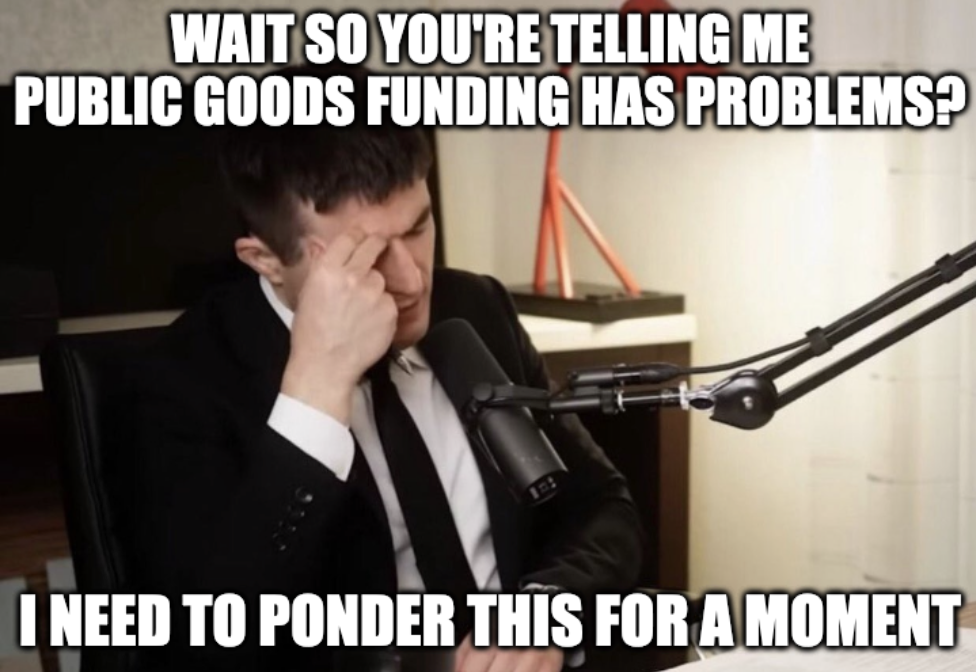
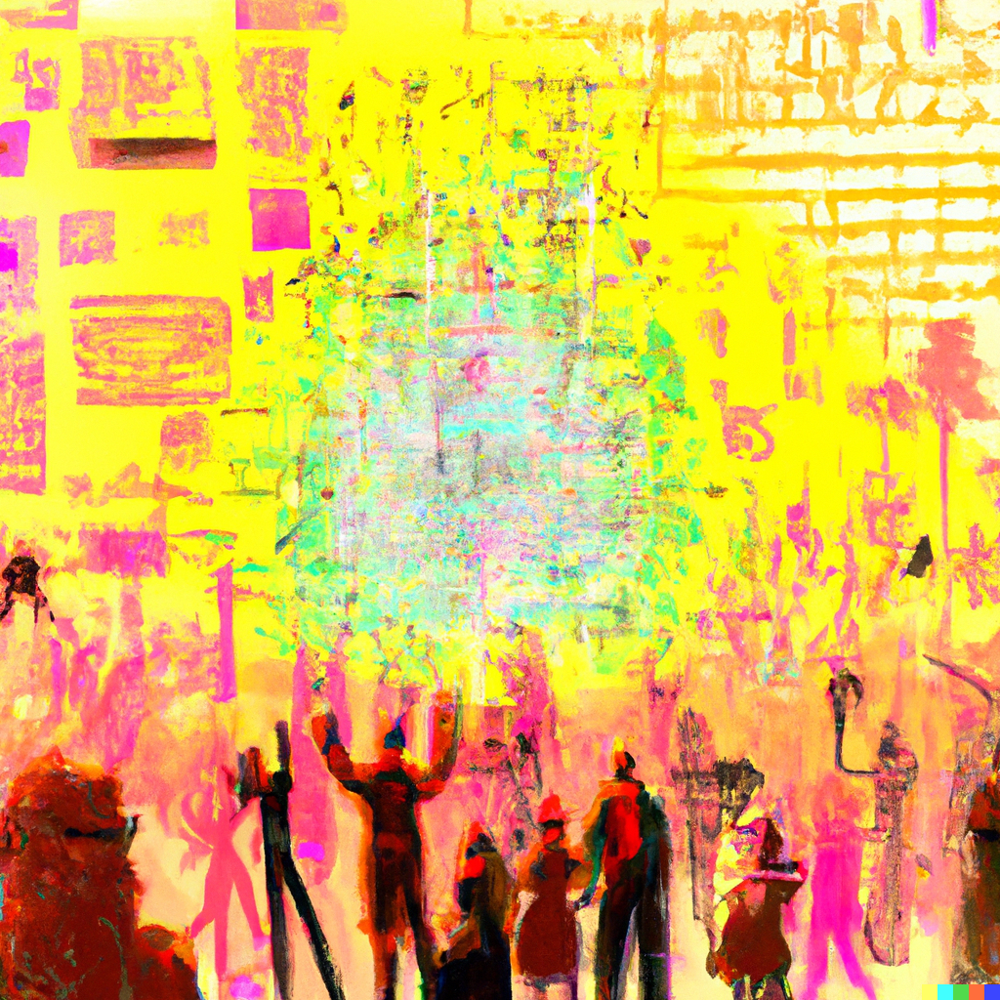
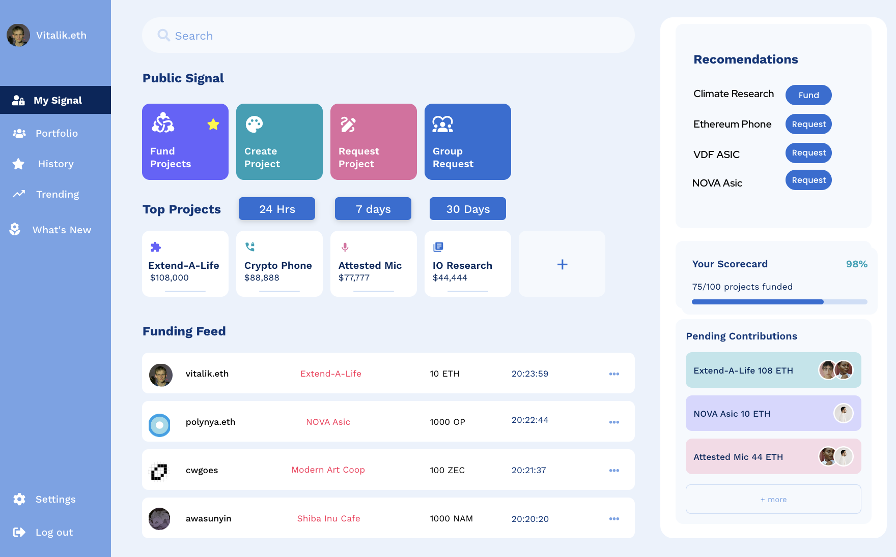
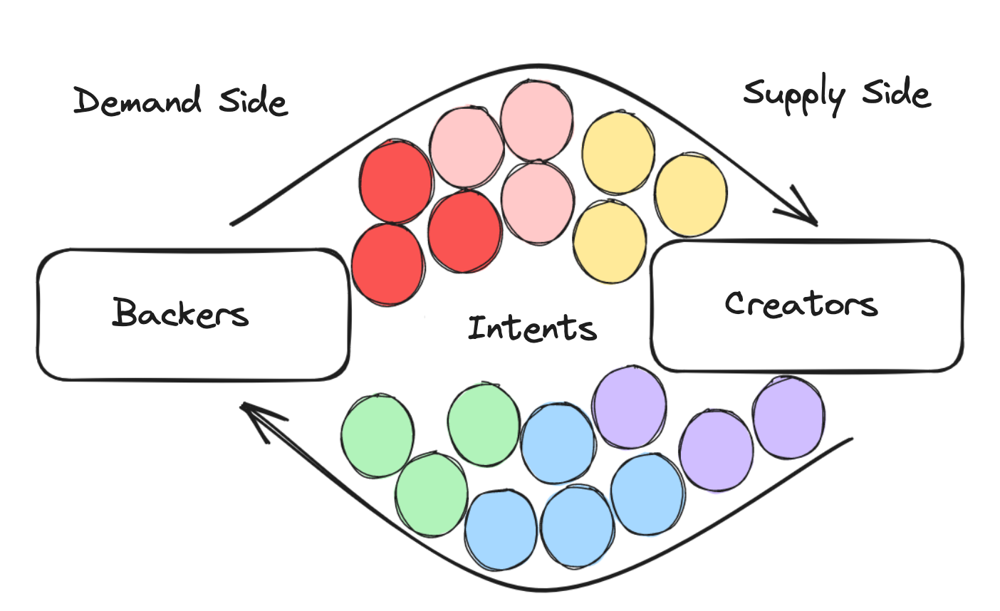

> _“Hardly that. He gives his orders to the tradesmen: they supply him, for forty, sometimes fifty, years, at their own risk: then he gets his Fellowship—which pays him in one year as much as your Fellowships pay in fifty—and then he can easily pay all his bills, with interest.”_
>
> \- [_Lewis Carroll_](https://slatestarcodex.com/2020/06/17/slightly-skew-systems-of-government/#comment-916962), 1894

### Preface

It should be noted that many brilliant minds have thought about public goods funding in great detail. While this article is not exclusively about public goods funding, this article takes _significant_ inspiration from the writings of Alex Tabarrok, Vitalik Buterin, Glen Weyl, and Christopher Goes among others.

In particular, the following sources are primary inspirations and source material for this art.

- [_The private provision of public goods via dominant assurance contracts_](https://mason.gmu.edu/~atabarro/PrivateProvision.pdf) Tabarrok, Public Choice 96: 345–362, 1998.
- [_Better Crowdfunding_](https://mason.gmu.edu/~atabarro/BetterCrowdfunding.pdf) Cason, Tabarrok, Zubrickas, 2019.
- [Presentation](https://youtu.be/6QkgP-RD1ZA?feature=shared) by Alex Tabarrok at AFT 2021
- [_A Flexible Design for Funding Public Goods_](https://arxiv.org/pdf/1809.06421.pdf) Buterin, Hitzig, Weyl, 2019.
- [_Quadratic Payments: A Primer_](https://vitalik.ca/general/2019/12/07/quadratic.html) Buterin, 2019.
- [_Towards heterotopia - the prerequisite cultural and technological substrate for a return to a world of scale-free credit money_](https://pluranimity.org/2022/09/26/towards-heterotopia/) Goes, 2022.

In addition, we would be remiss if we didn't applaud the efforts of others in the community like [Gitcoin](https://www.gitcoin.co/about), [Optimism](https://medium.com/ethereum-optimism/ethers-phoenix-18fb7d7304bb), [Namada](https://specs.namada.net/economics/public-goods-funding.html), and others not mentioned that are taking the challenge of public goods funding head on. Thank you.

### Acknowledgements

Thank you to the folks at [Delphi Digital](https://twitter.com/Delphi_Digital) for the initial brainstorming session on this topic in Paris during the Modular Summit. Special thanks to Can Gurel for coining both the name and idea of Public Signal.

Thanks to Christopher Goes for discussion and review. Thanks to Awa Sun Yin, Sam Hart, and Julio Linares for discussions in and around this topic.

### Introduction

This is the first article in a forthcoming series about applications you can build with Anoma. In this article, we will introduce an application tentatively named _Public Signal_. The basic idea is to build an intent-centric version of Kickstarter which, in addition to being supply-side driven, can be demand-side driven. _In Kickstarter only the producers can interact with the platform, while the backer has no ability to express their preferences for what projects they want to see offered on the platform._

Public Signal can rely on mechanisms like dominant assurance contracts that make funding the good (public, private, or otherwise) the dominant strategy. In particular, dominant assurance contracts improve on assurance contracts by offering refund bonuses by entrepreneurs to backers if the project fails to meet an assurance threshold.

Before we discuss Public Signal, it is appropriate to introduce some context by discussing prior literature on closely related topics including public goods, crowdfunding, and dominant assurance contracts. This art is partitioned into three sections.

In part one, we discuss public goods and related problems;

- What are public goods?
- The free-rider and assurance problems

In part two, we will review the relevant literature which presents a solution space for funding public goods with mechanisms like;

- Assurance contracts (crowdfunding)
- Dominant assurance contracts (crowdfunding + refund bonuses)

In part three, we will combine our learnings by way of presenting one potential sketch of an application that can be built on Anoma that provisions a spectrum of private to public goods, taking inspiration from the preceding literature. We then discuss why this makes sense to build with Anoma;

- Public Signal
- Anoma

The reader should be aware that this article is speculative and not concrete, in that the aim is to take some learnings about an important problem and provide one potential solution which intersects with the values and socio-technical underpinnings of Anoma. We aim for more discourse. Please visit the [research forums](https://research.anoma.net) and provide your insights.

Indeed, the curious reader should consider [foundational literature](https://u.arizona.edu/~mwalker/Samuelson1954.pdf) to better understand public goods, as this art is merely an imperfect introduction.

Finally, if this is _not_ the [inner monologue](https://blog.essential.builders/a-slightly-more-formal-definition-of-intents/) you were looking for, see this superb presentation on Anoma's architecture by D given at Protocol Berg titled [_The Anoma protocol and its Design Process_](https://watch.protocol.berlin/ethberlin/protocol_berg/session/the_anoma_protocol_and_its_design_process)_._

## Public Goods

<figure>

<figcaption>Source: Dalle-3</figcaption>
</figure>

> _Seen in this broader light, public goods are at the core of human flourishing._
>
> _- Buterin, Hitzig, Weyl, 2019_

### What is a Public Good?

[Public goods](<https://en.wikipedia.org/wiki/Public_good_(economics)>) are non-excludable, non-rivalrous items which provide benefits of some sort to their users.

- **Non-excludable** - people who don't pay cannot be easily prevented from using the good.
- **Non-rivalrous** - one person's use of the good doesn't reduce another person's ability to use the good.

These two categories divide goods into four possible types;
ExcludableNon-excludable**Rivalrous**Private GoodsCommon-pool Resources**Non-rivalrous**Club GoodsPublic Goods

- **Private Goods** - excludable and rivalrous. Only people who pay receive the good. Consumers have an incentive to pay, and producers have an incentive to produce. Examples include; clothing, services, cars, etc.
- **Club Goods** - excludable but non-rivalrous. Club goods have minimal marginal costs and are generally provided by natural monopolies. Examples include; private beaches, public transportation, museums, etc.
- **Common-pool Resources** - non-excludable and rivalrous, a type of good consisting of a resource system that makes it costly to exclude potential beneficiaries from using it. Examples include; forests, fishing grounds, man-made irrigation systems, etc.
- **Public Goods** - non-excludable and non-rivalrous. There is an incentive to free-ride and not pay for the good. Examples include; art, research, air, etc.

### Free-Rider Problem

> _Public goods challenge markets because non-excludability means its difficult to challenge non-payers (the free-rider problem)._
>
> _- Tabarrok, 2021_

The **free-rider problem** is a type of market failure that occurs when those who benefit from public goods do not pay or underpay for them. The free-rider problem arises when people observe others contributing to a public good. Your incentive is not to contribute because other people will contribute. If you do contribute, you don't get any additional benefit. Therefore, it makes sense to free-ride because you can't be excluded from using the good, nor can the good's consumption by another exclude you from consuming it.

Concretely, imagine that we observe a community of familiar Bitcoin enthusiasts working on an open-source software project (public good). This community is building a credibly neutral blockchain with multiple concurrent block proposers for economic censorship resistance, as instructed by [Satoshi Nakamoto](https://en.wikipedia.org/wiki/Satoshi_Nakamoto) in his follow-up to the Bitcoin white-paper. This project is called _Credibility_.

We would like to use Credibility when the project is complete. However, because we think others will value this public good and contribute towards building it, we decide not to contribute. Instead, it makes sense for us to let others contribute while we just free-ride and consume the good when it's ready.

The reader should be aware that the examples herein do not directly map to public goods as a dam would in [Alex Tabarrok's examples](https://foresight.org/summary/dominant-assurance-contracts-alex-tabarrok-george-mason-university/). However, open-source software is used in our example to enhance this art.

### Assurance Problem

The assurance problem arises when you are worried that if you contribute and others do not, then your contribution will be for naught.

One way to solve the assurance problem is to require some threshold of participation such that an individual's contribution would not be wasted.

Sticking with our prior example, let's continue. Suppose Satoshi Nakamoto announces that those willing to build this credibly neutral blockchain, _Credibility_, meet in El Salvador on April 1, 2024. Satoshi states that work will begin if and only if enough developers show up so that the credibly neutral blockchain can be built to the specification.
AgentDo not contributeContributeDo Not Contribute(0,0)(950,800)Contribute(0,0)(900,900)
Now we have eliminated the Assurance problem. We know that our contribution is never going to be wasted because we will only ever start building _Credibility_ if there are enough people who show up to El Salvador. So we have been given some assurance that our contribution will not be wasted. However, people in the community can still free-ride.

If we take the thought experiment further, consider that Sataoshi Nakamoto announces that Credibility will be built if and only if every member of the Bitcoin community agrees to come to El Salvador and contribute on April 1, 2024.
AgentDo not contributeContributeDo Not Contribute(0,0)(0,0)Contribute(0,0)(900,900)
Now, the free-rider problem has been eliminated because Credibility is only going to be built if everyone in the Bitcoin community shows up and contributes. If we do not contribute, there is no free-riding because the public good does not get built.

It should be noted that even with both the free-rider and assurance problems eliminated, there is no guarantee of success. Contribute-Contribute is not the only [Nash equilibrium](https://en.wikipedia.org/wiki/Nash_equilibrium).

### Review

Now that we have reviewed public goods along with the free-rider and assurance problems, we'll take a look at two potential mechanisms that in practice can help solve these problems and incentivize public goods funding.

## Crowdfunding, Kickstarter & Dominant Assurance Contracts

<figure>

<figcaption>Source: Dalle-2</figcaption>
</figure>

### Crowdfunding

> _Crowdfunding is an open call, essentially through the Internet, for the provision of financial resources either in the form of donation or in exchange for some form of reward and/or voting rights to support initiatives for specific purposes_
>
> _Schwienbacher and Larralde (2010)_

There exist several types of [crowdfunding](https://papers.ssrn.com/sol3/papers.cfm?abstract_id=2088298) models which include;

- **Rewards** - non-equity crowdfunding, where the funder receives a particular reward if the project is successfully funded.
- **Equity** - involves offering funding in exchange for equity in the entrepreneur's project.
- **Tokens** - initial coin offerings [were](https://www.sec.gov/securities-topics/ICO) once a popular way for blockchain based projects to raise funding.
- **Donations** - there are no rewards for donations, backer motivations often include funding a public good or a passion project.
- **Debt** - can be a peer to peer lending model where capital is aggregated from backers to borrowers.
- **Litigation rewards** - allows plaintiffs or defendants to crowdfund their case. Often contingent fees or success fees are shared with funders.

One common theme in these different crowdfunding schemes is that they aim to improve the fundraiser's access to capital by often relying on many contributors rather than concentrated funding from a select few. There are ways to game these crowdfunding models, with various [Sybil attacks](https://git.gnunet.org/bibliography.git/plain/docs/Tech_Report_-_A_Survey_of_Solutions_to_the_Sybil_Attack.pdf) as one example. A full discussion of this topic is out of scope for this art.

### Kickstarter

_Source: Kickstarter.com_

The most popular crowdfunding application to date is [Kickstarter](https://www.kickstarter.com/). Since April 28, 2009, Kickstarter has funded 248,665 projects with $7.6 billion pledged for funding. Twenty-three million identities have backed a project.

Kickstarter uses a rewards-based model, where people who back Kickstarter projects receive rewards or experiences for their pledges.

Kickstarter uses the assurance contract method. [Assurance contracts](https://en.wikipedia.org/wiki/Assurance_contract) stipulate the terms such that no backer pays until total contributions exceed a threshold that assures completion of the goal.

### Concepts and agents

Below we review some of the key concepts and agents of the system which allow [Kickstarter](https://www.youtube.com/watch?v=edV2PqZ86EA&pp=ygUVaG93IGtpY2tzdGFydGVyIHdvcmtz) to function.

- **Creator** - the person or team behind the project idea, working to bring it to life.
- **Backers** - pledge funds to back a project. Once the campaign ends, backers are committed to backing the project, credit cards are charged.
- **Project** - has a start and an end date. It is a deliverable that an entrepreneur is expected to produce with the funding from the campaign; e.g., record an album.
- **Categories** - projects must fit into one of the categories; arts, comics & illustration, design & tech, film, food & craft, games, music, or publishing.
- **Campaigns **- have a fundraising duration (time) and a fundraising goal.
- **All or Nothing** - creators either achieve their funding goal in the specified timeframe and backers are charged, or the campaign does not succeed.
- **Rewards** - can include the product, a discount on the product, an experience shared with the backers of the project.
- **Updates** - provided to backers periodically, so they can see progress.
- **Fees** - Kickstarter takes a 5% fee on successful campaigns and a 3-5% payment processing fee.

An individual or an organization with a concept writes a proposal for a good they would like to produce and a threshold of funds which they need to be able to produce it, and particular rewards tied to individual levels of contribution.

Backers choose how much they want to individually contribute, and the reward they will individually receive if the project is funded and delivers. The reward is dependent on how much they individually agree to contribute. For instance, the rewards are tiered such that you can get $r$ reward if you contribute at least $x$ amount of dollars. _If the campaign's threshold is met, the project is funded. If not, the project is not funded and no one is charged._

The reader should note that this brief overview does not do Kickstarter justice. The reader should reference the [terms of use](https://www.kickstarter.com/terms-of-use#section1) for a more in-depth understanding.

#### Advantages

- Kickstarter's category approach can facilitate communities where backers invest in the same entrepreneur over several projects.
- Kickstarter can also act as a first step for many entrepreneurs, allowing them to learn new skills or obtain valuable feedback in a relatively low-risk environment (all-or-nothing).

#### Limitations

> _Kickstarter, a popular crowdfunding platform, reports that since starting in 2009, 64% of approximately 400,000 campaigns have failed to reach their target (and thus no money was disbursed)._
>
> _- Cason, Tabarrok, Zubricks, 2019_

- To date, only ~ [41%](https://www.kickstarter.com/help/stats) of Kickstarter's 609,994 projects have received funding.
- As noted above, Kickstarter charges a 5% fee on successfully funded projects and a 3-5% fee for payment processing.
- There is no demand-side aggregation to accommodate user preferences.
- Backers on Kickstarter can only fund projects supplied by project creators.
- There is not a way for backers to individually or collaboratively request that some creator offer to run a campaign for a project the backer(s) desires to fund.
- Consider an example where 100 backers desire a graphic novel about the origins of cryptocurrency. Kickstarter cannot aggregate these requests in a two-sided market where creators can choose to run a campaign for a requested project.

One natural question arises. Would it be possible to have a better funding rate and lower fees with demand-side aggregation? We begin to answer the question by discussing dominant assurance contracts next.

## Dominant Assurance Contracts

<figure>

<figcaption>Source: Back to the Future</figcaption>
</figure>

> _We show that an entrepreneur can design a contract where the equilibrium has agents contributing to \*\*produce the public good as a dominant strategy_
>
> _- Alex Tabarrok, 1998_

Dominant assurance contracts allow a crowdfunding entrepreneur to offer backers a _refund bonus_ if they commit to contribute and the contribution threshold is not reached. The potential backer gets their contribution back plus a bonus.

This warps the public goods funding game by making it the dominant strategy to fund public goods.
AgentDo not contributeContributeDo Not Contribute(0,0)(0,Bonus)Contribute(Bonus,0)(100, 100)

- If we believe other people will _not_ contribute, then we want to contribute to get the refund bonus.
- If we think that other people will contribute, then we also want to contribute to get the public good produced, which still has a private benefit to us.

In practice, an entrepreneur who offers refund bonuses will still have to pay sometimes. This is because;

- There are still multiple successful equilibria when you don't require everyone to contribute.
- There can still be some _miscoordination_ on which of the successful equilibria to coordinate on.
- If not every player is necessary to reach the funding threshold, then it's no longer a dominant strategy to contribute.

### Open Questions

- How should refund bonuses be paid; fixed or proportional amounts?
- Who qualifies for a refund bonus?
- Does this work in practice?

### Better Crowdfunding from the Lab

In 2019 Cason, Tabarrok, and Zubricks examined dominant assurance contracts in the laboratory setting to answer some of the open questions. Without going into much detail, the main conclusions were;

- Refund bonuses double crowdfunding campaign success
- Refund bonuses pay for themselves
- All kinds of refund bonuses, fixed, proportional, early, constant, work well.

In particular, proportional refund bonus, $r = 0.20$ paid on contributions made during the first half of the contribution window had a funding frequency of 67% for projects that used this methodology!

This would be a 26 basis point increase over the current Kickstarter funding rate.

### Why do refund bonuses work?

Refund bonuses make more potential backers pivotal sooner. A backer is pivotal when a single backer finds it profitable to push total contributions to the threshold.

Refund bonuses make funding the public good a dominant strategy for backers. Backers either benefit if the project is not funded by receiving a refund bonus or benefit from the public good being funded. The caveats above still apply.

### Review

In this section we discussed crowdfunding, Kickstarter, and dominant assurance contracts. Next we'll discuss Public Signal and Anoma.

## Public Signal & Anoma

<figure>

<figcaption>Source: Dalle-3</figcaption>
</figure>

> _Venture capitalists, hedge funds, and other private equity firms which retain direct decision-making power over their capital allocations need simply start optimizing for provisioning public goods instead of private ones._
>
> _- Christopher Goes_

In this section, we will propose an application tentatively called _Public Signal_. The application can accommodate dominant assurance contracts and in the future compose with other applications with different mechanisms like quadratic funding. We will describe the application _without_ an over-reliance on an understanding of how the Anoma protocol works. For a more focused look at the the the overall architecture of Anoma see this [series of posts](https://members.delphidigital.io/reports/wtf-is-anoma-part-1-wtf-are-intents#predicates-vs-smart-contracts-7322) by Delphi Digital.

### Public Signal

Public Signal is an application which can use dominant assurance contracts to fund a spectrum of private to public goods; **Kickstarter with demand side aggregation and refund bonuses.**

Public Signal allows for funding of _hybrid goods_, not just public goods. The term hybrid good is not referenced anywhere in the literature, but we will use the term here to denote _the spectrum of private to public goods that can be funded with Public Signal_. Hybrid goods often look like public goods that fall somewhere on the matrix, which makes them either non-excludable or non-rivalrous.

For example, hardware manufactured for an autonomous community maybe specific to the community's contract with a supplier. Both parties may decide not to open source the specs until the technology proves itself. The IP from this type of good would be private at first, but could transition to something like an MIT or creative commons license in the future, making it a public good.

### Motivations

The reader may recall that one of the limitations of the current Kickstarter design is that only producers can interact with Kickstarter. As a consumer, you can’t say I want project X. Specifically, it is not possible for producers to _get_ the information that a bunch of consumers want X and are willing to pay Y for it. This allows for only a single-sided marketplace, where the flow of information and interaction is initiated only by producers.

There may be a whole extensive classes of preferences which are never discovered by producers, as they cannot learn that these preferences exist unless the producer magically deduces what to produce.

### Concept

The concept of Public Signal is to fully realize the idea of dominant assurance contracts in a two-way counterparty discovery market.

- Potential producers of public or private goods can craft proposals for what they would produce, with what required upfront cost and individual benefits (for the hybrid goods).
- Potential consumers of hybrid goods can craft proposals for what they _want to be produced_, with what they would individually be willing to pay.

Counterparty discovery will need to be interactive. This requires (i) a way to compose or merge two overlapping proposals, (ii) a way for potential producers and consumer groups to negotiate perhaps using on-demand consensus, (iii) decentralized court arbitration, for post-contract disputes if production doesn’t go as expected.

While this may seem ambitious, let's take a look at a potential minimum viable product to perhaps better understand how to bootstrap this idea.

### Minimum Viable Product (MVP)

Frequently, the community discourse postulates that the only use case of crypto is speculation. Crypto related speculation occurs because incentives often drive user behavior. If the user perceives a gain to be had from speculating on crypto, financial or social, they are incentivized to do so, especially if they perceive the reward to outweigh any risks.

One common Schelling point for the broader crypto community is gamification. In particular, it seems that the crypto community may have an affinity for donation based or crowdfunding games; e.g., Constitution DAO, Ukraine, Gitcoin, and ICOs. Some of the motivations behind these donations in the case of ICOs are speculative. Other motivations are less speculative but motivated by social signaling or farming for future airdrops.

Hence, a donation-based game centered on crowdfunding with dominant assurance contracts could be a recipe for fun.

> The idea of Public Signal was originated by [Can Gurel](https://x.com/CannnGurel?s=20).

### Requirements for MVP

- Entrepreneurs who desire to build a project
- Users who want to back projects
- Dominant assurance contract mechanisms
- Intents (credible commitments)
- Identity verification
- Application interface
- Anoma nodes

### Intent Examples

- **Identity based;** you submit an intent that says you will donate 1 ETH to any project Vitalik donates at least 10 ETH to.
- **Information based;** you submit an intent that says you will donate 1 ETH to any project doing superconductivity research.
- **Incentive based;** you submit an intent that says you will donate 10 ETH to any project offering a refund bonus.
- **Threshold based;** you submit an intent that says you will donate 10,000 NAM to any project that raises > 50% of their campaign goal in 1 week or less.

There are probably more complex intents one could conceive of, but for an MVP, this is a solid start.

### Further

One of the above examples assumes a transparent system where folks like Vitalik would be willing to publicly link their identity with their donations. This may not hold in practice and users may prefer not to reveal their identities for various reasons.

Although, there could be a mix of users who prefer to make their donations public. For instance, users may donate or participate explicitly for [social signaling purposes](https://www.sciencedirect.com/science/article/abs/pii/S104898432030103X). Additionally, it's worth noting that in order for the application to be usable, some minimum amount of information about the Campaigns will need to be public.

### Dashboard

_Note, this is a placeholder dashboard for what this could look like._

The above dashboard is a potential interface for users to interact with Public Signal. The dashboard allows users to see the latest funding activity with a live feed (customizable) in addition to the current top projects over a particular time frame. At the top of the page, the user can interact with the core functionalities of the app by using the search bar to discover new projects to fund or request. One-step below are four prominent buttons that let the user navigate to a new screen to craft their desired intent.

The side panel on the left allows users to access their portfolio, see their history, view trending campaigns, and see the latest campaigns.

The side panel to the right shows users the pending conditional funding that will unlock once the user makes a donation. In our example, if Vitalik funds Extend-A-Life, a life extension research project with a specific objective, 108 ETH will be pledged by others who have active intents and also fund the project as a result of his donation.

### Influencers

Let's think about from the perspective of an influencer. The influencer should be able to see before they back a project what other events trigger as a result of their backing decision;

- Does the project reach its funding threshold?
- Will my funding decision trigger more backing intents from users? If so, how much?

Someone like Vitalik, an influencer who has social credibility within the community, will be able to see the direct effects of their donation and also any potential second order effects. The influencer could then make an informed decision about the value of linking their donation to their cryptographic identity for a particular funding campaign.

### Ordinary Users & DAOs

An ordinary user who is not an influencer may care about what influencers are funding what projects. They will be able to filter by any known identity's funding history that is transparent. In addition, It's also possible that a DAO (autonomous community) may want to set up a strategy where they always fund a project if some subset of identities funds a project.

For example, let's consider a scenario which says if anyone from this array of identities funds project X then we will fund our standard amount in project X. However, if one small subset of identities within the array funds project X, then we will allocate a special portion towards project X.

This allows for funding decisions to be tied to the perception of social signal of others. In the above example, a DAO could choose to fund a project if they see other specific DAOs funding that project.

This ties directly back to the [program equilibrium](https://www.sciencedirect.com/science/article/abs/pii/S0899825604000314) literature regarding credible commitments which can be represented as [intents](https://anoma.net/blog/an-introduction-to-intents-and-intent-centric-architectures), e.g.;

    IfOtherProgram = Do(FundProject)
    	then myProgram = Do(FundProject)

This property affords users the ability to conditionally fund public goods based on the social signal they assign to others.

To use this application in a fully shielded mode where observers cannot tie external identities, e.g.; Vitalik Buterin to cryptographic hashes, the use of credible commitments would depend on transparent data like available refund bonuses, a project's percent to funding goal, or number of contributors, for instance.

There is also a possibility that a subset of projects must collect identifiers of investors to satisfy reporting requirements in certain legal jurisdictions.

Indeed, a shielded modality is necessary. You want to allow users to choose how much information they desire to reveal. In particular, if this type of application is to gain adoption, then users must retain full control over how much information they reveal. There can be consequences for publicly expressing one's preferences.

### V2 - Demand Side Aggregation

As things stand today, hardware production is primarily incentivized by crypto economics; mining, proving, or block building. However, hardware that users use are typically objects like a phone.

Imagine a group of users who form an autonomous community to produce a crypto phone that is generic and compatible with most blockchains. The demand-side consists of various phone preferences of an individual user. It's unlikely each user will be writing intents that say, I want a phone with these specs, this enclave, this tech, unlocked carrier neutral, as detailed specs are needed.

The _demand-side_ group would likely resemble something in the literature called a buyers club. A [buyers club](https://www.tandfonline.com/doi/epdf/10.1080/17441692.2021.1959940?needAccess=true) pools members' collective buying power, enabling them to make purchases at lower prices than are generally available, **or to purchase goods that might be difficult to obtain independently**.

- It's possible that members of an autonomous community could vote multiple times before crafting an intent that requests a phone being manufactured. Once an intent is generated and matched with a supplier, there could be multiple rounds of negotiation until the whole transaction becomes a formal document that is signed.
- It's also possible that users will generate intents and the interface presents available options from suppliers, who also may change their offering based on user preferences. At some point in this process there is a clear articulation of demand, and the intents between supplier and backer can be edited back and forth.

If the autonomous community and the supplier can agree on a contract, intents are matched, and a transaction can be created.

One aspect which makes hardware particularly interesting is that with dominant assurance contracts, it's possible that many folks may speculate that a particular project which appears unlikely to be funded based on demand-side aggregation but offers a refund bonus of say 10% for the first $n$ number of backers, actually gets funded.

### Review

In this section, we discussed the sketches of an application called Public Signal. We described Public Signal as an intent-centric Kickstarter with demand-side aggregation and refund bonuses. Then we reviewed the concept, an MVP, and V2 with demand-side aggregation. Next, we will discuss Anoma and its affordances for users and developers.

## Anoma

<figure>

<figcaption>Source: Christopher Goes, an autonomous ecologist's guide to anoma and namada</figcaption>
</figure>

Now let's talk about Anoma. In this section, we'll attempt to help the reader gain a better appreciation for why Public Signal and similar applications like this are a perfect match for Anoma.

### The last definition of Anoma you will ever need

Anoma is an intent-based network of autonomous communities. Communities can participate in the Anoma network by running the Anoma protocol.

For communities participating in the Anoma network, it provides both [_autonomy_](https://en.wikipedia.org/wiki/Autonomy) and [_interoperability_](https://en.wikipedia.org/wiki/Interoperability).

- Autonomy is the ability to exercise agency; the capacity of an actor to act unencumbered in a given environment. Anoma provides autonomy through infrastructural self-sovereignty.
- Interoperability is a characteristic of a product or system to work with other products or systems. Anoma provides interoperability through protocol compatibility.

The current economic network and organizing paradigm restricts autonomy and limits freedom. Communities have two choices;

1. Give up autonomy for the sake of interoperability.
2. Give up interoperability for the sake of autonomy.

In the former, autonomy is given up by opting in, to use infrastructure, protocols, and currencies operated and controlled by someone else, allowing communities to participate in wider economic networks. In the latter, interoperability is forgone by opting out of the shared infrastructure, leaving communities to produce everything themselves.

Anoma aims to offer a third way, one which preserves both autonomy and interoperability.

### Anoma's Affordances

<figure>

<figcaption>Source: Dalle-3</figcaption>
</figure>

By now, we suspect that the astute reader understands that Anoma is building towards [Heterotopia](https://pluranimity.org/2022/09/26/towards-heterotopia/). However, you still want to know, why would anyone want to use Anoma?

For applications, Anoma offers developers and users three key affordances;

- **Permissionless intent infrastructure**

Anoma supports programmable intents with a general protocol. This means that developers creating new applications don’t have to worry about finding or building extra components like validators, solvers, indexers, or any specialized infrastructure.

Developers just need to decide on intent formats and solver algorithms. In a sense, applications are not _real_ only virtual. Specifically, as it pertains to Public Signal, developers can fork or modify the Public Signal application and use it for their communities without needing to pay for or deploy a bunch of new infrastructure.

- **Information flow control**

Information flow control grants users the ability to control what, where, when, and to whom they share information. Privacy in settlement and privacy in counterparty discovery are two key benefits.

While Public Signal will benefit from users being able to see who is funding what project for social signaling purposes, which can increase the odds a given project is funded, users will certainly benefit from being able to keep their donations private or only revealable to a particular trust graph.

- **Intent-level composability**

All applications written for Anoma can be composed at the intent level, meaning that intents for different applications can be composed together and executed atomically, without any additional effort or prior coordination on behalf of the application developers.

For example, an application like Public Signal that uses dominant assurance contracts and another which uses [Quadratic funding](https://finematics.com/quadratic-funding-explained/) mechanisms can be composed with intents.

There are many such combinations of mechanisms. Indeed, we suspect that Anoma will provide a permissionless substrate for a marketplace of public goods funding mechanisms.

## Conclusion

In this article we introduced public goods, funding mechanisms like crowdfunding and dominant assurance contracts, and Public Signal a novel application that can be built on Anoma. It's clear that there exists a design space for crowdfunding-style applications. With the appropriate incentives in place, an application like Public Signal can capture the attention of new users while attempting problems like funding public goods, creating a funding domino effect.

---

## Feedback

Thank you for engaging with this article
! We would love your feedback, comments, or thoughts. See you in the [Research forums](https://research.anoma.net/t/public-signal-article-feedback/364?u=apriori).
