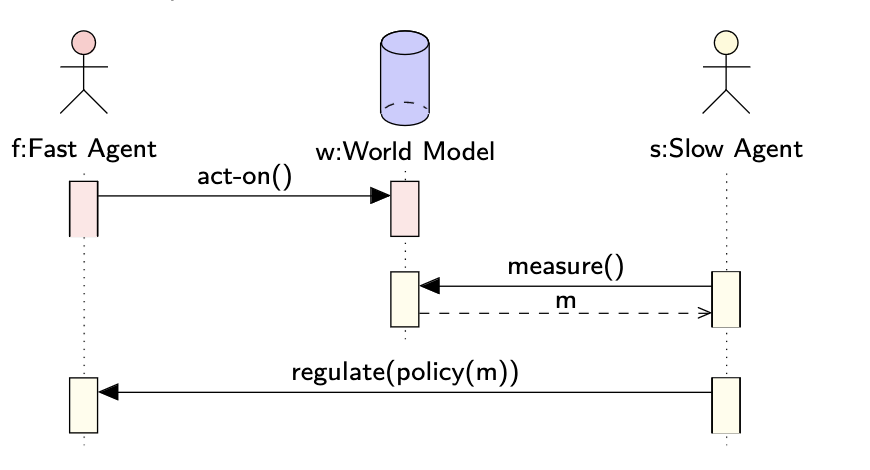
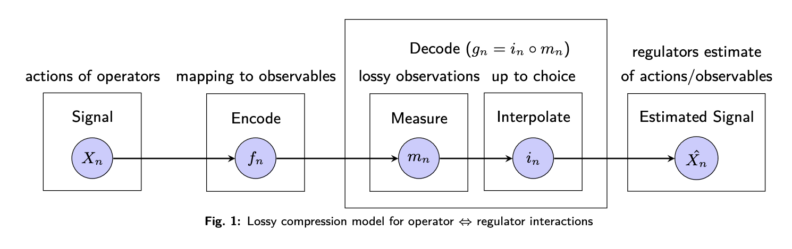
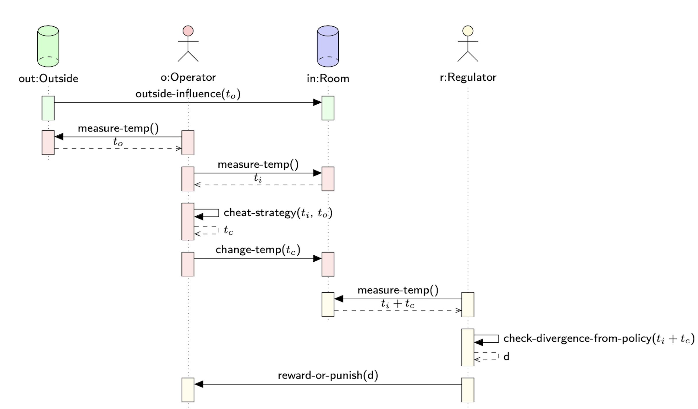
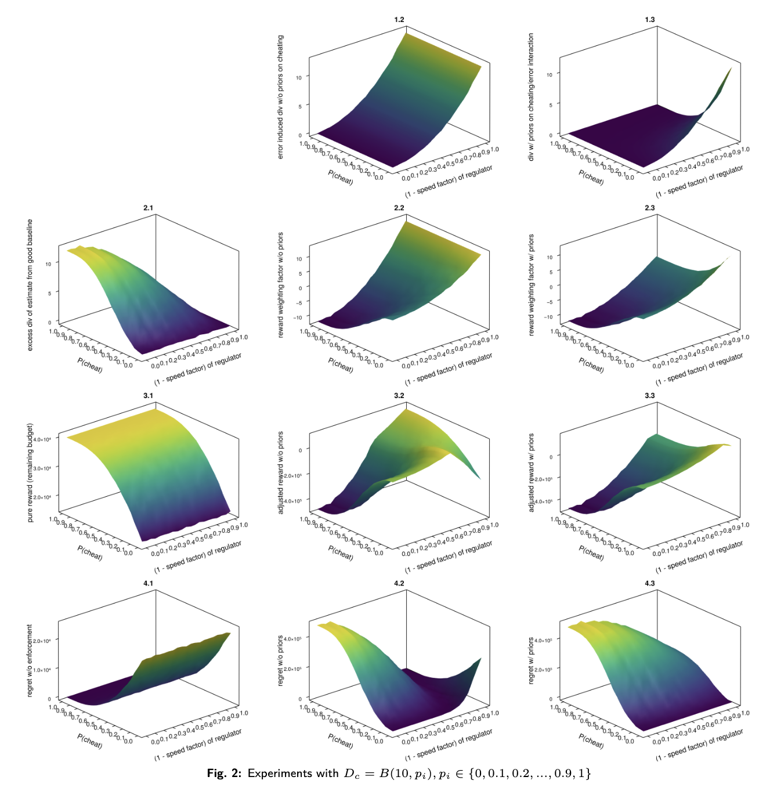

## Preface
This article is a summary based on the Anoma Research Topic titled [*Slow Games: Policy Enforcement under Uncertainty*](https://zenodo.org/records/13765214) by D Reusche, Christopher Goes and Nicolas Della Penna. All credit to the authors. Thank you to D and Chris for feedback and review. Any errors *are* my own.

## Introduction
The Slow Game is a type of principal-agent problem. The principal-agent problem ([PAP](https://en.wikipedia.org/wiki/Principal%E2%80%93agent_problem)) arises when one entity takes actions on behalf of another entity, where there is a potential conflict of interest. 

There are two actors in the slow game. 
- Operator - operator of a service. This is the agent. 
- Regulator - attempts to enforce policies of the service being provided by the operator. This is the principal.

The regulator is slower to act than the operator, and in some cases less sophisticated. Critically, the regulator is slower in measuring the operator's actions. This introduces uncertainty depending on the difference in speed between the two actors. 

In Anoma, examples of slow games include:
- Solver selection 
- Controller selection

The Slow Game report introduces a framework inspired by lossy compression problems to model this type of game. The report presents results of simulations (empirical analysis) from a minimal example. The report concludes by examining future directions of research including composition of slow games, operator collusion in slow games, and applied modeling for _Anoma_.

## Conceptual Framework

At a minimum, an instance of the slow game consists of:
- Fast agent $f$ taking actions. This agent could be a coordinated group like a network of solvers for example. Details like the identity of the fast agent, the space of actions they can take, and the costs / rewards (trade-offs) for taking particular actions are specific to each instance of the slow game.
- Slow agent $s$ taking $m$ measurements.  This agent could be a coordinated group of users or community members for example. The details of the slow agent $s$ like their identity, which measurements are taken, the frequency of measurements, and the cost of such are specific to the instance of the slow game.
- World Model $w$ determines how the actions taken by the first agent affect the measurements taken by the slow agent over time. The world model may or may not be fully known, the nature of which is specific to each instance of the slow game. 
- Regulatory mechanism $r$ which allows the slow agent $s$ to punish or reward the fast agent $f$. The punishment or reward depends on measurements $m$ taken over time. The nature of the punishment and rewards is specific to each instance of the slow game. 
- Target world profile $t$ is chosen by the slow agent $s$. The target world profile $t$ may include actions taken by fast agents $f$, measurements $m$ taken by slow agent $s$, or in between inferable variables of the world state.  $t$ may change over time, as the type of the target world profile is specific to each instance of the slow game. The value of $t$ is input into the system over time. 

Given the above, the characteristic questions for the slow game:
- Can a policy $p$ be crafted which will achieve the target world profile in incentive-compatible equilibrium?
- What is the policy $p$?
- What is the deviation between the reward profile of the actions which best maximize the fast agent's returns? We refer to this as slack, but colloquially could be called MEV. 

### Example: Solver Selection in Anoma

In the discourse, the term *solver* is often understood as market participants who provide counterparty discovery for user intents ([Davids et al., 2023](https://perridonventures.xyz/publications/redefining-blockchain-interactions-the-crucial-role-of-solvers-in-an-Intent-focussed-future#expandingthescope-newfrontforsolvers)). Another definition could be, solvers are agents who compete to satisfy user orders which may include complicated user specified conditions ([Chitra et al., 2024](https://arxiv.org/html/2403.02525v2)). 

Typically, the term solver is meant to encompass an entity that performs the following actions:

- Gossips intents
- Computational search
- Liquidity provision
- And transaction submission.

In [our thinking](https://x.com/cwgoes/status/1765829244393799910), these roles can be unbundled. Different actors can fill each of these functions.

In Anoma, the role of a solver is composed of Gossiper, Selector, Searcher and Picker. In practice, some solvers may exist where all the roles are performed by a single entity. 

Now that we have loosely defined the term solver, let's focus on the slow game example at hand. 

>Note here we refer to slack as noted in the report as MEV. The report also gives examples of Controller selection in Anoma and delegated governance systems. See the ART for more details. In future work we will formally define the term [MEV](https://arxiv.org/abs/2309.14201) originally known as [miner extractable value](https://arxiv.org/pdf/1904.05234). 

- Fast Agent - the solver in question (fast agent) chooses to accept or reject specific intents. Exploits price differences between intents (MEV) or returns MEV to users.
- Slow Agent - Users submitting intents to the solver measure if the solver is censoring intents (over time) and measure how much MEV is being returned (to users).
- World Model - MEV returned to users and censorship are probabilistically measurable over time. 
- Regulatory Mechanism - Users choose where to send their intents. Regulators can punish solvers by reducing their future rewards to zero by sending their intents to other solvers, for example.
- Target world profile - solvers capture MEV not more than a fixed margin above their operating costs and do not censor intents.

Indeed, we now have an idea of the conceptual framework. Next, we'll briefly discuss the lossy compression method used to model the slow game.

## Lossy Compression Model

[Lossy compression](https://en.wikipedia.org/wiki/Lossy_compression) is the class of data compression methods that uses inexact approximations and partial data discarding to represent the content. Lossy compression methods are everywhere in the digital world. They are used for communicating and storing images, audio, and video ([Blau and Michaeli 2019](https://proceedings.mlr.press/v97/blau19a/blau19a.pdf)). This contrasts with [lossless data compression](https://en.wikipedia.org/wiki/Lossless_compression) which allows the original data to be perfectly reconstructed from the compressed data with no loss of information. Here, we apply a lossy compression model to analyze what we have described as the slow game. 

>In the model we assume the difference in speed between the operator and the regulator leads to only lossy observations of operator actions being possible on the regulator side. The difference here is called the speed factor. The loss induced by it dropout. 

More plainly put, the regulator and the operator are operating at different speeds. The operator is acting faster than the regulator can measure. The difference in speed is quantified by the **speed factor**, the ratio of the regulator's speed to the operator's. Since the regulator is slower, they can only make lossy observations of the operator's actions. In general, the regulator is not measuring fast enough and misses some of the operators actions. This loss of information is called **dropout**. As such, the speed difference between the operator and the measurement of the regulator can be exploited by the operator. 

For example. Let's say the operator acts ten times within a given time interval, but the regulator can only measure twice. Here only 20% of the signal is observed. The other 80% of the signal is dropout. The speed factor which is the ratio of the regulator's measurement to the operator's speed is 0.2 (2 measurements/10 signals). 

The lossy compression model is used here because it provides a method to quantify the information loss and resulting uncertainty faced by the regulator. In particular, the model informs how we discount the known measurement error in the slow game's policy enforcement - how feasible it is for regulators to detect out of policy behaviors enacted by operators under uncertainty. The more errors in one's observation, the more lenient you need to be in enforcing a policy because errors may be caused by measurement and not defectiveness of the operator. 

The remainder of the Lossy compression model section of the paper (which we will not cover here) continues by discussing:
- Game formulation and knowledge requirements
- Crafting incentive structures via a regret formulation
- Speed games
- Interpolation and heavy tails

**Note:** Applying this model assumes that reward which can be gained by defection is distributed in [sub-gaussian](https://en.wikipedia.org/wiki/Sub-Gaussian_distribution) fashion, meaning that every defection opportunity provides a chance for small gains. Today, MEV opportunities are heavily concentrated in single events. Should one of these events be in the dropout set, nothing will be detected. Depending on the system parameters, sub-gaussian distributions could be enforced for some use-cases in practice.

In the following section we'll review the thermostat example from the paper which implements simulations for a minimal example of the slow game using the approaches we've discussed. 

## Example: Two-Player Thermostat Game

Let's imagine we are playing a game which is played between an operator and a regulator. There is a room that needs to be kept at a certain temperature. The room has a thermostat which controls the temperature. The temperature in the room is relative to the temperature of the outside world. The operator is responsible for keeping the temperature in range by operating the thermostat. The regulator sets the temperature policy for the room that the operator should adhere to, say between [18, 25] °C. The regulator is responsible for enforcing the rules of the game by rewarding or punishing the operator depending on adherence to the policy - the temperature of the room. 

### Game Model 
- Outside - drawn once per time step from a uniform distribution 𝒰(10, 32)
- Room - needs to be kept between a certain range of temperatures e.g., [18, 25] °C
- Operator - operates the thermostat to heat and cool the room, control its temperature. Also tries to maximize its reward for providing this service by using a stochastic cheating mechanism to cool or heat slightly less than necessary
- Regulator - sets the temperature policy for the room. Attempts to verify the operator's adherence to the policy. Rewards or punishes the operator depending on the operator's adherence to the regulator's policy. 

If the operator adheres to the temperature policy set by the regulator, they receive a reward. The reward in our example is computed by setting a heating/cooling budget $R_b$ for a period of $TS$ time steps, and giving all of the unspent budget to the operator as a base reward. The budget is the total amount of heating or cooling the operator can perform without being penalized. For example, heating or cooling by one degree costs one unit of budget. At the end of the time step the regulator checks how much of the budget the operator has used. The unspent budget is given to the operator as a reward or withheld in some cases if the operator deviates from the policy. 

>Here the operator (red) and the regulator (yellow) actions, happen at different frequencies $f_o$ and $f_r$ with $f_r$ $<$ $f_o$ and $f_o$ - once per time step. Outside influence can be seen in continuous time, but no change faster than maximal operator measurement frequency is relevant for our model 

The visual shows the interactions between the outside, the operator, the room, and the regulator. Let's dissect the sequence of actions present in the diagram, starting from the top and progressing to the bottom.
- outside-influence ($t_o$) - the outside temperature exists and influences the temperature of the room. This external variable is not controlled by the operator or the regulator.
- measure-temp($t_o$) - the operator measures the outside temperature.
- measure-temp($t_i$) - the operator measures the temperature inside the room.
- cheat-strategy($t_i, t_o$) - the operator decides on a cheat strategy based on the temperatures inside the room and outside. The cheat-strategy sets the target temperature for the room, which may diverge from the regulator's policy. Note that the term "cheat" is used because the operator is trying to maximize their reward by deviating slightly from the regulator's policy. 
- measure-temp($t_i+t_c$) - the regulator measures the temperature inside the room after the operator adjusts the thermostat. Recall that due to the speed difference between the operator and the regulator, the regulator's measurement might not capture all the operator's actions. 
- check-divergence-from-policy($t_i+t_c$) - the regulator checks for a divergence between the measurement of the room temperature and the policy. The divergence is noted as the variable $d$. 
- reward-or-punish($d$) - based on the observed divergence $d$ the regulator will reward or punish the operator. If the divergence is small (the room is kept within the temperature range defined by the policy) the operator will be rewarded. If the temperature falls outside the range of the policy the operator will be punished. 

Starting with the outside-influence, this sequence of actions takes place for every time step. The operator continues to adjust the thermostat to modify the temperature in the room based on their cheat-strategy. The regulator measures the room temperature each time step and either rewards or punishes the operator based on the divergence $d$. As we have discussed, the key challenge for the regulator is measuring the operator's actions due to the speed difference between the operator and the regulator's measurement. 

## Empirical Analysis
Based on the model we discussed in the prior section, the paper goes onto perform an empirical analysis. 

**tl;dr:** If we look at how the cheating strategy (conflation) interacts with the measurement error (pure error), we get better information about the operator's deviation from the policy. Empirically, we can create a reward and punishment scheme that incentivises the operator not to cheat across all speed regimes.

>To get an intuition for how our example plays out, given the above model and basic incentives, we simulate experiments and perform empirical analysis on it. We run experiments with $D_c = B(10, p_i), p_i \in \{0, 0.1, 0.2, ..., 0.9, 1\}$ with $S = 10000$, $R_b = 40000$, and interpolation replacing missing values with the mean of available data. 

- If we compare figures 1.2 and 1.3, we observe that incorporating the cheating strategy's conflation with pure error provides tighter divergence information compared to only the pure error. This effect is especially seen in game regimes with both high-speed differences and high cheating probability.
- Figures 3.2 and 3.3 show the weighting surfaces for the reward. This is derived by subtracting the excess divergence, figure 2.1, from the pure error without priors (1.2) and the pure error with cheating strategy priors (1.3). Figures 4.2 and 4.3 are the corresponding regret formulations.
- In both cases, we observe negative reward payments (i.e. punishments) in regimes with low speed differences and high cheating probabilities. This causes higher regret to the operator. 
- The policy derived from the conflation in figure 1.3 (cheating strategy prior) is tight enough in all speed regimes to incentivize in-policy behavior. Regret reliably increases together with cheating everywhere. 

>**Recap:** The policy is encoded in the reward weighting surfaces. Assuming the regulator knows their measurement error and the observed excess divergence from the estimate of a good baseline, they can read off the reward weight they should apply to the base reward.

See the paper, [*Slow Games: Policy Enforcement under Uncertainty*](https://zenodo.org/records/13765214) for more details. View this [repository](https://github.com/anoma/slow-game-research/tree/main) to run the simulations.

## Future Directions 

From the exploration of the problem space identified in this work, we have a better idea of how to model the slow game - as a lossy compression model - and the subgames being played. Some research directions that arise as a result include the following:

- Composition of slow games - on the Anoma network, operators and regulators maybe internally coordinated in diverse setups that can be modelled as a slow game.
- Operator collusion in slow games - the potential for operators to coordinate in order to extract value from users to undermine the regulatory mechanisms. 
- Applied modeling of Anoma - controller selection, solver selection.
- Empirical pipeline - an empirical pipeline that can help inform decision making for users in practice. 
- Transformation into a prior-free mechanism - this mechanism would not depend on any assumed prior knowledge about the environment or behavior of the participants. Instead, the mechanism learns and adapts based on observations.
  - In particular, [Theorem 3](https://arxiv.org/pdf/2009.05518) from *Mechanisms for a No-Regret Agent: Beyond the Common Prior* by Camara, Hartline, and Johnsen, gives an upper bound for the principal's (user) regret in their setting. This should provide an "upper" upper bound for extractable value as well, modulo some caveates: (a) extractable value should only be part of the principal's regret, (b) the rest is the agent's regret; e.g. friction in different places.
  - Additional components of the principal's regret include forecast miscalibration, cost of informational robustness, and discretization error. Agent regret  depends on the complexity of the utility functions, which depend on TX ordering and available computational resources for example. 

## Acknowledgements

From the paper:

>We thank the reviewers of the [Agentic Markets](https://agenticmarkets.xyz) Workshop at ICML 2024 for their helpful feedback on improving exposition and refining this work.

Thank you to the teams in the industry who are exploring this topic. 
- [Accountability along the transaction supply chain](https://ideas.skip.build/t/accountability-along-the-transaction-supply-chain/89) 
- [dydx v4 Social Mitigation Strategy for MEV](https://dydx.forum/t/dydx-v4-social-mitigation-strategy-for-mev/1377)
- [Cow Protocol Social Consensus Rules](https://v1.docs.cow.fi/solvers/in-depth-solver-specification/social-consensus-rules)
- [Osmosis governance stance against off-chain harmful MEV collusion and extraction software](https://commonwealth.im/osmosis/discussion/7812-osmosis-governance-stance-against-offchain-harmful-mev-collusion-and-extraction-software)
- [Jito Labs suspends mempool Functionality](https://blockworks.co/news/jito-labs-suspends-mempool-functionality)
- [How I learned to stop worrying and love MEV](https://medium.com/dragonfly-research/dr-reorg-or-how-i-learned-to-stop-worrying-and-love-mev-2ee72b428d1d)
- [The Simple Orderbook Flow (Aori Litepaper)](https://aori-io.notion.site/Aori-A-Litepaper-62f809b5c25c4798ad2c1d48d883e7bd)
