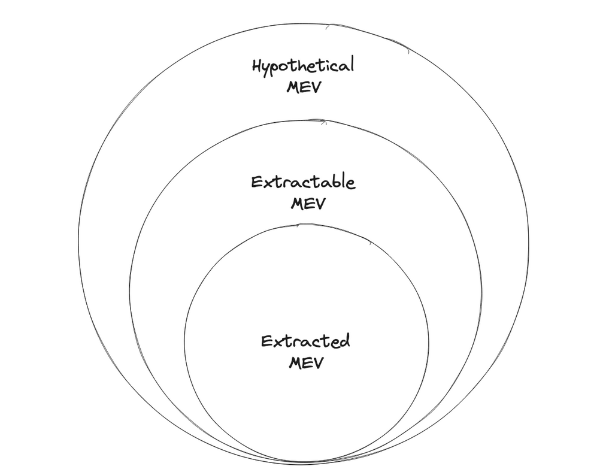

## Preface

Much public discourse has taken place since Devcon Bogotá when [SUAVE](https://youtu.be/ACXAzLy3iWY?feature=shared&t=1098) was first revealed to the community as the next milestone for Flashbots. SUAVE is an interesting idea. Many words have been written about SUAVE since then from folks both inside and outside Flashbots. In this article, before we begin I'm going to tell you what this article is not about.

- Cross-domain MEV (see [Christopher Goes](https://youtu.be/nDJ7qNFAqX0?feature=shared), [Obadia et al.](https://arxiv.org/abs/2112.01472), [Jon Charb](https://dba.mirror.xyz/NTg5FSq1o_YiL_KJrKBOsOkyeiNUPobvZUrLBGceagg) )
- Shared sequencers (see [Quintus,](https://youtu.be/q3Q2LZqbGKM?feature=shared)[Bowen](https://www.youtube.com/watch?v=Cj4k97SjbtY&pp=ygUjc3BlZWRydW5uaW5nIHRoZSBlbmRnYW1lIGpvc2ggYm93ZW4%3D), [Fisch](https://www.youtube.com/watch?v=q3Q2LZqbGKM))
- TEEs or cryptography (see [Andrew Miller](https://www.youtube.com/watch?v=4qgPd5kcwBs), [Phil Daian](https://www.youtube.com/watch?v=ek-bu4aoh0A&pp=ygUqd2h5IHRlZXMgc3VjayBtb3JlIGFuZCBsZXNzIHRoYW4geW91IHRoaW5r), [Ekiden](https://arxiv.org/pdf/1804.05141.pdf))
- Security models (see [Hasu](https://collective.flashbots.net/t/suave-economic-security-models/1070/3?u=apriori) & [Jon Charb](https://collective.flashbots.net/t/suave-economic-security-models/1070))

Some of these topics may be mentioned regarding the context they appear, but the specifics of how they work or details of their implementation are left to the reader to explore. For supplementary explorations, see this [repository](https://github.com/0xapriori/Suave-research/tree/main).

### Acknowledgements

_Thank you to Flashbots and the broader MEV research community._

## Introduction

SUAVE [_as_](https://collective.flashbots.net/t/suave-as-x/1024)..... a marketplace for MEV mechanisms.

In part one we will spend some time motivating SUAVE. We will discuss the following areas of research:

- **Geographical decentralization** - necessary for crypto to flourish long-term. To do so we need to decentralize power.
- **Game Warping** - Virgil Griffith discovered that using Ethereum as a credible commitment device allows for non-cooperative games to be warped into cooperative ones.
- **Strategyproof Computing** - an infrastructure vision that enables multiple participants to deploy new mechanisms, centered around services and resources, in an open and permissionless setting.

In part two we will spend time considering SUAVE's architecture and put forth some different mechanisms or applications that can be deployed on SUAVE.

- **Architecture** - SUAVE is a marketplace for MEV mechanisms. It is composed of an MEVM chain, a confidential data store, and execution nodes. The primary stakeholders of SUAVE are users, developers, and executors.
- **SAUPPs** - we discuss the motivations for building a SUAVE app and briefly review some known and less known possibilities.

This particular art will be intentionally different from other SUAVE art the reader has engaged with. And while we've had the privilege of talking to some friends at Flashbots about SUAVE, the analysis here-in is based on our own interpretation of publicly available information. This should not be mistaken for a canonical article but rather an observation that captures a particular point of view. The impatient reader can skip directly to part two. Though, it is the context from part one which makes part two much more interesting.

## Part 1. This is not SUAVE

## What is MEV?

<figure>
  
    <figcaption>Source: Flashbots</figcaption>
</figure>

> A notion called MEV, or miner-extractable value, measures the extent to which miners can capture value from users through strategic placement and/or ordering of transactions. Miners have the power to dictate the inclusion and ordering of mempool transaction in blocks. (Thus MEV is a superset of the front-running/arbitrage profits capturable by ordinary users or bots, because miners have strictly more power.)

This definition is pulled from the [_Clockwork Finance: Automated Analysis of Economic Security in Smart Contracts_](https://twitter.com/phildaian/status/1438532084130275334) by Babel, Daian, Kelkar & Juels.

There has been much effort put into formalizing MEV. For example, this excerpt from [_On the formalization of MEV_](https://writings.flashbots.net/formalization-mev) by Alejo Salles;

> Perhaps the definition that comes closest to formalizing this is the one given in the recent [Clockwork Finance](Clockwork Finance) paper via the following two expressions:
>
> (1) $EV(p,B,s) = \max_{(B_1, \ldots, B_k) \in B} {b(p,s_k) - b(p,s)}$
>
> (2) $k−MEV(p,s)=EV(p,validBlocks_k(p,s),s)$
>
> (1) Here, EV is the extractable value by player $p$ in state $s$ given a set of valid block sequences $B, (B1,…,Bn)$ is one such sequence, and $b(p,sk)$ is the balance of player $p$ in the state resulting of applying blocks $(B1,…,Bk)$ to $s$.
>
> (2) $k$-MEV is the $k$-maximal extractable value by a player $p$ in state $s$ acting as block proposer, where $validBlocks_k$ is the set of all valid block sequences of $k$ blocks that $p$ can create, and single-block MEV is just 1-MEV.

One common misconception which arises is mistaking extractable value for extracted value. The value extracted is typically a lower bound of what can in theory be extracted.

[MEV](https://assets.ey.com/content/dam/ey-sites/ey-com/en_us/topics/financial-services/ey-an-introduction-to-maximal-extractable-value-on-ethereum.pdf) has centralizing tendencies. MEV creates an incentive for block builders to vertically integrate with trading firms to boost their returns. Left unchecked, this is a centralizing force on Ethereum and other domains.

## Geographic Decentralization

<figure>

  <figcaption>Source: Phil Daian</figcaption>
</figure>

> _We believe that the single most important exit from a centralized cryptocurrency future is geographic decentralization._
>
> _Phil Daian_

The motivations for geographic decentralization include:

- regulations - introduce censorship onto blockchains.
- "neutrality" - cannot bias one region of the globe.
- building global systems - provide freedom and access to the world.
- consensus safety - technological robustness, survive black-swans.
- fairness - does not privilege one geography over another for users.
- decentralization - global participation, break down walls.

One of the motivations for geographic decentralization is to [decentralize power](https://collective.flashbots.net/t/decentralized-crypto-needs-you-to-be-a-geographical-decentralization-maxi/1385). The thinking goes - decentralizing power is all that matters and the technological and architectural components will follow suit. Decentralization of power must be global. Thus, it should be technical decentralization that protects the decentralization of power, _which_ requires social coordination.

Threats to decentralization include:

- cross-domain MEV - CeFI-DeFi arbitrage is centralizing.
- existing power dynamics - centralizing force of proof-of-stake.
- latency games - incentives for latency optimizations lead to centralization.
- regulatory capture - one regulatory agenda captures everyone.
- centralized MEV infrastructure - incentive optimization remains centralized. Existing actors will only gain more power.

Many components of the MEV supply chain including block builders and relays are highly centralized. On [Ethereum](https://ethereum.org/669c9e2e2027310b6b3cdce6e1c52962/Ethereum_Whitepaper_-_Buterin_2014.pdf)[90%](https://mevboost.pics) of the blocks built rely on MEV-Boost builder/relay market. Today, [integrated searcher-builders](https://x.com/FrontierDotTech/status/1693245725679767690?ref=blog.anoma.net) threaten to dominate the market because of their ability to capture [CeFi-DeFi arbitrage](https://frontier.tech/a-tale-of-two-arbitrages?ref=blog.anoma.net) at the top of the block where neutral builders cannot compete. This creates a profit discrepancy and incentivizes searchers to send orderflow to builders they know will win the MEV-Boost auction. Even if this wasn't the case, only a handful of builders and relays dominate the market today.

## Game Warping

> _Ethereum is an unprecedented arena for playing cooperative games. And moreover, Ethereum enables powerful economic vehicles we don’t yet understand._
>
> _Virgil Griffith_

[Virgil Griffith](https://en.wikipedia.org/wiki/Virgil_Griffith) wrote about this concept in his timeless [article](https://medium.com/@virgilgr/ethereum-is-game-changing-technology-literally-d67e01a01cf8)_Ethereum is game-changing technology, literally_. ([send mail](https://virgil.gr))

Griffith argued that Ethereum could be used to transform non-cooperative games into cooperative games with a technique called Game Warping - which stacks a new layer atop an uncooperative game to make cooperation rational. Griffith outlined four examples of games where using Ethereum as a credible commitment device changes the equilibrium of the game.

- [Commitment device](https://docs.google.com/presentation/d/1q_wmduMLr7IKkOPgWTWiYFfpgZNALFAah7ekB0I7X3o/edit#slide=id.g187ff1cf8c1_0_459) - provides enforcement and common knowledge of enforcement. Enforcement means commitments can credibly predict an agent’s behavior. Common knowledge of enforcements means the increased certainty can shift the equilibrium of the game.

If users instead of taking actions themselves, use programs (intents) and commit themselves to a strategy, this provides a credible commitment.

Let's consider a Prisoner's Dilemma game with players A and B from the [Program Equilibria literature](https://www.sciencedirect.com/science/article/abs/pii/S0899825604000314). With a credible commitment device player A could encode a commitment like this.

```
If MyProgram = OtherPlayerProgram
                DO(coop); else DO(defect)
```

- Example: Prisoner's Dilemma

In the Prisoner's Dilemma (a non-cooperative game), the rational strategy puts players in the worst possible position. Let's say players A and B want to steal some art from a museum. Before they do they each deposit 1000 ETH into a contract on Ethereum which states if I publish a defect message my 1000 ETH gets burned.

Now let's assume both A and B get caught and are put in separate rooms for questioning compelling a confession. With this contract in place as long as the authorities don't offer a bribe worth more than 1000 ETH the rational prisoners will choose to cooperate and not snitch on each other.Without the commitment device the dominant strategy would be to defect and accept any bribe from authorities. The commitment device, warps the game.

Griffith's conclusion was that Ethereum makes _all_ game-warping practical by providing a deterministic, all-seeing, cheap, and expedient judge. Ethereum enforces commitments and provides common knowledge of enforcement.

This idea of blockchains as permissionless credible commitment devices shows up in recent [SUAVE art](https://hackmd.io/@sxysun/suavespec#SUAVE-Spec).

> _SUAVE is a permissionless credible commitment device that programs and privately settles higher-order commitments for PCCDs_
>
> _SxySun_

What are higher-order commitments and PCCDs concretely?

- Higher-order commitments - intents ([programs](https://hackmd.io/@sxysun/coopaimev#Example-II-Conditional-Commitments)) which are dependent on other players' intents like the example from the program equillibria literature.
- PCCDs - blockchains.

> SUAVE is a permissionless blockchain that programs and privately settles user preferences expressed as intents (programs) for other blockchains.

Let's consider MEV and how this is related. MEV is the value that originates from the [uncoordinated use of commitment devices](https://tinyurl.com/mevccd).

Ethereum has block time of 12s. It takes 12s for it to implement the common knowledge of the most recent history/finalized commitments.

- Clearly Ethereum cannot be used to coordinate any events within 12s because the speed of block times which inform common knowledge is slower than the speed of the MEV game.
- This implies that blockchains cannot coordinate their own use, and because MEV is the uncoordinated use of blockchains, this uncoordination happens before commitments gets finalized within 12s.

Thus, there exists no blockchain that can contain its own MEV. For any blockchain, there exists one game that can never coordinate itself. This is a bold claim. If true it implies that there is some MEV which SUAVE cannot coordinate.

## Strategy Proof Computing

We first came across this paper while watching a [presentation](https://www.youtube.com/watch?v=DhsDFKnHPa0&pp=ygUTYW5kcmV3IG1pbGxlciBzdWF2ZQ%3D%3D) that Andrew Miller gave on SUAVE. The paper is quite prophetic and provides a clear framework for how to view **SUAVE as a marketplace for mechanisms**.

The paper we reference is _Strategyproof Computing: Systems Infrastructures for Self-interested Parties_ by Ng, Chaki, David C. Parkes, and Margo Seltzer. 2003.

Before diving into SUAVE's architecture, it will be useful for the reader to gain some understanding of strategyproof computing. The impatient reader can skip ahead.

### Overview

Strategyproof computing (SPC) is a vision that explicitly recognizes and embraces the self-interest and incentives of individual parties in a distributed system. SPC considers the problem of designing systems with useful long-term equilibrium behavior, when users or their computation/agents have presumably figured out how to play the game to their advantage.

The vision relies on market-based approach for resource allocation and the economic theory of mechanism design (MD).

Strategyproof computing is an infrastructure effort that wants to enable multiple participants, e.g., service providers, resource providers, intermediaries, to deploy new mechanisms, centered around services and resources in an open and permissionless setting.

### Main ingredients

- **Local strategyproof mechanisms** - no single mechanism can possibly be appropriate for all requirements in a heterogeneous system.
- **Open market for mechanisms** - SPC provides the dial-tone equivalent for the development and deployment of computing services that explicitly handle incentives.

### Guiding Principles

1. **Incentives first** - the self-interest of participants in distributed systems should be explicitly addressed by system designers.
2. **Utility-based** - considers the utility of users for different outcomes as the basis for resource allocation related arbitration.
3. **Simple** - simplify the decisions facing participants in distributed multi-agent systems
4. **Open systems** - allow for innovation and competition of design of new services.
5. **Decentralized** - for autonomy of the nodes that own the property rights to resources, but also for reasons of computational scale and timeliness of information.

### Economic Foundations

1. **Mechanism Design (MD)** - explicitly models each participant as a game-theoretic agent. MD wants to design optimal incentives for preferred system-wide outcomes.
2. **Relaxed view** - propose an open market for mechanisms that must only satisfy certain local incentive properties, essentially within the scope of the local deployment.

SPC considers the existence of multiple mechanisms, each of which is locally strategyproof within its scope.

**Strategyproof mechanisms (SPM)** - self-interested party communicates their own utility through straightforward truth-revelations about requirements and capabilities, regardless of what the strategies and behaviors of other parties might be.

### Basic Concepts

#### LSP Mechanism

Local strategyproof mechanism $M$ is one in which truth revelation is a dominant strategy for any participant that can express their utility for resources and services within the scope of $M$ independently of other events, and that chooses to submit requests for these resources exclusively to the mechanism.

**SPC infrastructure must provide support for multiple users to design and support local strategyproof (LSP) mechanisms in a market for mechanisms. An open marketplace leads to mechanisms with the right scope.**

Resource providers or intermediaries will create LSP mechanisms for admittance into distributed systems. Intermediaries profit by facilitating between buyers and providers.

#### Public Interface

- Each LSP mechanism provides a public interface that facilitates how parties can find mechanisms and composes services across mechanisms
- Part of the interface will make claims about incentive properties, and statistical properties on the utility of participants that hit that mechanisms.

**The interface must specify**

1. **Service request language** - language to describe how others can query the service.
2. **Restrictions** - on the preferences of parties that are submitting requests, for which the incentive properties of the mechanism hold. This is important because it will depend on the particular type of goal a user wants to accomplish.
3. **Utility statistics** - provide information on the average utility that parties have realized with the mechanism in the past.

#### Validation

The infrastructure will assume the key role of providing validation of the incentives and statistical properties of LSP mechanisms.

Validation schemes must be provided by the infrastructure for strategyproof systems to function. Indeed, Truth revealing equilibrium of well-defined mechanism can unravel without the ability to commit to a set of rules. Validation can be provided without requiring the direct checking of the rules of mechanisms.

1. **Active monitoring** - with police agents that belong to the infrastructure; poll for LSPs and check for deviations from the claimed incentive properties, must be able to masquerade as a user.
2. **Passive monitoring** - subset of requests and responses are monitors; requires that data must be stored for auditing purposes.

### Challenges & Open Questions

- **System Research Challenges** - AI related challenges.
- **LSP Mechanisms** - Basic research goal, establish the core validity of local strategyproofness in the context of system settings.
- **Validation and Verification** - Active and passive monitoring techniques are most effective if the responsible parties cooperate.
- **Scalability and Decentralization** - it must be rational for these nodes to choose to implement the computation and the message passing required to deploy the mechanism.
- **Composition** - Need to be able to discover and compose LSP mechanisms to form larger-scope LSP mechanism sets - **very SUAVE like**.
- **Measurements** - The negative effects of self-interest within a system must be clearly quantified.
- **Deployment Issues** - How to bootstrap a network effect for users and providers.

## Part 2. This is SUAVE

<figure>

<figcaption>DALLE-Michel Basquiat</figcaption>
</figure>

## SUAVE as a marketplace for Mechanisms

Now with some background on geographic decentralization, game warping, and strategyproof computing we can take a look at SUAVE with better context.

Let's begin by reviewing the architecture at a high level. It should be noted that the architecture may evolve slightly over time.

## Architecture

> _The net result of SUAVE is creating blocks that are included on chain for Ethereum or rollups._
>
> _Robert Miller_

### SUAVE Centauri ⇒ Andromeda

There are three main components to SUAVE

1. **MEVM chain** - modified EVM chain with special precompiles for MEV use cases. Some of these precompiles call out to an execution node.
2. **Execution Node**- is an off-chain node providing execution, simulating transactions, merging them together, building a block, inserting new transactions.
3. **Confidential data store** - for private information that users don't want to store on-chain, which can be accessed by the execution node.

There are three main stakeholders of SUAVE

1. **Developers** - write their MEV mechanism as a smart contract leveraging the MEVM's custom precompiles.
2. **Users** - send private data that they want included on-chain. Users can choose to authorize specific contracts, e.g., an auction or block-building contract, to access to their private data.
3. **Executors** - MEV agents who execute strategies, like back-running or arbitraging, to execute user bids.

#### Execution Nodes

Here, let's zoom in on execution nodes. This is one of the most difficult components of SUAVE to grasp.

**Smart contracts that are deployed on the MEVM chain, written in Solidity, define off-chain execution that is performed by the execution nodes.**

The contract's special MEVM precompiles call out to the execution nodes to perform some action.

For example, the smart contract says take all of these transactions, simulate them and treat them according to a particular algorithm. This is not performed on-chain, but rather off-chain inside an execution node running a trusted execution environment (TEE).

> _A [TEE](https://arxiv.org/pdf/1804.05141.pdf) provides a fully isolated environment that prevents other software applications, the operating system, and the host owner from tampering with or even learning the state of an application running in the TEE._
>
> _Cheng et al., Ekiden '19_

Execution nodes run (TEEs) to provide privacy and credibility to compute. Execution nodes have access to private data.

#### MEVM

We didn't yet define the MEVM. The MEVM is a modified version of the EVM with minimal changes but additional precompiles that allow for all functions of the off-chain MEV infrastructure. This makes it easy for existing solidity developers to build applications and rely on existing workflows, not needing to learn a new programming language.

Here is an example [contract](https://github.com/0xapriori/Suave-research#example-mevm-contract) of the Flashbots builder with some pseudocode presented by Robert Miller. The example demonstrates some of the custom [precompiles](https://github.com/flashbots/suave-geth#suave-precompiles).

MEVM's precompiles are the superpowers the MEVM gives developers - these are not available on Ethereum.

#### Leveling the playing field

SUAVE is a decentralized platform for MEV applications. As such, SUAVE will reduce the barriers to entry for developers who wish to deploy their own MEV mechanism - say block building. Anyone can come and deploy contracts on SUAVE.

In this positive sum vision, MEV applications **compete _and_ compose** together in an open market which results in strictly better outcomes for users and better blocks for validators.

Now that we've reviewed the core components of the architecture, let's talk about the bulletin board framework.

### Bulletin Board

> _SUAVE unbundles the mempool and block builder role from existing blockchains and offers a highly specialized and decentralized plug-and-play alternative._
>
> _The Future of MEV is SUAVE_

SUAVE can be thought of as a [bulletin board](https://www.youtube.com/watch?v=b3o2YP6sxpg&t=4642s) that anyone can submit their transaction execution requests to (intents, preferences). Once you make such a request, and it's floating in the suave mempool, the request is out there.

There are two ways to express preferences on SUAVE. One with a direct message to a trusted executor. This could be done to accommodate for lower latency domains than SUAVE.

Another is by making a committed bid. Once bids have been committed to the preference environment on SUAVE chain, they cannot be ignored. This gives users a censorship resistance property.

From the perspective of a target domain's (Ethereum) [perspective](https://barnabe.substack.com/p/seeing-like-a-protocol), SAUVE is a black box which builds the most optimal block for that particular domain. Some block proposers may be SUAVE aware and be able to profit switch between SUAVE and blocks built locally or by a different market. Other block proposers will not be SUAVE aware, which will require a SUAVE executor to participate in a PGA or PBS style auction to bid for inclusion.

Some architectures do not have PBS. This is fine. In the future, SUAVE will be compatible with these domains as well.

After execution on the target chain, an oracle reports the state change from the underlying domain and then the payment (fee) can be claimed by the executor on SUAVE.

### SUAVE Roadmap

As a note to the reader, the original SAUVE article laid out a three-phase [roadmap](https://github.com/0xapriori/Suave-research/tree/main#roadmap-1).

- SUAVE Centauri
- SUAVE Andromeda
- SUAVE Helios

The architectural design above discusses the Centauri to Andromeda phases. Thus, you will notice the omission of the infamous chart and terms; preference environment, execution marketplace, and decentralized block builder.


#### Preference Environment

The global preference environment is where users can submit their bids to and participate in different auctions competing for their orderflow.

#### **Execution Market**

The execution market is a competitive marketplace of specialized actors who can take user preferences and execute on them regardless of which chain it is. This is separate from decentralized block-building network because not all domains have a notion of block-building or PBS.

#### **Decentralized Block Builder**

The decentralized block-building network is a specialized instance of an executor within the executor marketplace but also logically separate.

#### Language Games

It should be noted that the above is the original language put forth to describe SUAVE's architecture.

We direct the reader to the original article, _The Future of MEV is SUAVE_, pairing it with Jon Charb's elite report _SUAVE, Anoma, Shared Sequencer, & Super Builders_ as well as the [_MEV in a Modular World_](https://youtu.be/b3o2YP6sxpg?feature=shared&t=3226) episode on the Bell Curve podcast.

## SUAVE Apps ⇒ SUAPPs

The design space for mechanisms and applications that can be built on-top of SUAVE is vast. The idea is that SUAVE significantly lowers the barriers to entry for competing in designing MEV mechanisms.

As a designer, you don’t have to compete for private orderflow as there should be an abundance of it up for grabs in the SUAVE mempool.

In fact, there could be a number of new crypto-economic incentives to play with; e.g., developers subsidizing adoption as a way to win orderflow. While SUAVE is not designed to compete with Ethereum or rollups for developer customers, it will be a permissionless environment for contract deployment.

Sometimes designers intend their product to be used in a particular way, but users discover other unanticipated [affordances](https://www.interaction-design.org/literature/topics/affordances).

### Why SUAVE Apps?

> _Therefore, the goal with SUAVE is to remove this centralization risk. As the SUAVE PCCD acts as a credibility lender that lends any MEV-time mechanism deployed on it credibility at low interest rates. In this way, we prevent the centralized MEV-time application dystopia because (i) the deployment cost of new mechanisms is lowered and (ii) the switching cost between mechanisms is lowered._
>
> _Sxysun_

Developers can deploy MEV applications on SUAVE chain and borrow from SUAVE's [credibility](https://hackmd.io/@sxysun/suavespec?ref=blog.anoma.net#Centralization) and decentralization, using SUAVE as a [root of trust](https://csrc.nist.gov/Projects/Hardware-Roots-of-Trust).

This protects users from monopolies because SUAVE provides low switching costs for application users which forces the operators of the mechanisms to remain honest.

As noted previously, [TEEs](https://youtu.be/4qgPd5kcwBs?feature=shared&ref=blog.anoma.net) provide [integrity and privacy](https://writings.flashbots.net/mevm-suave-centauri-and-beyond?ref=blog.anoma.net#andromeda-and-beyond) which is guaranteed even in the presence of a malicious operator.

There are many possibilities for SUAPPs. We will table a full discussion for forthcoming artwork, part 3. Below are some examples of potential SUAPPs.

### Orderflow Auctions

- [MEV-Share](https://collective.flashbots.net/t/mev-share-programmably-private-orderflow-to-share-mev-with-users/1264)
- [MEV-Blocker](https://mevblocker.io/#faq)

### Dutch Auction/RFQ/COW systems

- [UniswapX](https://anoma.net/blog/uniswapx)
- [CoWSwap](https://docs.cow.fi/)
- [DEX Aggregators](https://docs.1inch.io/docs/aggregation-protocol/introduction/)

### Block Building Algorithms

- [Distributed Building](https://www.youtube.com/watch?v=fAgrIdyWIqc&pp=ygUcdml0YWxpayBkaXN0aXJidXRlZCBidWlsZGluZw%3D%3D) - holy grail of block building.
- [PROF](https://www.youtube.com/watch?v=v1TkocRScJg) - protected orderflow for fair transaction ordering.
- [Proposer commitments](https://efdn.notion.site/PEPC-FAQ-0787ba2f77e14efba771ff2d903d67e4) - PEPC flavors and other beverages.
- [Pre-Confirmations](https://youtu.be/fAgrIdyWIqc?feature=shared) - mimics UX of a fast blockchain for a fee.

### Other Stuff

- [Private Voting](https://research.aragon.org/nouns-tech.html) - enabled by cheap compute and privacy.
- Blob Merging with EIP-[4844](https://eips.ethereum.org/EIPS/eip-4844) - rollups pay per blob, possible to share blob space.
- [Walrasian Auctions](https://en.wikipedia.org/wiki/Walrasian_auction) - an auction type that perfectly matches supply & demand.

### Real Word Auctions (RWAs)

This is hypothetical and conjecture. However, thinking down the road, there are many potentialities for types of [auctions](https://eprint.iacr.org/2023/114.pdf) on SUAVE. One intriguing possibility is [Spectrum Auctions](https://www.youtube.com/watch?v=TttPqjl991A&list=PLEGCF-WLh2RJBqmxvZ0_ie-mleCFhi2N4&index=8).

## Conclusion

SUAVE is a marketplace for MEV mechanisms, which is motivated by the desire to decentralize power and eliminate the negative existential externalities of MEV. This can be done via geographic decentralization, game warping, and strategyproof computing. These concepts inspire SUAVE's unique architecture. If successful, SUAVE lowers the barriers to entry for MEV mechanism designers and fosters innovations that would not be possible otherwise, leading to better outcomes for users.

## Open SUAVE Questions

- [Fast Block times](https://github.com/0xapriori/Suave-research/blob/main/README.md#fast-block-times)
- [Security Models](https://collective.flashbots.net/t/suave-economic-security-models/1070)
- [TEE associated risks](https://sgx.fail)
- [Iatrogenesis](https://en.wikipedia.org/wiki/Iatrogenesis)
- [Bidding Language](https://www.eecs.harvard.edu/cs286r/courses/fall09/papers/bidding.pdf)
- [Adoption](https://x.com/maxresnick1/status/1679595753776480258)
- [Light Nodes & DAS](https://arxiv.org/abs/1809.09044)

## Canonical References

- [Geographical Decentralization](https://dash.harvard.edu/bitstream/handle/1/4101256/Ng_Strategyproof.pdf)
- [Sxysun's SUAVE spec](https://hackmd.io/@sxysun/suavespec)
- [Ethereum is game-changing technology, literally](https://medium.com/@virgilgr/ethereum-is-game-changing-technology-literally-d67e01a01cf8)
- [Strategyproof computing](https://dash.harvard.edu/bitstream/handle/1/4101256/Ng_Strategyproof.pdf)
- [MEVM, SUAVE Centauri, and Beyond](https://writings.flashbots.net/mevm-suave-centauri-and-beyond#suave-as-a-market-for-mechanisms)
- [SUAVE, Anoma, Shared Sequencers, & Super Builders](https://dba.mirror.xyz/NTg5FSq1o_YiL_KJrKBOsOkyeiNUPobvZUrLBGceagg)
- [The Future of MEV is SUAVE](https://writings.flashbots.net/the-future-of-mev-is-suave/)

_Note: All artwork was generated by DALLE-2 for educational purposes only_
