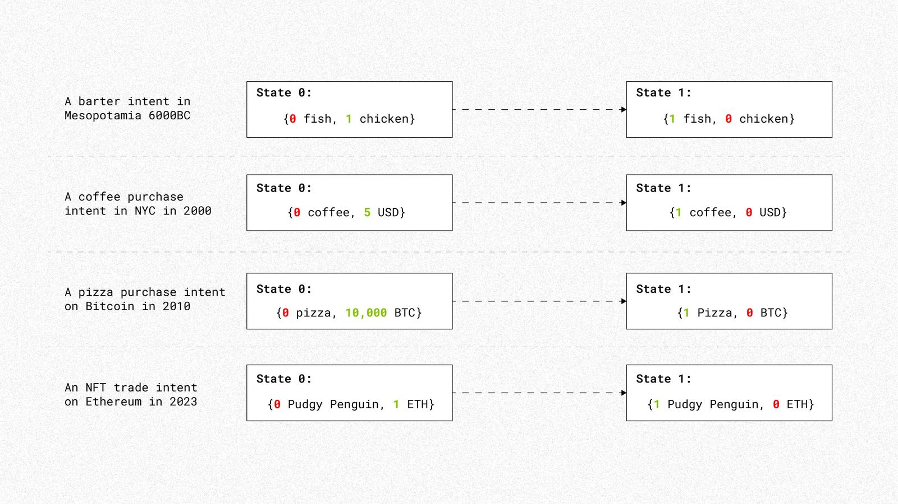
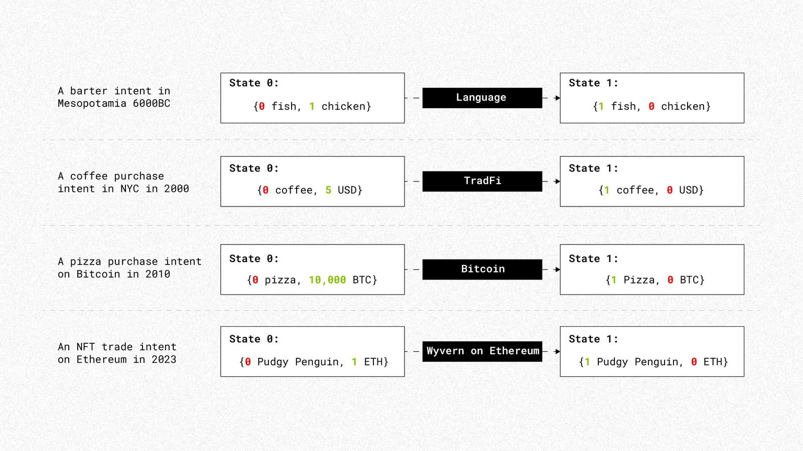
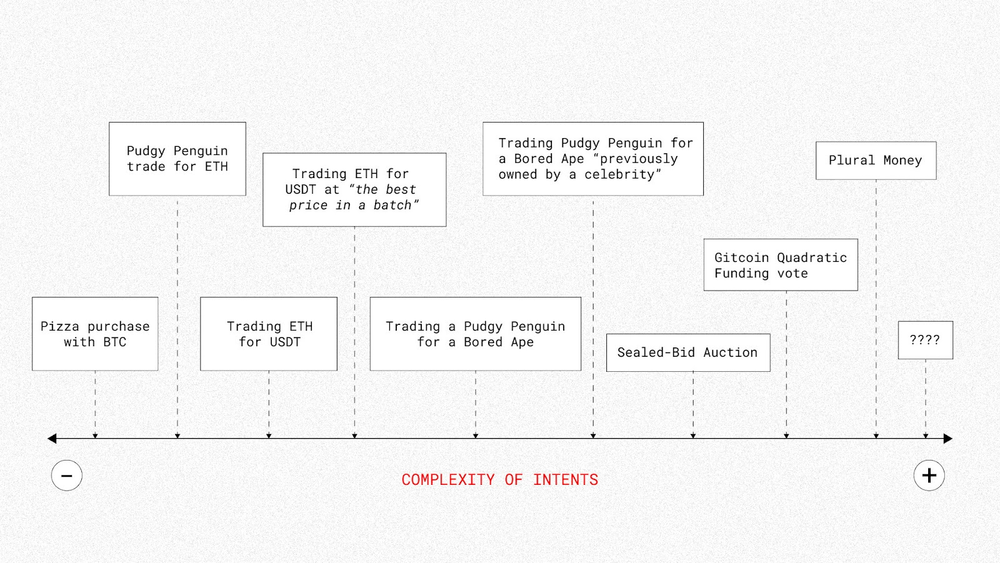
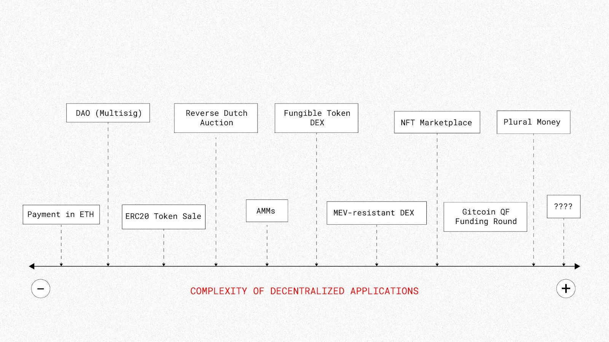
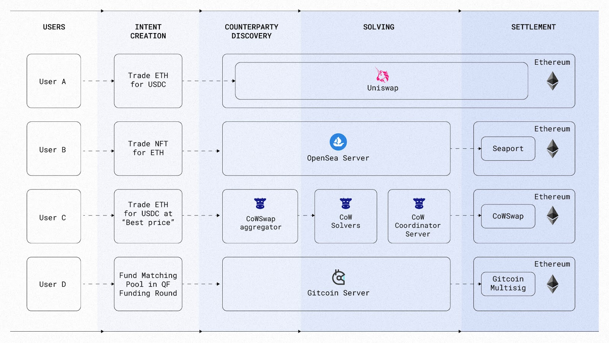
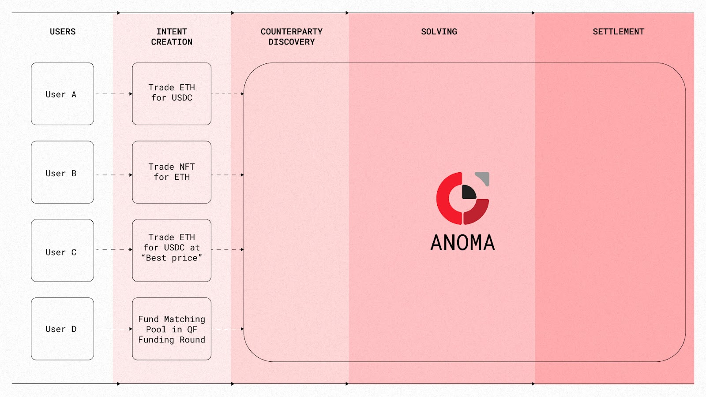
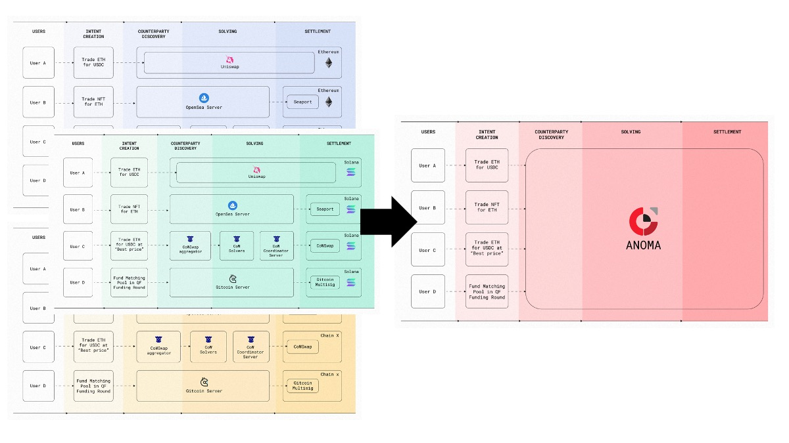
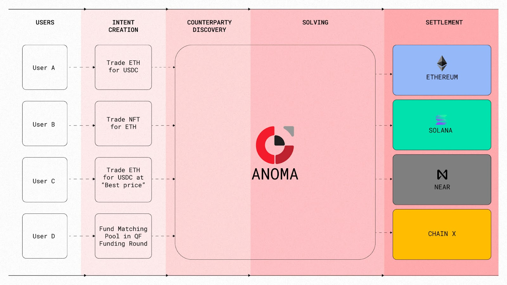
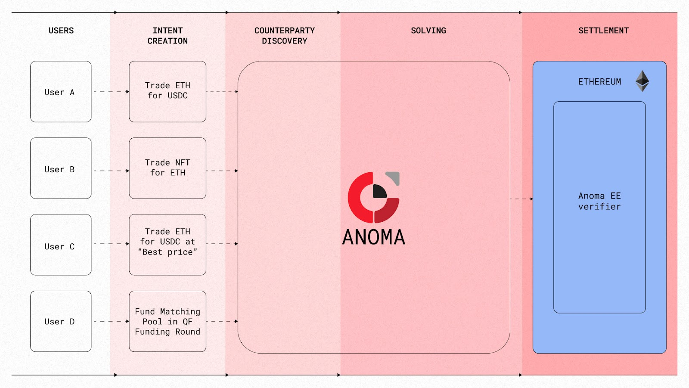
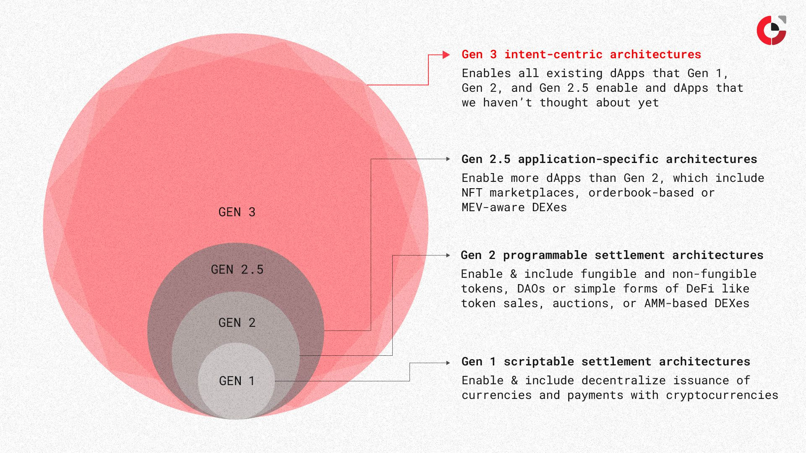

All architectures for decentralized applications so far are blockchain-centric, where everything revolves around the existence and need for a blockchain, which severely limits the design space – **putting a ceiling on** the properties that the architectures can offer and a limit to **what applications can be built on them.**

Anoma is the first intent-centric architecture that breaks free from any existing constraints – including if we need a blockchain (for anything outside of settlement) to begin with. Instead, the starting point is to ask ourselves:** what do applications need**?In this search, we take into account **all kinds of applications that exist today**: decentralized, centralized, and even the ones that cannot be built on web2 nor web3 architectures.

Turns out, all applications have one primitive in common: **the intent**.

## TL;DR

- Intents and applications can have arbitrary complexity
- Decentralized intent-completion mechanisms are application-specific and no one has yet proposed one that is generalized and able of completing any intent
- A benefit of an intent-centric architecture is that it provides the properties of generalized intents, counterparty discovery, solving, and settlement – which is sufficient to enable all existing applications but with end-to-end decentralization
- Intent-centric architectures are compatible with blockchain-centric architectures and can be used in multiple ways, as an L1, L1.5, or even L2 - it’s up to the dApp builders
- They also provide novel properties which can enable dApps that we haven’t even thought about and it’s too early to tell where the limits are

## What are intents?

An intent is an expression of an individual’s desired end state(s). Whenever a person needs something, they subconsciously generate a virtual intent in their head. This can be anything, from wanting fish, coffee, a pizza, or even an NFT:

<figure>
  
  <figcaption>Figure 1: Example intents throughout history</figcaption>
</figure>

Intents have always been there, we were just not aware of them. Humans started using intents way before they started interacting with software, computers, money, and barter systems – and right now, **everyone is generating intents in their heads**.

What has drastically evolved is the number and diversity of** mechanisms that people can use to complete their intents**. Compared to 6000 BC in Mesopotamia, when the first barter system appeared, today we’ve got many more mechanisms including fiat currencies, TradFi infrastructure, Bitcoin, and Ethereum:

<figure>
  
  <figcaption>Figure 2: Example intents throughout history and example completion mechanisms</figcaption>
</figure>

All existing mechanisms are non-fungible, they come **with different properties and trade-offs**; and they are non-excludable, meaning that individuals use multiple mechanisms at the same time, depending on which provides **the best properties and trade-offs** for every intent they want to complete.

This article focuses on intents related to **decentralized applications (dApps)** and **decentralized mechanisms** that are able to complete intents.

## Intents and decentralized applications

There are applications that are simple enough that they can be enabled with one intent. There are also more complex applications that can be enabled by a single intent, because an **intent can contain arbitrary levels of complexity**:

<figure>
  
  <figcaption>Figure 3: Spectrum of complexity of intents</figcaption>
</figure>

You might disagree with some comparisons in figure 3, but at least it’s easy to agree that a _payment intent_ (pizza purchase with BTC) is a lot simpler than a [quadratic funding vote](https://www.wtfisqf.com/). What’s interesting is that the most simple application that requires only one intent is _a payment_. Any other dApp will require more than one party and also more classes of intents:

<figure>
    
  <figcaption>Figure 4: Spectrum of complexity of dApps with examples</figcaption>
</figure>

It might be hard to agree with the position of every dApp in Figure 4, but it is easy to agree that a payment in ETH dApp is substantially simpler than a Gitcoin [Quadratic Funding](https://www.radicalxchange.org/concepts/plural-funding/) round on Ethereum or than a SALSA-based monetary system like [Plural Money](https://www.radicalxchange.org/media/blog/plural-money-a-new-currency-design/).

Another observation is that **the simpler the dApp**, the **more mechanisms** exist to complete them; **the more complex the dApp**, **the fewer mechanisms exist today** to complete them.

For example, a **payment intent** can be completed through many mechanisms: fiat currencies, TradFi systems like wires or credit cards, or cryptocurrencies just to name a few – each with different properties and trade-offs. But the options drop significantly when it comes to mechanisms that can facilitate more complex applications like **combinatorial auctions **and their** intents**, and the options become even less clear when we talk about **new age, Game B economic systems** like [Plural Money](https://www.radicalxchange.org/media/blog/plural-money-a-new-currency-design/), [CoFi](https://anoma.net/blog/anoma-is-putting-graphs-back-into-crypto), or [Heterotopia](https://pluranimity.org/2022/09/26/towards-heterotopia/) (scale-free money).

A very critical observation is that there are potentially **even more interesting and complex applications and intents** that we haven’t thought about yet. And a final, but fundamental takeaway is that **any application can be represented by intents** (see [intents as CSPs](https://research.anoma.net/t/draft-proposal-intents-as-constraint-satisfaction-problems-implemented-by-partial-transactions/210)).

There are many decentralized mechanisms that can complete **application-specific intents** – but no one has yet proposed **a mechanism** that is general and scalable enough **to complete any intent and enable any dApp**, no matter the complexity, number of unique parties involved, discrete categories of parties participating, and total volume of intents involved in the application.

## Intent-centric architectures

**An intent-centric architecture** is one where the most fundamental primitive is the **intent** and where intents are not application-specific, but **generalized**. In intent-centric architectures, users **define one or multiple end states** they want to reach and the architecture is designed to complete the intent while respecting the constraints that the user has defined.

Another way to look at an intent-centric architecture is as a design for a **fully generalized intent-completion mechanism**.

Intent-centric architectures come with many advantages:

1. Provides **all the properties that existing dApps** need: generalized intents, counterparty discovery, solving, and settlement
2. Provides **novel properties** for dApps: including local and global scalability, [information flow control](https://anoma.net/blog/zexe-vs-verizexe-vs-taiga), configurable ordering, configurable settlement, and compositional identity
3. Enforces a **declarative paradigm** for applications
4. Results in **market structures that are as decentralized as possible**, subject to exogenous constraints such as the limits of distributed systems and physics, where users through their intents and actions define what market structures they want

There’s a lot to unwrap here, but in this article I’ll focus on (1) intent-centric architectures providing all the necessary properties for existing dApps.

## What properties do decentralized applications need?

I define _property_ as a feature that an architecture or infrastructure protocol provides to dApps. For example, _programmable settlement_ is the key property that blockchain-centric architectures like Ethereum provide for dApps.

The starting point of an intent-centric architecture is what *properties *do decentralized applications need?

A way to answer this question is by looking at the architecture of the most complex dApps in the Ethereum ecosystem: NFT marketplaces (OpenSea, Blur), orderbook-based or MEV-aware DEXes (0x, 1inch, CoWSwap), Quadratic Funding (Gitcoin) they all require the following properties: **intents, counterparty discovery, solving, and settlement.**

## Intents, counterparty discovery, solving, and settlement on Blockchain-centric Architectures

Blockchain-centric architectures like Ethereum provide one key property: _programmable settlement_, which is sufficient to enable applications that are end-to-end decentralized where intents, counterparty discovery, and solving **are enforced on the blockchain**. This is sufficient for some dApps, for example fungible and non-fungible token creation, DAOs or simple forms of DeFi like token sales, auctions, or AMM-based DEXes. By now, dApp builders have tested the boundaries of what applications can be fully built on Ethereum and the **most** complex and practical to use end-to-end dApp to date is Uniswap 3.

But this route is not feasible for more complex dApps in the Ethereum ecosystem. Instead, they pursue what I refer to as **Gen 2.5 architectures**, where the final transaction is settled on Ethereum, but rely on web2 components for intents, counterparty discovery, and solving.

<figure>
    
  <figcaption>Figure 5: Overview of architectures of existing Applications in the Ethereum ecosystem</figcaption>
</figure>

To mitigate the centralization points, an increasing number of Gen 2.5 dApps are pursuing the blockchain-to-decentralize-X design path, which consists in deploying a sovereign chain that provides the necessary properties for the dApp besides settlement on Ethereum.

Deploying a blockchain seems like an easy-to-retrofit solution that can mitigate the centralization issues today, but it only enables **application-specific intents** in **a single security model (aka domain, e.g. Ethereum)**, which also comes with structural limitations: a loss of composability and network effects and more challenging UX for users derived from more complexity in the application architectures. What’s more, this substantially increases the **scope of concerns for every dApp team**, who went from building applications (Solidity and front-ends) to being in charge of an entire blockchain.

## Intents, counterparty discovery, solving, and settlement on Intent-centric architectures

One of the advantages of an intent-centric architecture is that it provides from the get-go the necessary properties (intents, counterparty discovery, solving, and settlement) for any existing dApp. Here’s how I define the properties:

1. **Generalized intents**: the architecture’s ability to process arbitrary intents and not be restricted to application-specific or special-cased intents
2. **Counterparty discovery**: a decentralized process through which individual intents can be gossiped around and accessed by solvers
3. **Solving**: a decentralized process through which intents are combined and computed through a valid solution (transaction) which can be settled
4. **Settlement**: verification and finalization of solutions on-chain

As the architecture is designed to provide more properties to dApps, the scope of concerns of an intent-centric dApp builder is limited to the _intent_ templates and respective _predicates_ on the settlement layer. Users of an intent-centric architecture only have to worry about defining their intents, which are binding commitments to their desired end state(s).

<figure>
    
  <figcaption>Figure 6: How dApps look like on an intent-centric architecture deployed as a sovereign chain</figcaption>
</figure>

DApps on intent-centric architectures have many implications, but a key difference is that **intents are fully composable**. As intents are generalizable, it is up to the solvers to determine what intents can form a valid solution. This means that one solver might propose a solution that involves 10 intents that are limited to fungible token trading, but another solver might propose a solution that involves 1,000 intents where some look like an fungible token trade, others look like NFT trades, or combinations of the later in addition to intents that are related to other applications.

Another implication is that this is **generalizable across security models** (aka domains), meaning that applications are no longer domain or blockchain-specific, which is an interesting result of what I call Gen 2++ architectures.

Gen 2++ architectures are characterized by the same architectural traits as Ethereum, with variations on specific **primitives**, for example different consensus (Nakamoto consensus to e.g. BFT consensus), sybil-resistance mechanism (from PoW to PoS), privacy (transparent to private execution); or optimizations on specific properties, such as throughput. Solana, Polkadot, Avalanche are examples of Gen 2++. However, most of the applications built on each Gen 2++ architecture are the same logic-wise as the ones built on Ethereum, just with different languages for different VMs.

Even if the users (A, B, C, D) and the dApps are the same (Uniswap, OpenSea, CoWSwap, Gitcoin), as dApps are blockchain-specific, user intents and applications are fragmented by each domain and cannot be composed with each other. Instead, on an intent-centric architecture dApps are fully generalizable across security models. Instead of forcing the user to interact with 4 different architectures with slight variations, it is a lot easier to standardize around one language for intents and one interface for creating intents:

<figure>
    
  <figcaption>Figure 7: DApps built on intent-centric architectures are generalizable across security domains</figcaption>
</figure>

In the examples above, I’ve been thinking about the instantiation of an intent-centric architecture as a sovereign chain or L1. But another advantage of intent-centric architectures is that it offers a spectrum of properties but it is up to the dApp builders to decide what properties to borrow. Plus, they are compatible with existing blockchain-centric architectures.

For example, a dApp can benefit from the generalized intents, counterparty discovery, and solving properties from an intent-centric architecture, but decide to use settlement on another sovereign chain, meaning that the intent-centric architecture is used as **an L1.5**:

<figure>
    
  <figcaption>Figure 8: intent-centric dApps that settle on other security domains</figcaption>
</figure>

Applications in this model are written in a standard way and are not specific to the deployment model or what settlement layer is used, which is not the case with how dApps on Ethereum or on Solana are written.

Another way for dApps to use intent-centric architectures is as an **L2.0 or rollup**. In this model, the dApps would compute a full state transition (of Anoma, Ethereum or any other chain) on the intent-centric architecture and deploy a ZK verifier to derive the security another another blockchain, for example Ethereum:

<figure>
    
  <figcaption>Figure 9: using an intent-centric architecture for full state transitions but borrowing the security of Ethereum</figcaption>
</figure>

## What applications can intent-centric architectures enable?

The first generation of architectures was pioneered by Bitcoin and the main property that Bitcoin et al. provided for dApps was **scriptable settlement**. Scriptable settlement enabled a few dApps to thrive: the decentralized issuance of currencies and payments with cryptocurrency with different properties (e.g. privacy). But these properties were not sufficient for other dApps that many envisioned, such as coloured coins or the Bitcoin stock exchange, which can be built on scriptable settlement architectures but were limited and not practical to use.

Ethereum pioneered the second generation of **programmable settlement** architectures that provided more expressivity to the settlement layer and enabled more kinds of dApps than Gen 1, for example fungible and non-fungible tokens, DAOs or simple forms of DeFi like token sales, auctions, or AMM-based DEXes. By now, dApp builders have tested the boundaries of what applications can be fully built on Ethereum (and are practical to use) and the most complex and used dApp to date is an AMM, specifically Uniswap v3. **Gen 2.5 architectures are application-specific**, but this architecture does enable more applications that cannot be fully built on Ethereum, for example NFT marketplaces, orderbook-based or MEV-aware DEXes.

The third generation of intent-centric architectures enable all applications of generations 1, 2, and 2.5 with end-to-end decentralization – **if we only consider the basic properties of generalized intents, counterparty discovery, solving, and settlement**. Intent-centric architectures also provide novel properties that dApp builders haven’t even thought about yet including: local and global scalability, information flow control, configurable ordering, configurable settlement, and compositional identity – which can enable dApps that are impossible to build on existing architectures.

<figure>
    
  <figcaption>Figure 10: Evolution of architectures and the diversity of dApps they enable</figcaption>
</figure>

## Conclusion

Similar to when Ethereum was introduced to a Bitcoin-only world, where it was not clear what kinds of dApps could be built with the new paradigm, we’ve only scratched the surface of what kind of applications can be built with intents and the third generation of architectures.
