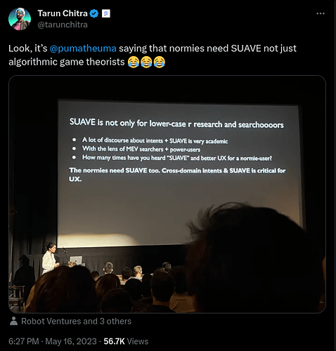
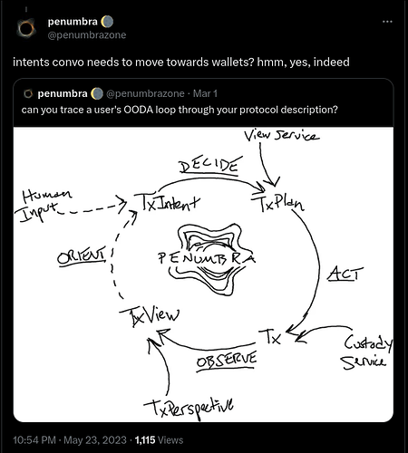
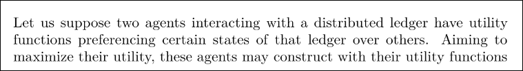
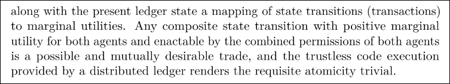
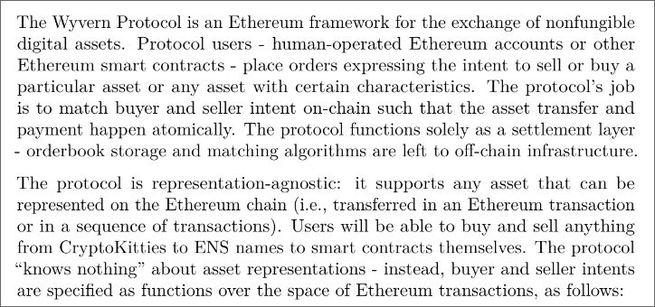
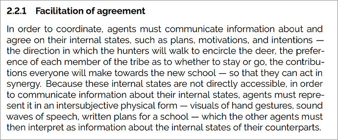
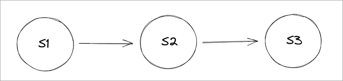
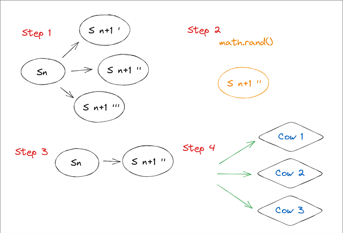
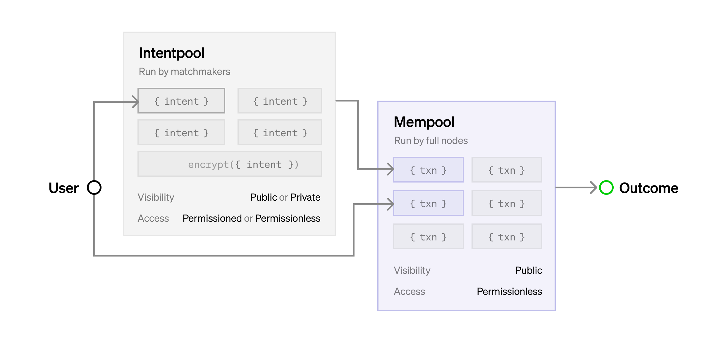

**tl; dr**

- Intents can be understood colloquially as _commitments to user preferences over the state space_ and mathematically as _atomic information flow constraints_.
- In a practical sense, intents:

1. Only make sense in a multi-party context.
2. Represent some kind of non-deterministic computation in a complexity theory sense (there may be more than one possibly acceptable state).
3. In order to be concretely efficient, must only refer to and constrain a small subset of the entire state space which the user is interested in.

- An _intent-centric architecture_ (such as Anoma) organizes all of the internal components and their structure on the basis of this mathematical concept of an intent.
- Intents aren't magic - in a sense, they're primarily a reconceptualization of how we understand what these kinds of distributed systems look like from the user's perspective, but they're a reconceptualization with many concrete implications for protocol design.
- Intentpools will require P2P network designs capable of expressing and accounting for heterogeneous roles, instead of assuming that all nodes are exactly equal as most current mempool designs do.
- Ultimately, the power in well-designed distributed systems rests with the users. If users select carefully to whom to send their intents, measure what goes on in the network, and reward good behavior, they will retain control over the incentive equilibria - and if they don't, no protocol design can change all that much.

## Introduction

"Intents" are in vogue, but in the Discourse the concept remains a wee bit ethereal, eluding attempts at concrete characterization. Intents are everything, nothing, and each point in between. I've particularly enjoyed a few genres of take:

From the _fully automated luxury space communism_ wing:

Don't forget, _think of the users_:

From the _penumbral polity of protocol pragmatism_:

From the department of _reasonable skepticism_:

To which I can only respond

Finally, from the _MEV economic realist_ wing (or possibly Paradigm's secret underground LAN party), Quintus and Georgios wrote an article on [intent-based architectures and their risks](https://www.paradigm.xyz/2023/06/intents). This article does an excellent job of articulating the relation of "intents" to Ethereum's current architecture and ecosystem topology and describing some risks in transitioning to an intent-centric world. I write partially in (late) response to it, with the hope that the synthesis of an Ethereum-centric perspective and our own can illuminate possible paths forward and areas of collaboration. Let me start off, first of all, with why I think these paths might be interesting.

## Why intents?

Developing a new substrate for coordination in the ashes of the old involves a certain conceptual tension. We remain economically tied to the old order, yet must break free from its concepts and measures in order to articulate a clear idea of the new. To me, "intents" is useful as a _coordinating concept_ which can help us sail this space of sociotechnical transition and seek out smooth seas on the other side. I think we want a coordinating concept with three key properties: one which encodes a recognition of the _duality_ between the system and the world, one which possesses a certain _universality_ with respect to coordination systems, and one which guides a technical design philosophy of maximum _compositionality_. Let me break each of these down in turn.

First, _duality_. What a [protocol sees](https://barnabe.substack.com/p/seeing-like-a-protocol) and what a user sees are not the same. Users are not interacting with blockchain systems in order to provide job guarantees for protocol designers. Users interact with systems because they _want_ something, and they care only about whether or not the system can give them what they want. What they want may include not only directly measured outputs but also higher-level and over-time properties, such as fairness - but still, users care about _outputs_ and _properties_ of the system, not the implementation details of the interior. When you invoke the Solidity compiler, you want output EVM bytecode which (a) correctly implements the semantics of your program and (b) consumes as little gas as possible. Unless you know some optimization that the Solidity compiler does not, specifying an exact sequence of EVM bytecode operations would be both time-consuming for you and suboptimal for your program compilation, since it would restrict the freedom of the compiler to find potentially more efficient sequences which still implement your program correctly. As a concept, "intents" takes this intuition of duality already present in compilers and applies it to distributed coordination systems themselves. Just as a high-level language compiler provides mechanisms which allow attention and time-constrained programmers to control complex hardware machines without concerning themselves with all of the low-level details, intents allow resource and knowledge-constrained users to reason about the behavior of a complex distributed system, and ensure that it aligns with their intentions without concerning themselves with all of the low-level details.

Second, _universality_. Articulating, matching, and settling the intentions of the participants is simply what coordination systems _do_. We owe the preconditions of our existence to the OG decentralized coordination system - language - and language operates on the basis of [discursive commitments](https://www.hup.harvard.edu/catalog.php?isbn=9780674543300) - intents _par excellence_. In using coordination systems, users seek the ability to express what they want, discover others with whom they can cooperate, and agree on a plan which utilizes their joint capabilities to realize a particular future. Properly articulated, a theory of intents can allow us to describe what systems _do_ from the perspective of a user, as opposed to what they look like from the inside. In this sense, an "intent" is not specific to blockchains. In interacting with the American dollar and legacy financial superstructure, for example, we also have intents, just a much more restricted range of choices. A theory of intents can help us move towards clearly articulating the question of "what do we want our economic system to do", only with which we can choose a configuration of protocols and culture that best suit our needs. If "duality" corresponds to the _soundness_ of an intent system (a user can express an intent with confidence that the execution of the system will be in fact constrained in the way that the intent describes), then "universality" corresponds to the _completeness_ of the intent system (an intent system allows anything a user might want to express for the purposes of coordination, because the most a user can ever do is express their intent).

This universality also helps illuminate what protocols, tokens, and language _can't_ do:

Indeed.

Third, _compositionality_. If working on distributed systems has taught me one thing, it is that distributed consensus is damn expensive, and distributed consensus on a _distributed consensus protocol_ doubly so. If we had an infinite time horizon, perhaps we'd manage to finally reach agreement on the one true serialization scheme (it is definitely not [any](https://github.com/cosmos/amino-js)[of](https://ethereum.org/en/developers/docs/data-structures-and-encoding/rlp/)[these](https://borsh.io/)), but we don't. As Moxie put it, [the ecosystem is moving](https://www.youtube.com/watch?v=Nj3YFprqAr8), and the existential risk we face is not that we'll fail to develop a correct set of protocols eventually, but rather that we won't do it _in time_. Open source and building in public provides the prerequisite context for efficient ecosystem collaboration, but alone it is insufficient, for we still end up with a plethora of protocols which are ever-so-slightly incompatible with each other because they make ever-so-slightly different design assumptions the effects of which ripple downstream. Similar concepts go under many names - [modular blockchains](https://celestia.org/learn/basics-of-modular-blockchains/modular-and-monolithic-blockchains/), [dependency inversion](https://en.wikipedia.org/wiki/Dependency_inversion_principle), [denotational design](http://conal.net/talks/denotational-design-lambdajam-2015.pdf) - but whatever you call it, intent-centricity _as a philosophy of software design_ offers a way out of this coordination conundrum, because minimalist intent-centric software components compose _automatically_, without any coordination or even communication necessary on the part of the software designers.

So, duality, universality, compositionality - quite the laundry list - but wait...

## What are intents?

Theory time. Let's start from the top: in the context of our design domain of discrete information systems, what _is_ an _intent_?

Quintus and Georgios define an intent (informally) as _a signed set of declarative constraints which allow a user to outsource transaction creation to a third party without relinquishing full control to the transacting party_. I think this definition describes how intents work with existing blockchain infrastructure, which was designed to work with transactions, very well: a third party can create transactions on behalf of the user, and a signed intent can give them the freedom to choose the execution path while still respecting user-defined programmable constraints. However, I do not think it captures the essence of the concept.

I have a confession to make: I've used the word "intent" for a long time, but I haven't been entirely consistent. Initially, it didn't strike me as a particularly important word - it just seemed like a way to describe why users would bother to use distributed ledgers in the first place. As part of writing this article, I trawled a bit through the history, and the earliest written mention I found was 2018:

Here, "intent" refers to the underlying user preferences, not a precise technical component (intents are "expressed by" orders), and the protocol handles only settlement (counterparty discovery is left to "off-chain infrastructure"). Let's say that the first component is "commitments to preferences".

After launching Wyvern, I didn't keep working on intent systems design - at the time, there wasn't much interest in the Ethereum ecosystem, and I thought blockchain systems would need to facilitate political polycentrism, so I instead went to work on Cosmos and IBC. I also kept tabs on Zcash (earlier, I'd written a block explorer), since it seemed like blockchain systems would also need privacy. I've always found it a bit tragic that these three ecosystems have remained so separate - in part, Anoma aims to offer a synthesis, and do our part to help knit the communities together.

Anoma comes at this question from an opposite but complementary angle: coordination -

I find philosophical language personally helpful for reasoning about systems, since it can capture the common shapes of relations shared by many different specific instances, but I've also found that it lacks the precision of mathematical definitions, without which agreeing on what exact protocols to actually run can be quite tricky.

In that spirit, mathematically, I understand intents as _atomic information flow constraints_. By authoring an intent, a user can describe which future information flows are compatible with their preferences, often including disclosure of information or authorization of state changes contingent on disclosure of information or state changes from or by other users. Intents can be understood, equivalently, as functions which define what histories are allowed to include them. Implicitly, intents commit a user to accepting future histories including and consistent with their intent, as these histories will be compatible with their preferences insofar as those were expressed in the intent itself.

This definition is still awfully abstract, so I think it's helpful to illustrate by construction. Imagine a world - let's call it [Spherical Cow Land](https://en.wikipedia.org/wiki/Spherical_cow). This world has some cows (no, not [that sort](https://cow.fi/)), and these cows want to coordinate:

In this world, there are:

- Some number of agents (the cows) _A_i_, indexed by _i_.
- An external reality which they can measure and take action in. Actions could include moving, kicking, mooing, etc. - typical cow shenanigans. We can understand these measurements and actions as messages sent to and received from the world.
- A magic intent computer with instantaneous encrypted messaging to all agents (cows).

This magic intent computer takes a progression of states over time.

- Each state _S_ contains _i_ partitions, each of which is the partition tracking what is known by cow _A_i_ (these partitions may include pointers to common state known by multiple cows which doesn't need to be repeated).
- The history _H_ is a succession of states: _H : List S_
- An intent _I_ is a relation over the history and new state: _I : H -> S -> 0 | 1_.

Each cow can send intents to the magic intent computer whenever they like. Periodically, at some internal clock rate, the computer performs an update action with the following steps:

1. Calculate the Pareto-efficient frontier of new states which include as many received intents as possible.
2. Randomly pick a new state from this frontier.
3. Append the new state to the history.
4. Send messages to all cows who have learned new information, according to the state partitions.

For illustration, think of the progression of intent computer steps in terms of who knows what. Atomically, with the processing of each batch of intents, cows learn new information:

Now, nothing constrains the cows to actually acting based on this information. The intents, state, and intent computer processing rules (just as for any computing system) are purely _syntax_ - they have no necessary _semantics_, or correspondence to the world. However, this system of intent computation has some very nice game theoretic properties. Informally, any state mutually preferred by any subset of the cows who can themselves enact the actions required to reach that state can be reached by the intent computer if the cows express their preferences as intents. The intent computer can also model physical constraints - for example, uniqueness and linearity of physical resources. See [this paper](https://arxiv.org/pdf/2204.03484.pdf) for a further formal exposition.

Now, in tandem with this intent computer, the cows can build a _culture_ - of semantic relations between the state, measurements, and actions in the world, of expressing their preferences as intents, and of adherence to the conditional commitments to action expressed in their intents. This last part is particularly important - as of course, any cow who previously committed to say "moo" can choose not to - but this contradiction in word and deed will be visible to the other cows, who can socially ostracize the violator. The intent computer itself, just like a written constitution, statute, or legal precedent, possesses no force except that which is granted by cultural interpretation. In modern culture, we conceptualize this notion of adherence as the "rule of law".

## Realizing an intent computer

In this construction, we relied on a magical intent computer, which can communicate with all agents instantaneously, search through the space of possible solutions instantly, and return the best one (by some definition) immediately. This instantaneous intent computer doesn't really exist - it would violate several physical laws - but when we build blockchain systems, in a sense we are trying to approximate it: the fairer and faster the communication, the deeper and wider the search, and the more mutually satisfying the solution, the better.

In theory, there is really only one problem: time, or the physicality of computation. There is no such idealized intent computer - rather, the approximations must be physically instantiated in a particular location and with particular operators, who cannot in general prove that they have behaved perfectly, and could go offline. Often, in blockchain systems, we make this role distributed and fault-tolerant using consensus protocols. There is no one-size-fits-all solution to consensus, because it depends on the physical details and semantics of the applications - who is using them? where are they? what latency and security do they need? etc.

In practice, there are cryptographic questions - how can we instantiate this information flow control? When are certain primitives most appropriate? What security assumptions are we willing to make about the capabilities available to potential adversaries? Different folks may be willing to make different assumptions here, but there are some that are pretty universal, at least at the moment - if P = NP, for example, we'd all better head back to the drawing board.

Physical computers have an _architecture_ - a specific way of organizing subcomponents into a structure designed to serve the purpose of the overall system. There can be many different architectures with the same purpose - they might differ in the components, the design of internal abstractions, and the structure of their composition. Anoma is an _intent-centric_ architecture for this sort of intent computer - which might prompt the question...

## What is an intent-centric architecture?

An _intent-centric architecture_, as Anoma understands it, uses this concept of an intent to organise all of the internal components: each interaction with a subcomponent describes an atomic operation and information flow constraints, but the choice of exactly how to perform the operation is made by the subcomponent itself.

Two concrete examples:

- P2P routing: Anoma's P2P routing system works on the basis of cryptographic identities. In order to send a message, you specify the public key(s) of the recipients who should receive it, information flow constraints around who you do or do not want to learn any metadata during routing, and preferences concerning bandwidth usage, latency, etc. With this description, the P2P intelligence engine figures out _how_ to actually send the message, including physical addresses (IP), intermediate hops, redundant paths, etc, while satisfying the provided constraints.
- Execution: Anoma's transaction execution system works on the basis of declarative specifications of what keys transactions might read and write and a requirement of serializability. With this description, the execution engine figures out _how_ to actually run each transaction, balancing them between many parallel processors, while satisfying the provided constraints.

Fully realized, an intent-centric architecture as defined in this way has two interesting properties. First, an intent-centric architecture is _maximally modular_: as interfaces with subcomponents specify only exactly the observable behavior necessary, new implementations of those subcomponents can always be swapped over time (e.g. new, faster ZKP systems). Second, for a particular scope of problem, an intent-centric architecture is _unique_: there is only one. Further exposition and formalization of these properties is an area of active research.

There are many roads to Rome. Lots of fine folks are working on infrastructure for intents these days - [Skip](https://skip.money/), [Essential](https://blog.essential.builders/introducing-essential/), [Agoric](https://agoric.com/), and [PropellerHeads](https://www.propellerheads.xyz/), to name a few - and others are working on specific intent application verticals - [CoW Protocol](https://cow.fi/), [Penumbra](https://penumbra.zone), and [Seaport](https://github.com/ProjectOpenSea/seaport), for example. Anoma takes this fully general road because we can and because we think someone should. I think inductive (specific) and deductive (general) approaches pursued simultaneously in a culture of open research are very complementary, as they can use each other for test data, guidance, and theoretical consistency checks.

One fruit of the inductive approaches so far is an excellent set of implementation constraints, concerns, and pitfalls to avoid. I think these have been best synthesized in Paradigm's post, and I want to address several topics they bring up in particular.

## Intent-pools and false dichotomies

Georgios and Quintus focus in particular on the concept of an "intentpool" - how exactly will these intents be gossiped around?

> In the absence of the Ethereum mempool, intent system designers are now faced with some design questions. One high-level decision is whether intents will be propagated to a permissioned set or be available in a permissionless manner so that any party can execute the intent.

As they visualize it:

I think there are two primary dichotomies in play here. The first is the dichotomy between _public_ and _private_ intentpools. I understand _public_ as they describe it to mean that any node can join and see the intents, and _private_ to mean that only specific pre-authorized nodes can see the intents. The second is the dichotomy between _permissioned_ and _permissionless_ intentpools. I understand _permissionless_ as they describe it to mean that any executor (specific party involved in intent settlement) can execute any intent, and _permissioned_ to mean that only specific pre-authorized executors can execute the intents. Used in this sense, a _private_ intentpool is also implicitly _permissioned_, as executors who do not see the intents cannot execute them. Another dimension of permissioning not explicitly covered in their post is is also important: _submission_ - where we could say that anyone can submit intents to an intentpool with _permissionless submission_, while only a specifically designated set of parties can submit intents to an intentpool with _permissioned submission_. Let's put this all in a table of possible configurations:

<table>
<thead>
<tr>
<th>Intentpool type</th>
<th>Who can submit intents?</th>
<th>Who can see intents?</th>
<th>Who can execute intents?</th>
</tr>
</thead>
<tbody>
<tr>
<td>Permissioned submission, private, permissioned execution</td>
<td>Specific parties</td>
<td>Specific parties</td>
<td>Specific parties</td>
</tr>
<tr>
<td>Permissioned submission, private, permissionless execution</td>
<td>Specific parties</td>
<td>Specific parties</td>
<td>Anyone (who can see the intents)</td>
</tr>
<tr>
<td>Permissioned submission, public, permissioned execution</td>
<td>Specific parties</td>
<td>Anyone</td>
<td>Specific parties</td>
</tr>
<tr>
<td>Permissioned submission, public, permissionless execution</td>
<td>Specific parties</td>
<td>Anyone</td>
<td>Anyone</td>
</tr>
<tr>
<td>Permissionless submission, private, permissioned execution</td>
<td>Anyone</td>
<td>Specific parties</td>
<td>Specific parties</td>
</tr>
<tr>
<td>Permissionless submission, private, permissionless execution</td>
<td>Anyone</td>
<td>Specific parties</td>
<td>Anyone (who can see the intents)</td>
</tr>
<tr>
<td>Permissionless submission, public, permissioned execution</td>
<td>Anyone</td>
<td>Anyone</td>
<td>Specific parties</td>
</tr>
<tr>
<td>Permissionless submission, public, permissionless execution</td>
<td>Anyone</td>
<td>Anyone</td>
<td>Anyone</td>
</tr>
</tbody>
</table>

While these distinctions are conceptually workable, they do not actually map to real systems. The Ethereum mempool is not permissionless. Rather, it is permissioned to anyone who holds enough ETH to pay for gas fees for a particular transaction. That set of potential transaction authors is quite dynamic, but it is still a permissioned set, just with a complex update function (the EVM state transition function itself). Truly permissionless systems do not exist in the real world, because they have no way to prevent DoS. The difference between the permissioning of the Ethereum mempool and the permissioning of someone's API is merely the distribution function of the tokens providing authentication.

I think there are two important points to note here. First, these three dimensions are not binary choices, but rather spectra. On the most permissioned end, a given intent pool might have, say, only one designated executor. On the most permissionless end, anyone can execute. Many interesting points lie in between: any executor staking a certain token, any executor with such-and-such an execution history, any executor within a particular executor DAO, just to name a few examples. Permissioning of submission and visibility of information, similarly, are spectra, and many points in between the two extrema may be compelling for different specific application needs.

Second, and more fundamentally, I think there is a subtle, implicit assumption in play here: that whether a system is permissionless or permissioned and private or public is a choice made by the intent system or intentpool designer. I do not think this assumption holds. At an operational level, intents are just messages sent between peers. What messages to accept (submission permissioning) and who to allow to read them (privacy) are choices made by individual nodes, not intent system designers. What executors to allow to execute an intent is a choice made by intent authors, since intent authors define the validity conditions of settlement. These choices by intent authors and P2P node operators may be informed by software defaults, but ultimately they will be dictated by cryptoeconomic equilibria.

Let's talk a bit about how Anoma's intent gossip system actually works. In order to do this, it will be helpful to first introduce the concept of _roles_. In distributed systems, there are many individual nodes, each of which can receive and send messages, store data, perform computation, and provide attestations (signatures). The way in which they do so often takes particular patterns, and many of these patterns are expected to be adhered to in order for the system to work as designed. For example, one very common role in proof-of-stake systems is that of a _validator_. Validators are expected to receive most messages for a particular chain (blocks, transactions, and votes), sign and send around their votes according to particular consensus logic, and typically execute the transactions (so they can sign, say, only valid blocks).

Considering just the peer-to-peer networking part, a role is defined by what messages a node wants to receive and send. Nearly all blockchain P2P networks in existence assume that all participating nodes take the same role - that of full node, or validator - and that they want to receive and send all messages. This assumption may make sense for a P2P network intended to relay transactions between full nodes and validators who are all supposed to be processing all of them, but it does not make sense for a P2P network intended to relay intents, for two reasons:

- First, there will be a _lot_ of intents. Many - perhaps most - intents will never be matched and make their way into transactions - they'll just be gossiped around for awhile, then expire. This is intentional - broadcasting intents should be cheap - but it makes P2P designs where all nodes receive all messages economically unworkable.
- Second, most nodes are probably not interested in most intents. Receiving and processing messages costs energy, and nodes will only want to receive and process messages when they have some reason to expect that doing so will be of benefit to them - perhaps through fees, through later payment from a community, through reciprocity with friends, etc. - whatever the specifics are, nodes will want to be able to express preferences about what intents they want to receive, and share those preferences with the network so that they receive only intents they want to process.

Anoma's approach is to standardise the protocol and make these roles explicit in descriptions of preferences for what kinds of intents each node wants to receive, and what commitments they are willing to make about processing those intents (e.g. signing blocks). Application-specific intent systems such as CowSwap and Penumbra fix a particular topology of certain roles as part of the architecture. For example, in Penumbra, the roles of gossip, ordering, solving, and execution all coincide - the same nodes are performing all of them. In CowSwap, intents are submitted to a single relayer, which compares solutions sent by different solvers, then periodically sends the best to Ethereum in a settlement transaction. Different specific topologies will make sense for different application designs and goals. Anoma aims to make these toplogies of roles explicit and programmable, and let different users, applications, and communities experiment with what configurations make most sense for them. For more details on how Anoma's P2P layer is instantiated, please see [the recent paper](https://arxiv.org/pdf/2306.16153.pdf).

## Order flow, trust, opacity, oh my

Georgios and Quintus bring up three particular risks they see in adoption of intent-centric infrastructure: order flow, trust, and opacity. I will address each of these in turn.

### Order flow

> _If intent execution is permissioned and the permissioned set is not chosen with care, the migration out of the public mempool threatens to centralize block production on Ethereum._

Ultimately, intents originate from users, and users must choose where to send them, perhaps with assistance from software such as a smart wallet which can perform appropriate measurements and calculations on a user's behalf. There will be profit-seeking operators, and those operators will seek to maximise their exclusive order flow. Users, or software acting on their behalf, must measure and track the execution of the user's intents on the network, and users must be willing to exercise their freedom of choice to switch away from extractive operators (or, ideally, threaten to do so in a sufficiently credible way that actual churn is not necessary). Intents have network effects, so users must also coordinate with other users in order to atomically switch between operators. I like to refer to this process as the ["slow game"](https://www.youtube.com/watch?v=PUBvZRhOTAo).

### Trust

> _As many solutions require trust in intermediaries, development of new intent-based architectures is hampered by high barriers to entry, implying lower rates of innovation and competition to ensure execution quality._

I share this concern, but I think what shape the network topology takes is largely dependent on what topologies of trust the protocol itself can model. Ethereum wallet users have only a choice of web3 RPC provider, and the protocol can only represent economically anonymized, large-scale trust relationships (holding ETH or being trustworthy in the "Ethereum community"), so trust in RPC providers is difficult and time-consuming to build. Anoma's approach is to rather standardize the protocol in a way which can model a diversified set of trust relations. Instead of sending to public RPC providers, users would send to their friends, or local community pools, at least as a first try. These trust relationships can be tracked and accounted for, making trust explicit and partially liquid (to the degree desired), but doing so requires a plurality of assets, since trust is plural. Making local node operations feasible requires standardised software designed for configurable roles - you can run an Ethereum node for your friends, but there's no way in the protocol to express what messages you do and don't want to process and how. Of course, if users all choose to send their intents to the Coinbase mega-solver, no protocol can stop them from doing that - the most that we as protocol designers is make the switching costs low and the slow game explicit.

### Opacity

> _As many intent architectures entail the user surrendering some control over their on-chain assets and permissioned mempools imply a degree of impenetrability from the outside, we risk building an opaque system in which it is unclear how or whether users’ expectations are met and threats to the ecosystem remain undetected._

Intents define their own conditions of settlement and thus control the boundary conditions of what routing can happen inside the network and what information must be disclosed back to the user. For example, an intent can require a chain of valid signatures from each gossip node, starting with the user and ending with the validator set. An intent can require that solvers processing it encrypt certain information about their solving process to a third party, who can homomorphically combine it and decrypt aggregate statistics periodically for network health monitoring (e.g. assets held in different security domains). We sometimes describe intents in Anoma as providing _programmable privacy_, but perhaps _programmable disclosure_ is a better term. The importance of network health monitoring is one reason I think programmable disclosure is so important. Precise control over information flow isn't an optional feature of intent systems - it is table stakes.

These arguments are not, of course, mathematically exact, and they risk getting caught up in semantic disputes. Rather than drill down each time, I think it is better to offer a proof by construction, which we plan to do our part to offer with the [Anoma RFC](https://anoma.net/rfc) soon. If you're willing to accept my arguments for the sake of the hypothetical, however, you might be wondering - in an intent-centric world, what will happen to the blockchains?

## Heterogeneous security and the end of supply-side blockchain economics

Right now, our industry operates on the basis of a world-model one might call _supply-side blockchain economics_: organised groups raise large amounts of capital to launch new chains (recently rebranded to "rollups"), then dribble it out to application developers expected to build on top. Demand (say, for blockspace) is implicitly expected to follow supply. Without conducting a thorough analysis, I attribute the dominance of this world-model to the concordance of two factors: first, an understanding of _platforms_ as the primary value capture sink, malappropriated from Silicon Valley and FAANG corporate economics, and second, the network effects and observable power law of _assets_, measured most commonly in USD price. The observed power law is attributed to some kind of platform-ness and everyone tries to build new platforms and convince applications to use them (and in doing so bring transaction fees to the platform). In the short term, this even appears to work, because we're almost all still dependent on fiat capital, and because speculative markets lend themselves to self-fulfilling prophecies.

An intent-centric conception flips this model on its head. Intents are _demand_ - they come from users who want something in the world, and what they want typically isn't to fill the coffers of platform operators. Users care about hand-grown organic blockspace just about as much as they care about hand-grown organic Excel cells. Now, users want blockspace that follows the consensus rules, that won't be reverted, and that is efficient for interactions with the other users and assets with which they want to interact - but these are constraints, not an affinity. Intents, more often than not, will express many validator sets which the user is just fine with, and a preference for low costs. Selection will happen just before settlement, and supply will follow demand. Validators are competing on _trust_, _access_ (since different assets are used to gate blockspace), and _latency_, since private keys are physically located somewhere. The computational cost differences will be marginal.

Zooming out on the history of blockchain systems, I think one can understand it as the unbundling of _protocols_, _security models_, _histories_, and _communities_. The word "Ethereum", for example, is commonly used to mean four things:

- A _protocol_ (the EVM), which supports smart contracts.
- A specific _security model_ (Gasper) with a validator set.
- A _history_, including a nominal _asset_ (ETH).
- A _community_ of people who self-identify as members.

A _history_ and a _community_ are tightly coupled: many members of the community have taken actions tracked in the history and many hold the nominal asset. Occasionally, the community can get away with small changes to the history (the DAO bailout), but large changes are politically impossible (imagine what would happen if Vitalik wrote a long, well-reasoned blog post arguing that half of all ETH balances should be deleted).

_Histories_, _protocols_, and _security models_, however, are not coupled at all: one can copy the protocol but start with a new history, and perhaps change the security model (most EVM rollups), or copy the history, but change the protocol (most Ethereum main chain upgrades), or copy the history and protocol, but change the security model (the Ethereum Merge).

The history of blockchain praxis starts with Bitcoin, which was a _protocol_, _security model_, _history_ (with BTC), and _community_ all rolled into one glob, both in the popular understanding and in the actual `bitcoind` client software architecture. In the years since then, new projects, cleaner software architecture, and improved understanding have gradually unbundled these concepts. Understood through this lens, for example, the network effects of _protocols_ and of _assets_ are related but distinct, as both can persist and change independently of the other.

I understand intents as the next and perhaps final step in this unbundling. Intent-centric applications follow a protocol, but the choice of history, community, and security model is up to the user and can be chosen afresh with each new intent, even programmatically in the intent itself. Intent-centric architectures are the dual of [scale-free money](https://pluranimity.org/2022/09/26/towards-heterotopia/) - with the network effects of assets and protocols unbundled, protocols will be competing on capability and efficiency, and assets will be competing on fairness of distribution and effectiveness of public goods funding.

Enough philosophy (until next time). Thanks for reading!

_Thanks to several folks in and outside Heliax for feedback on this article. All errors and criminally hand-wavy mathematical arguments remaining are my own._
