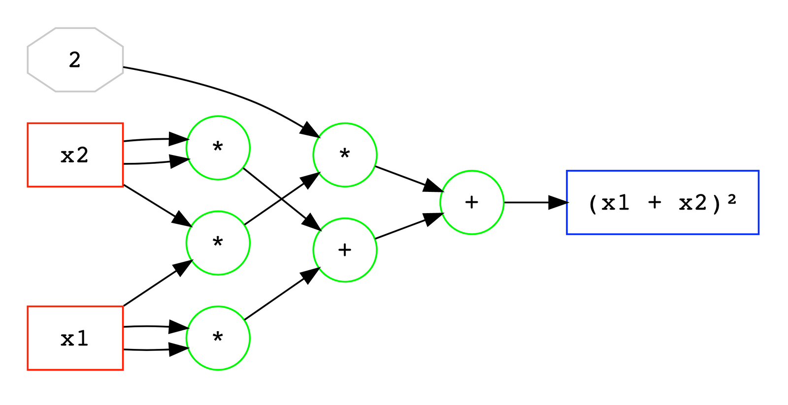
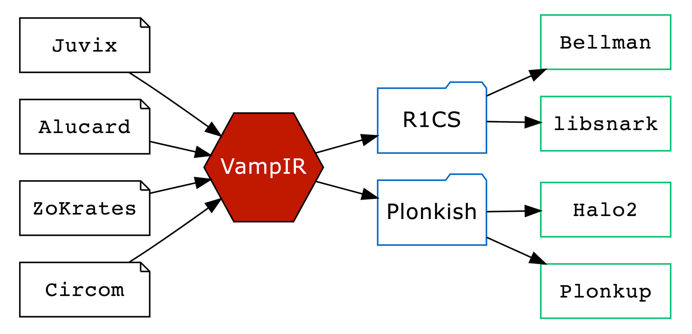
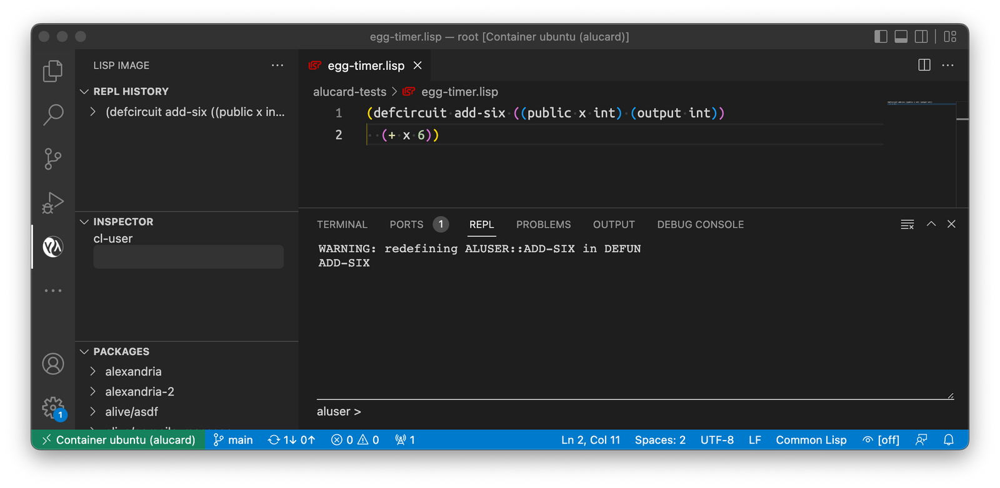
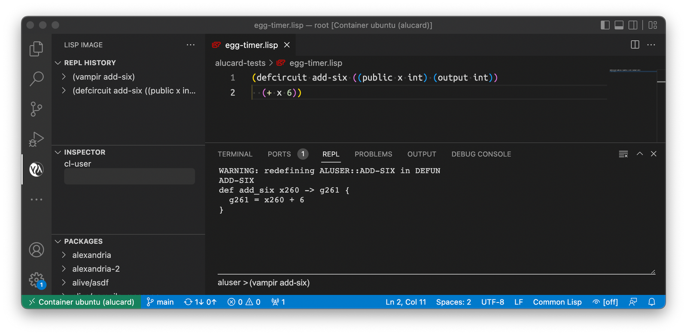
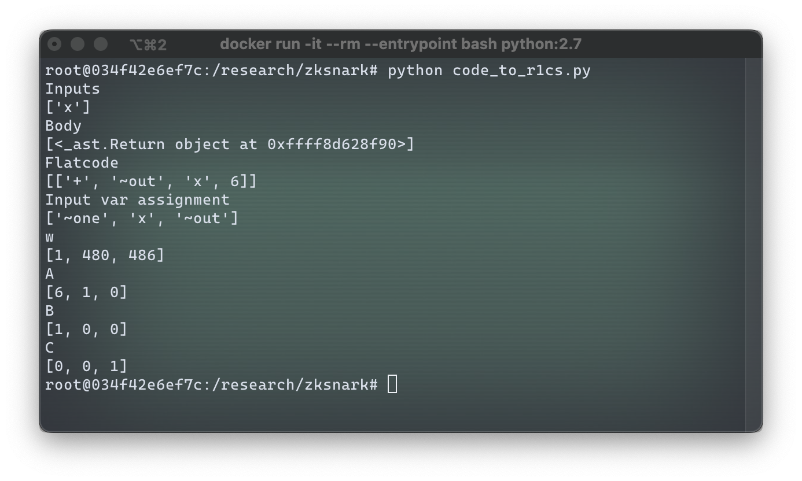
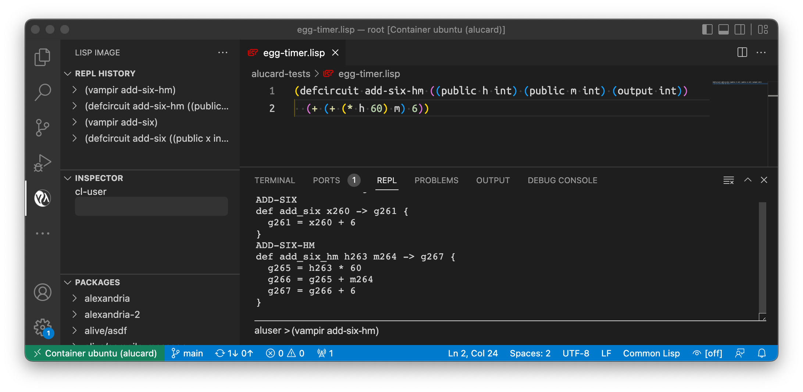
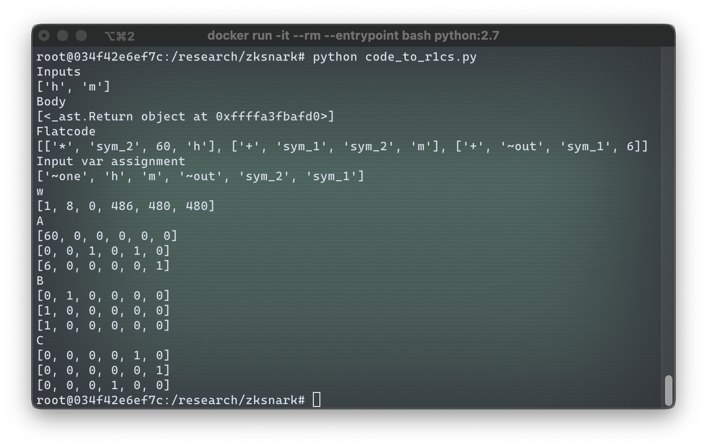
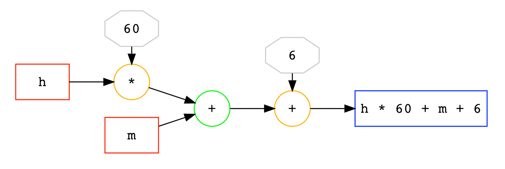
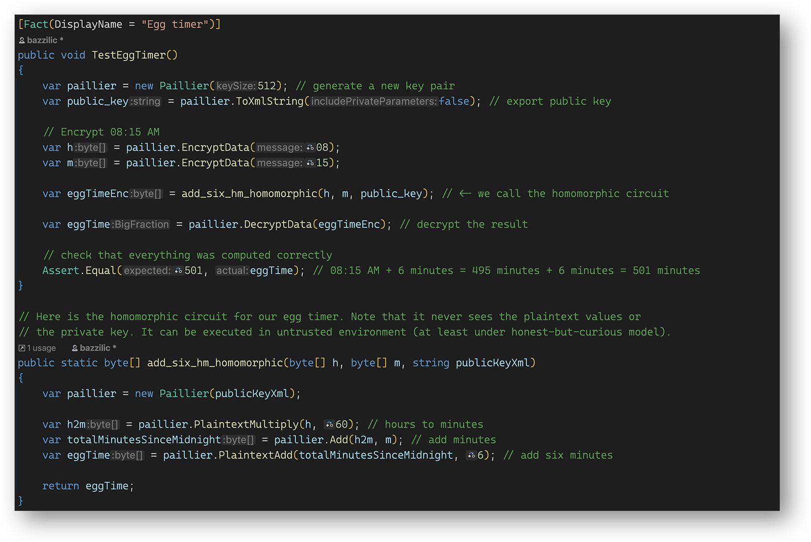

This blog post is intended to give a primer on the concept of arithmetic circuits that is gaining a lot of attention lately with the rise in the popularity of zero-knowledge proofs. We will take a look at what arithmetic circuits are, what they are used for, what tools are there for working with them, including the tools we develop here at Anoma, and what we can do with the circuits using these tools.

---

### What are arithmetic circuits

Arithmetic circuits come to us from a field of research called "computational complexity theory" (CCT), and are used as the standard model for computing [polynomials](https://en.wikipedia.org/wiki/Polynomial). An arithmetic circuit is an abstract concept, but it operates similar to a [logic circuit](https://en.wikipedia.org/wiki/Logic_gate): it takes variables and numbers as inputs, which go through arithmetic gates such as "add" or "multiply", like on the image below.Red boxes are input variables, grey octagon is a constant, green circles are operation gates, and a blue box on the right is the output.



An arithmetic circuit like that can be hooked up to other arithmetic circuits, in that case output of one circuit becomes an input of another, and the circuits themselves can be seen as "gates". In CCT, arithmetic circuits are used to reason about the complexity of computing polynomials. Lately they also gained immense popularity in a somewhat adjacent world of "proofs of computation" and its biggest practical application today – zero-knowledge proofs and, in particular, zkSNARKS.

### Arithmetic circuits in Anoma

Anoma, at its core, is strongly privacy-oriented. This is why a lot of our research and development is centered around the zero-knowledge toolkit and homomorphic cryptosystems, which are all closely tied to arithmetic circuits.

The two main tools will help us work with arithmetic circuits in this article are Vamp-IR, a target-agnostic internal representation (IR) language for arithmetic circuits; and Alucard, a Common Lisp-based DSL for writing arithmetic circuits.

<figure>
  
  <figcaption>This <s>vampire</s> perfectly regular cat is the mascot for the project</figcaption>
</figure>

Vamp-IR can be colloquially described as an "LLVM for arithmetic circuits". It is not intended for people to write directly in Vamp-IR nor execute Vamp-IR code. Rather, other languages (such as Alucard or Juvix) can compile to Vamp-IR, and Vamp-IR can further compile to various targets (e.g., Plonkup or Bellman).



When we say that Vamp-IR is target-agnostic, we mean that it aims to capture _only_ the intention of the circuit, without making any concessions to any particular proving system or any specific constraint system, to which Vamp-IR code can be further compiled. That way, circuits written in Vamp-IR can compile to either [R1CS](https://www.zeroknowledgeblog.com/index.php/the-pinocchio-protocol/r1cs) or [QAP](https://medium.com/@VitalikButerin/quadratic-arithmetic-programs-from-zero-to-hero-f6d558cea649), vanilla Plonk, Plonk with lookups, Plonk with custom gates, or any other constraint system. You can find much more information on Vamp-IR [here](https://specs.anoma.net/master/architecture/language/j-group/vampir/vampir.html) or by watching [this video](https://www.youtube.com/watch?v=KzXTu50-qIQ&feature=youtu.be).

In this blog post, we will write circuits using Alucard, our homebrew language designed specifically for writing zero-knowledge proofs and, therefore, arithmetic circuits. It is in active development and is already quite feature-rich: you can comfortably write Alcuard code in Emacs or VS Code while enjoying REPL, syntax highlighting, debugging, and compilation to Vamp-IR. You can find more info on Alucard [through this link](https://hackmd.io/emeUBiYoSqmJ95Ls2wsrMQ).

### Let's try it!

Our goal today is to trace a math function all the way from its pure mathematical form down to one of the standard representations of arithmetic circuits such as R1CS, and some less standard ones such as homomorphic circuit representation.

Let's start with something very simple, such as boiling eggs.I personally like it when the eggwhite is completely solid but the yolk is still a little runny. Extensive experimentation shows that optimal eggs are made when boiling time is 6 minutes exactly (look for the perfect eggs recipe at the end of this post). Now, _obviously_, we need to write a program that tells us when to turn off the stove.

Let's start with a very simple math function $f(x) = x + 6$. As any normal human (and definitely not a vampire), I count time in minutes passed since midnight. If I give the number "480" (8AM is 480 minutes after midnight) as an input to $f$, the function will return "486", which is when I should take the eggs off the stove. Perfect, let's implement this in code!

We will write our program in Alucard. If you want to follow along, you'll need to set up Alucard environment (see [this doc](https://hackmd.io/KTN_7tyGTe2RvJ5-aC4rBw)). Now, the Alucard program that implements our function $f(x) = x + 6$ is quite short:

```haskell
(defcircuit add-six ((public x int) (output int))
  (+ x 6))
```

`defcircuit` defines a new arithmetic circuit, which we will call `add-six`; it has a single public input `x`, which is an integer (number of minutes since midnight), and outputs an integer result of addition of `x` and 6, which in Alucard is written in [Polish notation](https://www.wikiwand.com/en/Polish_notation), i.e., operator first and then the operands: `(+ x 6)`. Here it is in the VS Code environment set up to work with Alucard:



Now our next step is to take the circuit that we defined in Alucard and compile it into Vamp-IR intermediate representation. This is very easily done in the REPL window by issuing a command `(vampir add-six)`:



This operation produces the following Vamp-IR code:

```haskell
def add_six x260 -> g261 {
  g261 = x260 + 6
}
```

Here you can see that Vamp-IR code is practically identical to Alucard code, minus the Polish notation; `x260` and `g261` are auto-generated variable names.

When we get to more complex functions later in this article, we'll see how Vamp-IR code is more low-level than Alucard and how it is much more convenient to write code in Alucard instead of directly writing it in Vamp-IR. One thing that we can note is that Vamp-IR, unlike Alucard, does not have types. Writing code in Alucard makes the code more robust as Alucard does the type checking for us.

So far, we went from defining a math function $f(x) = x + 6$ to implementing it in Alucard and then to compiling it to Vamp-IR. Our next step is to compile the intermediate representation into standard arithmetic circuit formats such as R1CS (Rank-1 Constraint System).

R1CS is designed to represent _a specific_ computation (i.e., a trace of execution for a given input) as a sequence of vector triplets $\langle A, B, C \rangle$, one triplet per line of Vamp-IR code, such that given a "witness" vector $w$ that represents the original input (let's say, 480 in our case), original output (in our case, 486), and some other values related to executing our program with given input, the following holds: $w \times A * w \times B = w \times C$ for every triplet, where $\times$ represents a vector dot product (scalar product). Each $\langle A, B, C \rangle$ triplet represents a single step in the generic computation algorithm, whereas the witness $w$ pins a specific execution on a given set of inputs.Witness does not only contain the inputs but _also_ all the intermediate states of the algorithm while computing on a given input, including the final state, i.e., the result of the algorithm.

As of the moment of writing this article, Vamp-IR does not yet have an operational compiler into R1CS, so instead we will use an [external tool](https://github.com/ethereum/research/tree/master/zksnark) that can compile arithmetic circuits into R1CS, which was written to accompany [this blog post](https://medium.com/@VitalikButerin/quadratic-arithmetic-programs-from-zero-to-hero-f6d558cea649). If you are following along, note that the tool requires Python 2 and doesn't work with Python 3. Here is the result of compiling Vamp-IR code into R1CS constraints for an input "480":



Since our program is very simple and has just one step (add 6 to the input), it is compiled to a single triplet of vectors $A=[6,1,0]$, $B=[1,0,0]$ and $C=[0,0,1]$. The witness for a particular computation of $f(480)$ is $w=[1,480,486]$. The first element of the witness is always a value "1" in R1CS; the second value in $w$ is the input variable, in this case it's "480"; then follow all intermediate values up to the final one which is the returned value – in our case we had no intermediate values, so the third and last element of $w$ is the return value "486". In some sense, the vector $w$ is the proof that we have actually executed the program that implements $f(x)$ – but this proof is not _zero-knowledge_, as we can clearly see the inputs and the outputs and all intermediate values.

Let's verify that witness $w$ indeed proves that we have executed the algorithm described by vectors $A$, $B$ and $C$. To do so, we need to verify that $w \times A * w \times B = w \times C$, i.e., verify that $[1, 480, 486] \times [6,1,0] * [1, 480, 486] \times [1,0,0] = [1, 480, 486] \times [0,0,1]$. Let's compute each scalar product:

$w \times A = [1, 480, 486] \times [6,1,0] = 1*6 + 480*1 + 486*0=486$
$w \times B = [1, 480, 486] \times [1,0,0] = 1*1 + 480*0 + 486*0=1$
$w \times C = [1, 480, 486] \times [0,0,1] = 1*0 + 480*0 + 486*1=486$

Finally, we verify that $w \times A * w \times B = 486 * 1 = 486 = w \times C$, and indeed this equation holds, therefore, witness $w$ proves that we performed the computation of $f(480)$ using our Alucard program. Note that the proof is tied to executing a particular program; if we computed $f(480)$ in some other way, we may not have been able to generate the witness $w$.

### A slightly more complex example

As I was writing this article, it came to my attention that some humans **do not** count time in minutes after midnight. While I find that unnatural, I am still going to make a version of the function $f(\cdot)$ that takes input time in form of hours and minutes (instead of just minutes).

We will define a new function $g(h,m) = h * 60 + m + 6$. It takes an input of number of full hours that gone by since midnight ($h$) and a number of minutes that have passed since the end of the last full hour ($m$) and adds 6 to that. It still outputs the time when the eggs should be taken off the stove in total minutes after midnight. While Alucard and Vamp-IR actually do support working with tuples and theoretically we can return time as a tuple $(h,m)$, we won't do that here for brevity.

Let's write our Alucard program that implements $g(h,m)$:

```haskell
(defcircuit add-six-hm ((public h int) (public m int) (output int))
  (+ (+ (* h 60) m) 6))
```

The program now has two input parameters of type `int`: `h` and `m` that represent hours and minutes, respectively.In the body of the circuit we again have our computation written in Polish notation: `(+ (+ (* h 60) m) 6))`, which can be decomposed as follows:

```haskell
(+
  (+
    (* h 60)
    m)
  6)
```

Operator `+` in line 1 adds `6` to the result of operator `+` in line 2. Operator `+` in line 2 adds `m` to the result of multiplication operator `*` in line 3. Operator `*` in line 3 multiplies `h` by `60`.



Vamp-IR code that is produced from this Alucard circuit contains exactly these three operations, as you can see in the screenshot or in the following listing:

```haskell
def add_six_hm h263 m264 -> g267 {
  g265 = h263 * 60
  g266 = g265 + m264
  g267 = g266 + 6
}
```

Here you can see that Vamp-IR code is actually much more low-level than Alucard code and it is much less tedious to write in Alucard – and more so the more complex programs we write. R1CS generated from this code will have three triplets of vectors $\langle A,B,C \rangle$, one per line of Vamp-IR code:



The R1CS triplets that were generated are:

|          $A$          |         $B$          |         $C$          |
| :-------------------: | :------------------: | :------------------: |
| $[60, 0, 0, 0, 0, 0]$ | $[0, 1, 0, 0, 0, 0]$ | $[0, 0, 0, 0, 1, 0]$ |
| $[ 0, 0, 1, 0, 1, 0]$ | $[1, 0, 0, 0, 0, 0]$ | $[0, 0, 0, 0, 0, 1]$ |
| $[ 6, 0, 0, 0, 0, 1]$ | $[1, 0, 0, 0, 0, 0]$ | $[0, 0, 0, 1, 0, 0]$ |

The witness is $w = [1, 8, 0, 486, 480, 480]$. As before, we can ensure that the witness proves that we have indeed performed the computation of $g(h,m)$ as it is implemented in our circuit `add_six_hm`. For the first triplet $\langle A_1, B_1, C_1 \rangle$:

$w \times A_1 = [1, 8, 0, 486, 480, 480] \times [60, 0, 0, 0, 0, 0] = 60\\$
$w \times B_1 = [1, 8, 0, 486, 480, 480] \times [0, 1, 0, 0, 0, 0]  = 8\\$
$w \times C_1 = [1, 8, 0, 486, 480, 480] \times [0, 0, 0, 0, 1, 0] = 480\\$
$w \times A_1 * w \times B_1 = 60 * 8 = 480 = w \times C_1$

The first triplet works! The second:

$w \times A_2 = [1, 8, 0, 486, 480, 480] \times [0, 0, 1, 0, 1, 0] = 0 + 480 = 480\\$
$w \times B_2 = [1, 8, 0, 486, 480, 480] \times [1, 0, 0, 0, 0, 0]  = 1\\$
$w \times C_2 = [1, 8, 0, 486, 480, 480] \times [0, 0, 0, 0, 0, 1] = 480\\$
$w \times A_2 * w \times B_2 = 480 * 1 = 480 = w \times C_2$

Second triplet works, so now on to the last one:

$w \times A_3 = [1, 8, 0, 486, 480, 480] \times [6, 0, 0, 0, 0, 1] = 6 + 480 = 486\\$
$w \times B_3 = [1, 8, 0, 486, 480, 480] \times [1, 0, 0, 0, 0, 0]  = 1\\$
$w \times C_3 = [1, 8, 0, 486, 480, 480] \times [0, 0, 0, 1, 0, 0] = 486\\$
$w \times A_3 * w \times B_3 = 486 * 1 = 486 = w \times C_3$

All triplets work, which means that this R1CS set $\left[w, \langle A_1, B_1, C_1 \rangle, \langle A_2, B_2, C_2 \rangle, \langle A_3, B_3, C_3 \rangle\right]$ indeed proves execution of `add_six_hm`.

### Even more complex circuits

If you have experience writing programs (for egg cooking or any other purpose), you can probably see many issues with our code for `add_six` and `add_six_hm` routines. We don't do any checks on the input values (what if someone tries to compute $g(25,63)$ or $f(-72)$?). We don't do any checks on the output: should the result of $g(23,55)$ be $1441$ or $1$?Lastly, for $g(h,m)$ we return the result still as a number of minutes since midnight instead of converting it back to hours-minutes format in one way or another. Given the same task, a good programmer using a regular language like Python would have probably written something like this:

```haskell
def add_six_hm(h, m):
    if h < 0 or h > 23 or m < 0 or m > 59:
        raise ValueError("Invalid time")
    m += 6
    if m > 59:
        h += 1
        m -= 60
    if h > 23:
        h -= 24
    return h, m
```

In this program, we validate the input against common sense constraints (so we don't have times like `92h -12m`), fail with an error if the input is invalid, and then return the result as a well-formed pair of hours-minutes. Doing things like that requires at the very least an ability to perform equality checks (`a == b`), greater-less comparisons (`a > b`), and conditional branching based on these checks and comparisons (`if ...: ... else: ...`).

While all that _is_ possible to do in arithmetic circuits, it is non-trivial and requires quite a bit of tinkering, so we won't go into that in this post. If you want to research this topic further, [this CS stackexchange post](https://cstheory.stackexchange.com/a/44148) is a good starting point.

### Homomorphic circuits

An attentive reader might have noticed that the original arithmetic circuit and its R1CS representation are not entirely equivalent. A circuit is an abstract program that can execute on any parameters, whereas R1CS is tied to a particular execution of the program with a specific set of input parameters.

In our research in Anoma we are always closely looking at privacy-preserving techniques, and among others we investigate _homomorphic cryptography_. What is it?

First, let's determine what is an encryption in general. Usually, we say that a _cryptosystem_ is a collection of several algorithms. At the very least, these algorithms are: key generation algorithm $\mathcal{K}$, encryption algorithm $\mathcal{E}$, and decryption algorithm $\mathcal{D}$. Some cryptosystems may have more. Encryption and decryption algorithms usually take two parameters each: encryption takes a _plaintext_ message (what we want to encrypt) and a key, and produces a _ciphertext_ (an encryption of the message); decryption takes a ciphertext and a key, and produces a plaintext. What is a key? A key is a piece of data generated according to algorithm $\mathcal{K}$ that separates different instances of the same cryptosystem: you can only meaningfully use algorithms $\mathcal{E}$ and $\mathcal{D}$ if you have the correct key.

Cryptosystems belong to two big groups: _symmetric_ and **\*a**symmetric* ones. Symmetric cryptosystems use *the same* key for $\mathcal{E}$ and $\mathcal{D}$; typical example of a symmetric cryptosystem is [AES](https://en.wikipedia.org/wiki/Advanced_Encryption_Standard). Asymmetric cryptosystems use separate keys, one is called a *public key* and is only used for **en**cryption, another is called *private key\* and is only used for **de**cryption; [RSA](<https://en.wikipedia.org/wiki/RSA_(cryptosystem)>) is a typical example of an asymmetric cryptosystem. Asymmetric cryptosystems allow for some interesting use cases that symmetric ones can't cover, for example: I can publish my public key (hence the name) without compromising the security of my private key, and anyone can encrypt a message for me that only I can decrypt.

Now, algorithms $\mathcal{E}$ and $\mathcal{D}$ are _projections_: $\mathcal{E}$ takes a message $m \in P$, where $P$ is a space of all possible plaintexts, and projects it onto its image $c \in C$, where $C$ is a space of all possible ciphertexts. $\mathcal{D}$ does the opposite. Some cryptosystems can also "project" some _operations_ from $P$ to $C$. Let's say there is an operation $f$ over one or several elements of $P$ with its results also being in $P$. We can denote that like this:

$$
f: \underbrace{P \times \ldots \times P}_n \rightarrow P
$$

We can say that the cryptosystem "projects" operation $f$ from set $P$ onto set $C$ if there exists an operation

$$
g: \underbrace{C \times \ldots \times C}_n \rightarrow C
$$

such that for any $a_1, \ldots, a_n \in P$, this equation holds:

$$
f {\color{red}(} a_1, \ldots, a_n {\color{red})} = \mathcal{D} {\color{blue}(} g {\color{red}(} \mathcal{E} {\color{orange}(} a_1 {\color{orange})}, \ldots, \mathcal{E} {\color{orange}(} a_n {\color{orange})} {\color{red})} {\color{blue})}
$$

Or, in simpler words, executing operation $g$ over encryptions of elements from $P$ results in an encryption of $f$ applied to these elements. Operation $g$ has the same effect on elements of $C$, as $f$ has on elements of $P$. We can do operation $f$ in space $P$ or we can jump into space $C$, do $g$ instead, then jump back to $P$ and have the same result. If sets $P$ and $C$ have this pair of operations $f$ and $g$ that behave like that, we say that there is a homomorphism from $P$ to $C$.

Operations that might interest us in application to arithmetic circuits are arithmetic operations such as addition or multiplication. Each of these operations takes two inputs in $P$ and produces one output also in $P$, so we can denote them as $P\times P \rightarrow P$.

Cryptosystems that have a homomorphism from $P$ to $C$ over one or several arithmetic operations are called _homomorphic cryptosystems_. Among those we can distinguish two main groups: _fully_ and _partially_ homomorphic. Partially homomorphic encryptions (PHE) support either only addition, or only multiplication. Fully homomorphic ones (FHE) support both, which makes it theoretically possible to execute arbitrary arithmetic circuits. We have known PHE cryptosystems since early 1970s, RSA being one of the first PH encryptions known to us. First FHE was developed only in 2009 (Craig Gentry's scheme).

The most important thing for us here is that homomorphic cryptosystems can enable _oblivious execution_ of arithmetic circuits: anyone and everyone can execute the circuit on any input parameters without knowing what the parameters were. This opens up great prospects for private computations on blockchain.

FHE systems are very complex, and they are also very slow. PHE ones are drastically faster and much simpler and easier to understand. Thankfully, there is Paillier cryptosystem (see [this PDF, page 51](http://hdl.handle.net/10012/3901)), a PHE that is perfectly suited for our task of measuring 6 minutes required to cook the perfectly boiled eggs.

The basics of Paillier encryption are:

- Public key is a set of two numbers $n$ and $g$; private key is a set of two numbers $\lambda$ and $\mu$.
- Encryption: for message $m$ and a random number $r$ (new random $r$ for every message), encryption is $\mathcal{E}(m) = g^m \cdot r^n \mod n^2$.
  Note that for encryption we only use the public key values $g$ and $n$.
- Decryption: $\mathcal{D}(c) = \frac{(c^\lambda \mod n^2) - 1}{n}\cdot \mu \mod n$.

Homomorphic properties of Paillier encryption include:

**Addition** of two ciphertexts $c_1 = g^{m_1}{r_1}^n \mod n^2$ and $c_2 = g^{m_2}{r_2}^n \mod n^2$. If we multiply the ciphertexts we get a valid encryption of $(m_1+m_2)$:

$$c_1 \cdot c_2 \mod n^2 = g^{m_1}{r_1}^n \cdot g^{m_2}{r_2}^n \mod n^2 = g^{(m_1+m_2)}(r_1r_2)^n \mod n^2$$

**Addition** of ciphertext $c_1$ and a _plaintext_ constant $k$. Multiplying $c_1$ by $g^k$ produces a valid encryption of $(m_1+k)$:

$$c_1 \cdot g^k \mod n^2 = g^{m_1}{r_1}^n\cdot g^k \mod n^2 = g^{(m_1+k)}{r_1}^n \mod n^2$$

Lastly, we can do **multiplication** of $c_1$ by a plaintext constant $k$. Exponentiating $c_1$ to the power $k$ produces a valid encryption of $(m1\cdot k)$:

$${c_1}^k \mod n^2 = (g^{m_1}{r_1}^n)^k \mod n^2 = g^{(m_1\cdot k)}({r_1}^k)^n \mod n^2$$

Note that Paillier does not support multiplication of two ciphertexts – otherwise, it would have been a fully homomorphic system. However, this set of capabilities is exactly enough for us to execute our egg timer circuit. Let's take a look at it again, now in a form of an actual circuit:



Red boxes `h` and `m` are encrypted inputs to our circuit, grey octagons `60` and `6` are publicly known constants. In the first operation `h * 60` (orange `*`), we use the ciphertext-plaintext multiplication feature of Paillier. In the second operation (green `+`), where we add `m` to the result, we use the ciphertext-ciphertext homomorphic addition. In the third operation (orange `+`), where we add `6` to the result, we use the ciphertext-plaintext addition feature.

All this looks great, let's implement this in code
! We will use a C# [implementation](https://github.com/aprismatic/paillier) of Paillier that I wrote for some of my previous projects. This implementation can do slightly more than what we discussed above, like _subtractions_ or work with negative and/or non-integer numbers. We won't need any of this today though. Here's the listing of our implementation of the egg timer circuit:



The circuit itself is in a separate method called `add_six_hm_homomorphic`. It takes three arguments: our old friends `h` and `m`, as well as the public key for the Paillier cryptosystem. We can't do homomorphic operations without knowing the public key. The `add_six_hm_homomorphic` method takes encryptions of `8` and `15` as parameters, instantiates a Paillier algorithm using the provided public key, then executes the circuit exactly as we described it in the circuit diagram above, and lastly returns an array of bytes that contains the encrypted result, which is supposed to be 8:21 AM expressed as number of minutes after midnight (which is 501 minutes).

In the test method `TestEggTimer` we setup a new Paillier cryptosystem instance with a 512-bit key, encrypt `8` and `15`, call the circuit, then decrypt the result and verify that the result is indeed what we expect to see – to verify that out circuit works correctly, which it does
! The circuit `add_six_hm_homomrophic` could be run somewhere else, in an untrusted environment, e.g., on blockchain or on a fog computing node, and the data passed to the circuit as parameters will be safe and private.

You can take a look at or play with this implementation of the egg timer homomorphic circuit if you follow [this link](https://github.com/aprismatic/paillier/blob/ed1207114e1c303f666c85ea88eef4b4244665d4/test/PaillierTests/SequenceComputations.cs#L54).

### Conclusion

This post was intended as a brief overview of arithmetic circuits, what they can be used for, and how we adapt them for different purposes. There are lots and lots of new, exciting avenues that arithmetic circuits and their derivatives can take us, there is a huge pile of things waiting to be researched. The lack of convenient tool set and necessity to use unstable DIY toolchains is one of the primary time hogs in research process. We know that from experience, we know that through the words of fellow researchers, both in industry and in academia, and we try to do our part and aid the ecosystem (and our own research, of course) by creating better tools. Vamp-IR is one of such tools, that, on the one hand, allows people to easily experiment with different high-level languages for designing circuits (e.g, Alucard or [Juvix](https://juvix.org/)); and on the other hand, gives flexibility in using various backends for these circuits (e.g., Bellman, Halo2, Plonkup or homomorphic encryptions).

---

**PS:** As promised, here is the perfect egg recipe (or an egg circuit?)

**Ingredients:**

- Free range organic eggs
- A pot of water
- ABSOLUTELY NO GARLIC
- An arithmetic circuit that can tell you what time it's going to be in 6 minutes
- A spoon
- A handful of ice cubes

Take the eggs out of the fridge so they can get to room temperature. Put the pot with water on the stove and wait for it to simmer.

Put an egg on the spoon and _slowly_ lower it into the simmering water, then carefully place it on the bottom and take out the spoon. Eggs are very prone to cracking due to temperature difference, so be very gentle. If you have more than one egg, repeat this step for each egg.

Use the circuit to find out what time it'll be in 6 minutes. Wait for that time to come. It is recommended to use the waiting time to practice converting Vamp-IR code into R1CS form. If you feel adventurous, you can try converting R1CS back into code.

When the time comes, take the eggs off the stove, pour out the hot water, refill the pot with cold tap water. Put in the ice cubes, this will make it much easier to peel the eggs.

Easily peel the eggs.

Lastly, add ABSOLUTELY NO GARLIC. _Voilà_!

_Written by Vasily Sidorov, zero-knowledge cryptography researcher & protocol developer at _[_Heliax_](https://heliax.dev/?ref=blog.anoma.net)_, the team building _[_Anoma_](https://twitter.com/anoma?ref=blog.anoma.net)_._

_If you're interested in zero-knowledge cryptography, cutting-edge cryptographic protocols, languages for circuits, or engineering positions in Rust, check out _[_the open positions at Heliax_](https://heliax.dev/jobs?ref=blog.anoma.net)_._
