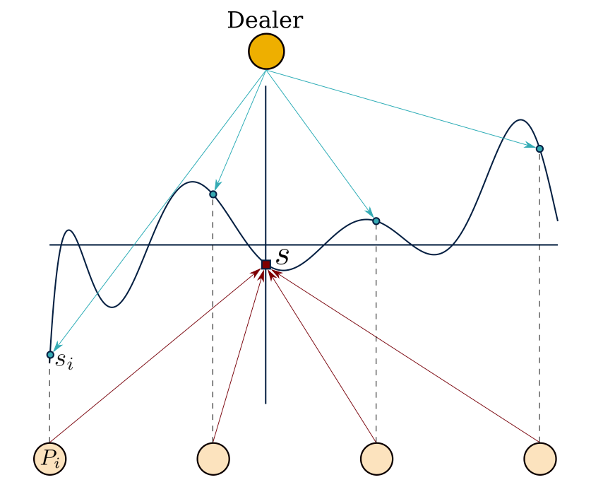

### Introduction

Many cryptographic applications currently require a trusted third party to generate and/or hold secrets. This party constitutes a single point of failure - it can be DoS-ed, breached or not operate in an honest manner. Removing the need for a trusted third party results in a more robust and trustworthy system.

Let's first specify the problem in more technical terms. We consider a node of a system a 'single point of failure' (SPOF) when at least one of the following is true:

- the operation of the whole system fails if that node becomes unavailable (caused either internally or by an adversary)
- the node has full access to the secret even for a single point in time
- misbehaving of the node can make the system deliver incorrect results

Distributed Key Generation (DKG) allows a group of parties to generate and store a shared key, while preventing any single party from having access to that key at any point in time. Instead, each party holds a piece of information called a ‘key share’. The common secret might be used in either symmetric or asymmetric encryption, and in the latter case it has a public key counterpart.

In order to execute a cryptographic operation such as decryption or signing, a quorum of a minimum size above a threshold $t$ must be assembled and each party of the quorum must participate in the process using their key share. More specifically, each party of the quorum uses their share to produce a partial result of the cryptographic operation. The partial results are then sent to a node that combines them to produce the final result of the operation. Note that this node doesn't acquire any knowledge of the key shares or the secret. Cryptographic algorithms that work in such a setup belong to the domain of [threshold cryptography](https://en.wikipedia.org/wiki/Threshold_cryptosystem).

For example, assume a sender and a receiver, with the sender wishing to send encrypted data to the receiver and the receiver not to be trusted with the secret key. A group of parties that share the secret is used on the receiver's side. The sender will use the group's public key to encrypt the data and send it over to the receiver. Upon receipt, the receiver will send the encrypted data to the group's parties requesting a decryption. Each party (decryption server) will perform an operation on the encrypted data using its share and the result (decryption share) will be sent back to the receiver. The receiver will check the validity of each received decryption share in turn. The receiver can fully decrypt the encrypted data when it collects a number of valid decryption shares that exceeds the threshold value.

The above works similarly for signing. The parties will be the signing servers and each one will produce a signature share that will be sent to a server for validation. Once that server collects an amount of valid signature shares that exceeds the threshold, it is able to compile the group signature on the data. The signature can be verified by any third party using the group's public key.

This post starts by explaining simpler constructions and builds up to the Aggregatable DKG construction.

> “If you want to keep a secret, you must also hide it from yourself.”

> ― George Orwell, 1984

### Secret sharing

We start with the problem of storing a common secret without having a SPOF. The secret needs to be held by the parties in the form of shares and it shouldn't be possible to disclose the secret unless a quorum is assembled. [Secret sharing schemes](https://en.wikipedia.org/wiki/Secret_sharing) offer exactly that and are the basis of DKG constructions. We will focus on [Shamir’s Secret Sharing (SSS)](https://en.wikipedia.org/wiki/Shamir%27s_Secret_Sharing).

SSS makes use of the property that a polynomial of degree $d$ can be uniquely reconstructed by any set of $d+1$ points using the Lagrange interpolation.SSS works as follows.Assume there exist $n$ parties $P_i, i \in [1,n]$ and the threshold is set at $t (1 \le t \le n)$:

1. A ‘dealer’ generates a secret $s \in \mathbb{F}_p$ and constructs a random polynomial $f(x) = \displaystyle\sum_{i=0}^{t}{a_i x^i}$ in $\mathbb{F}_p$, of degree $t$ and with its constant term set to the secret value $f(0)=f_0=s$.

2. The dealer then calculates $n$ shares $s_i = f(i), \forall i=1,2..,n$.

3. The shares are privately ‘dealt’ to the parties (sharing phase).

4. From this point and after, any $t+1$ parties (and no less) can use their shares to reconstruct the polynomial and thus reveal the secret (reconstruction phase).

SSS is depicted in the following figure.

<figure>

<figcaption>SSS</figcaption>
</figure>

In SSS, we trust the dealer to be honest. A dealer is honest when it deals shares that are consistent, ie. shares that are generated using the same polynomial. If the shares are not generated by the same polynomial, then different quorums composed of different parties will reconstruct different secret values. Here the dealer is able to force the system to operate in an inconsistent manner and thus poses a SPOF. Omitting our trust that the dealer is honest forces us to use a share validation mechanism.

A Verifiable Secret Sharing (VSS) scheme protects against such a malicious dealer by enabling parties to verify the shares’ consistency and thus ensuring that the shared secret can be correctly reconstructed. For example, [Feldman’s VSS](https://eprint.iacr.org/2010/495.pdf) (Fel-VSS) extends SSS to a VSS by making the dealer broadcast homomorphic commitments to each of the polynomial’s coefficients $F_i = g^{a_i}$. Alternatively we can view these commitments as one commitment to the polynomial:

$$
{\displaystyle F(x) = \prod_{i=0}^{t} {F_i^{x^i}} = g^{\sum_{i=0}^{t} {a_i x^i}} = g^{f(x)}}
$$

The parties can use these commitments to verify that their share belongs to the polynomial by checking if

$$
g^s_i=F(i) = {\displaystyle \prod_{j=0}^{t} {F_j^{i^j}}}
$$

### Distributed Key Generation

Up to this point, we have removed the need of trusting the dealer to be honest by using a VSS, but we still bear the risk of the dealer becoming non-operational or leaking the secret. In order to avoid the above in a DKG, the secret needs to be generated in a distributed manner as opposed to being centrally generated by one dealer. We will now present how Pedersen’s DKG works.

In [Pedersen’s DKG](https://link.springer.com/content/pdf/10.1007%2F3-540-46416-6_47.pdf) (Ped-DKG), all parties are dealers following Fel-VSS. This technique of making all parties dealers following a VSS is how many DKGs are constructed. The protocol works as follows:

1. Each party $P_i$ generates a secret $s_i$, a random polynomial $f_i(x)= \displaystyle\sum_{i=0}^{t}{a_i x^i}$ with degree $t$ and a Feldman commitment to it $F_i(x) = \prod_{i}g^{a_ix^i}$.
2. It then calculates its public key share $p_i = g^{s_i}$ and broadcasts a commitment to it $C_i = C(p_i, r_i)$.
3. When all $P_i$ finished broadcasting, each $P_i$ opens $C_i$ and the shared pubic key is set to $\displaystyle \mathbf{pk} = \prod_{i=1}^{n}{p_i}$ with the corresponding secret being $\displaystyle s = \sum_{i=1}^n{s_i}$.
4. Finally, $P_i$ broadcasts the commitment to the polynomial and distributes shares $s_{ij}$ of its secret to all other parties $P_j$ (sharing phase).

Ped-DKG features a complaint round inside the sharing phase to remove invalid shares.When the verification of a share $s_{xy}$ fails, $P_y$ broadcasts a complaint against $P_x$.If the complaints against $P_x$ are more than $t$, then $P_x$ is disqualified. If they are less than $t$ but not $0$, then $P_x$ publishes all $s_{xy}$ that had a complaint, and if any of those shares fails verification, then $P_x$ is disqualified.Disqualified parties are excluded from contributing to the secret by setting their shares to $1$.

The state of the system after the sharing phase is completed is such that each participating party holds $n-1$ shares and their own secret.For reconstructing the shared secret we need to obtain all secrets $s_i$ by reconstructing each polynomial $f_j(x)$.For that we need $t+1$ points for each polynomial.Since each party has a point of each polynomial, any $t+1$ parties suffice to reconstruct all $n$ secrets and thus reveal the common secret.

Ped-DKG assumes a fully synchronous communication model according to which all messages are delivered within a strict time bound. This assumption provides assurance that this protocol will always terminate successfully.

Ped-DKG can tolerate dishonest parties that don't form a majority:$n \ge 2t+1 \implies t \le \frac{n+1}{2}$

Ped-DKG performance can be reviewed by the following metrics:

- Verification complexity: $O(n^2)$ operations since every party needs to verify shares from all others
- Broadcast messages: $n$ broadcast messages of size $O(n)$

Different DKG algorithms can provide performance improvements as well as other benefits. Here, we will focus on the recently released Aggregatable DKG protocol.

### Aggregatable DKG

The [Aggregatable DKG](https://eprint.iacr.org/2021/005.pdf) (Agg-DKG) provides a significant performance improvement compared to other DKGs by leveraging aggregation. It uses a modified version of the [Scrape PVSS](https://cryptorating.eu/whitepapers/Cardano/216.pdf) as its underlying VSS.

#### Modified Scrape PVSS (Scrape)

Scrape is a Publicly Verifiable Secret Sharing protocol based on Fel-VSS, that provides the ability for any party, internal or 3rd, to verify the dealt shares. Scrape doesn't need a complaint round since all parties will agree on the set of valid shares based on the common public information. Since the shares need to be publicly verifiable, they are published encrypted, with each party being able to decrypt only its corresponding share. Additionally, it has properties that allow the usage of aggregation of different shared secrets. In the following subsections we describe the operations that Scrape provides.

##### Initialization

All parties share a Common Reference String (CRS) that includes:

- a bilinear group $\mathbf{bp} = (g_1 \in \mathbb{G_1} , \hat{h}_1 \in \mathbb{G_2})$
- encryption keys $ek_i \in \mathbb{G_2}$ of each party $P_i$ with corresponding decryption keys $dk_i \in \mathbb{F}: ek_i = \hat{h}_1^{dk_i}$ ($P_i$ keeps $dk_i$ secret).

##### Sharing Phase

The dealer chooses a secret value $a_0$ and sets the secret key $\mathbf{sk} = \hat{h}_1^{a_0} = \hat{h}_1^{f(0)}$. The result of the sharing phase is the _PVSS transcript_ that is publicly accessible and comprises of:

- commitments to the polynomial's factors ($F_i = g_1^{a_i}$)
- commitments to all the dealt shares ($A_i = g_1^{f(\omega_i)}$)
- encryptions of all dealt shares ($\hat{Y}_i = ek_i^{f(\omega_i)}$).

##### Verification

Verification starts with checking the shares' commitments against the polynomial commitment and then checks if the encrypted shares correspond to the shares of those commitments:

1. $\displaystyle \prod_j{A_j^{l_j(\beta)}} \stackrel{?}{=} \prod_j{F_i^{\beta^j}}$
2. $e(g_1, \hat{Y}_j) \stackrel{?}{=} e(A_j, ek_j), \forall{j} \in [1,n]$

with $I_j$ being the corresponding Lagrange polynomial, $$\beta\xleftarrow{\$}F$$ a nd $e: \mathbb{G}_1 \times \mathbb{G}_2 \xrightarrow{}\mathbb{G}_T$ is a Type III bilinear map. We are certain that the shares that pass the above checks belong to the committed polynomial and they are the same shares with the committed ones.

##### Secret reconstruction

To reconstruct the secret a quorum $\mathbf S$ of $t+1$ parties first needs to decrypt their shares $\hat{A}_i=\hat{Y}_i^{dk_i^{-1}}=\hat{h}_1^{f(\omega_i)}$ and check if their bilinear mapping check holds $e\big(g_1^{f(\omega_i)},\hat{h}_1\big) = e\big(g_1,\hat{h}_1^{f(\omega_i)}\big)$.The secret key is reconstructed using the Lagrange interpolation in the exponent at point $0$:

$$
\mathbf{sk}=\prod*{i \in \mathbf S}{\hat{A}\_i^{l_i(0)}}=\hat{h}\_1^{\sum*{i \in \mathbf S}{f(\omega_i)l_i(0)}}=\hat{h}\_1^{f(0)}
$$

##### Aggregation

Aggregation of PVSS transcripts can be achieved due to the homomorphicity of the commitment and encryption schemes used. Given two polynomials, $f_1, f_2$ with corresponding transcripts:

$$
\mathbf{pvss}_k = \big(({F}{k,0},..,{F}{k,t}), (A{k,0},..,A_{k,n}), (\hat{Y}{k,0},..,\hat{Y}{k,n})\big), k \in [1,2]
$$

we calculate the transcript $\mathbf{pvss}_3$ that corresponds to $f_3 = f_1 + f_2$ by:

- ${F}_{3,i} = {F}_{1,i}{F}_{2,i}, \forall{i\in[1,t]}$
- $A_{3,i} = A_{1,i}A_{2,i}, \forall{i\in[1,n]}$
- $\hat{Y}_{3,i} = \hat{Y}_{1,i}\hat{Y}_{2,i},\forall{i\in[1,n]}$

#### Agg-DKG

Agg-DKG is constructed as per Ped-DKG by making all parties Scrape dealers. Each dealer generates its own secret $c_i$ and its PVSS transcript ($n$ PVSS transcripts are generated in total). The group's public key is $\mathbf{pk} = (g_1^a , \hat{u}_1^a ) \in \mathbb{G}_1 \times \mathbb{G}_2$ and the secret key is $\mathbf{sk} = \hat{h}_1^a \in \mathbb{G}_2$ , where $a \in \mathbb{F}$ and $\hat{u}_1 \in \mathbb{G}_2$.

Each dealer deals a secret $\hat{h}_1^{c_i}$ and $a = \sum_{\mathbf Q}{c_i}$. ${\mathbf Q}$ is the set of honest dealers and is uniquely determined by all parties based on the same public data.

Each dealer will need to provide a signed proof of knowledge for its secret. In Agg-DKG this is achieved by issuing a Signature-of-Knowledge (SoK). Each dealer is equiped with a signing key pair $(sk_i, vk_i)$. To produce the SoK it first commits to its secret $C_i = g_1^{c_i}$ and then signs it:

$$
\sigma_i = (\sigma_{i,1}, \sigma_{i,1}) = \big(Hash_{G_2}(C_i)^{c_i}, Hash_{G_2}(vk_i, Ci)^{sk_i}\big)
$$

The simplest way to verify shares would be that all parties verify all PVSS transcripts.But since the PVSS transcripts can be aggregated, it becomes possible for verifiers to verify aggregations of transcripts.Agg-DKG uses gossiping of aggregated transcripts instead of an all-to-all approach to reduce the total verification complexity from $O(n^2)$ to $O(nlog^2n)$.Since gossiping is random, the aggregation might include the same transcript several times.To reflect that, share weights $w_i$ are included in the calculation of the final secret, which becomes $sk = \sum_{\mathbf Q}{w_ic_i}$.

To incorporate all the above, Agg-DKG augments the PVSS transcript described previously to the _DKG transcript_:

$$
tr = \big((C_0..C_n), (w_0..w_n), (\sigma_0..\sigma_n), \mathbf{pvss}\big)
$$

where $\mathbf{pvss}$ is an aggregated PVSS transcript.

A transcript is called _full transcript_ if it is valid and includes $t+1$ contributions. A valid transcript is a transcript that passes verification (see below). Clearly, more than one full transcript exists.

##### Aggregation

Aggregation of DKG transcripts is performed by aggregating the $\mathbf{pvss}$, merging the $C_i$ and $\sigma_i$ vectors and element-wise summing the $w_i$ vectors. The resulting transcript will refer to the combined polynomial that corresponds to the weighted shares.

##### Verification

Verification of a DKG transcript starts with verifying $\mathbf{pvss}$ first.Then, for every contribution $i:w_i\neq0$, $\sigma_i$ gets verified.Finally, verification that all the corresponding commitments are consistent to the combined polynomial commitment in $\mathbf{pvss}$ takes place.

##### Protocol

Agg-DKG works under the fully synchronous communication assumption. That means that there is a strict time bound between rounds and all messages (honest and adversarial) within a round will be seen by all parties by the end of the round. The protocol is as follows:

1. each dealer $P_i$ starts by constructing its own DKG transcript:

- it deals Scrape shares and sets $\mathbf{pvss}$ to the resulting PVSS transcript.
- it then generates its commitment and SoK and setting its weight to $1$.
- the rest of commitments and SoKs are set to $\bot$ and their weights to $0$.

2. These initial DKG transcripts are gossiped and a process of verify → aggregate → gossip rounds starts in the network. At any point the transcripts in circulation will be aggregations of some of the initial transcripts. The following take place in each round of this phase:

- each party verifies incoming transcripts and aggregates the ones that pass verification
- each party broadcasts their newly aggregated non-full transcript to $O(clogn)$ randomly selected parties ($c$ chosen as a small number $\ge 4$)
- each party that generates a full transcript after aggregation will broadcast it to all nodes with a probability of $\frac{2}{n}$.
- all parties decide to keep the full transcript for which the corresponding public key $pk$ has the smallest bit-count in binary representation.

We notice that the protocol's termination relies on constructing a full transcript. This is bound to happen after enough rounds take place in the synchronous setup. The first round that a full transcript was broadcasted is agreed to be the last round of the protocol. There is a chance that more than one full transcripts were broadcasted during the last round. The last point in the protocol description deals with this case.

The above results in a communication complexity of $O(clog^2n)$ broadcasts.

Agg-DKG can handle $t_c \lt \frac{n}{2} - logn$ crashed nodes and can tolerate $t_b \le logn$ corrupted parties by a byzantine adversary.The threshold upper bound can be computed by:

$$
t \le n-t_c-t_b \implies t \lt \frac{n}{2}
$$

### Final Thoughts

Agg-DKG has a performance advantage over other schemes that makes it scale better for real-world applications. Additionally, the usual complaint rounds during sharing are replaced by a gossiping protocol, which likely requires comparable effort to implement. Also, an indirect benefit of being publicly verifiable is that crashed nodes are able to obtain their secret shares as long as they come back online without being excluded and without losing their decryption key.

On the other hand, Agg-DKG is based on a synchronous communication model that assumes that all messages are delivered in bound time. This assumption might not be accurate when using real-world communication means such as the Internet. Finally, the secret key and secret shares are group elements instead of field elements. This prevents the usage of Agg-DKG with many well-known cryptosystems that operate on shares that are field elements.

In a future post, we will describe the work we do on DKGs as part of the Anoma protocol, presenting the decisions taken and explaining the reasoning behind them.

_Written by George Gkitsas, previously a zero-knowledge cryptography researcher & protocol developer at _[_Heliax_](https://heliax.dev/)_, the team building the _[_Anoma_](https://anoma.net)_ Protocol._

_If you're interested in zero-knowledge cryptography and cutting-edge cryptographic protocols engineering positions in Rust, check out the _[_open positions at Heliax_](https://heliax.dev/jobs)_._
