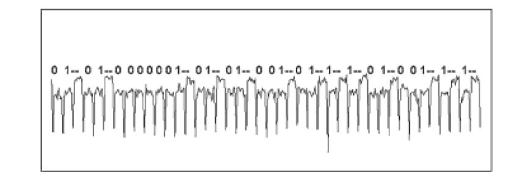

The goal of this post is to introduce side-channel analysis/attacks (SCA) and counter-measures and to provide directions that can help security assessments take them into consideration. Side-channels are relevant to cryptographic implementations, and as such they introduce a class of attack vectors in the blockchain context.

Note: Definitions in this post are not necessarily taken out of textbooks and industry standards. Readers that want to go deeper on the subject can consult the relevant and up-to-date research and standardization results.

## Introduction

The execution of any computation has physical characteristics. It requires some time to compute and it consumes some energy too. It produces electromagnetic fluctuations or even generates sounds. We call these physical quantities the side-channels (SCs) of the computation.

If we were to measure a SC during the execution of a computation, we would get a graph with the horizontal axis denoting time and vertical axis denoting the value of the quantity (except if we measure the total execution time which will result in only one value and not a graph). Such a graph is called a trace. An example power trace of an AES round execution is shown below. The annotations point different internal phases of the computation.


Side-channel information can be used to deduce information about the inputs of an execution. Assume a computation that for different input values it takes different time to execute. Also, assume that the computation is deterministic, it is executed in isolation (no other operations happen in parallel) and that we have perfect measurement accuracy and no measurement noise. We can execute the computation for all the possible input values and collect their corresponding timings (storage requirements aside). Under the aforementioned assumptions it would be possible to measure the time that an execution with an unknown input value takes, compare it to the stored timings and deduce the input value. If we apply this in the context of cryptographic algorithms, we end up with a tool that can help us deduce secret values (private keys, nonces, plaintexts etc.) from acquired traces. We will focus on cryptographic algorithms for the rest of this post.

In reality, we do not expect to have 1-1 mappings of input values and traces, the execution of a computation is not isolated from other executions or inner workings of a system, measurements suffer from noise and are be bound to the precision of the utilized equipment resulting, in additional information loss. Moreover, it cannot be assumed that an identical computation will result in identical traces (noise and other factors aside) since, in general, subsequent executions of the same computation on the same input are not guaranteed to perform in exactly the same manner (think of system interrupts, caches, probabilistic optimizations, error correction operations etc.).

We can categorize the factors that move us away from the ideal case into two groups: ones that contribute to information loss, and ones that pollute traces with useless information (and thus contribute uncertainty to the analysis of the acquired information). The former group can be countered by simply collecting more information, which in simple terms means acquiring more traces of the same computation. The latter group can be countered by a combination of statistical tools to focus on the important information and to identify and remove unrelated information.

SCs can also be used in ways that affect the target’s operation instead of passively collecting information. The capability of modifying a target’s behaviour creates opportunities for a different class of attacks, called active SCs (a.k.a. fault or perturbation attacks). Examples include altering the value of bits of memory cells by repeatedly accessing neighbouring cells ([Rowhammer](https://en.wikipedia.org/wiki/Row_hammer)), or shooting laser beams on hardware components to bypass critical security checks ([laser fault injection](https://blog.applus.com/lateral-laser-fault-injection-a-new-variant-to-one-of-the-most-effective-hardware-attack-on-secure-chips-developed-by-applus-laboratories/)). We only mention this class of attacks here for completeness and will not elaborate further on them.

During the rest of the post we introduce some terminology, dive deeper into two important classes of side-channel attacks, discuss counter-measures, and wrap up with a methodology for performing security assessments in the context of SCAs.

## Threat Modelling

In this section we elaborate on characteristics that play an important role when defining attacker profiles in the context of SC attacks. We will define a loose framework for the purpose of this discussion.

Its important to note that the effectiveness of side-channel attacks does not rely on weak cryptographic assumptions (i.e. discrete logarithm), bugs in coding, or misalignments between specification and implementation. Side-channels introduce new attack vectors which expand existing thread models.

#### Knowledge of the system

An important factor is how much information the attacker has about the target system. At the very minimum, the attacker needs to have some knowledge (or be able to make educated guesses) regarding the algorithms that are executed on the target, and what triggers their execution. Usually, an attacker that has knowledge of implementation details (access to source code or hardware designs) is assumed, as this information can often be obtained by other means (reverse engineering, educated guesses, industry standards etc.).

#### Proximity

A defining factor is the required proximity the attacker needs to have to the target. This factor is used more generally in rating any type of security vulnerability (see [CVSS](https://www.first.org/cvss/v3.1/specification-document)). We can borrow and slightly modify the commonly used quantification of this factor and use it in the context of SCA. We could use the following ratings:

- **Physical** - the attacker needs to be able to physically access/modify the target
- **Local / Adjacent** - the attacker has or can obtain a position that is logically local to the target (examples: same LAN, being able to execute operations on shared hardware)
- **Network** (or remote) - it is the less restrictive grade, usually implies that the attacker can exploit the vulnerability over internet

Typical examples of attacks requiring physical proximity are power and electromagnetic-based SCA. These attacks require one to physically measure power consumption or electromagnetic emanations at the target’s hardware, which in most cases requires probing and even modifying the hardware.

On the other side of the spectrum, we mostly find timing attacks when time fluctuations are distinguishable enough in network communication timings.

Timing attacks can also be local, and when they are they are more effective since there is less network jitter. In the local category we find a powerful class of attacks called micro-architectural attacks. These attacks make use of the fact that different processes running on a modern CPU share many CPU sub-components (caches, execution pipeline i.a.). The shared and interleaved usage leaks information of the internal operations of a computation.

Depending on the target and its operating conditions, there might exist opportunities to launch attacks remotely that would traditionally require physical proximity. For example, CPUs feature power measurement components that help in power regulation. If such a component is exposed to the OS through some interface, then there is an opportunity to acquire power traces without physical probing. Of course such an attack will be subject to required privileges, reduced measurement accuracy i.a., but the opportunity will be there. When securing against SCA, it is prudent to not reason using a fixed mindset and to at least consider worst-case scenarios like the above.

#### Attack Complexity

This metric distinguishes between attacks that are easily replicable, and attacks where special requirements need to be met per target. Typical rankings are **Low** and **High** correspondingly.

Examples:

- a remote timing attack against a service might be rated as High complexity since timing fluctuations will depend on the server hardware, which can vary significantly across targets
- a power attack against a specific smart-card model could be rated as Low since different targets have a high chance to behave identically down to the lowest technical levels

#### Privileges

Different attacks require different privileges on the target. The usual values here are **None/Low/High** with Low and High usually corresponding to user vs admin access.

A None case could be a remote timing attack where the attacker only needs to wait for specific traffic (or generate appropriate traffic) that triggers the target calculation.

A Low case is common in micro-architectural attacks. For example, suppose that the target is a service hosted on a shared server. The attacker needs to be an end-user of the hosting provider and try to co-locate with the target.

Cases rated as High are rarer in SCAs. We could create a hypothetical example from the remote power attack mentioned above by assuming that the power sensor interface is accessible only by users with admin rights.

## Side-channel Analysis Methodology

Side-channel analysis flow can be broken down to 4 phases: setup, acquisition, processing and analysis. The actual attack is defined as a final (5th step) following analysis. It is very common that each step will reveal new information which can help refine previous steps. Also, assumptions taken in previous steps might be proven incorrect, leading in the repeat of previous steps. The process is depicted in the following figure:


The setup phase mainly involves preparing the target and the connection with it. That might include modifying the hardware (e.g. removing capacitors), etching, soldering, selecting and connecting equipment. In non-physical attacks, it might include identifying services, preparing network monitoring etc. When the attack is interactive, meaning that the attacker needs to actively communicate with the target instead of just monitoring, the attacker might need to prepare input and response data. At the end of the setup phase, the attacker must have a way to connect to the target and have a way to trigger or get notified when the relevant computations are executed.

During acquisition, the attacker acquires traces of the side-channel. It is a simple iteration of a trigger/notify - measure - store procedure. The amount of traces that need to be acquired is determined by the processing and mostly by the analysis steps. The attacker initially acquires an empirical and guesstimated number of traces.

Processing applies generic signal processing to the acquired traces to achieve noise reduction, jitter reduction on misaligned traces etc. It is an important step that helps removing useless information from traces.

Analysis is the most important and defining step. The goal of this step is to assess if we have enough information to launch an attack. There are different types of analyses. The simplest one is visual inspection of traces in order to detect patterns that directly map to secret data. The trace below shows this case:



Visual inspection might not directly provide the information an attacker seeks, but might hint the attacker on where to focus and how to proceed with analysis. More commonly, analysis includes statistical methods that, for example, detect correlation between the traces and the secret data. When the analysis shows that there is a strong relationship between traces and secret data, an analyst can conclude that the target is weak against the given side-channel and an attacker is ready to launch the attack and retrieve the secret data.

Side-channel attacks utilize the divide-and-conquer paradigm. The side-channel information assists in revealing chunks of secret values one at at time. Candidate values for the chunks are ranked using the information of the analysis step and tried out during the attack.

## Timing attacks

We continue by explaining timing attacks. The examples in this section assume that an attacker has full-target knowledge and we operate under the CPA model. We also focus mostly on the analysis and attack phases.

#### Example 1

A simple example of a timing attack is that of a non-constant comparison of sensitive data.

```rust
fn check_password(in_pwd: [u8], pwd: [u8]) -> bool {
    if len(in_pwd) != len(pwd) {
        return false;
    }
    for i in 0..len(pwd) {
        if in_pwd[i] != pwd[i] {
          return false;
        }
    }
    return true;
}
.
.
input_password = read();
.
.
compare(input_password, correct_password);
```

The `check_password` function will return when either the input `m2` is fully scanned, or at the first point where `m1` differs to `m2`. The execution time here depends on the number of leading characters that match between the provided inputs.

An attacker could try all the possible one-character passwords and collect execution time measurements. The password with the correct guess of the first character will have a slightly different execution time, which signals the attacker to move on brute-forcing the second character and so on. The timing information in this example play the role of an oracle for correct password characters and are used as a heuristic for navigating the password space.

The attacker’s effort is (n/2)∗l(n/2)∗l, where nn is the password’s alphabet and ll is the password’s length. This is a huge reduction compared to the simple brute-force attack that requires an effort of nl/2nl/2.

#### Example 2

A more advanced example of a timing attack is based on the following code snippet. Suppose this is an algorithm that takes a secret key dd and a message mm and outputs a signature of mm.

```rust
fn sign(m: Message, d: SecretKey) -> Signature {
    let x = m;
    for i in len(d)-1..0 {
        x = x^2 mod n;
        if d[i] == 1 {
            some_operation(x,m);
        }
    }
    return x;
}
```

We can see that the value of each bit of the secret dd is used to determine if some code will be executed. This creates a dependency between the bit values of the secret and the time it takes for the algorithm to terminate.

For educational purposes, we start with an unsuccessful example attack. Lets assume for simplicity reasons that the code inside the `if` takes constant time to execute. As a first try, we can quickly see that we can claim that the total execution time of the algorithm will leak the secret’s hamming weight (amount of bits set to `1`). For a given `m`, the attacker can easily collect offline timing measurements for all hamming weights and compare an acquired trace against them. This is not helpful in determining the secret’s value, except for some trivial cases. When the attacker knows the hamming weight kk of the secret of length nn, they have a reduced brute-force effort of eff=(nk)2eff=(nk)2. Since secrets are supposed to be generated at random, we end up with a statistically expected hamming weight around 50%, or differently k=⌈n/2⌉k=⌈n/2⌉ or k=⌊n/2⌋k=⌊n/2⌋, a value that maximizes effeff. Additionally, a randomly generated secret has a negligible probability to land to the trivial cases. The statistically expected effort of guessing, for example 128 bits secret key, will be [(12864)2(12864)2](https://www.wolframalpha.com/input/?i=combination%28128%2C64%29%2F2) which is unapproachable.

Timing attacks, as originally described by [Kocher](https://paulkocher.com/doc/TimingAttacks.pdf), use a divide-and-conquer strategy of guessing the bits of the secret one by one, guided by a statistical heuristic. At any point during this attack, the attacker has a working guess of bb bits of the secret and tries to guess the next bit b+1b+1 correctly. The attacker knows a set of input messages and their corresponding measurements. Additionally, they have emulated the time the calculation takes up for the first bb guessed bits, for all input messages. To correctly guess the next bit with high probability, the attacker calculates the statistical variance of the emulated execution time of the b+1b+1 bits. If the guess of the b+1b+1 is correct, the variance will decrease, if not it will increase. The variance is the oracle that helps the attacker decide, what the secret key value is, bit by bit.

Other variations of the methods described above exist that offer different trade-offs in terms of accuracy, generality etc.

## Micro-architectural attacks

Micro-architectural attacks are a class of side-channel attacks that leverage information leakage through shared hardware components between processes. Examples of sources of leakage are cache memories and branch prediction components. Here, we will share an example to showcase the cache based attacks a.k.a cache-timing attacks. There are lots of different variations of cache-timing attacks, with the main ones being FLUSH+RELOAD, PRIME+PROBE and EVICT+TIME.

Let’s start with a quick and simplified primer on how caches work. The main memory lies outside of a CPU, it is big but slow while cache memories that lie inside the CPU die, they are smaller but faster. The main memory is split into blocks which are mapped to cache addresses (this is simplified, the reader can read on [set associative caches](https://en.wikipedia.org/wiki/Cache_placement_policies#Set-associative_cache) for a more accurate description). Whenever the CPU needs an address whose contents are in the main memory and not in the cache, it will fetch the corresponding memory block to the cache.

Cache-timing attacks rely on the difference that memory access times present between fetching data from cache vs main memory. An attacker can prepare the cache in a way that will force the victim process to fetch specific data from the main memory then detecting the access by trying to access the same cache line/set after the victim process has finished the operation, and measure the time it takes and thus deduce if the victim accessed specific addresses. If the addresses of this data are correlated with a secret value, then the attacker can discover the secret.

For example, imagine that the victim process is using a third-party library to invoke AES. Assume that the AES implementation uses lookup tables for the S-boxes and that these tables span across more than one cache line/set. Since lookup tables are constants, their addresses are mapped in the library’s binary beforehand to its execution (we take a simplistic view of the system and assume no address randomization etc.). The attacker can use FLUSH+RELOAD during the invocation of AES by the victim. That requires the attacker to flush the relevant cache lines/sets before the invocation of an AES round, then wait for the victim process to execute the AES round and finally access the lookup tables and measure the time it takes for the access. If the measured time is deemed low, that denotes that the victim accessed the addresses that correspond to that cache line/set, and if deemed high, it denotes that it didn’t. Since AES S-boxes are addressed by bytes of the secret key, the attacker can deduce (after several measurements) what the secret’s value is.

It is important to elaborate on the attack model of micro-architectural attacks. These attacks don’t require physical access. The required privileges can be minimum to zero. Since caches are shared between processes, virtual machines, hypervisors and even secure enclaves, the attacker only needs to be co-located on the same hardware and not necessarily on the same virtual server. In all cases, the attacker should have available ways to obtain timing measurements, either by time primitives or by other techniques ([sometimes quite creative ones](https://misc0110.net/web/files/timers.pdf)). The attacker also needs ways to manipulate caches and depending on the available ways, this might affect the required privileges.

## Counter-measures

Before exploring the different counter-measures, it is important to talk about the actual solution to the problem: removing the dependency between the physical quantity and the sensitive data.

The solution in the context of timing attacks would mean to make the algorithm execute in the same amount of time for all different values of the secret. In [Example 1](https://hackmd.io/7FrGxJKwSWiU8FzopvfbjQ?view#Example-1), we could compare all characters of the input and correct password. This could look like:

```rust
fn check_password(in_pwd: [u8], pwd: [u8]) -> bool {
    if len(in_pwd) != len(pwd) {
        return false;
    }
    let result = true;
    for i in 0..len(pwd) {
        result = result && (in_pwd[i] == pwd[i]);
    }
    return result;
}
```

In [Example 2](https://hackmd.io/7FrGxJKwSWiU8FzopvfbjQ?view#Example-2), we could emulate the `if` selection logic without suffering from timing variations:

```rust
fn sign(m: Message, d: SecretKey) -> Signature {
    let x = m;
    for i in len(d)-1..0 {
        x = x^2 mod n;
        x = d[i] * some_operation(x,m) + (1-d[i]) * x;
    }
    return x;
}
```

A solution in cache-timing attacks might mean to fit data that is addressed by parts of the secret key in one cache line, or alternatively, load all data that are addressable by values derived from the secret key in cache, regardless of which ones are needed at each specific memory access.

Completely removing the dependency is the most effective way to counter a side-channel, but unfortunately it is often too costly or even impossible for every side-channel. In this section we survey common counter-measures.

The goal of counter-measures is to make a potential attack costly enough that it doesn’t justify the attacker’s effort and resources. The quantisation of cost and effort is a result of risk assessment and is out of this post’s scope. For a more structured presentation, we group different counter-measures in 4 categories that map to the 4 phases of side-channel analysis.

Counter-measures that target the setup phase typically include mechanisms that either hide probing points requiring the attacker to put additional effort to reach them, or mechanisms that detect the presence of an attacker.
Some examples of hiding against physical attacks are making chip pins inaccessible, using decoys and shielding. Generic detection methods might include physical tamper-proofing mechanisms such as fuses and preset buttons. For remote and software-only side-channel attacks, there are some proposed detection mechanisms that rely on behaviour analysis.

Not many obstacles can be introduced at the acquisition phase besides signal reduction by weakening or shielding the side-channel source.

The processing phase can become harder by noise addition (although not very effective). Introducing misalignments can also increase the processing effort. A misalignment can be seen as jitter; different events seen in traces are not happening at the same point in time and even the whole trace might be moved in time (relatively to the trigger point).

Finally and more importantly, counter-measures that target the analysis phase include the introduction of fake operations, which lead to the introduction of useless information and decorrelation techniques, such as blinding and masking which reduce the amount of useful information leaked by the side-channel. The fake operations should be as indistinguishable from the real ones as possible to maximize effectiveness. Blinding is a technique where the sensitive data is combined with some random data and the result is used as the secret input. When the algorithm has finished, an unblinding operation is executed to obtain the algorithm’s actual result. The effect of blinding is that the side-channel leaks information of the value of the blinded secret. If the attacker obtains the blinded secret, it still needs the value of the blind to be able to derive the actual secret. If the blind value is chosen at random periodically, then different groups of traces refer to different blinded secrets, thus making it harder to even obtain the blinded secret to start with.

There is no generic way to measure the effectiveness of counter-measures. Some metrics are the degree in which a counter-measure increases the number of traces needed to obtain the same amount of information, the amount of extra steps an attacker has to take and the sophistication level of the tools, equipment and knowledge that is required to defeat a counter-measure.

Care must be taken to protect the counter-measures themselves. If, for example, blinding is used but the blind is predictable or easily obtained, it will be ineffective. Sometimes it is possible to apply side-channel attacks on counter-measures as well such as a fault attack that bypasses the blinding operation.

In general it is good to use a range of counter-measures, as the attack complexity can be raised favourably disproportionately to the cost of implementing them.

## Security Assessment under SCA

Ending our discussion on SCA, we visit the topic of security assessment with SCA under consideration. Quickly recapping, the utility of SCAs is to retrieve secret information from measurements of physical quantities. The measurements need to happen in parallel to the execution of a computation that uses the secret information.

Here we will employ an asset-based assessment. This choice stems from the fact that we have clearly defined assets, the secrets.
One can start by generating an asset registry where all secret values are enumerated. The next step will be to identify the points where the secrets are used, which are points with a potential SCA exposure, we will call these points Points-of-Interest (PoI). PoI’s should be kept alongside with the type(s) of SCA that are feasible against them.

Next, using a threat model that include attacker profiles listing the attackers’ capabilities, one can rank (and exclude) PoIs and thus help prioritize securing efforts.

At this point, most of the information we have about the sensitivity of PoIs to SCAs is hypothetical and not based on solid results. One option forward is to perform a side-channel analysis and concretely evaluate the security level of the system. Another option is to perform a root cause analysis and try to estimate the security level.

The first option usually provides more information as it counts in the attacker’s effort and ingenuity. During this analysis, the analyst acts as an attacker, within a given set of restrictions which can reveal vulnerabilities that wouldn’t be identified by just a system analysis. With this approach, a larger range of counter-measures can be considered and assessed, since all 4 phases of SCA are performed. This is usually most costly approach.

The second option makes more sense in cases where the parameters of an attack can be clearly and methodically quantified by reviewing the system’s implementation and deployment. That usually happens when the PoI is directly exposed and when it is relatively isolated from the rest of the system. This approach will provide information that help in deciding counter-measures targeting the analysis phase of SCA.

No matter which approach, we should end up with decisions on which counter-measures to use. And finally, the best step to take after implementing the counter-measures is to re-evaluate the security level by another cycle of SCA that will also include attacking the counter-measures themselves.

Hopefully, after all this effort, your system should be relatively secure. Regardless of this, you should stay vigilant to any changes that might affect it and have a look back at the asset-registry and PoIs periodically to make sure things stay secure.

## SCA in blockchain solutions

As with every system that makes use of cryptography, blockchain solutions are vulnerable to SCAs. The blockchain space is different in some ways compared to other sectors that employ cryptography. Most solutions rely on cryptographic primitives that comply with standards, while blockchains tend to use novel cryptography. This creates a different dynamic for both attackers and security engineers. Since there is a good amount of prior work and body of knowledge on side-channel attacks against standardized primitives, an attacker has limited but well-known options. Blockchains do not necessarily follow that path, which might force an attacker to invest additional effort in discovering attack vectors. The same follows for counter-measures; standardized primitives have mature counter-measures that security engineers can choose from, while more recent and novel cryptography had less time to catch up. This leaves open more possibilities for side-channel vulnerabilities to emerge targeting newer cryptography. Additionally, while there are readily available out-of-the-box offerings of side-channel resistant implementations for standardized primitives on the market, this is not the same for novel cryptography. This places the effort of securing implementations of novel cryptography on the blockchain projects.

A straightforward example of SCA applied in blockchains is obtaining an account’s private key by attacking the wallet. There are differences in launching SCAs against software and hardware wallets but both types are vulnerable. An attacker could just bypass a passcode security check and use a wallet right away or extract and use the account’s private key. While this example is blockchain relevant, it doesn’t target a blockchain solution itself, but rather an individual user. In general, any point in the system where a secret key is used is a potential target of SCA. An example coming from our work on Anoma is the front-running protection that validators offer by employing threshold encryption of transactions. The secret key is distributed in shards amongst validators and a quorum is needed to perform cryptographic operations. An attacker that has extracted enough secret key shards from validators can successfully break the transaction encryption. Assuming that the secret keys are not well protected locally, an attacker could try to hack in the validator servers and obtain the keys. If the system is susceptible to side-channel leakage, the attacker will not need to hack in, but rather launch a timing attack by measuring the timings network responses (if they depend on the secret key value in some way) or co-locate to them and try a micro-architectural attack. Depending on other factors, the attacker might find easier or more scalable to launch side-channel attacks.

A different example is breaking the privacy of shielded pools using metadata such as the time of a transaction is executed, proximity of the participant etc. An attacker using this data could, for example, try to find shielded transactions that originate from the same account based on some behavioural pattern, or identify an individual as the owner of an account based on the connection between a transaction’s metadata and external factual information (e.g. Alice bought coffee at 5:12:53pm last Tuesday and there was only one transaction made at that specific time).

## Final Thoughts

Side-channel attacks are a powerful tool for attacking cryptographic implementations and can affect the security of blockchain solutions. It is also a space of active research that has the tendency to produce new creative ways of attacking. Blockchain projects can benefit by following the latest research in the space and by including side-channel analysis in their security assessments.

_Written by George Gkitsas, previously a zero-knowledge cryptography researcher & protocol developer at _[_Heliax_](https://heliax.dev/?ref=blog.anoma.net)_, the team building the _[_Anoma_](https://anoma.net/?ref=blog.anoma.net)_ Protocol._

_If you're interested in zero-knowledge cryptography and cutting-edge cryptographic protocols engineering positions in Rust, check out the _[_open positions at Heliax_](https://heliax.dev/jobs?ref=blog.anoma.net)_._
