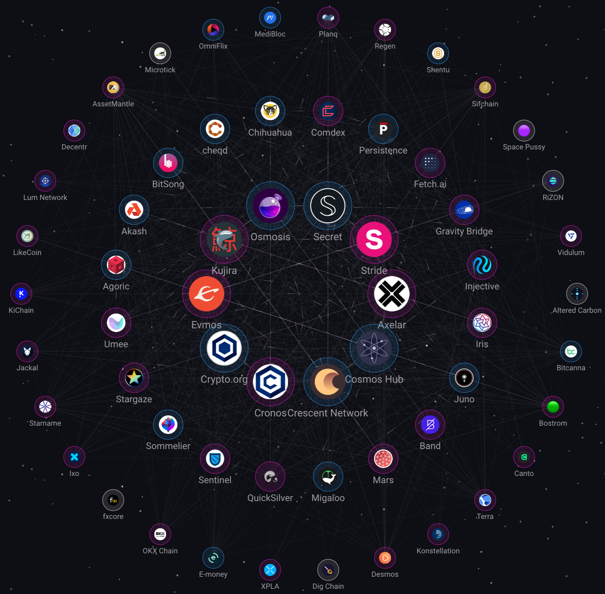
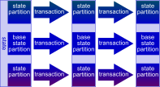
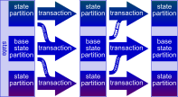
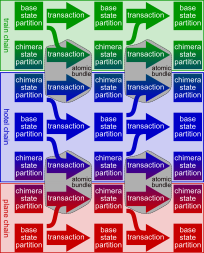
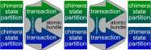
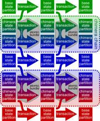
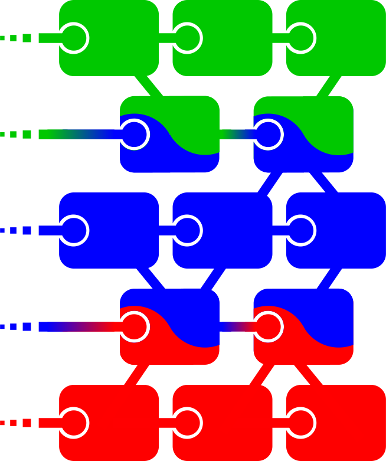
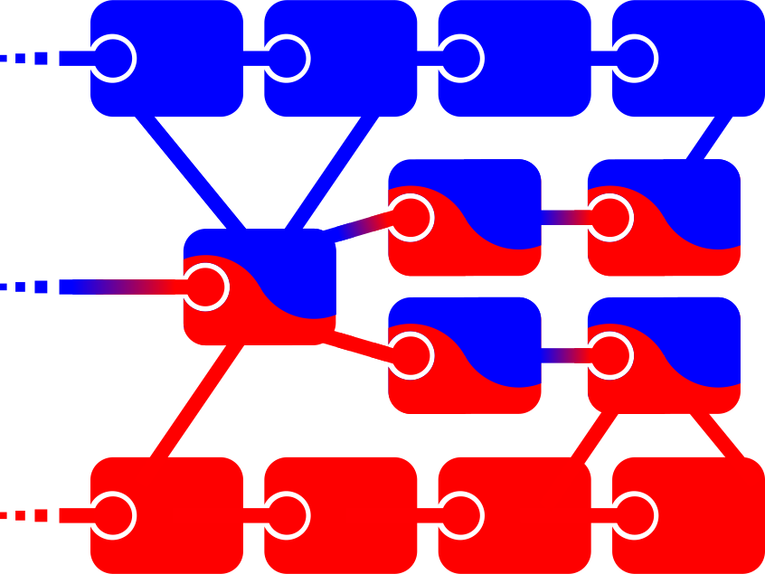
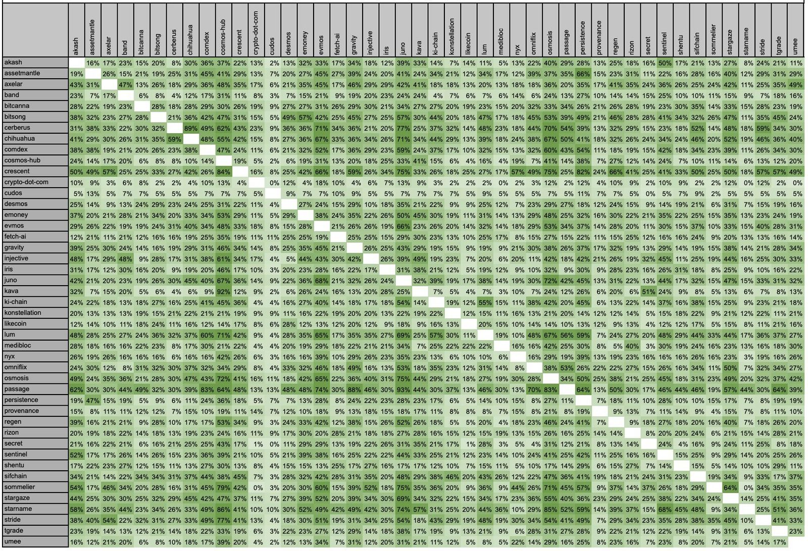

The Typhon ordering engine (part of the Anoma ecosystem) will support a new technique for cross-chain atomic commits: Chimera Chains. Chimera Chains will make on-chain transactions faster, easier, and more capable for applications that work with information across multiple overlapping (but not necessarily _identical_) instances. Chimera Chains are built on [Heterogeneous Paxos](__GHOST_URL__/heterogeneous-paxos-and-multi-chain-atomic-commits/), and represent our solution to the [Deciding Which Heterogeneous Consensus to Execute challenge](__GHOST_URL__/heterogeneous-paxos-and-multi-chain-atomic-commits/#deciding-which-heterogeneous-consensus-to-execute) introduced in [an earlier blog post](__GHOST_URL__/heterogeneous-paxos-and-multi-chain-atomic-commits/).

## Heterogeneous Trust

Like the [Cosmos ecosystem](https://cosmos.network/), Anoma is designed to support heterogeneous trust assumptions. Separate chains (called _instances_) run separate [state machines](https://en.wikipedia.org/wiki/State_machine_replication) with different trust models. For example, a chain's trust model might be [proof-of-stake](https://en.wikipedia.org/wiki/Proof_of_stake) based: the state machine tracks a staking token, and [consensus](<https://en.wikipedia.org/wiki/Consensus_(computer_science)>) requires [quorums](<https://en.wikipedia.org/wiki/Quorum_(distributed_computing)>)[backed](https://wiki.polkadot.network/docs/learn-consensus#nominated-proof-of-stake) by sufficiently large portions of stake. Other trust models might define quorums using [proof of authority](https://en.wikipedia.org/wiki/Proof_of_authority) or even [proof of work](https://arxiv.org/abs/1708.01285).

<figure>
    
  <figcaption>Cosmos zones (analogous to instances) on 2023-07-14, as mapped by mapofzones.com
</figcaption>
</figure>

While most blockchain consensus software, including [CometBFT](https://cometbft.com/), is oblivious to this heterogeneous trust, ours is not. When Anoma validators participate in multiple chains, they are explicitly aware of cross-chain opportunities. The same software processes can be use to add or even start up new instances on demand.

## Cross-Chain Atomic Transactions

Cross-chain [atomic](<https://en.wikipedia.org/wiki/Atomicity_(database_systems)>) transactions are a common and difficult problem in a multi-chain, cross trust-domain world.

### Example: The Train and Hotel Problem

Consider a [classic example](https://vitalik.ca/general/2017/12/31/sharding_faq.html#what-is-the-train-and-hotel-problem) (which we also discuss in [an earlier blog post](https://anoma.net/blog/heterogeneous-paxos-and-multi-chain-atomic-commits#hotel-and-train-example)): the user wants to buy a train ticket if and only if they can also buy a hotel room at their destination. They want to run these two transactions [atomically](<https://en.wikipedia.org/wiki/Atomicity_(database_systems)?ref=blog.anoma.net>). If they buy one, and then the other becomes unavailable, the user will be sad.

<figure>
  
  <figcaption>train and hotel problem</figcaption>
</figure>

There are a variety of ways to solve this problem, depending on how the hotel and train manage their booking systems. For example, if both use the same ledger / database / blockchain, then a single atomic transaction can try to book both, and either succeed or fail.

### Shared Sequencers

In principle, both the train and hotel can even use separate ledgers, and completely different state machines, so long as the transaction that books the train and hotel room is either placed into both ledgers, or neither. More specifically, the idea is to schedule an atomic _bundle_ of transactions: one for each ledger. Either all transactions are scheduled together, or none of them are. Various set-ups allow different ledgers to use the same system to order their transactions, such as [Espresso's Shared Sequencers](https://hackmd.io/@EspressoSystems/SharedSequencing).

### Shared Validity Sequencing

To solve our train and hotel problem, we do need _one_ additional element in addition to both ledgers either including or excluding their transaction from the atomic bundle. If it turns out that the train seat is unavailable, so the train transaction fails, we need to ensure the hotel transaction fails as well. Similarly, if the hotel room is unavailable, the train transaction must fail. This "one-bit" succeed-or-fail form of cross-ledger communication is what [Umbra Research calls Shared Validity Sequencing](https://www.umbraresearch.xyz/writings/shared-validity-sequencing).

## Heterogeneous Paxos

In [an earlier blog post](__GHOST_URL__/heterogeneous-paxos-and-multi-chain-atomic-commits/), we discussed how participant overlap enables a [consensus protocol that generalizes byzantized paxos](https://isaacsheff.com/hetcons), which we can use to [atomically](<https://en.wikipedia.org/wiki/Atomicity_(database_systems)>) commit bundles of transactions across multiple chains. When these chains happen to have precisely the same trust assumptions, this looks a lot like a [Shared Sequencer](#shared-sequencers), but Heterogeneous Paxos can work [even when their trust assumptions are significantly different](https://anoma.net/blog/heterogeneous-paxos-and-multi-chain-atomic-commits#quorums).

One challenge discussed was "[deciding which heterogeneous consensus to execute](__GHOST_URL__/heterogeneous-paxos-and-multi-chain-atomic-commits/#deciding-which-heterogeneous-consensus-to-execute)." Depending on how consensus participants overlap, it may be possible for chain _A_ to do atomic commits with chain _B_, and for chain _B_ to do atomic commits with chain _C_, but not for chain _A_ to do atomic commits with chain _C_. When this happens, we need to decide which chains each resource is available to: if two incompatible atomic bundles compete for a resource, we can get inconsistent state.

For example, a hotel booking system might be capable of atomic commits with a train booking system _or_ a plane booking system, but the train and plane systems might not be capable of atomic commits with each other. Naively, if a train+hotel bundle and a hotel+plane bundle compete for the same hotel room, the hotel room can be double-booked.

Our solution to this challenge is to explicitly partition state into portions corresponding to combinations of chains for which atomic commits are possible. Transactions can send information between partitions at any time as a transaction. For example, the hotel could keep a room in "train bookable mode" and switch it to "plane bookable mode" with a transaction communicating the relevant state between partitions. This corresponds roughly with the ["chain for each possible consensus" idea from our previous blog post](__GHOST_URL__/heterogeneous-paxos-and-multi-chain-atomic-commits/#a-chain-for-each-possible-consensus). We call these partitions _chimera chains. _

## Base Chains

We refer to each chain that defines its own validators as a _base chain_. Technically, a base chain is a [replicated state machine](https://en.wikipedia.org/wiki/State_machine_replication) that defines the set of [quorums](<https://en.wikipedia.org/wiki/Quorum_(distributed_computing)>) permitted to update the state machine. In general, transactions update each chain's state in a [serializable](https://en.wikipedia.org/wiki/Serializability) way.

When we say that state is stored _on_ a base chain, we mean that it is in a partition of state that cannot be affected by transactions in cross-chain atomic commits. State on the base chain is normal blockchain state, unaffected by other chains. Transactions committed to the base chain update state on the base chain, just like any other blockchain or replicated state machine. In general, we assume each chain's quorum definitions are on the base chain, which is consistent with [CometBFT](https://cometbft.com/) and most proof-of-stake or proof-of-authority designs.

## Chimera State Partitions

The base chain partition is one of many partitions each blockchain's state machine maintains. Each transaction can only update within one partition. This is similar to [database sharding](<https://en.wikipedia.org/wiki/Shard_(database_architecture)>), sometimes employed for scalability. In our case, however, the purpose of these shards has to do with permissions and cross-chain transactions.

Note that although transactions can only _write_ data in one partition, they can _read_ recent data (within a bounded number of commits) from any partition. This is why we prefer to think of these partitions as part of one state machine, rather than as separate state machines. To put it another way, cross-partition communication is extremely easy and can provide strong guarantees.

The partitions we care about here (besides the base partition, where quorums are defined), are *chimera *partitions. Chimera partitions store data that can be atomically updated with other chains. In our hotel / train / plane example, the hotel chain might have a partition for state that can have atomic updates with the train chain, and a partition for state that can have atomic updates with the plane chain. Crucially, this prevents hotel+train transactions from conflicting with hotel+plane transactions: they're scheduled separately. The train and hotel chains likewise have chimera partitions:

## Atomic Bundles

Transactions each update a partition, and the order of transactions on each partition is determined by the chain's [consensus](<https://en.wikipedia.org/wiki/Consensus_(computer_science)>) mechanism.

Chimera partitions use [Heterogeneous Paxos](__GHOST_URL__/heterogeneous-paxos-and-multi-chain-atomic-commits/) for consensus. This lets state on their local chimera partitions remain just as safe and live as it would on their base partition, but allows for [_atomic_](<https://en.wikipedia.org/wiki/Atomicity_(database_systems)>)_ bundles_ of transactions with other chains' chimera partitions. We support atomic bundles across any number of chains, but for simplicity, our discussion here always uses 2 chains.

<figure>
  
  <figcaption>atomic bundles shown in grey, with dashed outlines</figcaption>
</figure>

Atomic bundles are sets of transactions grouped together by their author, so that either they are all committed or none are committed. This is the _atomicity guarantee_ Heterogeneous Paxos provides. When the base chains have exactly the same trust assumptions, then the chimera chain is essentially a [Shared Sequencer](#shared-sequencers). Heterogeneous Paxos lets chimera chains be more general: the more overlap among the chains' consensus participants, the stronger the atomicity guarantee.

For example, an atomic bundle might include a transaction booking the hotel room, and a transaction booking a train ticket. The relevant state would have to be stored on the relevant chimera partition of each chain.

## Atomic Cross-Chain Communication

When a bundle is scheduled across chains, all the participants of all the chains involved can see (and agree on) the order of transactions on all the partitions involved. This means they can all maintain and update a copy of all the partitions involved.

Thus, atomic bundles enable a new feature for on-chain transactions: cross-chain atomic communication. While the transactions are being executed (after ordering is decided), transactions within a bundle can send messages to other transactions in the same bundle, and get responses. This communication is _not_ between machines in any way: each replica maintains and updates a copy of all the partitions involved, so each replica can run all the transactions, and any messages between them, locally.

For example, a hotel transaction could check if there is a room available (on the hotel's "train-bookable" partition), and then signal its findings to the train transaction, which likewise checks if there is a train seat available. Each chooses to book or not only after it has heard from the other.

Atomic communication is very different from, for example, [IBC](https://ibcprotocol.org/). All the communication happens within each replica running the state machines. There are no relayers, messages over the wire, or rounds of consensus. A transaction can even send a message to another transaction, and receive a response, atomically.

This communication is strictly more powerful than the one-bit succeed-or-fail communication found in [Shared Validity Sequencing](#shared-validity-sequencing): it allows arbitrary messages. In principle, [Shared Sequencers](#shared-sequencers) could integrate similar intra-bundle communication. This may be a fruitful area for future collaboration.

## Chimera Chains and the Chimera State Machine

At last, we have defined our chimera chains. Each chimera chain's state consists of a set of partitions: one from each base chain. The chimera chain's transactions are, in effect, the atomic bundles (which update the state). The chimera "state machine" includes a copy of the state machine defined by each base chain for its chimera partition, and these have the ability to send and receive messages within the bundle (as a syscall). We can have chimera chains spanning any number of chains (provided they meet the conditions for Heterogeneous Paxos), but our discussion here always uses 2 chains, for simplicity.

Chimera chain transactions retain the ability to read recent state from other partitions with the same base chain. This makes it easy, for example, for the hotel to transfer booking control of a hotel room from one chimera chain to another. The partition holding control of the room would have to record in state that they relinquish control, specifying which partition can assume control. In a later transaction, the destination partition reads that specification, and assumes control.

## Blockchain Representation

Each blockchain is an append-only log that appends batches of transactions (blocks), in a total order. Each base chain is its own independent blockchain. Each chimera chain is a blockchain as well. Blocks contain atomic bundles of transactions. Conveniently, transactions in each chain can reference the results of prior transactions that share a base chain. This is the blockchain representation of "reading from another partition of state."

<figure>

<figcaption>
3 Base chains: Green (train chain), Blue (hotel chain), and Red (plane chain), with chimera chains drawn between them using 2-color blocks. Each block is shown containing a hash (circle) of the previous block on its chain. Cross-chain references are drawn with lines.
</figcaption>
</figure>

## Atomicity

As we discussed in [an earlier blog post, Heterogeneous Paxos](__GHOST_URL__/heterogeneous-paxos-and-multi-chain-atomic-commits/) guarantees that base chains will agree on the blocks chosen for the chimera chain under an integrity condition (set of acceptable failures) we call the _atomicity condition_. Like the no-forking guarantee of each chain, the atomicity condition is all about which sets of consensus participants an adversary would have to corrupt in order to cause damage. Put briefly, the more overlap between the consensus participants of the base chains, the stronger the atomicity guarantee. If the base chains all use identical quorums (the same consensus participants), the atomicity guarantee is exactly as strong as the no-forking guarantee of each chain, and the chimera chain is effectively a [Shared Sequencer](#shared-sequencing).

This makes Chimera chains a bit like bridges: they allow cross-chain operations under a specific assumption that is different from (and usually weaker than) base chain operations. There are 2 big differences from more traditional trusted bridge designs:

- The atomicity condition arises naturally from the overlap in the consensus participants of the base chains, rather than some outside "bridge provider."
- Even if the atomicity condition is not met, chimera partitions retain the guarantees of their base chains: state is not lost, frozen, or corrupted. The only difference is that chimera transactions may have the wrong view of which transactions the other base chain committed to their view of the chimera chain.

### When The Atomicity Condition is not Met

One can view Heterogeneous Paxos as each base chain running their own consensus protocol to decide which blocks to commit to the chimera chain, with the added guarantee that they will agree when the atomicity condition is met.

<figure>
  
  <figcaption>Red and Blue decide on different chimera blocks when the atomicity condition is not met.</figcaption>
</figure>

When the atomicity condition is not met, each base chain still decides on a canonical chain of blocks for its view of the chimera chain (provided that the base chain has not forked). The difference is that different base chains may not agree. For example, suppose 2 conflicting hotel+plane transactions are proposed: one where Alice wants to book the last hotel room and the last plane seat, and one where Bob wants to book the last hotel room and the last plane seat. If the atomicity condition is not met, the hotel may believe Alice succeeded, and book Alice in the hotel room, while the plane may believe Bob succeeded, and book Bob on the plane.

Unlike bridge failures, an atomicity failure _cannot_ corrupt the hotel or plane booking systems themselves. The hotel and plane can still enforce their booking policies within their own transactions (e.g. who is allowed to book which type of room, or no more than 1 person per plane seat).

Unlike [multi-phase commit](__GHOST_URL__/heterogeneous-paxos-and-multi-chain-atomic-commits/#why-not-multi-phase-commits) failures, _no amount of failures_ on one chain can freeze resources on the other chain, or even force a timeout, so long as the other chain's failure assumptions are still met. If the hotel puts control over a room into a hotel+plane chimera chain, and the plane booking system crashes (e.g. a 51% attack), that hotel room is not stuck: the hotel can still update it or even move it back to the base chain, exactly as normal.

<figure>

<figcaption></figcaption>
</figure>

From a state partition and transactions point of view, if 2 base chains of a chimera chain (say, Red and Blue) don't meet the atomicity condition, they may each end up maintaining an incorrect view of the transactions the other chain has chosen, and, as a result, the state of the other chain's chimera partition. While this view of the other chain's chimera partition isn't formally part of the chain's state, it is necessary for computing any atomic communication within atomic bundles.

### Proof-of-Stake Atomicity Conditions

For chains with a straight-forward proof-of-stake based consensus, the atomicity condition is similarly straight-forward. In these chains, any set of consensus participants that hold more than 2/3 of the stake are a quorum. A base chain can fork if an adversary corrupts consensus participants holding at least 1/3 of its stake.

For these chains, chimera chains require only that there is more than 2/3 stake-holder overlap. (Specifically, each stake-holder's overlap is the minimum of the fraction of the stake it holds on each chain, and the total overlap is the sum of all stake-holders' overlaps.) If the stake-holder overlap is 2/3 + _x_, then the atomicity condition is: an adversary must control consensus participants with _x_ overlap in order to break atomicity. Naturally, when the stake-holder overlap is 1, the atomicity condition is the same as the no-forking requirement.

Evidence from the Cosmos ecosystem suggests that many chains should be able to support Chimera chains:

<figure>

<figcaption>
<a href="https://twitter.com/ObadiaAlex/status/1626657258200506368/photo/1" target="_blank">stake-holder overlap among cosmos chains</a>
</figcaption>
</figure>

## Anoma Resources and Partitions

The Anoma state machine represents state as _resources_: a generalization of UTXOs featuring immutable but consumable units of state. Each transaction consumes some resources and produces some new resources.

This presents us with a very clean model for moving control of state between partitions. A resource can specify a partition, and specify that a transaction may consume this resource if that transaction also produces an analogous resource on another "destination" partition. It can even specify which destination partitions are acceptable. Our mechanism for moving state between chimera chains becomes clear: each resource has a partition, and can move between partitions with a transaction.

## Future Directions

So far the Chimera Chains we've discussed use a Heterogeneous Paxos setup where the chimera partitions retain all the usual guarantees / failure assumptions of the base chains. A hotel room in the hotel+train partition, for example, remains bookable and obeys hotel invariants under exactly the same conditions as a hotel room on the base partition.

However, it is possible to build chimera-ish chains with other guarantees. A chain might, for example, establish some chimera-ish partitions that use _larger_ quorums than the base chain, [sacrificing some liveness for safety](__GHOST_URL__/heterogeneous-paxos-and-multi-chain-atomic-commits/#decreasing-liveness-or-increasing-safety). State in this partition is more likely to be frozen (a smaller adversary could prevent updates), but less likely to fork (it would take a larger adversary to commit 2 conflicting transactions). Such a partition would _also_ open up an opportunity for chimera chains (committing atomic bundles) with more base chains, since larger quorums will increase overlap.

In the extreme, we can always make a chimera-ish chain for cross-chain atomic commits between any set of chains, so long as they are willing to create a chimera-ish partition that uses big enough quorums. Partition quorums that are exactly the union of one quorum from each base chain would work, for example. Such a chimera-ish chain would have similar liveness guarantees, but possibly better latency, compared to [a multi-phase commit across the base chains](https://anoma.net/blog/heterogeneous-paxos-and-multi-chain-atomic-commits#why-not-multi-phase-commits).

Programming on these chimera-ish chains would be challenging. We need to make clear to programmers exactly what guarantees they are gaining, and what guarantees they are losing, when they move control of state between partitions.

## Conclusions

Chimera Chains are a new method for fast and atomic cross-chain transactions when multiple chains have sufficient validator overlap. They present an extremely general and flexible programming model that only requires a small addition to each base chain's state machine, allowing for cross-transaction messaging within atomic bundles.

Chimera chains are intended to "make the easy thing easy." When a set of chains have a lot of overlap, it should be fast and easy to do cross-chain transactions, and with Chimera chains, it will be.

[Questions? Join the discussion on the forum!](https://research.anoma.net/t/discussion-typhons-chimera-chains)
