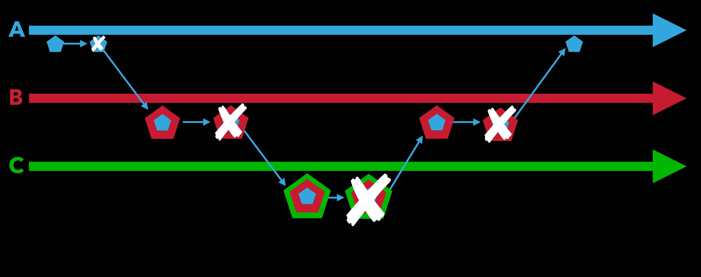
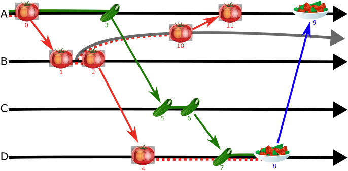
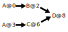

Here we set out to _generalize_ the "wrapped tokens" from [IBC](https://github.com/cosmos/ibc/blob/8d9d3b6fe7309b034df8457760b3bbd11d24b8e1/archive/papers/2020-05/build/paper.pdf#L2) and [ICS20](https://github.com/cosmos/ibc/blob/main/spec/app/ics-020-fungible-token-transfer/README.md).
We create a sound and efficient way to safely transfer arbitrary mutable digital objects (not just tokens) between mutually distrusting chains, tracking precisely how "trustworthy" each object is, and what "promises" each chain has made. 
Our approach is based on [taint tracking](http://www.tcse.cn/~wsdou/papers/2022-dsn-dista.pdf) and _endorsement_ from [Information Flow Control](https://en.wikipedia.org/wiki/Information_flow_(information_theory)) research, with the added twist that modern blockchains can have the power to _review_ and _verify_ histories of other chains, using [recursive ZKPs](https://eprint.iacr.org/2021/370), [optimistic proofs](https://www.coindesk.com/tech/2024/03/19/optimism-finally-starts-testing-fault-proofs-at-heart-of-design-and-of-criticism/), or simply fully replicating the other chain's state machine.

TODO: actual ART-report link

The full details are in our [technical report](https://www.dropbox.com/scl/fi/84mxa8jb7muiar76twg16/art_controllers-9.pdf?rlkey=xcaj31k59riay7cvqwwi73s13&dl=0), but here we explain what properties we are trying to maintain, why we think these properties are important, and how they fit into the larger Anoma ecosystem, while touching only briefly on some of the machinery under the controller tag operations.

## Introduction
In [distributed systems](https://en.wikipedia.org/wiki/Distributed_computing), [mutable digital objects](https://en.wikipedia.org/wiki/Object_(computer_science)) typically require some [state machine](https://www.cs.cornell.edu/fbs/publications/SMSurvey.pdf) to decide on their definitive current state.
This [state machine can be replicated](https://en.wikipedia.org/wiki/State_machine_replication) to enhance availability and fault tolerance.
We call the authoritative state machine of a digital object its _controller_.

For example: bank accounts are mutable digital objects; their controller is the bank's database.
Tokens and NFTs are objects; their controller is a blockchain. 
Most of the files on most computers could be called mutable digital objects, and the controller of each is the computer it's stored on.

Without some kind of controller, different parties may have contradictory notions of what the state is, and no way to reconcile them.
In a distributed system, some controllers may be [Byzantine](https://en.wikipedia.org/wiki/Byzantine_fault), and make duplicitous or incoherent statements about state. 
In general, an object is only as _trustworthy_ as its controller: if Alice's bank account says she has lots of money, but Bob doesn't trust Alice's bank, then Alice's "money" doesn't mean much to Bob. 

In general, applications can only use objects on the same controller: ethereum transactions only use ethereum smart contracts and accounts, and so on.  
Unfortunately, when applications need to share a controller  to interact, there is an incentive to push all applications onto one controller trustworthy enough (and with enough throughput) for everyone. 
Attempts to create such a controller typically require trust in a single authority (e.g. [AWS](https://aws.amazon.com/appsync/)) or an extremely expensive global consensus (e.g., [Ethereum](https://github.com/ethereum/wiki/wiki/White-Paper)) and remain inadequate for some applications:
 JP Morgan does not trust Ethereum to control their accounts, [which is why they maintain their own generic application controller](https://www.jpmorgan.com/onyx/about).
In fact, it is unlikely that _all_ worthwhile applications will ever agree on a controller who can manage all of their state.
This is why interoperability is so important: the internet works not because we all trust some single authority to manage all of it but because many different applications in different trust domains can interact. 

Here we are concerned with cases where objects can be _transferred_ between controllers, and therefore we have to track which controllers may have affected each object.
If there are any properties or invariants the object is supposed to maintain, there are the controllers that may have "messed up" the object. 
In the simplest case, we might imagine tagging each object with a set of _affecting controllers_.
In general, if an application (or a user) trusts all the affecting controllers in an object's tag, it can rely on that object.
A simple but effective set of rules would be:
- When an object is created, its affecting controllers set is whatever controller is authoritative for the object.
- When an object transfers to a new controller, we add the new controller to its affecting controllers.
- If an object updates its state based on the state of other objects (e.g. receiving a bank transfer from another account), we add the affecting controllers from all dependency objects to this object's affecting controllers. 
This solution is very similar to [taint tracking](http://www.tcse.cn/~wsdou/papers/2022-dsn-dista.pdf) or in Programming Language & Distributed Systems research: each object is "tainted" by its affecting controllers, and contributes that "taint" to everything that depends on it. 

The tricky part is in _removing_ controllers from objects' tags.
A common case in blockchain systems is to move an object from some chain (let's call it _base chain_) to some other chain (let's call it _L2_), do some stuff, and then move the object back to _base chain_. 
We then want _base chain_ to somehow "review" the changes made on _L2_, and somehow be able to treat the object like it was never on _L2_ at all.
We need to remove _L2_ from the object's tag.
In [Information Flow Control](https://en.wikipedia.org/wiki/Information_flow_(information_theory)) research, this is similar to _endorsement_, [a fairly well-explored problem](https://doi.org/10.1145/3133956.3134054).

<figure>
    
  <figcaption>with [IBC](https://github.com/cosmos/ibc/blob/8d9d3b6fe7309b034df8457760b3bbd11d24b8e1/archive/papers/2020-05/build/paper.pdf#L2) and [ICS20](https://github.com/cosmos/ibc/blob/main/spec/app/ics-020-fungible-token-transfer/README.md), users can transfer tokens between chains, "destroying" the original, and creating "wrapped" tokens, which are "unwrapped" when they are transferred back. 
</figcaption>
</figure>
TODO: better IFC-style wrapping/unwrapping diagram

The blockchain setting, however, introduces a unique twist: instead of relying on _trust_ as the main basis for endorsement, modern blockchains can have the power to _review_ and _verify_ histories of other chains, using [recursive ZKPs](https://eprint.iacr.org/2021/370), [optimistic proofs](https://www.coindesk.com/tech/2024/03/19/optimism-finally-starts-testing-fault-proofs-at-heart-of-design-and-of-criticism/), or simply fully replicating the other chain's state machine.
This means that we can remove controllers from objects' tags not because of some trust relationship, but because the right controllers remaining in the tag have reviewed the relevant controllers, and promised not to endorse any contradictory forks. 

TODO: actual ART-report link

In our [technical report](https://www.dropbox.com/scl/fi/84mxa8jb7muiar76twg16/art_controllers-9.pdf?rlkey=xcaj31k59riay7cvqwwi73s13&dl=0), we define rules and procedures for creating, updating, transferring, and tracking the state of tagged objects, and prove that our rules maintain safety properties including _causal resource history_ and _consistent controller tags_.
In this blog post, we explain what properties we are trying to maintain, why we think these properties are important, and how they fit into the larger Anoma ecosystem. 
We will touch on some of the machinery under the controller tag operations, but leave most of those details to the [technical report](https://www.dropbox.com/scl/fi/84mxa8jb7muiar76twg16/art_controllers-9.pdf?rlkey=xcaj31k59riay7cvqwwi73s13&dl=0).

## System Model
### Resources

TODO: for the blog post, this section could be shorter somehow. 

The digital objects we use in Anoma are called [resources](https://zenodo.org/doi/10.5281/zenodo.10498990).
We can encode extremely general mutable state with resources, but resources themselves are fairly simple.
Resources have very limited mutable state: they are _not yet created_ by default, can transition to _created_, and then to _consumed_.
However, each resource can carry arbitrary immutable data, specified by the resource's unique ID (which can be a hash).

Each controller's state carries cryptographic accumulators (e.g. [Merkle roots](https://doi.org/10.1007/3-540-48184-2_32)) representing the set of resources created by transactions ordered by this controller and the set of resources consumed.
If a resource is neither created nor consumed, it is _not yet created_.
As part of their immutable data, resources can have complex proof obligations (which we call _resource logics_) determining when they can be created or consumed, and these may depend on the state of other resources.
A resource logic can for example, specify exactly what programs can consume this resource: it would require a proof that the resources created are precisely the outputs of running a particular program with the consumed resources as inputs.
Such a proof might be as simple as a full execution trace of the program, or as complex as a [zero-knowledge proof](https://eprint.iacr.org/2021/370).
Through these logics, resources can encode fairly arbitrary state, not limited to scalar registers or tokens, while still allowing [ZKP-style confidential transactions](https://zenodo.org/doi/10.5281/zenodo.10498990).
Crucially, resource logics can also constrain _where a resource can be transferred_: not all resources will be able to be transferred to all controllers. 

### Controller Tags
Each resource's _controller tag_ is part of this immutable data.
It details which controllers define this resource's state.
Resources transition between these states in transactions ordered by controllers.
Each resource's tag therefore specifies a single controller that can order transactions for each type of transition, ensuring there is a single authority in charge of deciding whether each transition has or has not occurred:
- The resource's _creating controller_ determines if the resource has been created.
- The resource's _terminal controller_ determines if the resource has been consumed.
Transactions which perform a state transition but are ordered by the wrong controller are _invalid_.

### Transactions
All state updates occur in [Transactions](https://en.wikipedia.org/wiki/Database_transaction): atomic updates that designate a set of _input_ resources (which must be previously _created_) that are _consumed_, and a set of _output_ resources (which must not yet have been created) which are _created_.
Transactions can only update state controlled by one controller, and must include checkable proofs that the relevant resource logics of each resource created or consumed are satisfied.
However, input resources may have been _created_ in a transaction on another controller.
Therefore, controllers can sync with one another, allowing transactions to check if resources on other controllers have been created.
These updates can be asynchronous, so it is possible a transaction will not immediately be able to prove that a resource has been created.

### Controllers
Controllers order transactions: each controller decides on an ever-growing sequence of transactions defining the execution _trace_, and thus the current state, of a state machine.
Controllers do not necessarily compute and store this state themselves, although it may be efficient to do so.
Committing to an ever-growing sequence of transactions, however, does require that controllers keep _some_ state, to ensure they do not _fork_: commit two contradictory traces (neither is a prefix of the other).
Forks are the essence of, for example, [double-spend attacks](https://dahliamalkhi.wordpress.com/wp-content/uploads/2016/08/blockchainbft-beatcs2017.pdf).
A controller which commits invalid transactions or forks can be called _unsafe_ or [Byzantine](https://en.wikipedia.org/wiki/Byzantine_fault).

## Controller Tag Properties
### The Ideal: Serializable Resource History (SRH)
[Serializabile](https://jepsen.io/consistency/models/serializable) (part of [ACID](https://en.wikipedia.org/wiki/ACID)) transaction scheduling is a gold standard for "[consistency](https://en.wikipedia.org/wiki/Consistency_model)" in database, distributed system, and blockchain research. 
Here, we consider a resource's history to be the transaction that made it, and all of that transaction's inputs' resource histories. 
This collection of transactions is _serializable_ when there is some total (serial) order in which these transactions could have run, one at a time, consuming and producing resources in some global state.
A resource with SRH has no double-consumes in its history (under some assumptions, no double-consumes may be _equivalent_ to serializability). 

TODO: diagram about serializability

Unfortunately, guaranteeing SRH is very expensive to maintain, precisely because it is not _composable_: if one resource depends on one side of a double-spend, and another resource depends on another side of a double-spend, then even if they individually have SRH, anything that depends on both of them cannot have SRH.
Systems that guarantee SRH therefore require expensive checks with every transaction, even transactions that use only resources with the same terminal (and creating) controller. 

### Weaker but Cheaper: Causal Resource History (CRH)
[Causal Consistency](https://en.wikipedia.org/wiki/Causal_consistency) is weaker than serializability, but comparatively easy to maintain.
For our purposes, a resource has Causal Resource History (CRH) if it is the result of a valid transaction, and all the inputs to that transaction have CRH. 
CRH rules out resources created "out of thin air," or transactions that violate resource lgoics. 
It does not, however, rule out forks, and therefore it does not prevent double-spends. 

TODO: diagram about causal consistency

In our implementation, we'll use a simple technique to maintain CRH, and then build on it for stronger properties (CCT).
The core idea is that in order to _prove_ that a transaction is valid, we require proof that all its inputs have CRH.
This is an excellent use-case for [recursive zero-knowledge proofs](https://eprint.iacr.org/2021/370).

### A Little Trust Goes a Long Way: Consistent Controller Tags (CCT)
The _Consistent Controller Tags_ property (CCT) requires that if some resource does not have SRH, then its Controller Tag has a set of _affecting controllers_, one of whom is Byzantine.
With CCT, if an application (or a user) _trusts_ that a resource's affecting controllers are all safe, they can be sure the resource has SRH. 

Unfortunately, CCT (by itself) is not composable either: it allows resources with SRH (say, from both sides of a double-spend) to have empty _affecting controllers_ sets, so transactions require non-local checks to determine if each output has CCT.
Fortunately, we can keep track of information in each resource's controller tag that allows us to (conservatively) guarantee CCT with only local checks in each transaction.

One easy way to maintain CCT would be to start with a system that maintains CRH, and label every resource with every controller involved in its history (affecting controllers). 
If all the controllers are safe, then the resource has SRH. 
This technique, however, doesn't allow us to produce resources with smaller affecting controllers sets than their dependencies. 
Resources' descendants would be ever less trustworthy, and require ever larger tags. 
Furtunately, with a little bookkeeping, we can enable safe controller tag reductions using endorsement.

## Generalizing Wrapped Tokens to Controller DAGs: a Technique for CCT

With [IBC](https://github.com/cosmos/ibc/blob/8d9d3b6fe7309b034df8457760b3bbd11d24b8e1/archive/papers/2020-05/build/paper.pdf#L2) and [ICS20](https://github.com/cosmos/ibc/blob/main/spec/app/ics-020-fungible-token-transfer/README.md), users can transfer tokens between chains, creating "wrapped" tokens, which are "unwrapped" when they are transferred back. 
The origin chain maintains a record of tokens it has sent (specifically, a count of how many went out to each destination).
This represents a kind of "promise": the origin chain will accept (and unwrap) tokens sent back from the destination chain.
It also maintains a key safety property: no more tokens can be sent back than were sent out. 

The wrapped tokens, meanwhile, maintain a kind of "history": each layer of wrapping represents a chain.
Each time they are sent, a new layer is added, and each time they are returned, a layer is removed. 

For general-purpose resources, however, we need to generalize both the records kept by sending chains, and the histories kept by resources.

### Salad Example
TODO: better svg (especially for dark mode)
<figure>
    
  <figcaption>Timelines for 4 controllers, and resources for a virtual cooking application. Controllers are labeled with letters, and resources are labeled with numbers. Controller B has forked into two timelines (gray and black). Resources 10 and 11 _conflict_ with resources 2, 4, 8, and 9.
</figcaption>
</figure>
Suppose four controllers (A,B,C, and D) order transactions for a virtual cooking application.
In the beginning, a tomato resource (0) and a cucumber resource (3) are on controller A.
The tomato resource transfers to B (resource 0 is consumed, requiring whatever proofs are required to move a tomato, and resource 1 is created), and then, after some B-only transactions, it transfers to D (resource 4).
Likewise, the cucumber resource transfers to C and then to D (resource 7).
On D, a transaction consumes both the tomato and cucumber resources to create a salad resource (resource 8). 
At this point, the salad resource's history depends on A, B, C, and D.
These are the _affecting controllers_ of the salad's tag.
The salad then transfers from D to A, where the tomato and cucumber began.
Eventually, we want to allow A to _endorse_ the salad's history, pledging not to endorse any alternative histories in which the cucumber or tomato did anything else, and removing the need to remember that B, C, or D could have ``tainted'' the salad's history.
They can be removed from the affecting controllers of the salad's tag.

In this example, tomatoes are not supposed to be duplicated: they can be consumed only once.
Suppose, however, that controller B has forked, producing a _conflicting_ tomato (resource 10), which is then transferred to controller A (resource 11).
To maintain CCT, we therefore need to ensure that any resource with a history depending on both sides of the fork (such as resources 9 and 11) _must_ include an unsafe controller (such as B) in its tag. 
This requirement is tricky to reconcile with the notion of _endorsement_ and removing affecting controllers from the salad's tag. 

### Controller Endorsement
The key ingredient to enable safe controller tag reduction is _endorsement_.
Each controller maintains an _endorsement map_: for each other controller, it stores a digest (such as a merkle root) of the most recent state it has endorsed, and it only updates that digest if it can prove that the new digest is the result of a sequence of valid transactions starting with the previous digest. 
In principle, these proofs can be done with [recursive ZKPs](https://eprint.iacr.org/2021/370), [optimistic proofs](https://www.coindesk.com/tech/2024/03/19/optimism-finally-starts-testing-fault-proofs-at-heart-of-design-and-of-criticism/), or simply fully replicating the other controller's state machine history.

The fundamental notion of chains _endorsing_ each other, pledging not to endorse contradictory histories, is very powerful. 
It means that endorsing both sides of a fork requires forking: only a forked controller can endorse (both sides of) a fork. 

### Send and Receive Records
In our solution (the details of which are in our [technical report](https://www.dropbox.com/scl/fi/84mxa8jb7muiar76twg16/art_controllers-9.pdf?rlkey=xcaj31k59riay7cvqwwi73s13&dl=0)), we generalize the records controllers keep during a transfer. 
The sending controller creates a _send_ record, which stores where the resource was sent, and the receiving controller creates a _receive_ record, which stores where the resource came from. 
When a Controller receives a resource transferred from another controller, it must first endorse a digest of that controllers' state which includes the corresponding _send_ record. 
This ensures, among other things, that controllers cannot receive resources _directly_ from both sides of a fork. 

Send records have a notion of "parents": send records whose corresponding receive records on this controller are in the history of the resource sent. 
These parental relationships track the causal history of resources between controllers. 

### Controller DAGs
We also generalize the notion of "wrapped" tokens, which keep a list of affecting controllers, to a _DAG_ in each resource's controller Label.
Specifically, this is a DAG of references to send records on which this resource depends. 
In our salad example, resource 9 would have DAG:

TODO: better DAG (especially for dark mode)
<figure>
    
  <figcaption>Resource 9's controller DAG. Send objects written "X@y" are the objects stored on controller X when they sent resource y.
</figcaption>
</figure>
We want to be able to reduce this to as small as possible, ideally only referencing controller A, since that's where the resources started and finished.

### Reduce Proofs
Our endorsement process makes it possible to create a _reduce proof_ for a send record, showing it is safe to remove this send record from resources' controller DAGs (edges are added between all parents and all children).
This process is intricate, but the core concept relies on _parental endorsement_.
Before a send record can be removed, the controllers of its parents must endorse its controller. 
This ensures that if the send record's controller has forked, and both sides of the fork are removed form resources' controller DAGs, they still have a (forked) Byzantine controller in their DAGs: the original send record's parent's controller. 
We also have to update the "parental" graph of send and receive records: the "children" of the "removable" send record become "children" of its parents. 
Parental endorsement turns out to be very powerful: in fact, we cannot generally remove send records without parents. 

### Checking SRH
It is possible to check if a resource has SRH, but it requires getting recent state roots from all its _affecting controllers_, and their endorsement map entries for each other, and checking if there is some sequence of transactions from the endorsed states to the most recent states.
With enough recursive ZKPs, this could be an acceptable computation out-of-band, but it's very expensive to do as part of every transaction. 
This is where a little trust goes a long way: if applications (or users) have specific controllers they trust to maintain specific resources, then they can do fast computations with cross-chain resources while maintaining rigorous guarantees.

## Conclusion
The anoma ecosystem will feature digital resources which can easily transfer across mutually-distrusting instances.
Our controller tag infrastructure allows applications to make specific guarantees about their resources.
By maintaining CCT, applications can use resources whose controllers they trust, and be sure they're working with serializable resource histories, ruling out double-consumes. 

Our infrastructure allows controllers to endorse one another with detailed proofs, but crucially, this can be done _out of band_, and does not depend on the number or frequency of resource transfers between them. 
Controllers can periodically check each other regardless of transfer activity.
This is probably a good idea anyway: it helps detect forks if and when they do actually happen, and adds "trustworthiness" to controllers who have been endorsed by lots of other controllers. 

Chains (or resource holders) can systematically find "removable" send records, and create _reduce proofs_. 
Resource holders can periodically search for such proofs to simplify the controller DAGs of their resources. 
These processes can also be done out of band: removing unnecessary old history whenever the opportunity arises. 

