Under some conditions, Heterogeneous Paxos allows for atomic cross-domain transactions, where learners do not necessarily share the same failure assumptions. Building on Heterogeneous Paxos, we hope to exploit the high intersection between validator sets of different blockchain to create a heterogeneous consensus protocol for atomic multi-chain transactions. This will extend the capabilities of IBC to allow for arbitrary communication between chains within an atomic transaction.

## Objective

We want to enable [atomically](<https://en.wikipedia.org/wiki/Atomicity_(database_systems)>) committing batches of transactions across multiple chains. Another way to look at each batch is as a single, multi-chain transaction, composed of sub-transactions on each chain, and communication between them.

## Hotel and Train Example

Consider a classic example: the user wants to buy a train ticket if and only if they can also buy a hotel room at their destination. They want to make these two transactions [atomically](<https://en.wikipedia.org/wiki/Atomicity_(database_systems)>). If they buy one, and then the other becomes unavailable, the user will be sad.

Imagine that the hotel booking system and the train ticket booking system are managed on separate blockchains (_red chain_ and _blue chain_). Each chain may have multiple proposed next blocks, each containing some transactions. In some of those blocks, the user succeeds in their purchase, and in some they fail:

<figure>

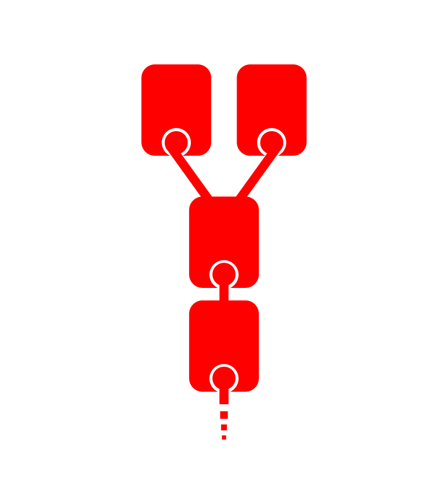
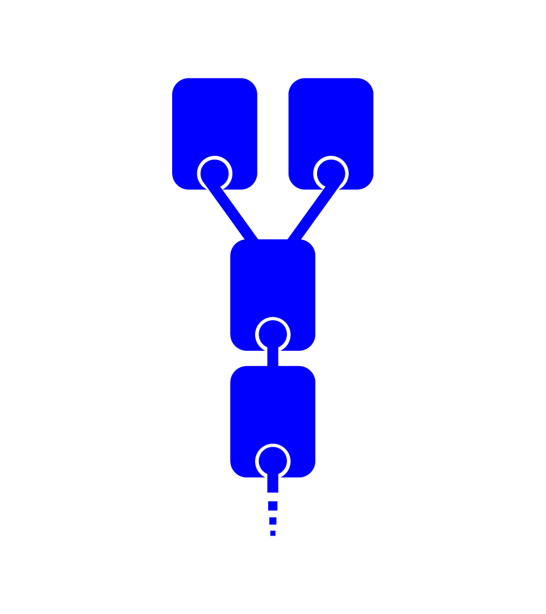

<figcaption> Red chain and Blue chain, each with 2 proposed highest blocks</figcaption>
</figure>

Ultimately, however, each chain must choose which block to commit: which block the next block must reference. Any process a chain uses to make this decision is called [consensus](<https://en.wikipedia.org/wiki/Consensus_(computer_science)>). In today's blockchain systems, they choose independently:

<figure>

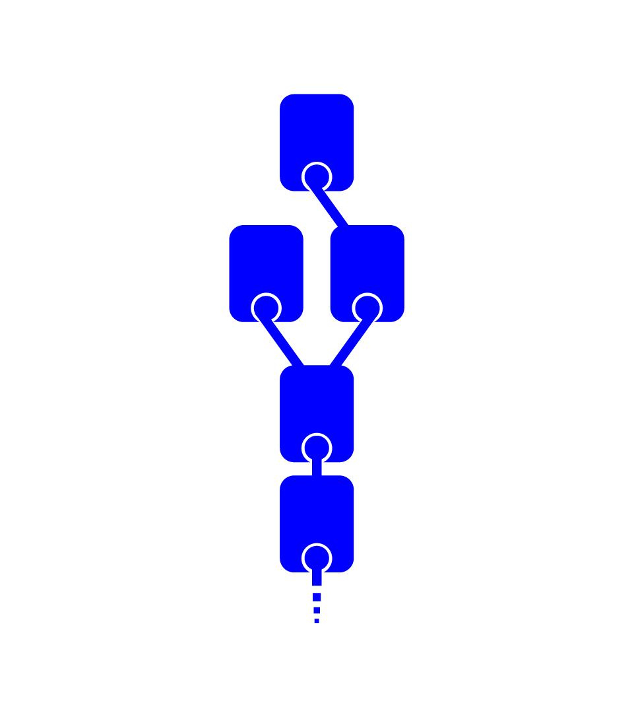

<figcaption>Red chain and Blue chain each make a choice</figcaption>
</figure>

Hopefully for our user, either both purchases were successful, or both failed. Unfortunately, we haven't added anything to provide any guarantee!

We want to provide some way to bundle transactions together. We can imagine these as a single block for both chains:

<figure>
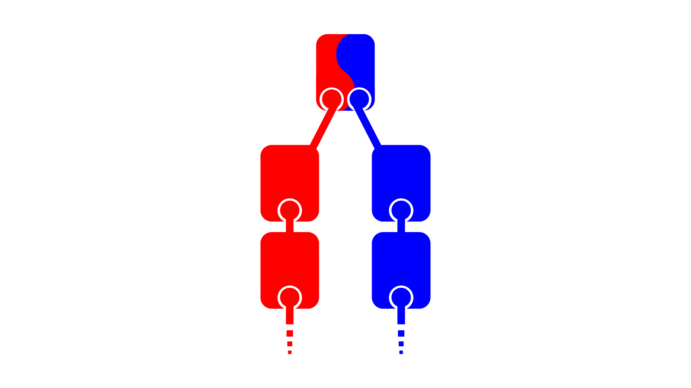
<figcaption>A block on both Red and Blue chains!</figcaption>
</figure>

In practice, such a block would contain some transactions to run on one chain, and some to run on the other.

Unfortunately, merely bundling transactions together is not enough. It is possible one chain will choose to use the combo block, and the other will not. For example, if blue chain incorporates the combo block, but red chain does not, the red chain transactions in the combo block would be effectively meaningless.

<figure>
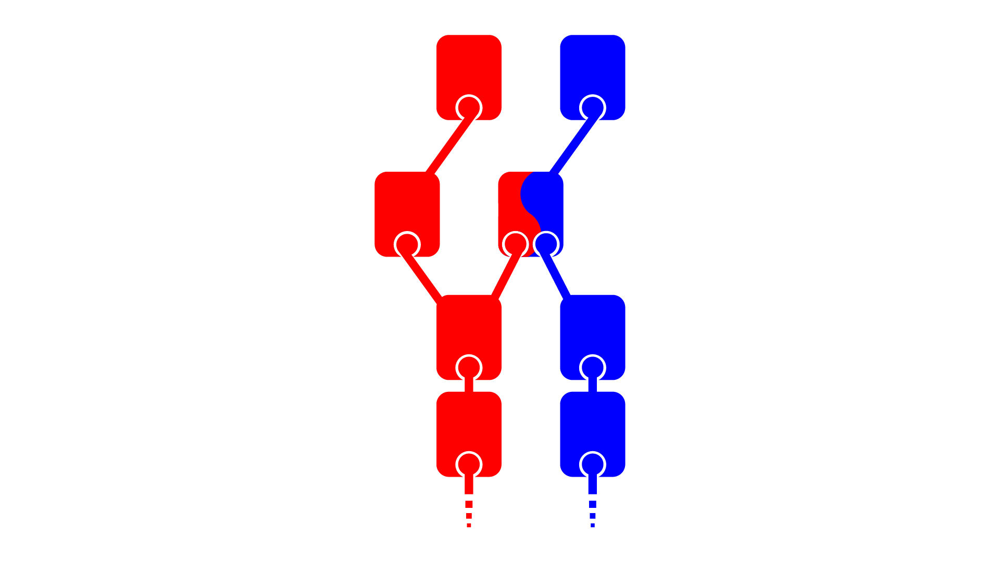
<figcaption>Blue chain chose the combo block, but Red chain did not!</figcaption>
</figure>

What we need is some kind of adaptation to the chains' consensus protocols that would allow them to guarantee (under _some_ conditions) they'd both agree to choose or ignore the combo block. Then the user could be sure that (under some conditions) they'd either end up with both a hotel room and a train ticket, or neither (but not just one).

<figure>
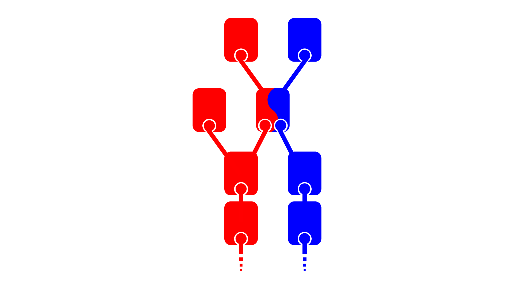
<figcaption>Both chains chose the combo block!</figcaption>
</figure>

[Heterogeneous Paxos](https://doi.org/10.4230/LIPIcs.OPODIS.2020.5) is one consensus protocol that may allow us to build such multi-chain atomic transactions.

## Why Mess With Consensus for Multi-Chain Atomic Transactions?

While [IBC](https://ibcprotocol.org/) allows verified transmission of information across chains, it can only communicate _between transactions_. In particular, [IBC](https://ibcprotocol.org/) cannot support a transaction in which a smart contract on Chain A sends a message to a contract on Chain B, and then Chain B replies back to Chain A, all within the same transaction.

## Why Not Multi-Phase Commits?

Of course, we could simulate atomic transactions by building a [multi-phase commit protocol](https://en.wikipedia.org/wiki/Two-phase_commit_protocol), with the different chains' state machines as participants, and [IBC](https://ibcprotocol.org/) as the network. This is essentially the approach taken in [Atomic Cross-Chain Swaps](https://arxiv.org/abs/1801.09515). This plan has three drawbacks: speed, liveness, and a game theoretic problem.

### Speed

A multi-phase commit requires at least 2 rounds of consensus for each chain. We propose to commit everything within one combined round.

### Liveness

The final _commit_ phase of a multi-phase commit protocol can only proceed once all chains have completed the previous phases. This means that each chain (or at least whatever assets are involved in the multi-chain atomic transaction) becomes at _most_ as available as the _least_ available chain involved: If any one chain crashes, none of them can progress. We hope to gain a more nuanced agreement / liveness tradeoff where transactions and chains can specify exactly the conditions under which they demand agreement and termination.

### Game Theoretic Problem

Some chain must perform the final state transition before the commit phase can begin. This gives that chain, in some sense, a _free option_: it can choose when (or if) the cross-chain atomic transaction completes. This could be useful in cases of cross-chain trades and fluctuating prices. [Atomic Cross-Chain Swaps](https://arxiv.org/abs/1801.09515) tries to address this problem with hash-locked assets to disincentivize a chain from permanently delaying a transaction. Unfortunately, this cannot generalize to all possible cross-chain transactions (with arbitrary smart contracts). Of course, this "last to pre-commit" problem exists within each chain's consensus algorithm as well, so we hope to extend existing consensus fairness techniques to include cross-chain atomic commits.

## Quorums

Any consensus with [immediate finality](https://hal-cea.archives-ouvertes.fr/cea-03080029) can be described in terms of [quorums](<https://en.wikipedia.org/wiki/Quorum_(distributed_computing)>). A quorum is any set of participants (machines, also called nodes, validators, acceptors, or voters) that can communicate among themselves and decide once and for all which block goes next on the chain, without communicating with anyone else. Often, [any set that contains more than two thirds of the participants](https://lamport.azurewebsites.net/pubs/byz.pdf) (or participants owning more than two thirds of the stake) is a quorum. Crucially, [every pair of quorums within the same consensus must have an honest participant in their intersection](https://people.cs.umass.edu/~arun/cs691ee/reading/BQS97.pdf) in order to guarantee the chain doesn't fork. Otherwise, if all the participants in the intersection of quorums A and B are dishonest, they can [bisimulate](https://lamport.azurewebsites.net/pubs/byz.pdf), and behave one way for the purposes of quorum A, and another way for the purposes of quorum B, so nothing can guarantee quorums A and B decide on the same block. If two quorums each decide on a different block, the chain forks.

### Example

Consider red chain and blue chain. Red chain has 3 quorums, drawn below as red triangles. Each red quorum intersects each other red quorum, and red chain users accept that if one of those intersections contains no honest participants, red chain may fork.

Likewise, blue chain has 3 quorums, drawn below as blue rectangles. Each blue quorum intersects each other blue quorum, and blue chain users accept that if one of those intersections contains no honest participants, blue chain may fork.

Note that neither chain has a single point of failure: no participant is in all the quorums of any chain.

<figure>

<figcaption>3 intersecting Red tirangular quorums, and 3 intersecting Blue rectangular quorums</figcaption>
</figure>

Now suppose that, [as is common for proof-of-stake blockchains,](https://youtu.be/7k1d6jrb7TU) there are some participants in both red quorums and blue quorums. In our diagram, these intersections become purple triangles:

<figure>
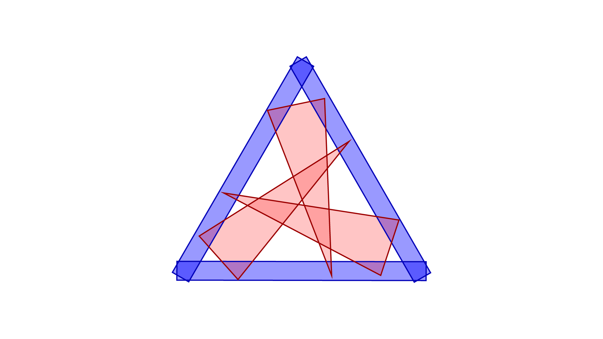
<figcaption>2 sets of 3 intersecting quorums</figcaption>
</figure>

### Best Case Scenario

If a user believes each of these red-blue intersections contains an honest participant, they should be able to commit atomic multi-chain batches of transactions with red and blue chains. Each chain's quorums remain the same: a red quorum is sufficient for red chain to decide, and a blue quorum is sufficient for blue chain to decide. However, we need to adapt both red and blue's consensus algorithms so that an honest participant in both can ensure they don't disagree on whether to commit a shared batch of transactions. This is precisely what [Heterogeneous Paxos](https://doi.org/10.4230/LIPIcs.OPODIS.2020.5) does.

### When Assumptions are Wrong

Crucially, each such atomic multi-chain batch of transactions comes with assumptions about the conditions under which it will be atomic: in this case, that each red-blue intersection has an honest participant. When such a batch has an incorrect assumption, it's possible that one chain will commit the multi-chain batch, but the other chain will not. In our train and hotel room example above, this could result in the user getting a train ticket, but no hotel room.

Fortunately, [Heterogeneous Paxos](https://doi.org/10.4230/LIPIcs.OPODIS.2020.5) cannot cause either chain to get stuck because something has gone wrong on the other chain: each quorum is still sufficient to make its chain decide. This is distinct from, for example, [Stellar Consensus Protocol](https://www.stellar.org/papers/stellar-consensus-protocol), in which users do not know in advance what their quorums will be, and their quorums depend on other participants' trust choices.

## It's Kind of Like a Bridge

In some ways, our Heterogeneous Consensus could create something like a [trusted bridge](https://coinmarketcap.com/alexandria/article/what-are-blockchain-bridges): it allows operations across multiple chains, under specific trust assumptions. Other bridge designs tend to be based on multi-phase commits, so ours will be faster and will not require locking assets.

## Challenges

### Deciding Which Heterogeneous Consensus to Execute

Naively, it is possible for one chain to try to simultaneously commit multi-chain batches with multiple other (collections of) chains, and in doing so, to deadlock.

### Example

Suppose we have 3 chains: red, blue, and green. Each chain has 3 quorums.

- Red chain has 3 quorums drawn as red triangles. Each pair of red chain quorums intersect, and red chain users can be sure the chain will not fork so long as each of these intersections contains an honest participant.
- Blue chain has 3 quorums drawn as blue triangles. Each pair of blue chain quorums intersect, and blue chain users can be sure the chain will not fork so long as each of these intersections contains an honest participant.
- Green chain has 3 quorums drawn as green rectangles. Each pair of green chain quorums intersect, and green chain users can be sure the chain will not fork so long as each of these intersections contains an honest participant.

<figure>
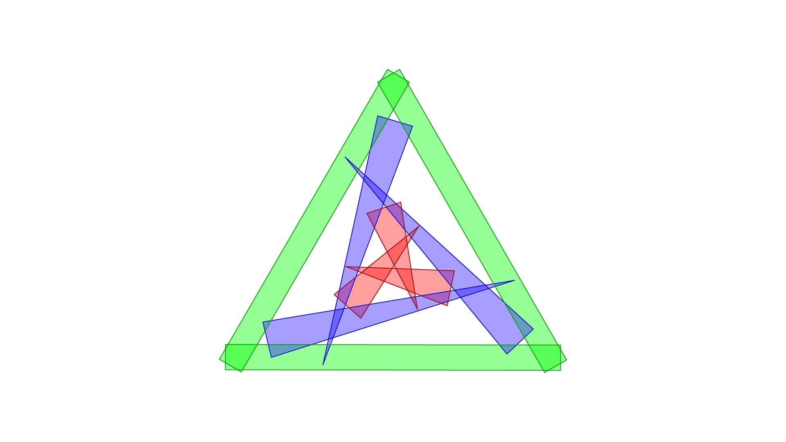
<figcaption>3 sets of 3 intersecting quorums</figcaption>
</figure>

Note that each red quorum intersects each blue quorum (purple regions). In principle, it should be possible to commit a batch of red and blue transactions (a combo block), and be sure that if there is an honest node in each purple region, this commit will be atomic. If a red quorum decides to commit the combo block, the honest nodes in the quorum intersections will prevent any blue quorum from committing any other block.

<figure>
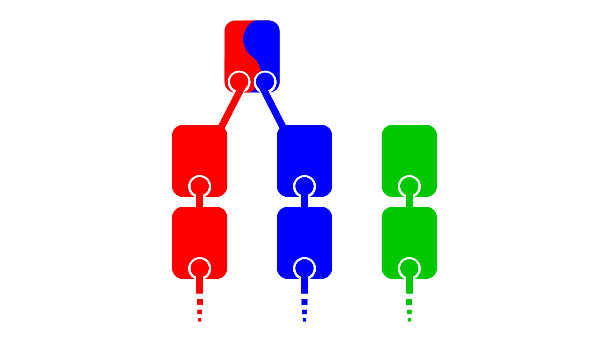
<figcaption>Red and Blue combo block</figcaption>
</figure>

Note also that each blue quorum intersects each green quorum (cyan regions). In principle, it should also be possible to commit a batch of blue and green transactions, and be sure that if there is an honest node in each cyan region, this commit will _also_ be atomic. If a green quorum decides to commit the combo block, the honest nodes in the quorum intersection will prevent any blue quorum from committing any other block.

<figure>
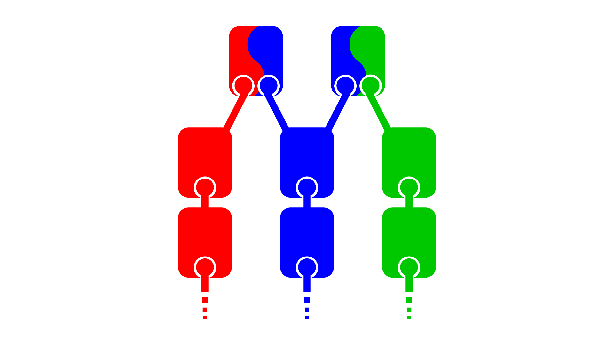
<figcaption>Red and Blue combo block with Blue and Green combo block</figcaption>
</figure>

Recall that a green quorum is sufficient to make green chain decide on a block _without communicating with anyone else_, and a red quourm is sufficient to make red chain decide _without communicating with anyone else_. This means that it's possible (even when all participants are honest) for a red quorum to decide on the blue-red combo block, and a green quorum to decide on the blue-green combo block: the quorums don't intersect, so they may simply never hear from each other at all.

<figure>

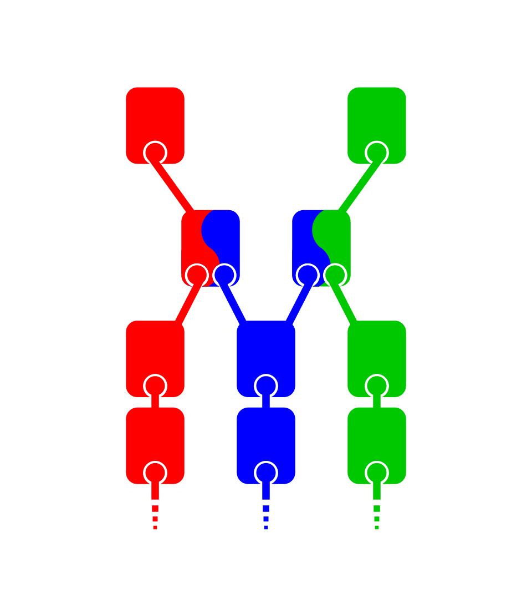
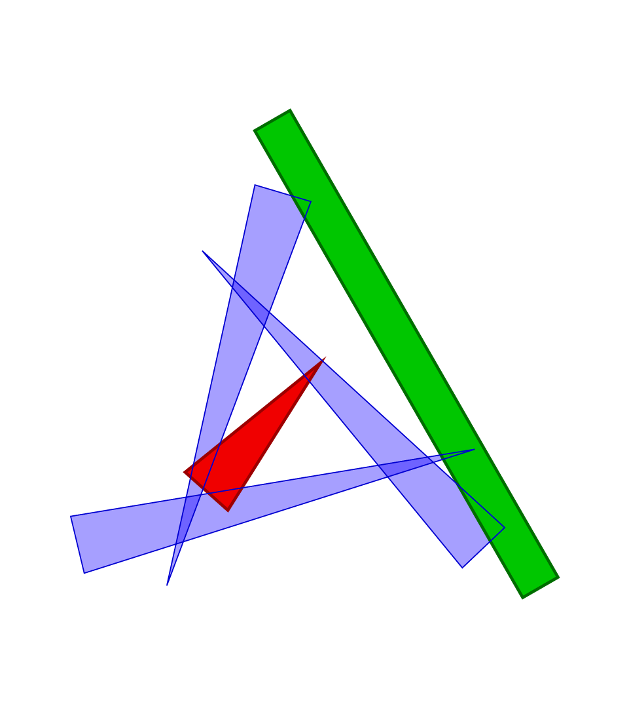

<figcaption>Red chain decides on a Red-Blue combo block, and Green chain decides on a Blue-Green combo block. The Red quorum shown has decided one thing, and the Green quorum shown has decided a different thing.</figcaption>
</figure>

In this situation, blue quorums cannot decide anything other than the blue-green block, because each blue quorum has an honest node in the intersection with a green quorum that has already decided on the blue-green block. Likewise, blue quorums cannot decide on anything other than the red-blue block, because each blue quorum has an honest node in the intersection with a red quorum that has already decided on the red-blue block. Since the red-blue block and the blue-green block are not the same (and in this case, we'll assume they conflict), blue chain is stuck: it can't decide on anything.

Note that this would not be a problem if every red quorum had an intersection (featuring an honest participant) with every green quorum: red and green could avoid deciding contradictory things.

### Fundamental Limitations

As in our example above, just because chain A can have a heterogeneous consensus with chain B, and chain B can have a heterogeneous consensus with chain C, does not mean chain A can have a heterogeneous consensus with chain C. The key is to avoid the possibility of competing blocks in incompatible consensuses. In some sense, each round of consensus needs to know _in advance_ which heterogeneous consensus it's going to run. Naively, this is very discouraging: it seems we must have already decided something before we begin making a decision. Fortunately, we have some promising directions for solving this conundrum.

### Side Note

[David Mazieres](https://www.scs.stanford.edu/~dm/) has postulated that when you don't know the set of participants in advance, consensus takes a minimum of 4 rounds of communication. [Heterogeneous Paxos](https://doi.org/10.4230/LIPIcs.OPODIS.2020.5), which assumes we know all the quorums we're using in advance, requires only 3 rounds of communication. This suggests we may need at least one more round at some point to "decide which heterogeneous consensus to run." In contrast, [Stellar Consensus Protocol](https://www.stellar.org/papers/stellar-consensus-protocol), which operates on a slightly different model, requires 4 rounds. In Stellar, participants have opinions about who they want in quorums, and quorums depend on other participants' opinions as well. Unlike Heterogeneous Paxos, it's impossible to know how big your quorums are (and thus how likely you are to be able to actually decide, or even precisely with whom you are guaranteed to agree) in advance.

## Possible Directions Toward Solutions

### Schedule Consensuses in Advance

Each chain could, in principle, decide in advance of each block what heterogeneous consensus they will run for that block, and heterogeneous consensus selects a shared block only if all chains agreed on that heterogeneous consensus. Naively, this sounds like a multi-phase commit: each block requires one (advance) round of consensus, and then one round of heterogeneous consensus. However, there are 2 key differences:

- The set of transactions need not be specified until the heterogeneous consensus begins.
- Chains can schedule arbitrarily many heterogeneous consensus rounds arbitrarily far in advance: amortizing the cost of that "first round of consensus."

### A Chain for Each Possible Consensus

Given the quorums for an any collection of blockchains, we could create a new blockchain for each possible heterogeneous consensus between their various quorums. In the example above, this would mean there would be a "red-blue" chain, and a "blue-green" chain _in addition to_ the red, blue, and green chains:

- the red transactions in the red-blue chain would be the ones decided upon by red quorums, and the blue transactions in the red-blue chain would be the ones decided upon by blue quorums, so if there is a red-blue quorum intersection without an honest participant, the chain may fork, but anyone following only blue transactions or only red transactions will not observe the fork.
- the green transactions in the blue-green chain would be the ones decided upon by green quorums, and the blue transactions in the blue-green chain would be the ones decided upon by blue quorums, so if there is a blue-green quorum intersection without an honest participant, the chain may fork, but anyone following only blue transactions or only green transactions will not observe the fork.

<figure>
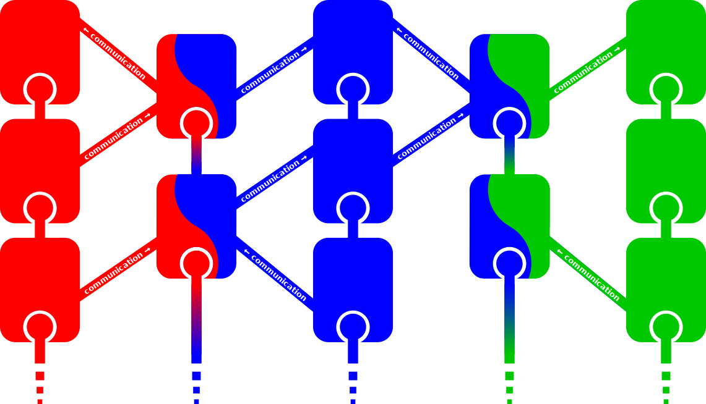
<figcaption>Heterogeneous Consensus chains between "main chains" with communication</figcaption>
</figure>

Between blue chain and red-blue chain, and between blue chain and blue-green chain, we can allow straightforward, trustless, (perhaps IBC-based) communication that's guaranteed to arrive within a fixed number of blocks. This is simply because the blue transactions on all chains are decided upon by the same quorums. In principle, smart contracts could "move state" from, say, the purely blue chain to the blue-green chain when they want to do business with green smart contracts, and then back to the blue chain when they're done.

### As Locks

One way to imagine programming in this "a chain for each possible consensus" world would be to think of chains as holding exclusive locks on state. In particular, only one chain can hold the lock on some state at a time, and the only possible chains are those for which a heterogeneous consensus exists. Each piece of state (each smart contract) needs application-specific code to decide which chain holds its lock at which time. For example, a user might allow the hotel-and-train-and-bank chain to temporarily hold the lock on their bank account while they try to atomically book a hotel room and train ticket.

## Decreasing Liveness or Increasing Safety

So far, we've only considered using the quorums already trusted by chains. However, a user might be OK with some state being slightly less live if they can enable more possible atomic transactions, or increase the safety of that atomicity. For example, we might imagine user who wants to atomically commit some transactions to red, green, and blue chains above. Using only the chains' native quorums, this is impossible: red chain is not willing to wait for any of green chain's participants in order to decide, and vice versa. However, suppose that the user owns all the state involved in these transactions, and is willing to use that state only when all three chains are live.

We can imagine building a new chain, where each quorum includes a quorum from red, a quorum from green, and a quorum from blue chains. This chain is more safe than any of the red, green, or blue chains: it can only fork under the conditions wherein _all_ of red, blue, and green chains fork. This chain is also less live than any of red, green, or blue chains: it can only commit new blocks under the conditions wherein _all_ of red, blue, and green chains commit new blocks. However, it would certainly be safe to move state from any of red, green, or blue chains onto the combo chain, and back: the data wouldn't risk corruption, just, at the most, getting stuck. If the user is authorized to do that, they may choose to do so.

This fits neatly into our "a chain for each possible consensus" model. In our "as locks" model, we can imagine that some lock holders incur liveness penalties but may be more safe. Applications will have to determine for themselves when they want which chains to lock their data.

## Changing Quorums

So far, we've considered each chain as if it has a static set of quorums. However, this is not the case. In, for instance, in proof-of-stake chains, the quorums change whenever stake changes hands. If we are maintaining a set of "bridge" chains that operate heterogeneous consensuses for each possible heterogeneous consensus, then all those chains need to update their quorums synchronously in order to preserve the same trust guarantees. This means that any transaction that could change a chain's quorums is extra-difficult to commit.

## Programming Model

In order to take advantage of any multi-chain atomic commits, we need to expose this functionality to transactions within the chains. What kind of API or language features should we provide for maximum flexibility while still enabling the full power of heterogeneous multi-chain commits? How can we make this as easy-to-use as possible without setting up developers to shoot themselves in the foot?

### Atomic Multi-Chain Batches of Transactions

For our transactions themselves, we want to preserve the flexibility of each source-chain's state machine. In order to make as few assumptions as possible about their state machines, one might think about interaction between their transactions the same way diverse computers interact: as network communication. We could write an API (perhaps similar to [IBC](https://ibcprotocol.org/)) wherein each transaction can send and receive bytes to and from other transactions in the batch. This communication would be synchronous: the transactions are actually executed together on the same participants, perhaps even in a single thread of execution. There are 2 key features that distinguish "atomic network" communication from traditional Inter-Blockchain Communication.

- Atomic network communication allows cycles of communication within the same transactions: transaction A on blue chain can send a message to transaction B on red chain, and then B can send a message back to A, and this can all happen atomically. IBC does not allow this: all communication must be _between_ transactions.
- Atomic network communication relies on honest nodes in the quorum intersections to _prove_ what messages are sent. In general, we do not assume that all participants can compute all transactions for all state machines: just the state machines for which they are in a quorum. In our red/blue example, the blue quorum cannot wait to listen to an entire red quorum to learn what messages red transactions sent to blue transactions. The only red participants they can guarantee hearing from are those in an intersection with the deciding blue quorum. There is not guarantee that the _majority_ of such participants are honest, only that _one_ of them is. That honest participant must be able to _prove_ the which messages red transaction sent to blue transactions in the batch, so that the participants computing the blue transactions can compute correctly.

### One Chain for Each Possible Consensus Model

Anyone can start a new chain using Heterogeneous Consensus with any quorums at any time. Heterogeneous consensus chains can have different quorums for each transaction (as long as they all intersect, and we accept that there may be atomicity violations for transactions whose quorum intersections lack honest participants). We should be able to establish trustless communication (perhaps with [IBC](https://ibcprotocol.org/)) between transactions on different chains with the same quorums. This would allow applications to "move data" to shared chains where atomic commits are possible, and then back. What we need is a specific interface indicating when such moves are safe, when atomicity in batches is preserved, and a way to easily move state from one chain to another.

This is further complicated by transactions that may want to change safety or liveness guarantees (see above), which will need to specifically acknowledge that they are moving to a less live or even less safe chain. This is in some ways not so very different from [endorsement](https://doi.org/10.1007/978-3-642-11957-6_5) in information-flow-control systems.

## Conclusion

Multi-chain batches of transactions are fundamentally useful: they expand one of the key advantages of blockchains (atomic transactions) to a multi-chain environment, freeing applications from the restrictions of a single chain for global ordering. We have the basic tools to get there, but some challenges remain. We must figure out how we're going to decide which consensus to use at which time, and provide a programming model to match. If we get this right, the future will be much brighter for cross-chain applications.

_Written by Isaac Sheff, lead of Typhon, distributed systems researcher and protocol developer at _[_Heliax_](https://heliax.dev/?ref=blog.anoma.net)_, the team building _[_Anoma_](https://twitter.com/anoma?ref=blog.anoma.net)_._

_If you're interested in bleeding edge distributed systems research and building protocols that deploy them, check out _[_the open positions at Heliax_](https://heliax.dev/jobs?ref=blog.anoma.net)_._
