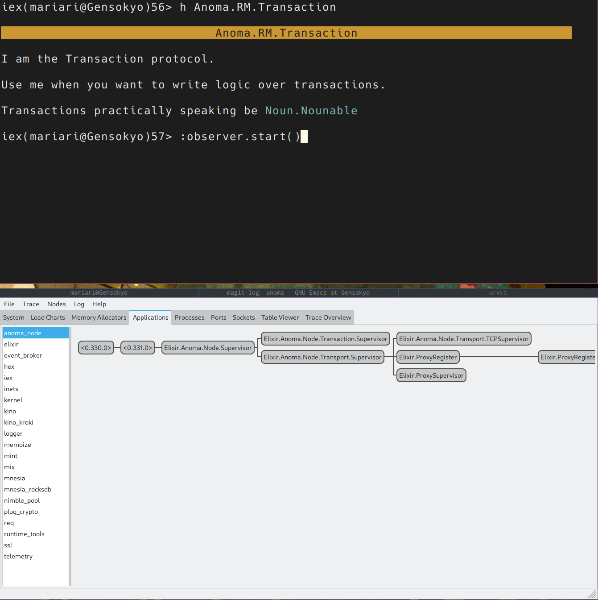
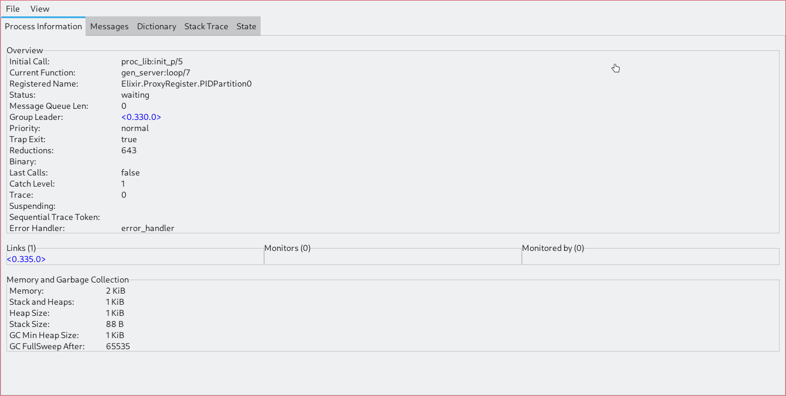

## Summary

The article explains why Anoma is being built using the Elixir
programming language:

-   Elixir, which runs on the Erlang virtual machine, lets developers
    inspect and debug the system while it's running and update the code
    without restarting
-   Erlang was created to build robust, fault-tolerant networked systems
    using lightweight processes that can crash without taking down the
    whole system
-   Elixir's process model is a natural fit for Anoma's architecture,
    which is based around separate "engines" that communicate by passing
    messages
-   Elixir makes it easier to implement Anoma's design with less
    accidental complexity, because the language matches the architecture
-   Having the implementation closely match the specification will make
    it easier to mathematically prove things about the properties of the
    system down the road

In short, Elixir provides the right tools and abstractions to build
Anoma according to spec, while providing a good developer experience
and supporting future verification efforts.


<a id="orgc06199d"></a>

# Anoma: Why Elixir?

Anoma is a decentralized operating system with heterogeneous
trust. For developing Anoma we've been using [Elixir](https://elixir-lang.org/). This choice
is somewhat unconventional, and thus begs the question "why write
Anoma in Elixir!?". There are a plethora of reasons as to why [Elixir](https://elixir-lang.org/)
is a good choice. To motivate the reasoning, we will go first from
generic reasoning as to why it's a good fit for many projects before
diving deep into why it makes sense for Anoma in particular.


<a id="orgb7d7476"></a>

## Live Interactive Systems

When building any large complicated system, the number one feature one
wants is to be able to understand how the system is operating along
with being able to determine if there are mishaps when carrying out a
design. For most software projects, this means sitting down and
thinking about the system abstractly or tracing through the system
execution in the case of direct questions. Thankfully for us, we have
chosen [Elixir](https://elixir-lang.org/), which rests on the foundations of Erlang/OTP. In
practical terms, this means we get a live interactive system from
which we can ask the system questions.

For example, instead of having to sit and think about the
architecture of how the components of Anoma fit together, I can ask
the underlying system, "please give me the layout of processes for my
application":



The specifics of the diagram doesn't matter. What does matter is that
the system can reflect on itself, helping to explain the very system
that we are building. Meaning, that the system we are building can be
in dialog with the builders to shape discussion around itself. No
longer is the system simply speculated about from the hazy
recollections that the engineers who made it have. A great upshot of
this is that if we have further questions about the system, we can
drill down and ask it more questions. For example what if we were
curious about one of those nodes in the diagram, what information can
we get from there?:



As we can see, we now have diagnostics on the particular node along
with information about it's **state**, **stack trace**, etc.

This want and concern does not only apply to big complicated projects;
at every stage of development one wants to be able to play with the
software, change a few components, and recompile only the parts they
are interested in. Having the underlying Erlang/OTP available, allows
quicker feedback cycles by allowing the team to better understand the
system as we develop it.

To give a concrete list of features that Elixir utilizes to achieve
this is:

1.  Hot code reloading
    -   This means we can have the software running locally, and be able
        to change any part of it without having to shut down and restart
        the service. This is invaluable for trying to experiment with new
        ideas!
2.  Underlying environmental reflection
    -   The underlying reflection gives the system the information it
        needs to be able to report back crucial information about
        itself. Without inroads to the system, an interactive system
        would quickly turn opaque!
3.  The entire system available (from parser, to compiler, to
    visualization suite) from the user shell
    -   This allows a skilled engineer the ability to diagnose problems
        and see practical implications of what they are doing. This is
        apart of the [same technology that allowed people to debug a space
        probe 100 million miles away!](https://flownet.com/gat/jpl-lisp.html)
4.  A lack of artificial distinction between system and language.
    -   This means that the core functionality of the system is realized
        through the language itself, proving itself capable enough to
        compose a highly robust system.

With these properties and features laid out, this make Elixir quite
different from language in common use (Java, Rust, Python etc.)

With that said, there are [genres of languages](https://wiki.c2.com/?ImageBasedLanguage) that exhibit the same
features some of which have [superior visualization techniques](https://gtoolkit.com/). What is
it about the Erlang/OTP system that makes them special compared to
them?


<a id="org19197a5"></a>

## Designing Robust Systems

To understand what makes Elixir special, we first must go back to what
problems that Erlang and the Beam were meant to solve. Joe Armstrong's
thesis: [Making reliable distributed systems in the presence of
software errors](https://erlang.org/download/armstrong_thesis_2003.pdf), lays out their problem domain:

1.  The system must handle very large numbers of concurrent activities
2.  Actions must be performed at a certain point in time or within a
    certain time.
3.  Systems may be distributed over several computers.
4.  The system is used to control hardware.
5.  The software systems are very large.
6.  The system exhibits complex functionality such as, feature
    interaction.
7.  The system should be in continuous operation for many years.
8.  Software maintenance should be performed without stopping the
    system.
9.  There are stringet quality and reliability requirements
10. Fault tolerance both to hardware failures, and software errors,
    must be provided.

In order to tackle these problems they created a philosophy and
ultimately requirements that the underlying operating system and
language should have.

In doing so Erlang/OTP, much like Anoma, defined out a language an
ultimately an operating system that tackles their very real problems.

To give a sample of the features the system has:

1.  The system has very cheap processes
        ```elixir
        iex(mariari@Gensokyo)10> :timer.tc(fn -> spawn(fn -> nil end) end)
        {10, #PID<0.1689.0>}
        ```

    -   This snippet shows a process takes only 10 microseconds to spawn!
2.  The architecture of the application is split into a series of
    processes, each process are often referred to as actors.
    -   Actors are interesting objects as here are their central properties:
        1.  They contain some state they maintain
        2.  They can send and receive messages
        3.  Messages are processed sequentially (order is guaranteed)
            between the same two actors!
3.  Processes are isolated. Meaning that if a process crashes, it does
    not affect other processes. [Erlang the movie](https://www.youtube.com/watch?v=BXmOlCy0oBM) gives a good example
    of this at play on their real systems!
4.  Processes are managed by a chain of [supervisors](https://www.erlang.org/doc/apps/stdlib/supervisor.html).
    -   Supervisors are interesting in that they look after many
        processes (some of who may be supervisors). When a process they
        are supervising crashes, they have policies on what happens to
        the other processes under their control.
    -   It was realized that actors on their own are not enough to make a
        robust system, and this is a crucial component that is missing
        from most other actor models.
5.  The mentality is "let it crash".
    -   With Supervisors this is a very potent strategy for creating
        reliable and robust systems.
        -   When crashes happen early, we can isolate the errors, this is
            hard to do when one has an Either/Result/Maybe type, as stack
            information is often lost with those strategies. The supervisor
            then can restart the crashed component helping the system
            resume normal behavior.
        -   Further since parts of the system being down can be normal, one
            typically thinks out a robust supervision system that lets the
            system gracefully degrade. A common example is having a full
            fledged system that does all the bells and whistles, however
            when some external service is down (say you query an external
            service for images or AI responses), then we can fall back on
            simpler behavior until the issue is solved.
        -   This also helps in the case of underlying hardware errors, as
            if something like a bit flip due to a cosmic ray were to
            happen to a high integrity component, instead of the
            application crashing and stopping, the application could crash
            and sensible restart behavior can be had.
6.  The system has fair concurrency, with it's own scheduler system.
    -   This means your processes aren't going to get starved of
        resources.

These are just a few of the features that make the Erlang/OTP system
standout even among other interactive systems. These properties will
be vital when we consider how Anoma is modeled from both a code
perspective and a specification perspective.


<a id="org3dd3410"></a>

## Specs: Or What is an Engine.

Implementing Anoma comes after specifying Anoma. Natural language is
easier to use and parse than arbitrary code. This matters both for
explicating and understanding concepts.

So most high-level ideas for Anoma come in the form of the
specification and those are the ones that will make users initially
interested and excited about Anoma. To understand what Anoma has to
offer, the user will look at the specification. If they are interested
in the presented promises of the system, they become incentivized to
take a proper look at the code and engage with it.

What the user is looking for is for an instantiation of the presented
proposal with desired properties. That is, they need to establish that
a piece of code lying inside a repository is an actual implementation
of the system described.

To make this easy, the engineers need to have a good interface that
makes it easy to establish a connection between concepts central to
the specification and our code. Otherwise, the application becomes
hard to adopt and develop for any outside party. Having such
properties can fundamentally depend on your choice of a language.

For example, if you are interested in functions, it matters whether
you present id : Bool -> Bool as lambda x -> x or {{true, true},
{false, false}}. There is a reason why we don't use set theory
everywhere in mathematics. If you think of functions as something that
takes things in and pops things out, the type theoretic approach is
probably easier to comprehend and work with.

Following this idea, a good requirement for the desired language is to
have a good first-class citizen corresponding to the central concept
of the specification: the [engine](https://specs.anoma.net/latest/node_architecture/engines.html?h=engine). Almost every functionality in the
Anoma infrastructure is specified as a functionality of a particular
engine. Mempool behavior is implemented through the Mempool
Engine. Transaction execution is done through the Execution Engine.

An [engine](https://specs.anoma.net/latest/node_architecture/engines.html?h=engine) has several properties, some of the central ones being:

1.  It is stateful
2.  It can receive messages
3.  It can send messages
4.  Messages are processed sequentially

So what is an engine? Something that quacks like an agent, it seems!
Now what systems take agents as first-class citizens? Erlang-based
systems!

Having a good actor model of the language we use does not only allow
for an easier understanding of the codebase, greater engagement with
parties interested in Anoma development coming from the specification
side, it also grants us credence in future verification and auditing
work being done internally.

The formal verification efforts Anoma has are aimed not at the
verification of a particular implementation: implementations may
differ and canonical ones may change due to timely choices. Instead,
proving of system properties will be done through the formalization of
the [Anoma specification](https://specs.anoma.net/latest/). As it goes, a proof is only as good as the
initial formalization of the system. The closer the underlying
concepts of the specification and the implementation are, the more
believable it is that whatever we come to prove about Anoma will also
correspond to a proof about our Elixir implementation.


<a id="orgfdc8d20"></a>

## Conclusion

We have chosen Elixir to develop the Anoma node software. The Anoma
node consists of several independently moving pieces that have to be
orchestrated and connected (e.g., transaction execution, intra-node
communication, .. (insert some more here)). From a developer's
perspective it is beneficial to be able to introspect these individual
components at runtime, update them, and manipulate them.
Additionally, the Erlang VM offers us the basic building blocks to
build and connect such a system of independent processes in a robust
and scalable way.

The specification of Anoma dictates that any node consists of
different 'engines', which are isolted processes each responsible to
handle part of the Anoma node responsibilities.  The Erlang VM its
computational model of processes with shared-nothing memory maps
nearly 1:1 on the architecture proposed in the Anoma
specification. This means that the implementation of the specification
will have much less accidental complexity compared to other
computational models.

Thus, choosing the Erlang VM to implement the Anoma specification
offers us better developer UX and reduces the impedance mismatch
between the specification of Anoma and its physical implementation.

