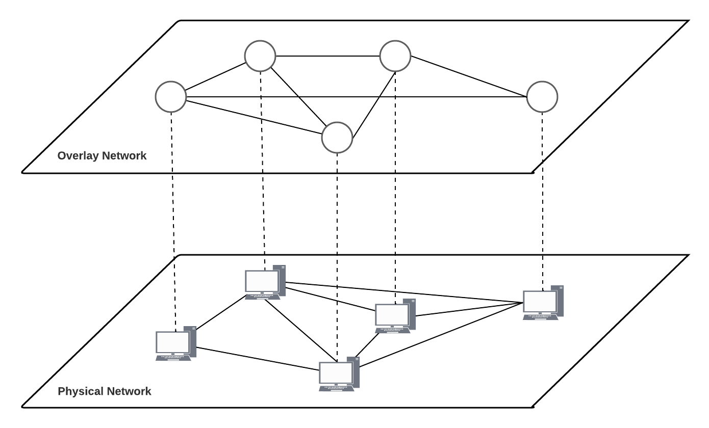
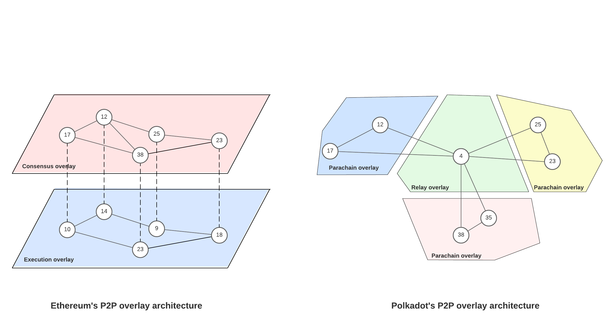

## Introduction

At the core of every distributed system is a communication network. This communication network is used for exchanging data and coordinating tasks among various components. How it is architected depends on the requirements of the distributed system.

A blockchain system is a distributed system: multiple components exchange data and coordinate tasks in order to maintain a byzantine fault-tolerant Replicated State Machine. But unlike other distributed systems, such as traditional client-server architectures, decentralization is a core principle of blockchain systems: each chain should have no central authority or single point of control. As such, it also requires a communication network that is decentralized. This is exactly what peer-to-peer (P2P) overlays offer.

## What is a P2P overlay anyway?

<figure>

  <figcaption>A virtual P2P overlay on top of the physical network.
</figcaption>
</figure>

A P2P overlay is a virtual network built on top of the Internet. It is "virtual" in the sense that it creates a logical network of interconnected nodes that may not necessarily be physically adjacent or directly connected. The overlay is structured in a way that there are no central parties that facilitate coordination. Instead, parties rely on their neighbors (also known as _peers_) in the overlay. Nodes can act as clients when accessing information and as servers when providing data or services to other nodes. Since the overlay lacks a central authority, its nodes are responsible for managing virtual connections and ensuring that the requirements of the application it serves, in our case a blockchain, are met.

## What do blockchains require from their P2P overlays?

Different distributed systems require different communication networks. Due to the diverse architectures of various blockchain systems, it is challenging to make generalizations about their P2P overlay requirements. Nonetheless, there are certain common requirements, which we divide into _functional_ and _non-functional_.

#### Functional requirements

Functional requirements describe the specific functions and features the P2P overlay should perform. Blockchains rely on their P2P overlays for:

- _Data dissemination_: Blockchain systems rely on their P2P overlays to the disseminate data to relevant parties. For instance, validator nodes need to distribute transaction blocks across the network for local verification, which is crucial for state replication.
- _Data storage_: P2P overlays play a key role in secure data storage. Important data must be stored securely to ensure its availability, even when some nodes become unavailable. For example, newly received transactions must be securely stored for future execution.
- _Data retrieval_: The P2P overlay also facilitates retrievang data from the blockchain. When a node wants to access specific data from the blockchain, it sends a request to the relevant nodes that have the required information. For example, if a node learns that it's missing a transaction referenced in a proposed block, it can request the missing transactions from its peers.

#### Non-functional requirements

Non-functional requirements describe the qualities and attributes that the P2P overlay must possess. Blockchain systems need P2P overlays to offer:

- _Decentralization_: The P2P overlay must avoid a single point of control, aligning with the decentralized nature of blockchain systems.
- _Performance_: To ensure the smooth operation of the blockchain, the P2P overlay must offer low-latency data dissemination and retrieval. Slow data dissemination can lead to consensus delays, potentially resulting in block synchronization issues and opening the door to attacks like forking and double-spends.
- _Security_: The overlay must resist overlay attacks on nodes and their (virtual) connections, and provide a secure environment for data dissemination, storage and retrieval. Overlay attacks exploit the decentralized, distributed nature of P2P overlays to compromise their security and availability. Common overlay attacks include Sybil attacks, eclipse attacks, routing attacks, and Denial-of-Service (DoS) attacks.
- _Robustness_: Even in presence of node or connection failures, the overlay must recover quickly and continue providing services to the blockchain. For example, in blockchain systems, the churn rate (nodes joining and leaving) can be high, and the overlay must ensure that the protocols related to data dissemination, storage, and retrieval are robust enough to handle this dynamic environment.
- _Scalability_: The overlay must allow for a large number of nodes to participate without significantly degrading other non-functional requirements.

## Do current P2P overlays meet these requirements?

Evidently, existing P2P overlays meet their functional requirements as existing blockchains do work. However, existing overlays present non-functional challenges to blockchain systems. For example, [research has shown](https://dl.acm.org/doi/abs/10.1145/3453161?casa_token=MnmguWo2-2QAAAAA:Mqf1H50_JCEGOYj2fUkeEi2V6BS4eiA21XKd3HQZqv90dzQav-1r8K5wdI25hYTutbhW6k6dStXuyQ) that slow data dissemination in Bitcoin's P2P overlay can lead to blockchain forks. Similarly, Ethereum's P2P overlay's data dissemination design is vulnerable to an eclipse attack, which could partition the Ethereum P2P network. Clearly, there are some issues, but before we answer the posed question, we need to better understand how current P2P overlays are architected.

#### Current P2P overlays in blockchain systems

The vast majority of blockchain systems rely on unstructured P2P overlays. In an unstructured P2P overlay, nodes connect to others in a random manner, resulting in [a random graph topology](https://en.wikipedia.org/wiki/Random_graph). Nodes receiving transactions and blocks, relay it to either a sub-set of their neighbors (gossiping), or to all their neighbors (flooding). Ustructured overlays are popular due to their inherent robustness, as they do not require additional effort to restore a specific topology structure in the event of node or connection failures. However, unstructured overlays exhibit sub-optimal performance and scalability when it comes to information dissemination. In flooding schemes, the load on each peer grows linearly with the total number of broadcasted messages in the overlay, which, in turn, grows with the overlay's size. Gossip protocols impose less load, but often introduce [additional](https://dl.acm.org/doi/abs/10.1145/1317379.1317382?casa_token=HbmhdluxT9AAAAAA:WUslm2sVGZFe0yveU40OkakV8zh21DEjwj6OUwokzwI2I73L12t5BZFMw9sh9W5PvIorln07nbC2Lw) propagation delays.

Efforts to mitigate issues with existing P2P overlays frequently lead to trade-offs between different non-functional requirements. For example, [Kadcast](https://dl.acm.org/doi/abs/10.1145/3318041.3355469?casa_token=XsN-ykG4T3EAAAAA:UkoK4GlVMU1ppq19DhI_4toxhLnZiua75CsW6KtzwdAi91ZLm1X3OS3xmMFa3Zms_aJ6oNz3CVp9Qg) uses a structured ([Kademlia](https://pdos.csail.mit.edu/~petar/papers/maymounkov-kademlia-lncs.pdf)-based) overlay as a more performant alternative to a random graph topology, but it is less robust in an environment where node frequently join or leave the network. [BloXroute](https://bloxroute.com/wp-content/uploads/2019/11/bloXrouteWhitepaper.pdf) and [Fibre](https://bitcoinfibre.org) reduce latency in their dissemination protocols, but are not completely decentralized: they introduce trusted relayers in the network.

#### The actual problem with these P2P overlays

While we certainly encourage enhancing existing overlays, it is important to acknowledge that they focus on the symptoms rather than the root causes, making them ill-suited for sustainable long-term deployment. The root cause of these issues runs deeper: there is a fundamental mismatch between currently deployed P2P overlays and blockchain networks. These overlays, whether structured or unstructured, were initially designed for applications that did not consider the inherent differences between nodes, resulting in, for example, performance deficiencies in heterogenenous environments.

Blockchains, by their very nature, encomposs heterogeneinity: subsets of nodes possess different capabilities and preferences for latency, bandwidth, and failure tolerance trade-offs. For example, light clients demand less bandwidth compared to validators as they frequently engage in one-to-one communication, while validator nodes participate in one-to-many broadcasting throughout the overlay network, and may be willing to use a lot of bandwidth if they can achieve low latency. These diverse requirements require an overlay architecture capable of accommodating node heterogeneity.

## What could we do about it?

Existing works on P2P overlays that can accommodate node heterogeneity typically group nodes into separate sub-networks that require less communication with other sub-networks, and each sub-network has its own independent P2P overlay. Smaller P2P overlays can generally disseminate information more efficiently, so these multi-overlay architectures in blockchain systems facilitate faster information dissemination compared to a single large overlay. Moreover, this approach provides the flexibility to tailor data dissemination, storage and retrieval protocols to the characteristics and needs of the nodes in each sub-network.

For instance, [Ethereum](https://ethereum.org/en/developers/docs/networking-layer/) has one dedicated P2P overlay for consensus nodes (for block gossiping) and one for execution nodes (for transaction gossiping). Both overlays have different specifications and different protocols. In [Polkadot](https://arxiv.org/abs/2005.13456), heterogeneous parachains each have their own separate (independent) P2P overlays. The primary difference between the two architectures is scale: each Ethereum node participates in both overlays, whereas Polkadot nodes each participate in one parachain or the relay chain. In essence, Ethereum's architecture resembles two parallel overlays both spanning the entire network, while Polkadot's P2P network consists of several smaller federated overlays dedicated to sub-networks.

While these P2P overlay architectures can provide flexibility to accomodate node heterogeneity, they carry other challenges. Since Ethereum requires that nodes run both P2P networks simultaneously, it means that each P2P overlay is the size of the whole network. This removes the performance benefits of having smaller size P2P overlays. One the other hand, Polkadot's architecture, which facilitates faster data dissemination and retrieval, exposes security vulnerabilities due to splitting the network into smaller, independent sub-networks. Smaller P2P overlays are more susceptible to overlay attacks, as adversaries can compromise a significant portion of the overlay with fewer resources.

## What should we do about it?

The ideal solution is to have an overlay architecture that accommodates node heterogeneity while retaining the benefits of existing overlays. This is precisely what Anoma's P2P overlay architecture aims to provide.

Anoma's approach involves segmenting the overlay into smaller _sovereign domains_, each operating independently with its own internal topology and protocols for data dissemination, storage, and retrieval. These protocols can be tailored to the characteristics, needs and capabilities of the nodes in the domain.

<figure>

<figcaption>
Anoma's P2P overlay architecture, where the network is segmented into sovereign domains.
</figcaption>
</figure>

#### Domains

Nodes can initiate domains for specific purposes. For example, nodes could create domains for blockchain-specific services (e.g., solving intents) or network-specific services (e.g., anonymous routing). Nodes can concurrently participate in as many domains as they like, limited only by their own capabilities, and the membership protocol of each domain. For instance, a domain of intent solvers in Anoma may only accept join requests from trusted solvers, and a domain could remove nodes that exhibit free-riding behavior.

#### Intra-domain and inter-domain protocols

Nodes participate in both _intra-domain_ and _inter-domain_ protocols. Nodes that participate in a domain are responsible for the domain's management. This means that all nodes engage in intra-domain protocols, such as node discovery, to maintain connections with reachable peers in that domain. Unlike federated multi-overlay architectures, nodes in Anoma's architecture can also maintain connections to a small subset of nodes from other domains, allowing for inter-domain routing. For example, solvers in a specific solver domain may need to establish inter-domain connections to nodes in a validator domain to send solved intents for block execution. This approach allows for cross-domain communication and collaboration.

#### Node-based reputation and group-based reputation

Anoma's architecture also enables trust mechanisms built on both node-based and group-based reputation models. In these reputation systems, nodes maintain statistics about the behavior of other nodes and groups of nodes, and use these statistics to infer how these nodes and groups of nodes are likely to behave in the future.

Node-based reputation systems allows nodes to discover and account for the reliability, preferences and capabilities of their peers. For example, nodes locally measure the latency of message arrivals. Based on this information, a node could decide to send a message through a longer path (more hops) in the overlay, but one than is faster because it avoids nodes with high bandwidth constraints. However, relying solely on a node-based reputation system may fall short as it can be unreliable in dynamic networks.

To address this limitation, Anoma's architecture also introduces group-based reputation that aggregates the historical behavior of nodes over time, reducing the impact of transient nodes. Group-based reputation promotes collaboration and accountability, fostering cooperation among nodes and incentivizing them to maintain a positive reputation collectively. Notably, our architecture inherently facilitates the maintenance of group reputation, as the overlay is naturally segmented into distinct groups (domains). This segmentation lays the groundwork for reliable reputation management, ensuring that domains meet requirements such as performance and security. For example, group reputation could be used to detect whether a small domain is compromised by an adversary, and honest nodes could use this information to join the attacked domain to restore functionality.

## Conclusion

Anoma's P2P overlay architecture offers a solution to the fundamental challenges faced by existing P2P overlays in blockchain systems. By introducing the concept of sovereign domains and enabling both intra-domain and inter-domain protocols, it provides elegant means of accommodating node heterogeneity. Furthermore, the incorporation of node-based and group-based reputation models enhances the performance, security and reliability of the overlay. Anoma's approach paves the way for P2P overlays that can better serve the diverse requirements of blockchain networks.

[Questions? Join the discussion on the forum!](https://research.anoma.net/t/discussion-anomas-p2p-layer/344)
