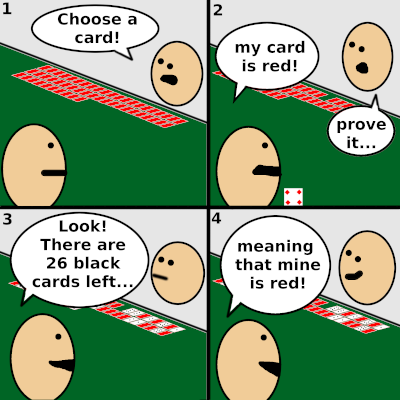
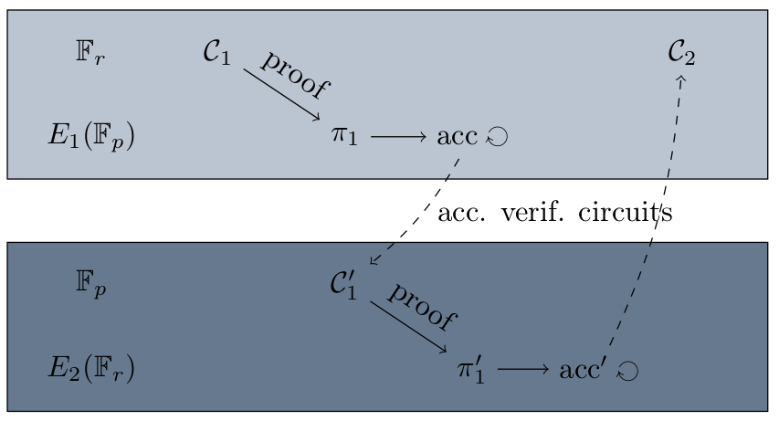
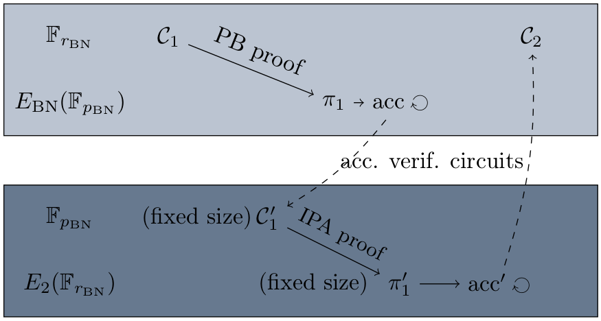

Recursive zero-knowledge proofs are new cryptographic primitives relevant to the Anoma blockchain use case. In this article, we investigate the possible alternatives for verifying blockchain circuits efficiently. Our main interest is in estimating the efficiency of pairing-based constructions.

## Introduction

### Motivation

Blockchain consensus protocols allow different parties to verify the validity of the different blocks. Recently, different constructions have been introduced to achieve different properties (for example privacy and anonymity).

The Anoma blockchain computes shielded transactions thanks to the [Multi-Asset Shielded Pool](https://masp.dev/). Each block contains different information related to state transitions that can be verified by all users of the blockchain. A basic idea for verifying the current block state is to recompute all state transitions starting from the genesis block. The major disadvantage of this method is that the longer the blockchain, the more computationally expensive it becomes.

We present in this article how state transitions can be verified using a [proof of knowledge](https://en.wikipedia.org/wiki/Proof_of_knowledge). Introducing this concept with a simple example without any cryptography involved, this article also describes different alternatives for getting concrete secure proofs from a cryptographic point of view. Subsequently, we present efficient verifications of the whole blockchain using _recursive proofs of knowledge_. To sum things up, a comparison of the different constructions available is made from a practical point of view.

### A simple example

Proofs of knowledge have become very famous in the last few years. We begin this section with a very simple example using a deck of cards.

This simple example shows that:

- Alice does not reveal information on her secret card (neither the number, nor the suit, i.e. ❤️ or ♦️). We say that this proof is _zero-knowledge_.
- Using this undeniable proof, Bob is always convinced by Alice. With this, we say that the proof has the _completeness_ property.
- A cheater that picked a red card would not be able to prove that he picked a black card. This is called the _soundness_ of the proof.

In the following sections, we consider _proofs of knowledge_ that satisfy _zero-knowledge_, _completeness_ and _soundness_. As a public-key cryptography construction, proof schemes are based on a hard mathematical problem. The security of the proofs we investigate here relies on the Discrete Logarithm Problem (DLP) instantiated with two different cases: finite fields and elliptic curves. In the next section, we introduce the needed tools for building proofs of knowledge.

In this article, we assume that the reader is familiar with elliptic curve and pairing-based cryptography, as well as finite field algebra.

## Proof of knowledge of an arithmetic circuit

Proofs of knowledge give evidence of the knowledge of the solution of a circuit. The proofs we consider in this article have a similar structure:

1. Consider an arithmetic circuit,
2. Translate the circuit in terms of polynomials (see the following section, 'Plonk arithmetization'),
3. Commit to the polynomials using a commitment scheme.

In the following sections, we consider arithmetic circuits modulo a prime $r$. A simple example would be the knowledge of a square root, i.e. given $y\in\mathbb F_r$​, the knowledge of $x$ such that $x^2 = y\bmod r$.

### The Plonk arithmetization

In this section, we consider the [PLONK arithmetization](https://eprint.iacr.org/2019/953). Arithmetic circuits modulo $r$ are decomposed into gates of the form $q_L a + q_Rb + q_Oc + q_M ab + q_C = 0$, where $*a$*, $*b$* and $c$ are the values we do not want to reveal. The square-root circuit described above can be written as $0\cdot x + 0\cdot x + (-1)\cdot y + 0\cdot x \cdot x + 0 = 0$, meaning that $x^2 = y$. Another example (also related to squares) is the knowledge of a Pythagorean triple, i.e. $(x,y,z)$ satisfying $x^2 + y^2 + z^2$. In order to translate it as a PLONK circuit, we decompose it as

| **Mathematical claim**                         | **Corresponding PLONK gate**         |
| ---------------------------------------------- | ------------------------------------ |
| $x$ and $T_1$ satisfy $x^2 = T_1$              | $0⋅x+0⋅x+(−1)⋅T_1+0⋅x⋅x+0=0$         |
| $y$ and $T₂$ satisfy $y^2=T_2$                 | $0⋅y+0⋅y+(−1)⋅T_2+0⋅y⋅y+0=0$         |
| $z$ and $T₃$ satisfy $z^2 = T_3$               | $0⋅z+0⋅z+(−1)⋅T_3+0⋅z⋅z+0=0$         |
| $T_1$, $T_2$ and $T_3$ satisfy $T_1+T_2 = T_3$ | $1⋅T_1+1⋅T_2+(−1)⋅T_3+0⋅T_1⋅T_2+0=0$ |

This circuit can be rewritten using the following table:

| **Gate** | $q_L$ | $q_R$ | $q_O$ | $q_M$ | $q_C$ | $a$   | $b$   | $c$   |
| -------- | ----- | ----- | ----- | ----- | ----- | ----- | ----- | ----- |
| 1        | $0$   | $0$   | $-1$  | $0$   | $0$   | $x$   | $x$   | $x^2$ |
| 2        | $0$   | $0$   | $-1$  | $0$   | $0$   | $y$   | $y$   | $y^2$ |
| 3        | $0$   | $0$   | $-1$  | $0$   | $0$   | $z$   | $z$   | $z^2$ |
| 4        | $1$   | $1$   | $-1$  | $0$   | $0$   | $x^2$ | $y^2$ | $z^2$ |

The circuit also requires extra information: the first $c$-value (say $c_1$​) corresponds to the last $a$-value (which is $c_2$), etc. In this example, $c_1=a_4$, $c_2=b_4$ and $c_3 = c_4$​. This information is often called "copy constraints". Note that one of the proof schemes we consider below is defined using the "ultraPLONK" arithmetization, leading to optimizations of the circuits. For simplicity, we consider only the case of the PLONK circuits.

From this circuit, the PLONK arithmetization produces polynomials corresponding to the circuit and the proof constructions rely on _polynomial commitments_. We will define these in the next section.

### Polynomial commitments

The PLONK arithmetization leads to several polynomials we aim to prove the knowledge of. Here, we briefly recall what is a polynomial commitment scheme.

A [commitment scheme](https://en.wikipedia.org/wiki/Commitment_scheme) is a cryptographic primitive that allows one to _commit_ to a chosen value (or chosen statement) while keeping it hidden to others, with the ability to reveal the committed value later. In this context, the value is a polynomial $f(x) \in \mathbb F_r[x]$, and the commitment corresponds to an evaluation $f(s)$ for a given $s\in \mathbb F_r$​. From this commitment, the prover is able to open it so that a verifier can be convinced of the knowledge of $f$, without knowing its coefficients.

We now present two polynomial commitment schemes relying on different assumptions. It has been studied in [this work](https://eprint.iacr.org/2020/499) in a more general context, including the generalization for recursive proofs. We will go back to these constructions at the end of this post.

#### The IPA commitment scheme

The first polynomial commitment scheme we introduce is developed by [Zcash](https://z.cash) and currently called [Halo 2](https://zcash.github.io/halo2/) by its designers. The main idea is to prove the knowledge of a polynomial $f(x)$ by committing a value $f(s)$ for a challenge $s$ given by the verifier. Using elliptic curve cryptography, we are able to prove the knowledge of $f$ without revealing its coefficients. The scheme relies on the Inner Product Argument (IPA). We summarize here the different steps of the commitment scheme:

- Setup:\
  We consider an elliptic curve $E$ defined over $\mathbb F_p$ with a subgroup of (large prime) order $r$. We also consider $\deg(f)+1$ points of $E(\mathbb F_p)$ of order $r$. The security relies on the elliptic curve discrete logarithm problem. In practice, this scheme is often used using the Pasta curve. One main advantage of the Halo 2 construction is that there is no trusted setup.

- Commitment:\
  A commitment is a point of $E(\mathbb F_p)$ computed using scalar multiplications by the coefficients of the polynomial $f$. An additional random scalar is also required in order to become zero-knowledge.

- Opening:\
  Given a commitment, it computes scalars of $\mathbb F_r$ and points of $E(\mathbb F_p)$ in an algorithm with a $\mathcal O(\log(\deg(f)))$ complexity.

- Verification:\
  After recomputing values of the opening step, it checks an equation on the curve. This time, the opening elements are computed with an algorithm whose complexity is linear in the degree of $f$.

For a more precise description of this commitment scheme, we refer the reader to the Zcash [Rust code](https://github.com/zcash/halo2/) and our [SageMath code](https://github.com/anoma/research/blob/master/cryptography/recursive-proofs/ipa.py).

In order to reach the 128-bit security level, one needs to choose an elliptic curve with a subgroup of 256-bit prime order. The [Zcash](https://z.cash) team designed an efficient construction with the [pasta curves](https://github.com/zcash/pasta). With these curves, $\log_2(p), \log_2(r) = 256$.

#### The PB commitment scheme

This construction relies on different security assumptions as it computes pairings, and has been introduced in [this paper](https://eprint.iacr.org/2019/953). While we need a secure discrete logarithm problem over the curve, the scheme computes a bilinear map that outputs an element of a finite field $\mathbb F_{p^k}$​ for a given embedding degree $k$. The security also relies on the discrete logarithm over $\mathbb F^*_{p^k}$​. Consequently, for a 128-bit security level, this scheme requires a larger prime $p$ than the Halo 2 commitment scheme. A special security analysis is needed for each curve in order to estimate whether the security has been reached. The Pairing-Based (PB) commitment scheme splits as follows:

- Trusted setup:\
  For this, we consider a pairing-friendly elliptic curve $E$ defined over $\mathbb F_p^*$, which means that for a large prime $r$, all the $r$-torsion points are efficiently commutable. From now on, we denote $\mathbb G_1$ and $\mathbb G_2$, two orthogonal subgroups of order $r$. $G_1$ and $G_2$ denote generators of these cyclic groups. For an integer $n>0$, a third party chooses a secret integer $s$ and computes $([s_i]G_1)_{i=0}^n$ and $G_2, [s]G_2$. The trusted setup can be computed once and several proofs can be computed using this setup.

- Commitment:\
  The commitment corresponds to evaluating the polynomial at the secret integer $s$, and then computing a scalar multiplication. Using the trusted setup, the commitment can be done without even knowing $s$.

- Opening:\
  Several extra computations correspond to the extra necessary elements for a verification. It computes modular integer arithmetic as well as polynomial arithmetic.

- Proof:\
  Using the bilinearity of the pairing, the verifier is able to check an equation over the finite field $\mathbb F_{p^k}$. These computations require arithmetic over the curve (more precisely, over $\mathbb G_1$).

If you want to learn more about the PB proof scheme, feel free to reference this designer's [Rust code](https://github.com/dusk-network/plonk), or [our post](https://research.metastate.dev/plonk-by-hand-part-1/) explaining how to compute a proof "by hand". We also provide a [SageMath code](https://github.com/anoma/research/blob/master/cryptography/recursive-proofs/pb.py) for further investigations.

## Towards recursive proof constructions

A naive solution of verifying all blockchain blocks would be to verify each block separately. As mentioned before, this approach becomes increasingly expensive as the blockchain keeps growing. In order to get an efficient verification, several constructions provide a way of plugging a proof into another one. This is what we call _recursive proofs_.

### Proof of a proof

Suppose that we have two circuits $\mathcal C_1$​ and $\mathcal C_2$ we aim to give proofs of knowledge of solutions ($x_1$​ and $x_2$​). In other words, $\mathcal C_1(x_1)$ and $\mathcal C_2(x_2)$ are true. The idea of "proof of proof" is as follows:

- Compute a proof $\pi_1$ of the the knowledge of $x_1$ for the circuit $\mathcal C_1$;
- Produce a circuit $\mathcal C_1'$ corresponding to the verification of $\pi_1$;
- Compute a proof $\pi_2$ of the knowledge of $\pi_1$ for $\mathcal C_1'$, together with $x_2$ corresponding to $\mathcal C_2$.

This way, if the verification of $\pi_2$​ succeeds, it means that $\mathcal C_2(x_2)$ is true, and that there exists $\pi_1$​ verifying the first circuit. In other words, we obtain a proof of both $x_1$ and $x_2$​ using only one proof.

The main drawback of this construction is that the circuit corresponding to a verification is often very complex. For instance, in a pairing-based proof scheme, the verification involves the computation of pairings, and these correspond to large circuits.

In general, we prefer computing proofs using an accumulator.

### Proofs accumulator

On this topic, accumulators have been introduced for the purpose of "accumulating" proofs. While the [Halo 2](https://zcash.github.io/halo2/) construction provides this accumulation, the ideas have been formalized in this [paper](https://eprint.iacr.org/2020/499) in a wider context. An accumulator satisfies several properties:

- Given $\text{acc}$ and $\pi$, we are able to verify an accumulation, i.e. that a new accumulator $\text{acc}'$ indeed accumulates $pi$ into $\text{acc}$.
- Given an accumulator $\text{acc}$, we can verify all the proofs accumulated using one verification algorithm.

Using this construction, one can compute proofs of accumulation leading to a recursive proof. The main advantage of the accumulator construction (in comparison to the "proof of proof") is that verifying an accumulation is much simpler than verifying a proof.

The two schemes we have introduced are adaptable and we can get an accumulator in both cases:

- In the [IPA scheme](https://zcash.github.io/halo2), proofs correspond to polynomial commitments, and we can accumulate them by computing linear combinations of both the commitments and the polynomials.
- In the [PB scheme](https://eprint.iacr.org/2019/953), the accumulator is also obtained from linear combinations of proofs, thanks to the bilinearity of the pairing.

In both cases, accumulation verification corresponds to a simpler circuit than in the case of "proof of proof". In practice, it is common to use the accumulator construction, which we will spend the rest of the article focusing on. Going back to the $\mathbb F_r$​ circuits $\mathcal C_1$ and $\mathcal C_2$​, a construction based on an accumulator would be:

- Compute a proof $\pi_1$ of the the knowledge of $x_1$ for the circuit $\mathbb C_1$. The proof $\pi_1$ corresponds to elements defined with integers modulo $p$, namely $\mathbb F_p$ elements, and points of a curve defined over $\mathbb F_p$.
- Accumulate this proof $\pi_1$ in an accumulator (elements of $\mathbb F_p$).
- Produce a circuit $\mathcal C_1'$ corresponding to the accumulation verification of $\pi_1$. The accumulation verification is often simpler than in the "proof-of-proof" case, but corresponds to an arithmetic modulo $p$ circuit.
- Compute a proof $\pi_1'$ of the knowledge of $\pi_1$ for $\mathcal C_1'$. This circuit is an $\mathbb F_p$-circuit and so we need to use an elliptic curve with a different structure for generating a proof of this circuit. More precisely, we need an elliptic curve with a subgroup of order $p$ in order to match with the circuit. We will examine in the next sections how difficult it is to achieve such curves.
- Accumulate $\pi_1'$ into an accumulator (defined over the second curve base field). If this new curve base field is $\mathbb F_r$, we are able to produce a proof for $\mathcal C_2$ recursively using the first curve.

As we have seen, the choice of curves is very important in order to obtain a recursive proof. We need to be able to produce proofs on two different curves $E_1, E_2$​ closely related to each other:

In the next section, we investigate the details of the requirements for $E_1$​ and $E_2$ in order to obtain recursive proofs in the context of the IPA and the PB recursive proofs.

### Cycles of curves

From the two accumulator constructions, we obtain recursive proofs using the construction with circuits modulo $r$ and $p$. It means that we need two elliptic curves:

- $E_1$ defined over $\mathbb F_p$, and $r$ divides the order of $E_1(\mathbb F_p)$,
- $E_2$ defined over $\mathbb F_r$, and $p$ divides the order of $E_2(\mathbb F_r)$.

This definition easily extends to a cycle of more than two curves, but we do not require the formal definition. Depending on the proof scheme, the curves we will use need other properties. In most of the schemes used in practice, a large power of $2$ dividing $p−1$ and $r−1$ is required, so that the arithmetic over the finite fields is efficient using FFT.

Following this, we consider three types of cycles of curves:

- Non-pairing cycle:\
  Both curves are non-pairing-friendly, and in order to get 128 bits of security, one needs to use $\log_2(p), \log_2(r)\geq 256$. The Halo 2 scheme use the [Pasta](https://github.com/zcash/pasta) curves, a non-pairing cycle. It is not very restrictive to get such curves, even with efficiency and security properties.

- Half-cycle:\
  Several constructions are possible. For instance, [this construction](https://github.com/daira/pluto-eris) provides a cycle with a Barreto-Naehrig curve (which is pairing-friendly) and a non-pairing curve for a (conservative) 128-bit security level ($\log_2(p)\geq 384$). A half-pairing cycle can lead to one-layer recursive proofs, meaning that we can verify a batch of proofs in one time. It is not clear how we could obtain an efficient fully recursive proof using a half-pairing cycle, in particular with a mix of IPA and PB proofs.

- Pairing cycle:\
  Both curves are pairing-friendly, and the sizes of $p$ and $q$ need to be larger in order to reach the 128-bit security level. This depends on the embedding degrees and the structure of the primes, and needs further cryptanalysis study. Currently, the main construction uses MNT-4 and MNT-6 curves, and requires primes $p$ and $r$ with at least 768 bits.

### Recursive proofs in practice

We now investigate recursive proofs from a practical point of view, with the aim of comparing the different constructions based on IPA and PB proofs.

#### An IPA recursive proof

The Halo 2 proof scheme described above can be adapted to get an accumulator, and as a result, a recursive proof.

- Choice of curves:\
  The [Zcash](https://z.cash/) team uses a cycle of curves called [Pallas and Vesta](https://github.com/zcash/pasta). The two curves are defined with arithmetic modulo 256-bit long primes, reaching high efficiency and security in practice.

- Size and cost:\
  Estimating the size of the proofs and the cost of a verification depends on the circuit considered. Asymptotically, Halo 2 reaches a certain logarithmic complexity, but not a fully succinct proof scheme (where the verification cost does not depend on the circuit size). For a non-optimized circuit with 1024 gates of maximal degree 1, the proof is stored in less than 768 bytes and the verification costs less than 78.25ms. For a given circuit, many optimizations can lead to improvements on both sides.

- Other properties:\
  This scheme does not rely on pairing-based assumptions, and does not require a trusted setup.

#### A PB recursive proof

An accumulator can also be obtained from the pairing-based scheme studied earlier in this article.

- Choice of curves:\
  Cycles of pairing curves are more complicated to generate. In order to obtain a recursive proof practically, one needs to use two MNT curves. More precisely, we are restricted to curves defined modulo larger primes than in the IPA case. Aurore Guillevic recommends here 992-bit long primes for a conservative security, and the arithmetic over these curves is not really efficient due to the larger moduli. At the moment, the curves obtained [here](https://members.loria.fr/AGuillevic/pairing-friendly-curves/#mnt-curves) do not fit with the efficient Lagrange polynomial multiplication, but curves with such properties could be found with a bit more research.

- Size and cost:\
  Pairing-based recursive proofs are succinct in the sense that the verification cost is constant and does not depend on the circuit size. Practically, verification costs approximately 20ms, while proofs correspond to $16\log_2(p)$ bits. For a 128-bit security level, proofs are stored in 1984 bytes using the MNT curves.

- Other properties:\
  One drawback of this construction is the required trusted setup, but the construction leads to fully succinct verification. Depending on the size of the circuit, this construction could be preferred compared to the Halo 2 construction.

#### Mixing IPA×PB recursive proof

Another alternative is to do a mix of IPA and PB proofs.

- Choice of curves:\
  Using a mix of IPA and PB proofs lets us find a half-pairing cycle with more efficient curves. Namely, it is possible to reach the 128-bit security with curves defined over 446-bit primes (one is pairing-friendly, the other is not) using [this work](https://github.com/daira/pluto-eris). The pairing-friendly curve is a Barreto-Naehrig (BN) curve and its structure is very similar to the BLS12 curves.

- Size and cost:\
  Using this half-pairing cycle, we are able to build succinct recursive proofs by choosing $E_1$ to be a BN curve:

1. Setting $E_1 = E_\text{BN}$, the circuits $\mathcal C_i$ lead to succinct proofs $\pi_i$ and an accumulator defined over $\mathbb F_p$.
2. Circuits $\mathcal C_i'$ correspond to the verification of the accumulation in the case of the PB scheme. They are defined modulo $p$, and have all the same fixed size, coming from the succinctness of the $\pi_i$.
3. Proofs of $\mathcal C_i'$ are obtained using the IPA proof scheme. As the size of the circuits $\mathcal C_i$ is fixed, we also obtain a bounded proof size.
4. Finally, the verification of the whole recursive proof corresponds to one PB verification, and one IPA verification with fixed size circuits.

- Other properties:\
  Further investigation is needed in order to know if the circuits $\mathcal C_i'$ lead to efficient verification in the IPA curve. This construction relies on the PB proof and therefore requires a trusted setup. The main advantage compared to other construction is the succinctness together with practical efficiency (to be confirmed). This construction allows efficient scalar multiplications using the GLV method (curves have $j$-invariant $0$). The construction using a BN curve is secure against subgroup attacks, but the twist security check is more expensive: $E_\text{BN}^t=33⋅409⋅4181358137757019⋅p_{380}$ and $E_2^t=32⋅13⋅73⋅1634952357132739⋅1881161189879663262061651⋅p_{301}$ (where $p_\ell$ denotes a prime of $\ell$ bits, and $E^t$ the quadratic twist of $E$).

## Conclusion

In this article, we presented three constructions of recursive proofs based on different security assumptions, with different trade-offs between sizes of proofs and verification cost. We summarize size and complexities in the following table, while concrete implementations would be needed for real comparisons.

| **Recursive proof based on**            | **IPA**               | **PB**               | **IPA$\times$PB** |
| --------------------------------------- | --------------------- | -------------------- | ----------------- |
| Security assumption                     | ECDLP                 | ECDLP and pairing    | ECDLP and pairing |
| Trusted setup                           | no                    | yes                  | yes               |
| Prime size                              | 256-bit               | 992-bit              | 446-bit           |
| (Proof + accumulator) size              | linear in the circuit | $\approx 4464$ bytes | needs more work   |
| Verification cost (in the circuit size) | logarithmic           | constant             | constant\*        |

${}^*$ constant in the size of the circuit but bound by size of an _accumulation verification_ circuit (can be large).

Using our SageMath [code](https://github.com/anoma/research/blob/master/cryptography/recursive-proofs/bench_pb.py), we are able to compare the timings of all these schemes but not in the most precise way possible, as SageMath is not sufficiently efficient. Though, we can compare the cost of the proof over the 446-bit curves and using the MNT curves, together with the current PB proof based on BLS12-381 curves. The following comparisons are based on our SageMath code, and hence are not precise.

- The proof verification on a BN-446 curve is slower than over the (non cyclable) BLS12-381 curve, with a factor of 1.72.
- Over the MNT4-768 curve, the verification costs 1.80 times the cost on the BLS12-381 curve.
- The proof verification on a MNT6-768 curve costs 2.10 times a verification over the BLS12-381 curve.
- The proof verification on a MNT6-992 curve is not possible at the moment because no curve (with $p-1$ a multiple of $2^{32}$) has been generated yet.

While it seems to be more expensive, the PB recursive proof seems to be practically possible. Though, other computations may be more expensive: when algorithms involve arithmetic modulo pp, computations become more expensive as long as $p$ becomes larger. Scalar multiplications, but also polynomial evaluations, would have a significant cost with larger MNT curves.

Finally, these estimations need further investigations in order to confirm our estimations. In particular, an implementation using Rust would be helpful.

_Written by Simon Masson, zero-knowledge cryptography researcher & protocol developer at _[_Heliax_](https://heliax.dev/?ref=blog.anoma.net)_, the team building _[_Anoma_](https://twitter.com/anoma?ref=blog.anoma.net)_._

_If you're interested in zero-knowledge cryptography, cutting-edge cryptographic protocols, or engineering positions in Rust, check out _[_the open positions at Heliax_](https://heliax.dev/jobs?ref=blog.anoma.net)_._
