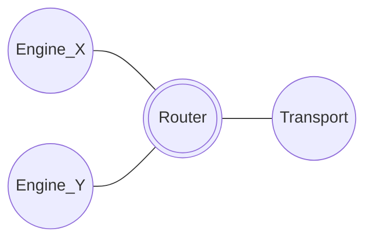
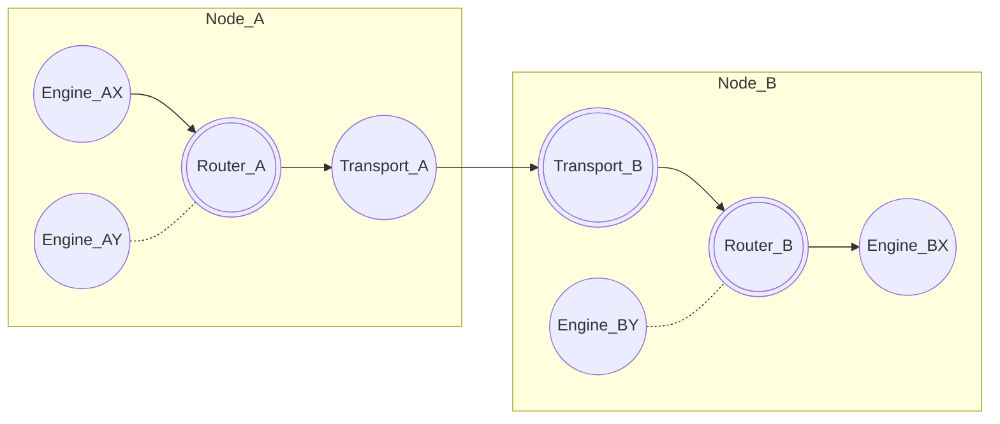
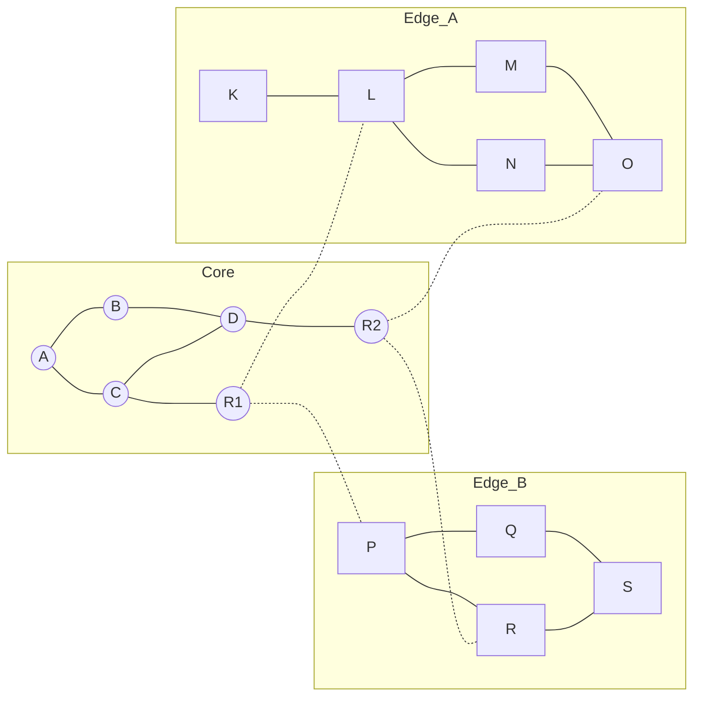
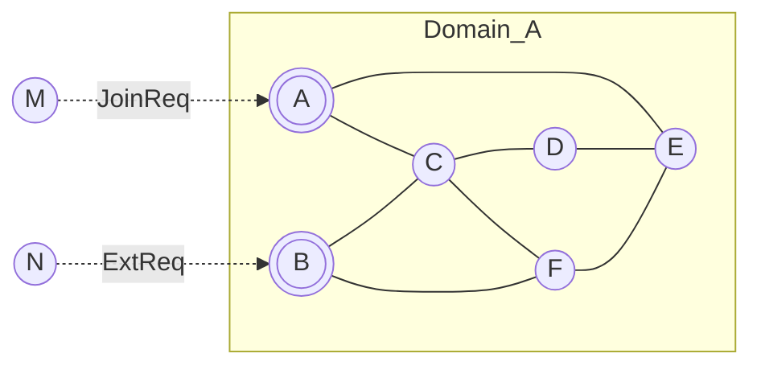

## Introduction

Anoma is researching and developing a set of network protocols
that facilitate message passing in a distributed system.

The network protocol stack is designed as a standalone component
generically useful for building distributed systems.

This article serves as a brief introduction and high-level overview of the network architecture.

## Node architecture

The system is based on the *actor model*,
where each node runs a set of processes, or actors.
We call these *engines* in our design.
Engines have state and communicate with each other via asynchronous message passing:.
An engine may send and respond to messages,
react to timer events, and spawn other engines.

Each node has a cryptographic identity that uniquely identifies it in the network.
A node consists of a collection of running engines.
Local engines communicate with each other directly,
while they reach remote nodes via the Router and Transport engines.

The Transport engine is responsible for maintaining authenticated and encrypted network connections between nodes
via a modular transport system that supports various transport protocols with different reliability, latency, and privacy guarantees.
Transport protocols initially supported include QUIC and TLS,
later this can be extended with onion-routed, mix, mesh, and delay-tolerant network protocols.

The Router engine routes incoming and outgoing messages from and to local engines,
based on the destination address of each message, which consists of a node and engine identity.

<figure>

<figcaption>A node with its engines.</figcaption>
</figure>

## Communication patterns

The network supports unicast, multicast, and anycast communication patterns.

- *Unicast*: direct messages between two engines.
- *Multicast*: few-to-many messages sent to a publish-subscribe topic and delivered to all subscribers.
- *Anycast*: messages sent to any known member of a domain.

<figure>

<figcaption>Unicast communication: Engine AX sends a message to BX via the Router And Transport engines.</figcaption>
</figure>

## Network Architecture

The network consists of nodes that may communicate with each other directly,
and participate in any number of domains.

Nodes in the core network are directly reachable via transport address(es)
specified in their signed node advertisements.

Mobile nodes of end-users may communicate directly on edge networks,
and reach the core network via relays
that store and forward messages for them.

This results in a two-tier network architecture,
where relays provide reliable message delivery and basic location privacy for mobile nodes.
Mobile nodes with higher location privacy requirements
may use an onion-routed or mix network to connect to the core network.

<figure>

<figcaption>Two-tier network architecture with core & edge networks.</figcaption>
</figure>

## Domains

The network consists of sovereign domains.
A domain is a sub-network with its own *cryptographic identity*.
Domain creation is permissionless, it only requires a domain advertisement signed by the domain owner(s),
which contains the domain configuration.
Domain identity is based on a public key, and may use threshold cryptography.
The domain configuration specifies the authentication mechanism used to join the domain,
the protocols used in the domain, and the list of nodes that serve external requests.
This enables *pluralistic interoperability*,
i.e. domains may run different protocols internally,
but able to respond to external requests nevertheless.

The domain's *membership* is the list of nodes
that are allowed to participate in the network protocols inside the domain.
A domain may be instantiated as one or more overlay networks that may or may not be inter-connected,
depending on the protocols used in the domain.
This allows both single-instance domains with globally synchronized data structures,
as well as [grassroots](https://arxiv.org/abs/2301.04391) domains
that may have a number of instances in the core network and on various edge networks,
and use mergeable data structures, such as [CRDTs](https://crdt.tech).

The initial set of protocols that run in a domain consists of
a membership protocol, a topic-based publish-subscribe protocol,
and a block storage protocol.
Later, domains with higher privacy requirements
will be able to opt to be part of a mix network
that provides pub/sub and block storage services.

A *domain advertisement* serves the purpose of advertising
a list of nodes that serve join requests and external requests from non-members.
Join requests may require an authentication mechanism,
such as a pre-shared key, public-key certificates, or other forms of membership proof.
External requests are used by non-members
to request information from the domain without joining,
and may require an authentication token.

Anycast routing is used to send messages to any known member of a domain that serve requests.

A topic-based publish-subscribe (pub/sub) protocol
allows domain members to subscribe to topics of interest,
where authorized publishers for a given topic may publish messages.

A block storage protocol allows limited persistence of data,
which is integrated with the pub/sub protocol
such that storage nodes willing to store a published message
publish an acknowledgement that indicates how long they're willing to store the message.

<figure>

<figcaption>A domain overlay with interlinked nodes and requests.</figcaption>
</figure>

## Summary

The network architecture consists of
nodes in a two-tier network architecture,
sovereign domains that allow pluralistic interoperability,
messaging based on the actor model with unicast, multicast, and anycast communication pattern,
and a modular transport system with various transport protocols
with varying levels of reliability, latency, and privacy guarantees.

More details will be published in the upcoming report at [Anoma Research Topics](https://art.anoma.net).
