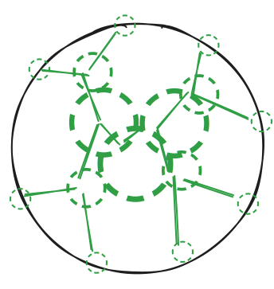

# Operator Pool Trees: filling order flow ASAP—at least in theory

If you (at some point in your life)

> criticized the broad use of mathematical models for human behaviour, arguing that some human choices are irreducible to mathematics  
> [[Wikipedia: Mathematical Economics]](https://en.wikipedia.org/wiki/Mathematical_economics)

you will have a field day criticizing this blog post.
If not,
I hope you agree with my strategy in writing this article:[^1]
I will start by presenting the whole background, in particular utility functions, discount factors, and social welfare optimization 
(in the hope that the critics get too bored), 
before the presentation of the core idea:
a model for networks of interconnected frequent batch auctions of operator pools that allows to rule out certain constellations, because they are utter nonsense (for the purpose of welfare maximization)—even under the most favourable conditions.
<!-- Finally,
I conclude with a tentative research agenda as to 
how one may go about implementing suitable  _distributed_ frequent back auctions. 
-->
Finally,
I conclude with a tentative research agenda for how the insights gained 
could be a basis for _distributed_ frequent batch auctions
as part of Anoma as an intent-machine for Ethereum.
So, buckle up for a _»tour Xe force«_ through some  _elements of mathematical economics_ or skip to the end for how this relates to Anoma as an intent machine for Ethereum.[^2]

## Utility functions, discounted utility, \& maximal welfare

### Utility functions and the [Von Neumann–Morgenstern utility theorem](https://en.wikipedia.org/wiki/Von_Neumann%E2%80%93Morgenstern_utility_theorem)

Wikipedia's short explanation of utility function is that[^6]

> a decision-maker faced with risky […] outcomes of different choices will behave as if they are maximizing the expected value of some function […]. This function is known as the von Neumann–Morgenstern utility function.

<!-- 
While utility functions are, first and foremost, 
a concept of mathematical economics,
we go as far out and assume that utility is in rough  is some kind of
value created if users have their orders filled.
How the two relate exactly is out of the scope of this blog post.
Note that if we were to add the right amount of
auction theory or mechanism design,
chances are we would come close to a fair fee for order fulfillment,
which one may take as proxy for utility functions.
-->

Let us refrain from philosophical claims about what utility functions are "actually" corresponding to in every day life.
We can simply follow the practice of mathematical economists and write
$u(O)$ for the real number that is associated to the outcome that a set of orders $O$ is filled.
If you want to think of it as _value created,_ "combined" _user preferences,_ or simply _profit:_ anything is good, as long as it does not add confusion or assumptions that lead to inconsistencies.
In the same spirit,
we shall take one more page out of the mathematical economist's book.

### [Discounted Utility](https://en.wikipedia.org/wiki/Discounted_utility)

Assets that we have at our disposal today are
more useful than those that will be in the future.
This is an oddly common phenomenon.
One way to capture it,
is the use of 

- a discount factor $\beta$ and
- discounted utility $\beta^t \cdot u(O)$ for fulfilling a set of orders $O$ after waiting for some time $t$.

That is all we have to know about discount factors and discounted utility.

### [Welfare Maximization](https://en.wikipedia.org/wiki/Welfare_maximization)

The last point is very simple.
We want to optimize for a "global" utility.
This is non-trivial in general,
but will be fairly straightforward for the "idealized world" of this post:
the only cost we consider is communication cost,
which we want to minimize.[^7]

## Back of the envelope calculations

We assume that orders may flow from any point on a circle as the black one in the figure.
More precisely, 
we model order flow as a set of Poisson point processes equally spread around our circle of operators, rendered as green dotted small circles on the black circle.[^8]
We assume the activity of these order flow processes to be time-invariant so that 
batch auctions fill $X\%$ of all order flow in expectation where **I am missing a good value for $X$, but it should be around 50% or higher, but 30% may work as well.**
Unfilled order flow will move along green lines towards the global pool in the centre,
but has the possibility to be filled in pools of intermediate size.
Let us describe this now in more detail and present 
some conditions that may deserve to be explored in detail.

<!-- suitable number for X, the percentage of order flow being filled ? -->

### The network structure: a complete $\boldsymbol{\gamma}$-ary tree of operator pools

Suppose we have $\gamma^k$ operators that can accept order flow.[^3]
We arrange the operators as the leaves of a complete $\gamma$-ary tree,
and the inner nodes of the tree thus correspond to 
_operator pools_ of size $\gamma^h$ where $h$ is the height of 
the inner node of the tree;
thus, 
the root corresponds to the _global pool_ of size $\gamma^k$
and each operator could be seen as a degenerate pool of size $1$.
<!-- I am not quite sure yet, if
we will see that this does not bring anything to the table
and thus basically can ignore the leaves and 
focus on the proper pools.-->

###  Delay approximations 
Finding consensus among operators of a pool—be it
about the next batch of intents, transaction bundles, or
other types of order conglomerates—will take 
quadratic communication complexity,
but only incur a delay that is proportional to 
the (average of) longest communication delays. <!-- 
check: run the numbers
https://docs.julialang.org/en/v1/manual/arrays/
so, we need 2/3rds of all validators,
any minimal quorum is chosen uniformly,
latency is proportional to maximal distance;
intuitively, with larger sets, we have super-linear growth
--> 
For a first estimate,
we assume operators to be spread out evenly on a circle,
such that sibling leaves of the tree
are neighbours on the circle.[^4]
As estimate for each communication within a proper pool,
we take the distance to the operator that is furthest away.
So, the communication cost in pools is proportional 
to $(\gamma^h)^2 = (\gamma^{2h}) = (\gamma^2)^h$
and thus,
submitting orders to a pool of double the size
incurs $\gamma^2$ the communication cost,
which is detrimental to welfare.
Concerning latency,<!--
one way or another, e.g., having three/four children per level
--> we aim to have at least one batch auction in a pool
before unfilled/unmatched orders are forwarded to the parent-pool—early
enough so that it can be considered in the next auction in the parent-pool.[^5]
Thus, although $\gamma = 2$ is nice for illustrations, 
we may actually rather need $\gamma =3$ in the end.

<!-- TODO: explain how the number come about -->

### The crux: filling rate

We shall reason in terms of what we call the _filling rate_ 
of the auctions in the single pools of the hierarchy,
i.e., the expected percentage of order flow that is filled:
$$X = \frac{\sum_{O \subseteq B_n} |O| \times \hat p(O)}{|B_n|}$$
<!-- for an auction that takes time $t$, 
we have the discounted expected utility
$$\beta^t \sum_{O \subseteq B_n} u(O) \times p(O)$$
--><!-- continue here b
- u(O) is the utility of the order set being completely matched
- p(O) the probability that this one actually happens, a product of
  - probability this is a possible match times
  - probability the match is found by the respective pool / the algorithm
-->
where $B_n$ is the $n$-th batch,
$O \subseteq B_n$ is a sub-batch of orders,
and $\hat p(O)$ is the probability that $O$ is the (maximally useful) set of filled orders.

For a concrete simple example, <!-- starting with one -->
we take the case of pairwise swaps,
say of digitally transformed pokémon cards;
each swap comes with a bid for having it filled.
The matching algorithm is almost trivial
**(and the reader can figure it out themselves $\mathtt{;-)}$).**
Note that this will match each matching pair
**(and will favour smaller over bigger cycles if they are found [`😅` oof needed an example with simpler matching strategy!!!])** 

Now, let us turn to the **obviously oversimplified and potentially _wrong_ calculations.**
Assume that we have a discount factor $\beta = 0.5$
and that batch auctions in a child pool are twice as fast as in their parent pool;
**(moreover, assume that bids only differ in negligible amounts [some details need checking/experiments!!!]).**
Under these conditions, 
we have a theoretical benefit from a hierarchical setup
if less than half of the order flow has to flow to the global pool or its direct children.

The reason is that then less than half of the order flow incurs the squared discount factor,
while all the matching at lower levels is benefiting from 
a "rooted" discount factor (or better).
In concrete numbers,
less than half of the orders will have the squared discount factor
$\beta^2 = 0.5^{2} = 0.25$ while more than half of the order flow is subject
to a discount factor of $0.5^{0.5} = \sqrt{0.5}\approx 0.71$ or even closer to $1$.
Roughly,
the hierarchy is matching faster in expectation than a single global pool.
So, if we had a matching efficiency of $50\%$, 
one additional layer would already suffice and the depicted hierarchy of eight pools would already be better than a single global pool.
For values below $50\%$, we would need a deeper tree.

**[here we would have something nice to let the reader play with the numbers,
using reveal.js (see, e.g., [here](https://quarto.org/docs/interactive/ojs/#example))
but we need to sync with Pedro during/after EthCC]**

Assuming the filling rate as constant throughout pools is actually "wrong", 
as discussed in the conclusion. 
Before we come to that, 
let us discuss some **random points**.

#### upshot, fine print, observations, etc. [some bullets]

- Obviously, it depends on the order flow what the matching efficiency is.

- Also, it is not clear how to deal with orders that get stuck in the global pool,
and we need a life time in practice.

- While there are common choices for arrival processes for modelling order flow,
<!-- well, maybe not !!! -->
_filling rate_ is possibly intricate to calculate. 

- Note that we assume that the pools are operated by the same parties,
somewhat reminiscent of sub-nets in Avalanche.
In principle, 
one may have a heterogeneous setup,
but then slashing and the like will be more complicated.

**[This part is hurting most]**

<!-- 
so, if half the matches have to wait 
for β^{2t} and the other half at most β^{.5t},
we are already better off: no matter what β is?
If β = .5 and t = 2
β^{2t} = .125 and β^{.5t} = 1/2, 
we gain some utility already.
TODO: general calculation / code 
-->

## Conclusion: the obvious non-sensical, the scale-free, ...?

Note that despite the many open questions marks concerning how hierarchical mempools
could be a better solution for solving than global pools,
we can identify two different reasons for operator pool trees are inadequate (cf. distributed solving). 

With the picture of the hierarchical operator pools in the circle in mind,
if matching orders occur on opposing sides of the circle only,
then clearly, there is no point in having a hierarchical mempool,
because matching orders more often than not will travel all the way to the root pool.
In this case, 
we only need the global pool. There is no tree.

On the other extreme,
if matching orders always occur in proximity to each other,
we only need a number of very local pools;
at the very extreme, we have the occurrence of all order flow in a single place, 
e.g., due to proximity to the server of a pre-existing CEX.
There is no point in having a tree, 
but we may have one to say that the leaves do not need the support of the tree.

We have seen that
the last category of order flow is the uniform and homogeneous spread of all possible orders:
we need more math, find some examples, or better both.
Sources of inspiration could be the large body of work on self-similarity, scale-freeness, 
and queing theory.<!-- well, this ← sentence just random last bit ... -->
Finaly,
although we just have some crude back of the envelope calculations,
we have identified a setting where hierarchical operator pools _may_ have a theoretical advantage. 
Time will tell.

<!-- ---- -->

[^1]: This may be due to the fact that I have grown up in a low-context culture, but well, let us not digress.

[^2]: To my dear critics: I hope that you will take the time to check that you agree with the definitions given in the first part.

[^3]: Remember, these are back of the envelope calculations!

[^4]: The globe would actually give "faster" approximations.

[^5]: Solving time has also to be considered, 
	but we are only interested in situations where solving time is "almost" negligible,
	i.e., at least an order of magnitude below consensus time.
	
[^6]: The elided assumption concerns "certain axioms of rational behaviour."

[^7]: The compute cost will only add minor detail. <!-- TODO check -->

[^8]: So, we have one Poisson point process for each possible swap request,
	and we assume that matching swaps are of the same activity. 
	Moreover, whenever a new swap request arises in this way, 
	the probability to arrive a given validator is $\gamma^{-h}$,
	i.e., order flow is the "same" for all operators.

<!-- footnotes end -->

<!-- notes and the like

====== June 28

btw and for the record: here's the paper I had in mind yesterday, concerning the switch from frequent batch auctions to continuous trading in Taiwan https://papers.ssrn.com/sol3/papers.cfm?abstract_id=3733682

however, one point I was wrong about: they used to have an auction every 5 seconds, while Eric Budish was having the phrase blink of an eye , and in a the implementation details paper the high level argument is

> In a continuous-time market, a tiny speed advantage is enough to always win the race; in a discrete-time market—even one as fast as the blink of an eye (roughly 0.5 seconds)—tiny speed advantages are orders of magnitude less valuable. 

http://www.cramton.umd.edu/papers2010-2014/budish-cramton-shim-frequent-batch-auctions-aerpp.pdf

(and let me add this to my draft material about the blog post)

-->

<!--

---

_Notes_

- [Preconfirmations Eth research](https://ethresear.ch/t/preconfirmations-on-splitting-the-block-mev-boost-compatibility-and-relays/19837)

_random_

- intent-centric distributed operating system
-->
