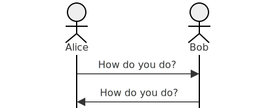
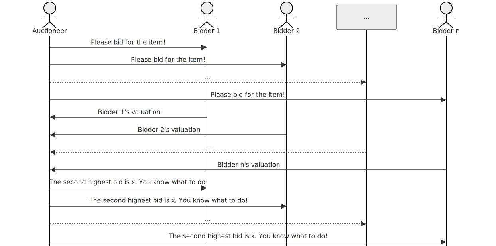

The second price auction—the most down to earth aspect of [Vickrey's Nobel prize](https://www.nobelprize.org/prizes/economic-sciences/1996/summary/)—is a splendid example for a protocol that one can easily implement in Elixir. If all you care about is Anoma, note the following:

> 1. Anoma is a protocol.
> 2. Anoma is being implemented in Elixir.
> 3. Auctions are one typical application of Anoma.

So, the main topic is actually protocols. However, they are pretty complex in general. Hence we consider the second price auctions as an illustrative example and provide a hands on implementation in Elixir that you can experiment with.

## Protocols

This post touches three fundamental aspects of protocols: protocol design, protocol specification, and protocol implementation. The protocol design of the second price auction is already done. It is a great example for how [game theory](https://en.wikipedia.org/wiki/Game_theory) and [mechanism design](https://en.wikipedia.org/wiki/Mechanism_design) enters our everyday lives. In this post, we mainly focus on protocol specification and implementation.[^7] Thus, if you ever wondered what a protocol looks like concretely and how we can make it run, you will be up to speed in less than 30 minutes.

### Protocols: first approximation

In first approximation, at least one layer above the [Wikipedia page](https://en.wikipedia.org/wiki/Communication_protocol), a protocol is like an agenda for a meeting, but over a longer period of time and each participant plays a very specific role. In other words, a protocol describes what participants should do under which circumstances; in particular, it describes which messages a participant can expect to receive and how to respond to them.



As an illustrative example, let us try to formulate the British greeting culture as a protocol. We have two participants, Alice and Bob and they send each other a single message; Alice is the greeter and Bob is the "greetee", which means that each participant plays a different role here. Next, we have a closer look at the second price auction, once in full generality and once for the case of a specific instance; then, we turn to the implementation in Elixir.

### Protocols: the second price auction as example

The main idea of the sealed-bid second price auction is that the highest bid gets the item, but the winner only has to pay the price of the second highest bid—_and_ that the best way to play this game for the bidder is to submit their "true" valuation.[^5]



The above diagram illustrates the general protocol, but let us run through a specific instance step by step.

### Protocols: an instance of the second price auction

Alice, Bob, and Charly receive letters from Christie's that they are testing Vickrey's auction and that they request to submit bids for the imprint of a boot in clay, signed by Banksy. Charly is quite into Banksy and submits a bit of 10k pounds, which is the very limit of her budget for art and other collectibles. Bob has heard of Banksy, but is not quite aware of the relevance; however, he guesses that it might be worth at least 100 pounds. Finally, Alice is not in favor of commercialization of Banksy and puts a 1 pound bit, which she thinks is the most clever way to express her opinion in a single bid. In the end, everyone receives a letter stating that the winner is the person that has bid more than 100 pounds and that the person in question is bound to pay 100 pounds and subsequently will receive the item.


As it happens, this was the end of this experiment as the payoff for Christie's is just not sufficient. First price auctions just work better for auction houses, it seems.

### Protocols: note on protocol style

The above protocol description takes out a page from the proverbial book of [cryptographic protocols](https://en.wikipedia.org/wiki/Cryptographic_protocol): we have a fixed list of roles and each role comes with rules for communication via sending messages—assuming that messages are delivered reliably. For the second price auction, the roles are the _auctioneer_ and a number of _bidders_, which we assume to be known in advance, for the sake of simplicity. First, the auctioneer communicates to all bidders the item that is on sale with the request for bidding via a bid in a sealed envelope to be sent to the auctioneer. Thus, each of the bidders will pencil down their true valuation of the item and send the letter to the auctioneer (or not).[^1] Finally, after the auctioneer has received all the bids (or the deadline is reached), all participants are informed about the second highest bid. Then all bidders can verify that their bid was taken into account properly. The identity of the winner can be kept secret. The winner will know as they have bid higher than the second price. Everybody else will also not have lost anything since their true valuation was supplied.

Our implementation will amount to an incarnation of the behaviors all participants, which communicate via [message passing](https://en.wikipedia.org/wiki/Message_passing); we also need to make precise how the auctioneer calculates the second price. We have prepared a tailor made crash course in Elixir that explains just enough of this language to cover our specific instance of the second price auction.

## Elixir in less than ten minutes

Besides the usual concept of [function](https://en.wikipedia.org/wiki/Functional_programming#Pure_functions), we use processes to model the behavior of protocol participants, i.e., how they react to each others messages. Roughly, processes are functions equipped with—among other things—a "secretary" that takes care of sending and receiving of messages; the latter are [side effects](<https://en.wikipedia.org/wiki/Side_effect_(computer_science)>).

### Function

As per usual, we must have a "Hello World"-program, which we shall implement as the function that returns this very string as result when invoked with the empty tuple `()` as argument. So, let us enter the Elixir REPL by writing [`iex`](https://joyofelixir.com/a-setup-and-install) in the shell or by going to this [online REPL](https://Elixirconsole.wyeworks.com/).[^2]

```elixir
$ iex
Erlang/OTP 25 [erts-13.1.5] [source] [64-bit] [smp:16:16] [ds:16:16:10] [async-threads:1] [jit:ns]

Interactive Elixir (1.14.0) - press Ctrl+C to exit (type h() ENTER for help)
iex(1)> hello_world = fn -> "Hello World" end
#Function<43.3316493/0 in :erl_eval.expr/6>
iex(2)>
```

Now we can execute our `hello_world`-function by applying it to `()`, the empty tuple of arguments.

```elixir
iex(2)> hello_world.()
"Hello World"
iex(3)>
```

There we are! Invoking the function returns the string.

Let us also quickly go through a paradigmatic example with one argument. Doubling via addition is the function $x \mapsto x + x$ (or $\lambda x. x+x$ if you prefer): this function maps an argument to the sum of the argument with itself. It can be defined in Elixir using [lambda](https://en.wikipedia.org/wiki/Lambda_calculus)-like notation.

```elixir
iex(3)> fn x -> x + x end
#Function<42.3316493/1 in :erl_eval.expr/6>
```

We can give this function a name before we apply it to a number.

```elixir
iex(4)> double = fn x -> x + x end
#Function<42.3316493/1 in :erl_eval.expr/6>
iex(5)> double.(21)
42
iex(6)>
```

Thus, to apply a function that is defined using lambda-like syntax, we use the dot `.` to express that we want to apply this function and we enclose the arguments in parentheses; the dot `.` can be read as "applied to". But now, we have to go beyond the pure functional world in order to allow for interaction of agents via message passing.

### Spawning processes—think agents

Besides a purely functional core, Elixir provides us with a way to "wrap" a function into a process that executes the function. Let us see how this works for our hello world example.

```elixir
iex(6)> hello_world_io = fn -> IO.puts "Hello World" end
#Function<43.3316493/0 in :erl_eval.expr/6>
iex(7)> spawn(hello_world_io)
Hello World
#PID<0.116.0>
iex(8)>
```

The following are happening: a process is spawned and executes the function, which results in the output of "Hello World"; the spawn command moreover returns a process ID of the process into which the function was "wrapped".[^3] This process ID, or PID for short, allows us to provide arguments to a function in a different way, using message passing.[^4]

### Receiving and sending messages

While spawning processes is based on a function without argument, the process has a "mailbox" for messages and the function may access the mailbox. Thus, we have the following "wrappable" version of our `double` function.

```elixir
iex(8)> double_interactive =
...(8)>    fn ->
...(8)>      receive do
...(8)>        {x} -> IO.puts (x+x)
...(8)>      end
...(8)>    end
#Function<43.3316493/0 in :erl_eval.expr/6>
```

Next we spawn this function and store the PID.

```elixir
iex(9)> pid = spawn(double_interactive)
```

Now, we can send our argument to the function in a message.

```elixir
#PID<0.123.0>
iex(10)> send pid, {2}
4
{2}
iex(11)>
```

Besides the function being executed, resulting in the expected output, the REPL also shows the message that was sent. There is [much more to learn](https://www.erlang-solutions.com/blog/understanding-processes-for-Elixir-developers/), but it is time to return to the auction example.

## The second price auction in Elixir

For the implementation, we write processes for each of the bidders and the auctioneer. Recall that a bidder first waits for an item to be announced by the auctioneer, then will respond with the true valuation, before they get the response from the auctioneer about the second highest bid. The code for Alice thus is as follows.

```elixir
alice =
fn ->
    receive do
        {auctioneer, item} -> send auctioneer, 1
    end
    receive do
        x -> if x < 1 do IO.puts "yeah!" end
    end
end
alice_pid = spawn(alice)
```

Note that we have omitted the check that the auctioneer is actually the "real" auctioneer and also whether the item is the imprint of a boot in clay, signed by Banksy. We write similar processes for Bob and Charly, and then we can tackle the auctioneer.

```elixir
auctioneer =
fn ->
    send alice_pid, {self(), "imprint"};
    send bob_pid, {self(), "imprint"};
    send charly_pid, {self(), "imprint"};
    receive do
        x ->
        receive do
            y ->
            receive do
                z ->
                    send alice_pid, second.(x,y,z);
                    send bob_pid, second.(x,y,z);
                    send charly_pid, second.(x,y,z);
            end
        end
    end
end
```

First the auctioneer sends the requests for bids to each of the bidders, via their PIDs `alice_pid`, `bob_pid`, and `charly_pid`, respectively. Then, the auctioneer waits for three bids and announces the second price. As a result, the winner will know and celebrate anonymously.

```elixir
alice =
...(11)> fn ->
...(11)>     receive do
...(11)>         {auctioneer, item} -> send auctioneer, 1
...(11)>     end
...(11)>     receive do
...(11)>         x -> if x < 1 do IO.puts "yeah!" end
...(11)>     end
...(11)> end
warning: variable "item" is unused (if the variable is not meant to be used, prefix it with an underscore)
  iex:14

#Function<43.3316493/0 in :erl_eval.expr/6>
iex(12)> alice_pid = spawn(alice)
#PID<0.129.0>
iex(13)> bob =
...(13)> fn ->
...(13)>     receive do
...(13)>         {auctioneer, item} -> send auctioneer, 100
...(13)>     end
...(13)>     receive do
...(13)>         x -> if x < 100 do IO.puts "yeah!" end
...(13)>     end
...(13)> end
warning: variable "item" is unused (if the variable is not meant to be used, prefix it with an underscore)
  iex:16

#Function<43.3316493/0 in :erl_eval.expr/6>
iex(14)> bob_pid = spawn(bob)
#PID<0.140.0>
iex(15)> charly =
...(15)> fn ->
...(15)>     receive do
...(15)>         {auctioneer, item} -> send auctioneer, 10000
...(15)>     end
...(15)>     receive do
...(15)>         x -> if x < 10000 do IO.puts "yeah!" end
...(15)>     end
...(15)> end
warning: variable "item" is unused (if the variable is not meant to be used, prefix it with an underscore)
  iex:18

#Function<43.3316493/0 in :erl_eval.expr/6>
iex(16)> charly_pid = spawn(charly)
#PID<0.151.0>
iex(17)> max = fn (x,y) -> if x > y do x else y end end
#Function<41.3316493/2 in :erl_eval.expr/6>
iex(18)> min = fn (x,y) -> if x < y do x else y end end
#Function<41.3316493/2 in :erl_eval.expr/6>
iex(19)> second = fn (x, y, z) -> min.(max.(x,y),max.(x,z)) end
#Function<40.3316493/3 in :erl_eval.expr/6>
iex(20)> auctioneer =
...(20)> fn ->
...(20)>     send alice_pid, {self(), "imprint"};
...(20)>     send bob_pid, {self(), "imprint"};
...(20)>     send charly_pid, {self(), "imprint"};
...(20)>     receive do
...(20)>         x ->
...(20)>         receive do
...(20)>             y ->
...(20)>             receive do
...(20)>                 z ->
...(20)>                     send alice_pid, second.(x,y,z);
...(20)>                     send bob_pid, second.(x,y,z);
...(20)>                     send charly_pid, second.(x,y,z);
...(20)>             end
...(20)>         end
...(20)>     end
...(20)> end
#Function<43.3316493/0 in :erl_eval.expr/6>
iex(21)> spawn(auctioneer)
yeah!
#PID<0.174.0>
```

## Conclusion

We have used the second price auction as example of a protocol
that we can implement in Elixir, using only the primitives of functions, process spawning, sending and receiving of messages. In fact, these are the core primitives found in the actor model of computation as summarized in the language λAᴄᴛᴏʀ in Emanuele D’Osualdo's [PhD thesis](https://dblp.org/rec/phd/ethos/DOsualdo15.html), inspired by [Core Erlang](https://www.erlang.org/blog/core-erlang-by-example/). And if you were wondering how this all is related to Anoma, the answer is simple:

> 1. Anoma is a protocol.
> 2. Anoma is being implemented in Elixir.[^6]
> 3. Auctions are one typical application of Anoma.

[^1]: This simple strategy for bidding is what is so special about the second price auction: bidders can participate using a straightforward strategy for bidding.
[^2]: You can copy and paste the code of the first section on functions into this [online REPL](https://Elixirconsole.wyeworks.com/), though the line breaks will "disappear". [Installing Elixir](https://joyofelixir.com/a-setup-and-install) and running `iex` in a shell is the better alternative, because the later example go beyond what is supported in the online version.
[^3]: The process also terminates immediately.
[^4]: Note that `spawn(double)` will run into an exception.
[^5]: In fact, the Nobel price is very much related to the question of which compatibility of incentives aka [truthfulness](https://en.wikipedia.org/wiki/Strategyproofness).
[^6]: ... and rust.
[^7]: However, the topic of mechanism design is extremely important for the proper function of blockchains.
