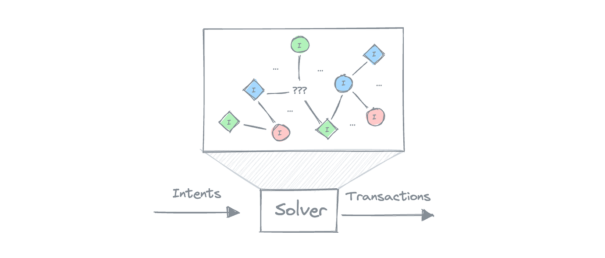
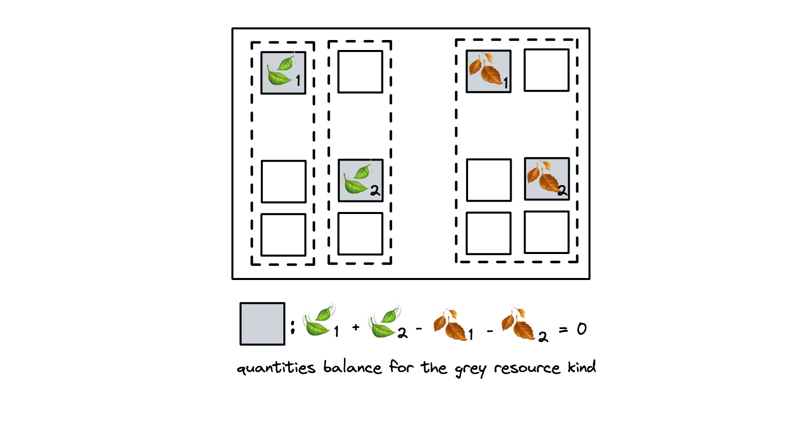
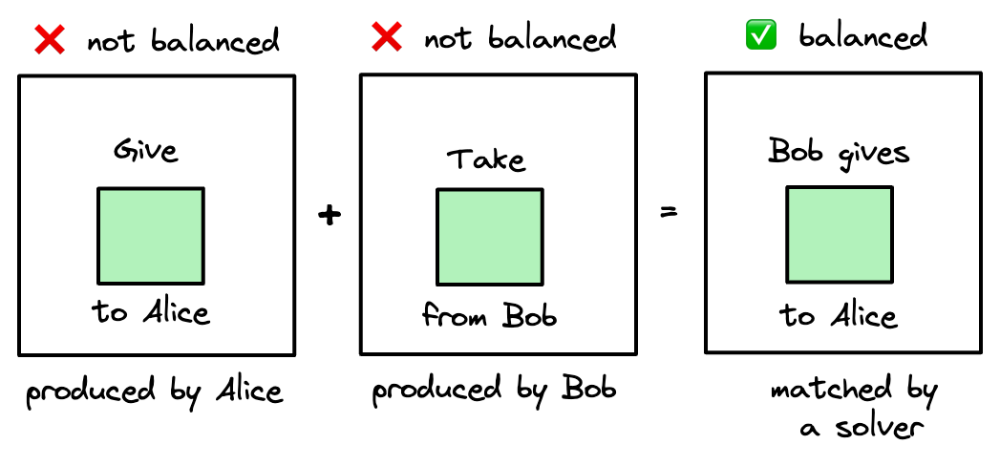

## Introduction

We [spent](https://anoma.net/blog/abstract-intent-machines) [some](https://zenodo.org/records/10019113) [time](https://anoma.net/blog/towards-an-intent-centric-topology) catching and formalising intents before. This is another note about intents, now from the resource model perspective.

## Intents, the abstraction
In an intent-centric protocol such as Anoma, users initiate chain state changes by submitting their intent to the intent gossip network. Intents are representations of user preferences that constrain the initiated state transition. They are invariant across all possible satisfying state transitions, meaning that no matter what transaction gets constructed, the user’s intent will be satisfied by it. **Solvers** are the actors who receive user intents and match them together, constructing balanced transactions.

 

### Constraints and preferences
Intents have two components: constraints and preferences. **Constraints** correspond to hard requirements that must be satisfied for the intent to be considered satisfied, and **preferences** correspond to additional information on how to better satisfy the intent, but they don't necessarily have to be enforced for the intent to be considered satisfied. In this post we only consider the ways to express constraints.

## Resource model basics

> This section provides a quick introduction to the resource model components. To learn more about the resource model, check out [this blogpost](https://anoma.net/blog/rise-of-the-resource-machines).

|Component|Description|
|-|-|
|**Resource**|Atomic unit of state in the resource model|
|**Resource logic**|A predicate associated with each resource. It specifies on which conditions a resource can be created and consumed. Each resource logic belongs to some application|
|**Resource quantity**|A numeric value associated with a resource. When a resource is being consumed, its quantity is assumed to be positive, and when a resource is being created, the quantity is assumed to be negative|
|**Resource kind**|Resource's fungibility domain. Computed from the resource's components that include the *resource logic*|
|**Application**|Virtual structure characterised by its logic and read and write interfaces. Resources associated with the application's logic comprise the application's state|
|**Transaction**|State update representations. Solvers construct transactions to satisfy users' intents. Transactions can be *balanced* and *unbalanced*|
|**Transaction balance**|The sum of the quantities of resources consumed and created in this transaction, computed per each resource kind|
|**Balanced transaction**|A transaction for which for each resource type, the sum of the quantities equals to zero[^1]. Only balanced transactions can be executed|
|**Unbalanced transaction**|A transaction that isn't balanced 🤷🏻‍♀️. Unbalanced transactions are composed until they balance and then, if valid, they are ordered and executed|

On the diagram below the rectangle represents a balanced transaction composed of dotted rectangles (unbalanced transactions). The squares represent resources, grey squares are resources of the same kind. The application's state is updated to autumn: green leaf resources are consumed (positive quantity), orange leaf resources are created (negative quantity). 

[^1]: the transaction balance is checked against the **balancing value**. For simplicity we can assume the balancing value is set to 0.

## Are intents [unbalanced] transactions?

No. To communicate their intents to solvers, users send their initial unbalanced transactions to the intent gossip network. The transaction constraints can be represented as:
- the partial *state transition* the transaction initiated by the user implies 
- a resource logic directly or predicates that have to return true in order for the resource logic to be satisfied
- some other way we didn't think of yet (not described in this blogpost)

Intents are *not equivalent* to [unbalanced] transactions. Let's take a closer look at two ways to express constraints to better see why.

## Two ways to express constraints

### I. Create what you want

When the user knows exactly what they want, they can simply produce an unbalanced[^6] transaction that creates the asset they want. This transaction is not balanced (because the desired asset was created for the user but not actually given - or consumed - by the previous owner. The previous owner is not even known yet), and the solver's goal is to find a transaction that would balance the given one [^2].

[^2]: generally the number of unbalanced transactions that are composed to create a balanced one is not limited, but we can always imagine all of the other transactions involved pre-composed.

[^6]: balanced transactions correspond to intents that are satisfied (with multiple intents satisfied by the same balanced transaction), unbalanced transactions correspond to intents yet to satisfy.

### II. Describe what you want in a predicate

In the case a user doesn't know *exactly* what they want[^3] but only know some properties of the desired asset, they can specify the constraints in a resource logic[^7] associated with some of the involved in the transaction resources.

An application might include some constraint enforcement logic as a part of its own logic (for example, [this scale-free kudos application implementation](https://github.com/anoma/anoma-app-patterns/blob/main/Token/Transaction/Swap.juvix) allows expressing some forms of intents) or it can be used in combination with a "carrier" application that serves as a way to express intents. A logic of such a carrier application states that its resource can be consumed iff the intent predicate it carries is satisfied. The user would create a carrier resource as a part of their initial transaction. Having the carrier resource consumed in the transaction proves that the intent was satisfied.

### Comparison

Expressing constraints as predicates allows to specify what properties the desired assets must have without specifying the rest, but requires a certain functionality to be implemented by the application in use or a carrier application that can be used to express the constraints. On the other hand, expressing constraints by directly creating the desired assets doesn't depend on any application's constraint expression logic but requires the user knowing *exactly* what they want: kinds, amounts, and *all* of the other resource components of *all* desired resources.

## Conclusion

Intents = preferences + constraints. Constraints can be either expressed by directly creating the desired assets or by describing their properties in a predicate. In both cases the resource machine ensures that the intent is satisfied.

[^3]: it can also be used when the user knows exactly what they want, but let's just assume they don't

[^7]: or a predicate that has to be true in order for the resource logic to be satisfied, the mechanism is the same
