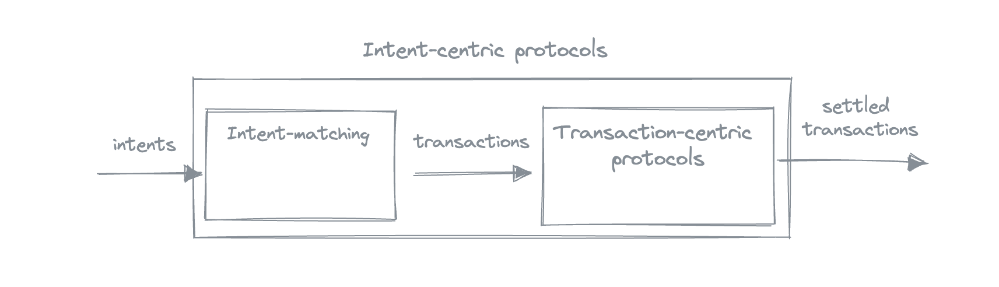
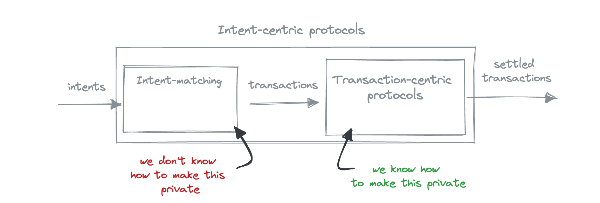

The introduction of intents brought the process of creating, sharing, and matching intents up to the protocol level: transaction-centric protocols expect users to submit transactions as input, and have intents out of scope; intent-centric protocols expect users to submit intents, and matching intents becomes a part of the protocol. If the intent-centric protocol happens to also be privacy-preserving, like the Anoma protocol, there is a question of privacy at the intent matching stage.

How do you go from wanting something (your intent) to actually getting it (settled transaction)? In the Anoma context, this process can roughly be described as follows:

- express what you want as an intent,
- share the intent
- the intent is matched with other users' intents; as a result of the match, a transaction is produced
- the transaction is settled

This process can roughly be divided into two phases: counterparty discovery phase (intent → transaction) and settlement phase (transaction → settled transaction).

## Settlement Privacy vs Counterparty Discovery Privacy

Now, how do we achieve privacy in these phases? Settlement phase privacy is well-understood: it has been worked on for many years, [wonderful](https://github.com/zcash/zips/blob/main/protocol/nu5.pdf)[solutions](https://eprint.iacr.org/2018/962) that provide a way to produce shielded transactions and allow information flow control have been developed. With the counterparty discovery phase it is much less clear, significantly because there are simply no generalised intent-centric protocols that are live yet, not even talking about the privacy-preserving ones.

Counterparty discovery privacy essentially refers to the privacy in the context of sharing intents with solvers. As solvers are the actors who satisfy intents, they need to know what you want, which doesn't align well with the idea of privacy - why do I have to tell anyone what I want? So the question of counterparty discovery privacy is: how can we tell someone what we want without actually telling them what we want?

We took a look at various ways that could potentially be used to provide privacy in the counterparty discovery phase.

## Setup

We consider two types of participants:

- _solvers_, the actors who solve intents. Solvers have solving strategies, which can be public or private
- _users_, the actors who have intents and want them to be solved. Users' intents are private

The goal is to create a protocol where users send some non-sensitive data derived from intents (e.g., encrypted intents) to solvers, and solvers match the intents and output shielded transactions.

## Approaches and results

We've considered various cryptographic approaches:

- TEE,
- multiparty computations,
- FHE,
- witness encryption,
- functional encryption,
- searchable encryption,
- and collaborative SNARKs,

along with some non-cryptographic ways to mitigate the issues.

### The good

#### TEE

Trusted execution environment, or TEE, refers to an isolated environment of a hardware computing devise that allows performing secure computations. To allow private solving, the solver's strategy would be loaded in the TEE, users would send their encrypted intents that would get decrypted in the TEE and processed by the solving strategy, outputting a shielded transaction.

The downside of the TEE path is that trusting TEE to be the primary source of security might be suboptimal due to the amount of vulnerabilities that exist and keep being found.

#### MPC

Multiparty computations, or MPC, allow multiple parties to compute a public function together using some private data (shares) that they don't reveal. To instantiate private solving with MPC, users would keep their intents as private shares, and the solver's strategy would be encoded in the MPC protocol itself.

The downside of MPC is that it is expensive, and requires a lot of data transfer that grows with the number of participants, strategy complexity, and the computations required to be performed.

### The ugly

Fully homomorphic encryption, or FHE, refers to the type of encryption that allows to perform arbitrary computations on encrypted data. FHE is not applicable to the problem of private solving, since a solver can always be a user. Receiving encrypted intents of other users, solvers can always create their own intents and try to match them with users' intents. If the intents match, the user's intent becomes known to the solver (it is the opposite to the one the solver has created), otherwise the solver can repeat this process until they find an intent that matches the user's intent.

Note that unlike fully homomorphic encryption, this is not a core problem for TEE and MPC, because the amount of times an intent can be tested against other intents can be programmatically limited in the protocol, compromising between privacy (less tests are allowed → lower chances to match) and flexibility (more tests result in higher chances of finding a match, which can come from the solver).

### The bad

Witness encryption and collaborative SNARKs don't allow to perform private computations. Using searchable encryption in our context would result in search keywords coincide with the data being protected. Functional encryption doesn't seem very promising at this point.

## Caveats

### Solvers are users

The fact that each solver can be a user makes things complicated. The matched counterparties would naturally learn each others' intents: if I want to exchange an orange for an apple, and our intents match, it means that you intend to exchange an apple for an orange. We don't want solvers to exploit this opportunity to guess our intents, but we also can't stop solvers from being users.

### Phase privacy overlap

As the output of the counterparty discovery layer is a transaction, and the Anoma protocol offers settlement privacy, this transaction is shielded. It means that whatever approach we take, it is supposed to call all the cryptography that is needed to produce shielded transactions (ZKP, signatures, encryption), which might be non-trivial and expensive to arrange.

## Conclusions

Private solving is hard. It is not explored, it comes with limitations, but we can improve it. Besides cryptographic approaches, there are various non-cryptographic ways to reduce the amount of shared data, and the best solution will likely be a combination of both.

The detailed report on the approaches to private solving can be found [here](https://zenodo.org/record/8321167).
