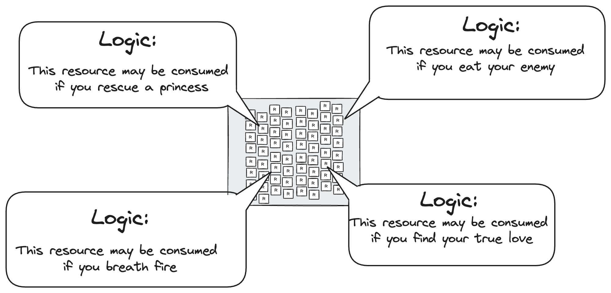
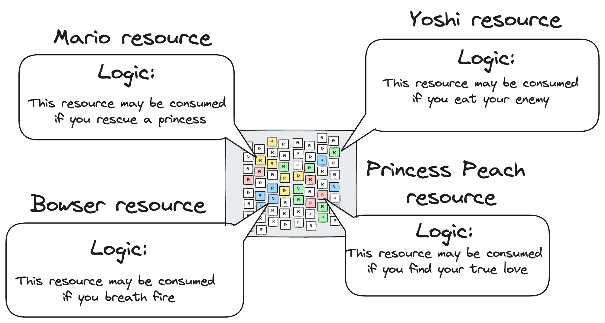
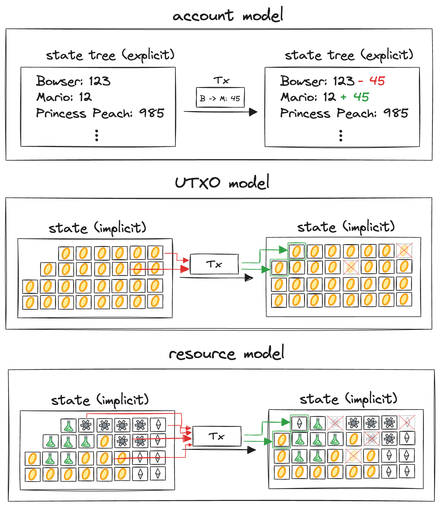
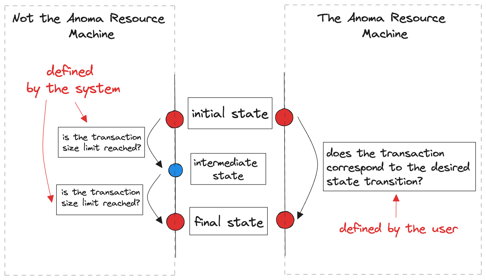
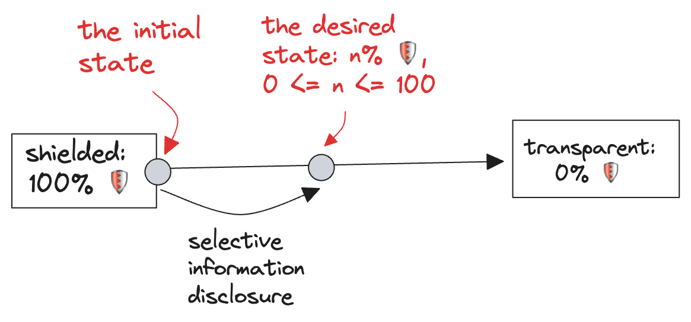
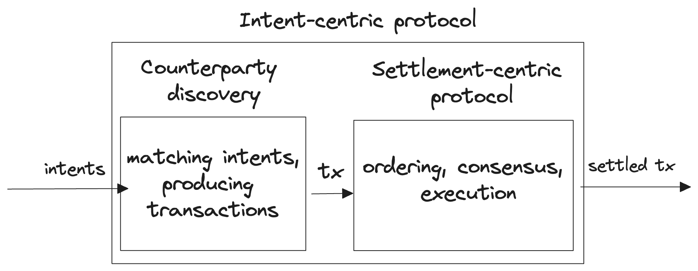
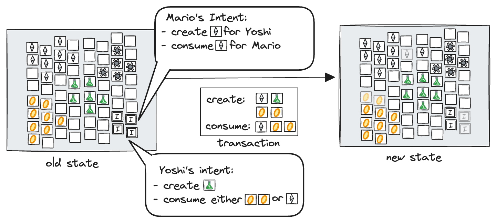

In the Anoma protocol, users submit preferences about the system state and the system continuously updates its state based on those preferences. The **Anoma Resource Machine** (ARM) is the part of the Anoma protocol that defines and enforces the rules for valid state updates that satisfy users' preferences. The new proposed state is then agreed on by the consensus participants. In that sense the role of the Anoma Resource Machine in the Anoma protocol is similar to the role of the Ethereum Virtual Machine in the Ethereum protocol.

## What is a resource?

The atomic unit of the ARM state is called a **resource**. Resources are immutable, they can be created once and consumed once, which indicates the system state change. The resources that were created but not consumed yet make the current state of the system.

Each resource has a predicate associated with it, called a _resource logic_, that, in a declarative form, describes what can be done to the resource, which in practice means specifying the conditions on which the resource can be created and consumed. Such conditions can include other resources being created or consumed, explicit action authorisation (e.g., check a signature provided by a specified party), etc.

There are different _kinds_ of resources - the resource kind is determined by the logic associated with it and some extra data, called a _resource label_. Resources of different kinds are non-fungible, unless the resource logic explicitly allows that, specifying on which conditions the resources may be treated as of the same kind.

Resource logics allow to express how resources of different kinds behave and interact with each other, which enables _applications_.

### The ARM properties

#### Execution model

Two of the most popular execution models are the account model and the UTXO model. The Anoma Resource Machine operates in the _resource model_, which is neither of them. In the Anoma protocol, a resource is a state unit of the system, similar to how in the UTXO model, a UTXO is a state unit of the system. However, unlike the Bitcoin UTXO model, which sees UTXOs as currency units and is limited in expressivity to that context, the resource model is generalised and provides flexibility — resource logics allow to build applications with usecases not limited to financial contexts only, and the resource model can support applications operating in any model[[1]]([1])[[2]]([2]).

#### Atomic state transitions of arbitrary complexity

The Anoma Resource Machine sets the transaction completion criterion to transaction balance in contrast to using the transaction size as the completion criterion. The number of resources created and consumed in each transaction is not limited by the ARM. It allows agents to express arbitrarily complex state transitions using a single transaction, which can be handy in multiple scenarios when the logical state transition requires more creations/consumptions than the transaction size limit would otherwise allow. This gives a user control over the trade-off between the atomicity and complexity of the transaction.

#### Information flow control

The parties whose intents are being addressed by the transaction can decide how much of the information about their state to reveal and to whom, which doesn't affect the way the ARM treats these states. This **information flow control property** is realised with the help of **shielded execution**, in which the state transition is only visible to the parties involved in it. This allows selective disclousure as opposed to the fully transparent case by default, where a user is not in control of who can access their state. The resource machine operates on abstractions that can instantiate both ends of the privacy spectrum (shielded resources and transparent resources), enabling anything in between, which allows it to have a unified state model, delegating the concrete privacy decisions to whom they should belong - the user.

#### Account abstraction

In the Ethereum context, [account abstraction](https://eips.ethereum.org/EIPS/eip-4337) refers to the option of controlling assets exclusively by smart contracts, as opposed to the initial setup where assets were controlled by user accounts.

Account abstraction comes with the ARM by default: each resource is controlled by a resource logic — a custom predicate that encodes constraints on valid state transitions for that kind of resource and determines when a resource can be created or consumed. Resource logics can specify arbitrary constraints and are not limited to (but can include, if desired) explicit entity approval requirement (e.g., a signature).

#### Intent-centric architecture

Intents[[3]]([3])[[4]]([4]) are a way for users to express their preferences about the next state of the system they are using. Intent-centric architecture, as opposed to the settlement-centric architecture[[5]]([5]) (the one where users have to craft transactions directly), allows users express their desires without the need to specify how the desired state should be achieved (but if they want, they can).

Anoma's architecture is intent-centric, and the Anoma Resource Machine is designed to express intents and ensure their correct and complete fulfilment and settlement.

## The role of the ARM in Anoma

Let's see how a system would operate in the resource model, from the point of preferences being expressed by the users of the system to the point where the desired state update has been executed.

The set of unconsumed resources comrpises the current state of the system. Users describe the next desired state (users' intents) by expressing what resources they want to be consumed and created.

Intents are matched together into transactions. Transactions describe the proposed state transitions - what resources to create and what resources to consume.

A transaction is only considered valid if resource logics of all involved resources are satisfied - the predicates return a true value. Executing a valid transaction results in the desired resources being created and consumed, satisfying the users' intents, updating the system state.

## Conclusion

The Anoma Resource Machine is the core of the Anoma protocol designed to facilitate intent-centric architecture featuring programmability, giving users control over their data. The first version of the ARM specification defines what a resource and a transaction are, describes the rules of transaction composition, unifies the notion of a proof for all privacy contexts, specifies the program formats, and covers many more aspects: take a look yourself [here](https://zenodo.org/records/10498991).

---

1. A token operating in the account model would be represented by a single resource containing a map $user: balance$. Only one resource of that kind can exist at a time. When a user wants to perform a transfer, they consume the old balance map resource and produce a new balance map resource. [↩︎](↩︎)
2. A token operating in the UTXO model would be represented by a collection of resources of the token type, each of which would correspond to a portion of the token total supply and belong to some user owning this portion. [↩︎](↩︎)
3. [https://anoma.net/blog/an-introduction-to-intents-and-intent-centric-architectures](https://anoma.net/blog/an-introduction-to-intents-and-intent-centric-architectures)[↩︎](↩︎)
4. [https://anoma.net/blog/towards-an-intent-centric-topology](https://anoma.net/blog/towards-an-intent-centric-topology)[↩︎](↩︎)
5. Intent-centric protocols can be described as two-phase protocols: in the intent phase, intents are matched with each other, resulting in transactions. Transactions then are ordered and executed in the settlement phase of the protocol. Settlement-centric protocols thus refer to the protocols that include the settlement phase, but not the intent phase. [↩︎](↩︎)
